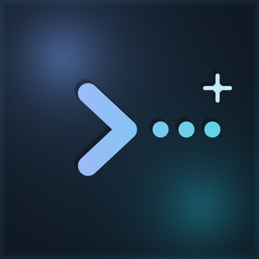

<p align="center">
  
</p>

<h1 align="center">Maestro</h1>

<p align="center">
  <strong>Run multiple Claudes across your projects. Coordinate all of them from one place.</strong>
</p>

---

## What is Maestro?

If you've ever had four Claude sessions running on one project and three more on another -- all in separate terminals with no idea what the others are doing -- Maestro is for you.

Maestro gives you a **desktop app**, a **CLI**, and a **server** that work together so you can:

- Break work into tasks and subtasks
- Spin up Claude sessions and assign them tasks
- See what every Claude is doing in real time
- Record sessions and replay them later

Think of it like a project manager for your Claude agents. You define the work, Maestro coordinates who does what.

---

## Quick start

### What you'll need

- [Node.js](https://nodejs.org/) v18 or newer
- [Rust](https://rustup.rs/) (for the desktop app)
- [Tauri prerequisites](https://tauri.app/start/prerequisites/) (for the desktop app)

> If you only want the server and CLI, you can skip Rust and Tauri.

### 1. Install dependencies

```bash
npm install
```

### 2. Start everything

```bash
npm run dev:all
```

This launches the desktop app and the server together. That's it -- you're running.

### Or start things separately

```bash
npm run dev:server    # Just the server
npm run dev:ui        # Just the desktop app
```

### 3. Set up the CLI

```bash
cd maestro-cli
npm run build && npm link
maestro --help
```

Now you can use `maestro` from any terminal.

---

## Dual environment setup (Prod + Staging)

Maestro supports running two isolated environments simultaneously -- a stable **prod** build and a **staging** dev environment with hot-reload.

| | Prod | Staging |
|---|---|---|
| Server port | 3001 | 3002 |
| UI | Installed "Maestro Prod" app | `tauri dev` with hot-reload |
| Data dir | `~/.maestro/data` | `~/.maestro-staging/data` |
| Session dir | `~/.maestro/sessions` | `~/.maestro-staging/sessions` |

### Staging (development with hot-reload)

```bash
npm run staging
```

Starts the server on port 3002 and opens a Tauri dev window. Code changes in `maestro-ui` are reflected immediately. Data is isolated at `~/.maestro-staging/`.

### Prod (stable build)

**First time setup** -- build and install the Tauri desktop app:

```bash
npm run build:server
npm run prod:build
```

This compiles the UI with prod server URLs baked in and installs "Maestro Prod" as a macOS app.

**Run prod:**

```bash
npm run prod
```

Starts the server on port 3001 and launches the installed "Maestro Prod" app.

### Running both at the same time

```bash
# Terminal 1
npm run prod

# Terminal 2
npm run staging
```

Both use separate ports and data directories -- no conflicts.

### Deploy the CLI (defaults to prod)

```bash
./scripts/deploy-maestro.sh
```

Builds and globally installs the `maestro` CLI, configured to connect to the prod server (port 3001).

---

## How it works

Maestro has three parts that talk to each other:

```
  ┌──────────────┐          ┌──────────────┐
  │  Desktop App │          │     CLI      │
  │  (Maestro UI)│          │  (maestro)   │
  └──────┬───────┘          └──────┬───────┘
         │                         │
         │    both connect to:     │
         └────────┬────────────────┘
                  │
          ┌───────▼────────┐
          │     Server     │
          │ (maestro-server)│
          └───────┬────────┘
                  │
            stored as JSON
          in ~/.maestro/data/
```

**The server** is the brain. It stores your tasks, sessions, and projects as plain JSON files on disk. Nothing fancy -- you can open them in any text editor.

**The desktop app** gives you a visual workspace with terminals, a file explorer, a code editor, and a task management panel -- all in one window.

**The CLI** lets you do everything from the terminal: create tasks, start Claude sessions, report progress, manage queues.

Changes made anywhere show up everywhere instantly.

---

## What can you do with it?

### Create and organize tasks

Tasks are how you define work. They can have subtasks, dependencies, and priorities.

```bash
maestro task create --title "Build auth system"
maestro task create --title "Add login endpoint" --parent <parent-id>
maestro task create --title "Add signup endpoint" --parent <parent-id>
maestro task tree     # See the full hierarchy
```

### Assign tasks to Claude sessions

A **session** is a Claude instance working on one or more tasks. You can spawn sessions from the desktop app or from the CLI:

```bash
maestro session spawn --task <task-id>
```

### Track progress in real time

Each Claude reports what it's doing as it works:

```bash
maestro report progress "Finished the login route, starting tests"
maestro report blocked "Need database credentials"
maestro report complete "Auth system is done"
```

### Use two work modes

- **Simple mode** -- Claude sees all its tasks at once and works through them
- **Queue mode** -- tasks are lined up one at a time, like a to-do list

```bash
maestro queue start       # Pick up the next task
maestro queue complete    # Done, move to the next one
maestro queue skip        # Skip this one for now
```

### Two roles for Claude sessions

- **Workers** do the actual coding. They pick up tasks, write code, and report back.
- **Orchestrators** plan the work. They break big tasks into smaller ones and spawn worker Claudes.

---

## The desktop app

The desktop app is a full workspace built for working with Claude:

- **Terminals** -- real terminal sessions with tmux integration for persistence
- **Agent detection** -- automatically recognizes when Claude is running in a terminal
- **File explorer** -- browse local and remote (SSH) files
- **Code editor** -- Monaco-based editor with syntax highlighting
- **Task panel** -- create, filter, and track tasks visually
- **Session recording** -- record what happens in a session and replay it later
- **Command palette** -- quick access to everything with keyboard shortcuts
- **SSH support** -- connect to remote machines, transfer files, forward ports

---

## Tmux Integration

Maestro uses tmux for persistent terminal sessions, allowing your Claude agents to keep working even when you close the app.

### What is tmux?

tmux is a terminal multiplexer that lets you:
- Create persistent sessions that survive app restarts
- Detach and reattach to running sessions
- Manage multiple windows and panes (though Maestro handles this at the app level)

### Persistent Sessions

When you create a terminal with "Persistent terminal (tmux)" checked:
- The terminal keeps running in the background when you close the app
- You can reattach to it later from the "Manage persistent terminals" menu
- Perfect for long-running tasks, monitoring, or SSH connections

### Basic tmux Keybindings

| Keybinding | Action |
|------------|--------|
| **Ctrl+B** then **D** | Detach from session |
| **Ctrl+B** then **[** | Enter scroll mode |
| **q** (in scroll mode) | Exit scroll mode |
| **Mouse wheel** | Scroll (enabled by default) |

### Multi-Agent Benefits

tmux enables better coordination between multiple Claude agents:
- Each agent gets an isolated tmux session
- Agents can work in parallel without interfering with each other
- Sessions persist independently, so one agent crashing doesn't affect others
- Better status tracking and automatic reconnection

### Migration from Zellij

If you're upgrading from an older version that used zellij, see [TMUX_MIGRATION.md](./TMUX_MIGRATION.md) for a detailed migration guide.

---

## The CLI

The CLI covers everything you need. Here are the most useful commands:

**Tasks**
```bash
maestro task list                 # See all tasks
maestro task create               # Create a task
maestro task get <id>             # View task details
maestro task update <id>          # Change status, priority, or title
maestro task complete <id>        # Mark done
maestro task tree                 # See the task hierarchy
```

**Sessions**
```bash
maestro session list              # See all sessions
maestro session info              # Current session details
maestro session spawn --task <id> # Start a new Claude session
```

**Reporting**
```bash
maestro report progress <message>
maestro report complete <summary>
maestro report blocked <reason>
maestro report error <description>
maestro report needs-input <question>
```

**Queue** (when using queue mode)
```bash
maestro queue start               # Pick up next task
maestro queue complete            # Finish current task
maestro queue skip                # Skip current task
maestro queue status              # See queue progress
maestro queue list                # See all queued items
```

**Projects**
```bash
maestro project list
maestro project create <name>
```

**Other**
```bash
maestro whoami                    # Who am I? (role, session, permissions)
maestro status                    # Project overview
maestro skill list                # Available skills
maestro manifest generate         # Generate a session config file
```

Every command supports `--json` for script-friendly output.

---

## Key concepts

| Concept | What it means |
|---------|---------------|
| **Task** | A unit of work. Has a title, description, status, and priority. Can have subtasks and dependencies. |
| **Session** | A Claude instance working on tasks. Tracks timeline, environment, and status. |
| **Project** | A container for related tasks and sessions. |
| **Manifest** | A config file that tells Claude what to do when it starts up -- which tasks, which role, which strategy. |
| **Worker** | A Claude session that executes tasks. |
| **Orchestrator** | A Claude session that plans work and spawns workers. |
| **Simple strategy** | Claude sees all tasks at once. |
| **Queue strategy** | Claude processes tasks one at a time from a queue. |
| **Skill** | A plugin (markdown file) that gives Claude extra context or instructions. |

---

## Project layout

```
agent-maestro/
├── maestro-ui/          # Desktop app (Tauri + React + Rust)
├── maestro-server/      # Server (Express + WebSocket)
├── maestro-cli/         # CLI
├── maestro-mcp-server/  # MCP server integration
├── maestro-integration/ # Integration tests
├── docs/                # Architecture docs
├── scripts/             # Build scripts
└── package.json         # Workspace root
```

---

## Where data lives

Everything is stored as JSON files you can read and edit:

```
~/.maestro/
├── data/
│   ├── projects/        # One JSON file per project
│   ├── tasks/           # Organized by project
│   ├── sessions/        # One JSON file per session
│   ├── queues/          # Queue state per session
│   └── templates/       # Session templates
└── sessions/
    └── {session-id}/
        └── manifest.json
```

No database to set up. No migrations. Just JSON files on disk.

---

## Building for production

```bash
npm run build:all
```

This builds the desktop app, server, and CLI. You can also build them individually:

```bash
npm run build:ui
npm run build:server
npm run build:cli
```

---

## Environment variables

| Variable | What it does |
|----------|-------------|
| `MAESTRO_API_URL` | Where the server is running (default: `http://localhost:3000`) |
| `MAESTRO_PROJECT_ID` | Default project to use |
| `MAESTRO_SESSION_ID` | Current session ID |
| `MAESTRO_TASK_IDS` | Tasks for this session (comma-separated) |
| `MAESTRO_ROLE` | `worker` or `orchestrator` |
| `MAESTRO_STRATEGY` | `simple` or `queue` (default: `simple`) |
| `MAESTRO_MANIFEST_PATH` | Path to a manifest file |

---

## License

AGPL-3.0-only. See [LICENSE](./LICENSE) for details.

---

## Acknowledgments

Built with [Tauri](https://tauri.app/), [React](https://react.dev/), [xterm.js](https://xtermjs.org/), [Monaco Editor](https://microsoft.github.io/monaco-editor/), and [tmux](https://github.com/tmux/tmux).

Built for [Claude](https://anthropic.com/) by [Anthropic](https://anthropic.com/).


