<p align="center">
  
</p>

<h1 align="center">Maestro</h1>

<p align="center">
  <strong>Your AI team manager — run multiple Claudes and keep them all in sync.</strong>
</p>

---

## The Problem

You're working on a project. You've got one Claude writing backend code, another fixing tests, and a third updating docs — each in its own terminal window. None of them know what the others are doing. You're the one bouncing between tabs, copy-pasting context, and hoping nothing conflicts.

**Maestro fixes that.**

---

## What Maestro Does (In Plain English)

Maestro is like a **project manager for your AI helpers**. You tell it what needs to get done, and it:

1. **Breaks work into tasks** — big goals become small, trackable pieces
2. **Assigns tasks to Claudes** — each one knows exactly what to work on
3. **Keeps everyone in sync** — every Claude reports progress as it goes
4. **Shows you everything** — one dashboard to see all the action

```mermaid
flowchart LR
    You["🧑 You"] -->|define work| Maestro["🎼 Maestro"]
    Maestro -->|assign tasks| C1["Claude 1"]
    Maestro -->|assign tasks| C2["Claude 2"]
    Maestro -->|assign tasks| C3["Claude 3"]
    C1 -->|reports back| Maestro
    C2 -->|reports back| Maestro
    C3 -->|reports back| Maestro
```



---

## Who Is This For?

- **Developers** who use Claude Code and want to run multiple agents at once
- **Teams** that want to parallelize coding work across AI sessions
- **Anyone** tired of manually coordinating multiple Claude terminals

No AI experience required. If you can run `npm install`, you can use Maestro.

---

## How It Works — The Simple Version

Maestro has three pieces:


| Piece | What it does | Do you need it? |
|-------|-------------|-----------------|
| **Desktop App** | Visual dashboard with terminals, file browser, and task board | Great for seeing everything at a glance |
| **CLI** | Terminal commands to create tasks, spawn Claudes, check progress | Perfect if you live in the terminal |
| **Server** | Coordinates everything behind the scenes | Yes — always runs in the background |

All your data is stored as simple JSON files. No database setup needed.

---

## Getting Started

### Prerequisites

- [Node.js](https://nodejs.org/) v18+
- [Rust](https://rustup.rs/) *(only if you want the desktop app)*
- [Tauri prerequisites](https://tauri.app/start/prerequisites/) *(only if you want the desktop app)*

### Install & Run

```bash
# 1. Clone and install
npm install

# 2. Start everything (desktop app + server)
npm run dev:all

# That's it! 🎉
```

If you only want the server (no desktop app):

```bash
npm run dev:server
```

### Set Up the CLI (Optional)

```bash
cd maestro-cli
npm run build && npm link
```

Now you can type `maestro` in any terminal.

---

## A Real Example

Let's say you want to build a login system. Here's how you'd use Maestro:

**Step 1: Create tasks**

```bash
maestro task create --title "Build login system"
maestro task create --title "Create login API endpoint" --parent <id>
maestro task create --title "Add login form UI" --parent <id>
maestro task create --title "Write login tests" --parent <id>
```

**Step 2: Spawn Claudes to work on them**

```bash
maestro session spawn --task <task-id>
```

Each Claude automatically knows its assignment and starts working.

**Step 3: Watch the progress**

Open the desktop app or run:

```bash
maestro status
```

You'll see each Claude reporting in as it works:

> *"Finished the login route, starting tests"*
> *"Login form component done, adding validation"*
> *"All 12 tests passing"*

---

## Two Ways to Organize Work

### Simple Mode (Default)

Claude sees all its assigned tasks and works through them however it sees fit. Good for experienced users who trust Claude to prioritize.

### Queue Mode

Tasks are lined up one at a time. Claude finishes one, then gets the next. Good for sequential work where order matters.

```bash
maestro queue start       # Start working on the next task
maestro queue complete    # Done — give me the next one
maestro queue skip        # Skip this one for now
```

---

## Two Roles for Claude Sessions


- **Workers** do the actual coding — they pick up tasks, write code, and report back
- **Orchestrators** plan the work — they break big tasks into smaller ones and spawn workers

---

## The Desktop App at a Glance

The desktop app gives you a single window with everything you need:

- **Terminals** — run commands, with persistent sessions that survive app restarts
- **Task Board** — create, organize, and track tasks visually
- **File Browser** — browse project files (local or remote via SSH)
- **Code Editor** — syntax-highlighted editor built in
- **Session View** — see what every Claude is doing in real time
- **Command Palette** — quick keyboard access to all features

---

## Useful CLI Commands

Here are the commands you'll use most:

| What you want to do | Command |
|---------------------|---------|
| See all tasks | `maestro task list` |
| Create a task | `maestro task create --title "Do the thing"` |
| See the task tree | `maestro task tree` |
| Spawn a Claude on a task | `maestro session spawn --task <id>` |
| See all running sessions | `maestro session list` |
| Check project status | `maestro status` |
| See who you are (in a session) | `maestro whoami` |

Every command supports `--json` if you want machine-readable output.

---

## Where Does My Data Live?

Everything is stored in your home directory as plain JSON files:

```
~/.maestro/
├── data/
│   ├── projects/     ← your projects
│   ├── tasks/        ← all your tasks
│   ├── sessions/     ← session history
│   └── queues/       ← queue state
└── sessions/
    └── manifest.json ← session config
```

No database. No cloud. Just files you can open in any text editor.

---

## Project Structure

For the curious — here's what's inside the repo:


---

## FAQ

**Do I need the desktop app?**
Nope. The server + CLI is all you need. The desktop app is nice to have for visual oversight.

**Can I run this on Linux/Windows?**
The server and CLI work anywhere Node.js runs. The desktop app is built with Tauri and supports macOS, Linux, and Windows.

**Is my data sent anywhere?**
No. Everything stays on your machine in `~/.maestro/`. Maestro is a local-first tool.

**What if a Claude session crashes?**
Terminal sessions use tmux under the hood, so they persist even if the app closes. You can reattach to them later.

**Can I use this with other AI models?**
Maestro is designed for Claude Code, but the task management and coordination layer is model-agnostic.

---

## Need the Full Technical Details?

Check out the [README.md](./README.md) for the complete technical reference, including:

- Dual environment setup (prod + staging)
- All CLI commands
- Environment variables
- Build instructions
- tmux integration details

---

## License

AGPL-3.0-only. See [LICENSE](./LICENSE).

---

<p align="center">
  Built with <a href="https://tauri.app/">Tauri</a>, <a href="https://react.dev/">React</a>, <a href="https://xtermjs.org/">xterm.js</a>, <a href="https://microsoft.github.io/monaco-editor/">Monaco Editor</a>, and <a href="https://github.com/tmux/tmux">tmux</a>.
  <br>
  Built for <a href="https://anthropic.com/">Claude</a> by <a href="https://anthropic.com/">Anthropic</a>.
</p>
