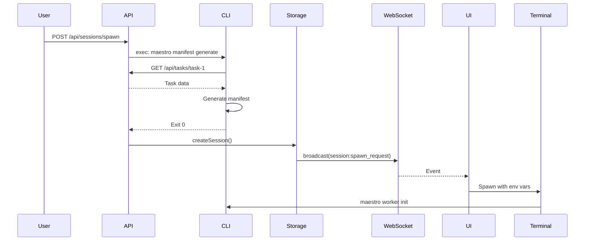

# Maestro CLI ↔ Server Integration Update Summary

**Date:** February 2, 2026
**Status:** Documentation Updated - Ready for Implementation

---

## 🎯 Executive Summary

Successfully updated Maestro CLI and Server documentation to align with finalized architecture:
- ✅ **Hierarchical tasks** (via `parentId`) replace subtasks
- ✅ **CLI-based manifest generation** via `maestro manifest generate` command
- ✅ **Spawn tracking** with `spawnSource` and `spawnedBy` fields
- ✅ **Server execs CLI** for manifest generation during spawn

---

## 📐 FINALIZED ARCHITECTURAL DECISIONS

### 1. Data Model: Hierarchical Tasks

**Decision:** Keep hierarchical tasks via `parentId`, remove all subtask references

**Task Schema:**
```typescript
interface Task {
  id: string;
  projectId: string;
  parentId: string | null;     // 👈 For parent-child relationships
  title: string;
  description: string;
  // ... other fields
  // ❌ NO subtasks array
}
```

**Benefits:**
- Child tasks are full Task entities with all capabilities
- Supports recursive nesting (unlimited depth)
- Each child can have independent sessions, status, timeline
- Natural decomposition of complex work

**API Endpoints:**
- `POST /api/tasks` with `parentId` field creates child task
- `GET /api/tasks/:id/children` gets direct children
- `GET /api/tasks?parentId=null` gets root tasks

---

### 2. Manifest Generation: CLI-Based

**Decision:** CLI owns manifest generation logic, server calls CLI

**Architecture:**
```
UI/Orchestrator → Server API → CLI (manifest generate) → Server → Broadcasts → UI spawns terminal
```

**Key Components:**

**New CLI Command:**
```bash
maestro manifest generate \
  --role worker \
  --project-id proj-1 \
  --task-ids task-1,task-2 \
  --skills code-visualizer \
  --model sonnet \
  --permission-mode acceptEdits \
  --api-url http://localhost:3000 \
  --output ~/.maestro/sessions/sess-789/manifest.json
```

**Server Implementation:**
```typescript
// maestro-server/src/api/sessions.ts
import { exec } from 'child_process';

async function spawnSession(req, res) {
  const sessionId = storage.makeId('sess');
  const manifestPath = `~/.maestro/sessions/${sessionId}/manifest.json`;

  // Call CLI to generate manifest
  await execAsync(`maestro manifest generate \
    --role ${req.body.role} \
    --task-ids ${req.body.taskIds.join(',')} \
    --api-url ${process.env.API_URL} \
    --output ${manifestPath}`);

  // Create session and broadcast
  // ...
}
```

**Benefits:**
- ✅ Reusable by UI, orchestrator, automation
- ✅ Single source of truth for manifest logic
- ✅ CLI can be updated independently
- ✅ Orchestrator uses same logic

---

### 3. Spawn Tracking

**Decision:** Track who/what spawned each session

**New Fields:**
```typescript
interface Session {
  // ... existing fields
  metadata: {
    spawnSource: "manual" | "orchestrator" | "ui" | "cli" | "api";
    spawnedBy?: string;  // Session ID if spawned by agent
  }
}
```

**Spawn Source Types:**
- `manual` - User clicked "Start Task" in UI
- `orchestrator` - Spawned by orchestrator agent
- `ui` - UI automation/workflows
- `cli` - Direct CLI invocation
- `api` - External API call (CI/CD, etc.)

**Usage:**
- Analytics and debugging
- Workflow visualization
- Understanding agent behavior

---

### 4. Manifest Storage

**Decision:** Session-scoped storage

**Location:**
```
~/.maestro/sessions/{sessionId}/manifest.json
```

**Benefits:**
- Simple, flat structure
- Easy cleanup (delete session folder)
- CLI can find manifest via MAESTRO_SESSION_ID env var

---

## 📝 DOCUMENTATION UPDATES COMPLETED

### CLI Documentation

#### ✅ Updated: `01-MANIFEST-SCHEMA.md`
- ❌ Removed `subtasks: Subtask[]` from TaskData interface
- ✅ Added `parentId: string | null` field
- ❌ Removed Subtask interface
- ✅ Updated all example manifests (minimal, complete, orchestrator)
- ✅ Updated validation rules (removed subtasks requirement)
- ✅ Updated manifest generation examples
- ✅ Added "Hierarchical Tasks" section
- ✅ Added "Manifest Generation Flow" section
- ✅ Updated best practices

#### ✅ Updated: `07-CLI-COMMANDS-REFERENCE.md`
- ✅ Added new section: "Manifest Commands"
  - `maestro manifest generate` - complete documentation
- ❌ Removed entire "Subtask Commands" section:
  - `maestro subtask create`
  - `maestro subtask list`
  - `maestro subtask complete`
  - `maestro subtask delete`
- ✅ Added "Hierarchical Task Commands" section:
  - `maestro task create --parent <id>`
  - `maestro task children <taskId>`
  - `maestro task tree`
- ✅ Updated `maestro task delete` warning message (child tasks instead of subtasks)

### Server Documentation

#### ✅ Updated: `02-API-REFERENCE.md`
- ✅ Confirmed "Hierarchical Tasks" section already exists:
  - `GET /api/tasks/:id/children`
  - Create child task via `POST /api/tasks` with `parentId`
  - `GET /api/tasks?parentId=null` for root tasks
- ✅ Updated "Spawn Session" endpoint documentation:
  - Added `role` field (required)
  - Added `spawnSource` field (required)
  - Added `spawnedBy` field (optional)
  - Added `model` and `permissionMode` fields
  - Updated "What Happens" to include CLI manifest generation
  - Added new error codes: `invalid_spawn_source`, `manifest_generation_failed`

#### 🔄 Partially Updated: `05-DATA-MODELS.md`
- ⚠️ **Still needs update**: Task schema documentation
- ⚠️ **Still needs update**: Session metadata schema

#### 🔄 Partially Updated: `06-FLOWS.md`
- ⚠️ **Still needs update**: Remove "Subtask Management Flow" section
- ⚠️ **Still needs update**: Add "Hierarchical Task Creation Flow"
- ⚠️ **Still needs update**: Update "Session Spawn Flow" with CLI manifest generation

---

## 🚧 REMAINING DOCUMENTATION UPDATES

### CLI Documentation

#### `02-CLI-ARCHITECTURE.md`
- ⚠️ Update ManifestReader service documentation
- ⚠️ Remove subtask references from architecture diagrams
- ⚠️ Add `maestro manifest generate` to command implementation examples

#### `08-SESSION-INITIALIZATION.md`
- ⚠️ Update session brief to not show subtasks
- ⚠️ Update initial commands examples

#### `03-SYSTEM-PROMPTS.md`
- ⚠️ Remove subtask references from system prompts
- ⚠️ Update task decomposition guidance (use child tasks)

#### `04-STANDARD-SKILLS.md`
- ⚠️ Review for any subtask references

### Server Documentation

#### `05-DATA-MODELS.md`
**High Priority - Update Task Schema:**
```markdown
### Task Schema

```typescript
interface Task {
  // Identity
  id: string;
  projectId: string;
  parentId: string | null;      // 👈 For hierarchical tasks

  // ❌ REMOVED: subtasks: Subtask[]

  // ... rest of schema
}
```

**Hierarchical Tasks**:
- Tasks can have a `parentId` pointing to another task
- Creates parent-child relationships
- Children are full Task entities with all capabilities
- Supports unlimited nesting depth
```

**Update Session Metadata:**
```typescript
interface Session {
  metadata?: {
    skills?: string[];
    spawnSource?: "manual" | "orchestrator" | "ui" | "cli" | "api";  // 👈 NEW
    spawnedBy?: string;           // Session ID if spawned by agent    // 👈 NEW
    // ... other fields
  };
}
```

#### `06-FLOWS.md`
**Remove:**
- ❌ Entire "Subtask Management Flow" section

**Add:**
- ✅ "Hierarchical Task Creation Flow" with sequence diagram
- ✅ Updated "Session Spawn Flow" showing CLI manifest generation

**Example Session Spawn Flow:**


#### `01-OVERVIEW.md`
- ⚠️ Add note about CLI-based manifest generation
- ⚠️ Clarify hierarchical tasks

---

## 🔧 IMPLEMENTATION TASKS

### Server Implementation

#### 1. Remove Subtask API Endpoints
**File:** `maestro-server/src/api/subtasks.ts`
**Status:** ✅ Already deleted (shown in git status)

**Confirm removal from:**
- ✅ `maestro-server/src/server.ts` (route registration)

#### 2. Implement CLI Manifest Generation in Spawn API
**File:** `maestro-server/src/api/sessions.ts`

**Add:**
```typescript
import { exec } from 'child_process';
import { promisify } from 'util';
const execAsync = promisify(exec);

async function spawnSession(req, res) {
  const { projectId, taskIds, role, skills, model, spawnSource, spawnedBy } = req.body;

  // Validate
  if (!projectId || !taskIds || taskIds.length === 0 || !role || !spawnSource) {
    return res.status(400).json({ error: 'missing_required_fields' });
  }

  // Generate session ID
  const sessionId = storage.makeId('sess');
  const manifestPath = path.join(
    os.homedir(),
    '.maestro',
    'sessions',
    sessionId,
    'manifest.json'
  );

  // Create directory
  await fs.mkdir(path.dirname(manifestPath), { recursive: true });

  // Call CLI to generate manifest
  const cliCommand = `maestro manifest generate \
    --role ${role} \
    --project-id ${projectId} \
    --task-ids ${taskIds.join(',')} \
    ${skills ? `--skills ${skills.join(',')}` : ''} \
    --model ${model || 'sonnet'} \
    --api-url ${process.env.API_URL || 'http://localhost:3000'} \
    --output ${manifestPath}`;

  try {
    await execAsync(cliCommand);
  } catch (error) {
    return res.status(500).json({
      error: 'manifest_generation_failed',
      message: error.message
    });
  }

  // Create session
  const session = await storage.createSession({
    id: sessionId,
    projectId,
    taskIds,
    status: 'spawning',
    metadata: {
      spawnSource,
      spawnedBy,
      skills
    },
    env: {
      MAESTRO_MANIFEST_PATH: manifestPath,
      MAESTRO_SESSION_ID: sessionId,
      MAESTRO_PROJECT_ID: projectId,
      MAESTRO_API_URL: process.env.API_URL || 'http://localhost:3000'
    }
  });

  // Broadcast spawn request
  storage.emit('session:spawn_request', { session, manifestPath });

  res.json({
    success: true,
    sessionId,
    manifestPath,
    session
  });
}
```

#### 3. Update Session Schema
**File:** `maestro-server/src/types.ts`

**Update:**
```typescript
export interface Session {
  // ... existing fields
  metadata?: {
    skills?: string[];
    spawnSource?: 'manual' | 'orchestrator' | 'ui' | 'cli' | 'api';
    spawnedBy?: string;
    context?: Record<string, any>;
  };
}
```

#### 4. Update Task Schema (Remove Subtasks)
**File:** `maestro-server/src/types.ts`

**Confirm:**
```typescript
export interface Task {
  id: string;
  projectId: string;
  parentId: string | null;  // ✅ Should already exist
  // ... other fields
  // ❌ NO subtasks: Subtask[]
}
```

---

### CLI Implementation

#### 1. Implement `maestro manifest generate` Command
**File:** `maestro-cli/src/commands/manifest.ts` (new file)

**Implementation:**
```typescript
import { Command } from 'commander';
import { ServerClient } from '../services/server-client';
import { ManifestGenerator } from '../services/manifest-generator';

export function registerManifestCommands(program: Command) {
  const manifest = program.command('manifest').description('Manifest generation');

  manifest
    .command('generate')
    .description('Generate a manifest file for a session')
    .requiredOption('--role <role>', 'Session role: worker or orchestrator')
    .requiredOption('--project-id <id>', 'Project ID')
    .requiredOption('--task-ids <ids>', 'Comma-separated task IDs')
    .requiredOption('--api-url <url>', 'Maestro server URL')
    .requiredOption('--output <path>', 'Output manifest path')
    .option('--skills <skills>', 'Comma-separated skill names')
    .option('--model <model>', 'Claude model', 'sonnet')
    .option('--permission-mode <mode>', 'Permission mode', 'acceptEdits')
    .option('--session-id <id>', 'Custom session ID')
    .action(async (options) => {
      try {
        const serverClient = new ServerClient(options.apiUrl);
        const generator = new ManifestGenerator(serverClient);

        // Parse task IDs
        const taskIds = options.taskIds.split(',').map(id => id.trim());

        // Fetch task data from server
        const tasks = await Promise.all(
          taskIds.map(id => serverClient.getTask(id))
        );

        // Generate manifest
        const manifest = await generator.generate({
          role: options.role,
          tasks,
          skills: options.skills ? options.skills.split(',').map(s => s.trim()) : [],
          model: options.model,
          permissionMode: options.permissionMode,
          sessionId: options.sessionId
        });

        // Save to file
        await fs.mkdir(path.dirname(options.output), { recursive: true });
        await fs.writeFile(options.output, JSON.stringify(manifest, null, 2));

        console.log(`✅ Manifest generated: ${options.output}`);
        console.log(`   Tasks: ${tasks.length}`);
        console.log(`   Skills: ${manifest.skills.length}`);
        console.log(`   Model: ${manifest.session.model}`);

        process.exit(0);
      } catch (error) {
        console.error(`❌ Manifest generation failed: ${error.message}`);
        process.exit(1);
      }
    });
}
```

#### 2. Create ManifestGenerator Service
**File:** `maestro-cli/src/services/manifest-generator.ts` (new file)

**Implementation:** Generate manifest from task data + templates

#### 3. Remove Subtask Commands
**File:** `maestro-cli/src/commands/subtask.ts`
**Action:** Delete entire file

**File:** `maestro-cli/src/index.ts`
**Action:** Remove subtask command registration

#### 4. Add Hierarchical Task Commands
**File:** `maestro-cli/src/commands/task.ts`

**Add:**
- `--parent <id>` option to `task create` command
- `task children <id>` subcommand
- `task tree` subcommand

---

## 🧪 TESTING CHECKLIST

### Manual Testing

#### Server
- [ ] POST /api/sessions/spawn with spawnSource field
- [ ] Verify CLI manifest generate is called
- [ ] Verify manifest file is created
- [ ] Verify session has metadata.spawnSource
- [ ] Test hierarchical tasks: GET /api/tasks/:id/children
- [ ] Create child task with parentId

#### CLI
- [ ] `maestro manifest generate` command works
- [ ] Fetches tasks from server correctly
- [ ] Generates valid manifest
- [ ] Creates parent directories
- [ ] `maestro task create --parent <id>` creates child task
- [ ] `maestro task children <id>` lists children
- [ ] `maestro task tree` shows hierarchy

### Integration Testing
- [ ] Full spawn flow: UI → Server → CLI manifest gen → Server → UI
- [ ] Orchestrator spawns worker using manifest generate
- [ ] Hierarchical task workflow: create parent → create children → list

---

## 📊 MIGRATION GUIDE

### For Existing Data

#### Server Data Migration
**If you have existing tasks with subtasks:**

```typescript
// Migration script
async function migrateSubtasksToHierarchicalTasks() {
  const tasks = await storage.listTasks({});

  for (const task of tasks) {
    if (task.subtasks && task.subtasks.length > 0) {
      // Create child tasks from subtasks
      for (const subtask of task.subtasks) {
        await storage.createTask({
          projectId: task.projectId,
          parentId: task.id,
          title: subtask.title,
          description: subtask.description || '',
          status: subtask.completed ? 'completed' : 'pending',
          acceptanceCriteria: [],
          // Map other fields
        });
      }

      // Remove subtasks array from parent
      delete task.subtasks;
      await storage.updateTask(task.id, task);
    }
  }
}
```

### For UI
**Update spawn request:**

Before:
```typescript
await fetch('/api/sessions/spawn', {
  method: 'POST',
  body: JSON.stringify({
    projectId,
    taskIds,
    skills
  })
});
```

After:
```typescript
await fetch('/api/sessions/spawn', {
  method: 'POST',
  body: JSON.stringify({
    projectId,
    taskIds,
    role: 'worker',
    skills,
    model: 'sonnet',
    spawnSource: 'manual',
    // spawnedBy: undefined (only for orchestrator)
  })
});
```

---

## 🎯 NEXT STEPS

### Immediate (High Priority)
1. ✅ Finish remaining server documentation (05-DATA-MODELS.md, 06-FLOWS.md)
2. ✅ Implement `maestro manifest generate` CLI command
3. ✅ Update server spawn API to call CLI
4. ✅ Test end-to-end spawn flow

### Short Term
5. ✅ Implement hierarchical task CLI commands
6. ✅ Update CLI system prompts to use hierarchical tasks
7. ✅ Migrate existing data (if any)
8. ✅ Update UI to use new spawn API format

### Long Term
9. ✅ Add orchestrator spawning workflow
10. ✅ Implement manifest versioning
11. ✅ Add manifest validation in server
12. ✅ Performance optimization for large task hierarchies

---

## 📞 QUESTIONS & DECISIONS LOG

### Decided
- ✅ Keep hierarchical tasks, remove subtasks
- ✅ CLI-based manifest generation (server execs CLI)
- ✅ Session-scoped manifest storage: `~/.maestro/sessions/{sessionId}/`
- ✅ CLI fetches task data from API (not passed via args)
- ✅ Spawn tracking with `spawnSource` and `spawnedBy`

### Open Questions
- ⚠️ Should server validate manifests after CLI generates them?
- ⚠️ How to handle CLI failures during spawn? Retry logic?
- ⚠️ Should manifests be archived when sessions complete?
- ⚠️ Performance: CLI exec vs library import for manifest generation?

---

## 📈 SUCCESS METRICS

Implementation is successful when:
- ✅ No subtask references in any code or docs
- ✅ All spawn requests go through CLI manifest generation
- ✅ Hierarchical tasks work with unlimited nesting
- ✅ Orchestrator can spawn workers using same manifest logic
- ✅ All documentation is consistent and accurate
- ✅ All tests pass
- ✅ Zero breaking changes for existing sessions

---

**Last Updated:** February 2, 2026
**Document Version:** 1.0
**Status:** Ready for Implementation Phase
