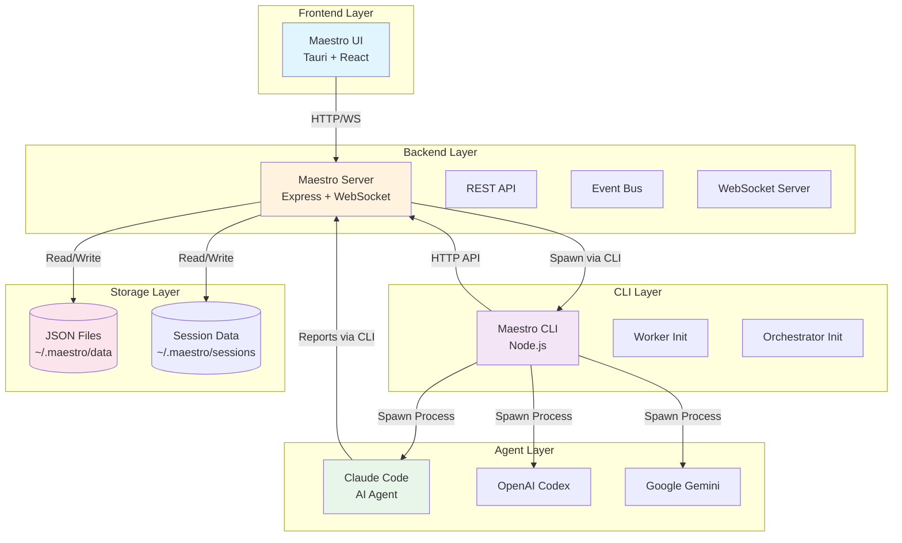
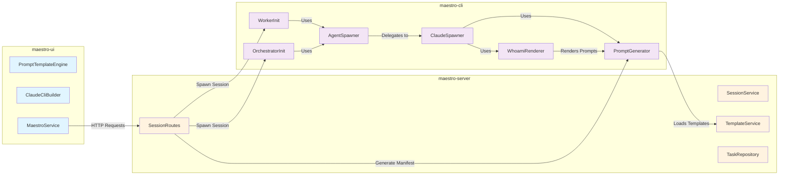
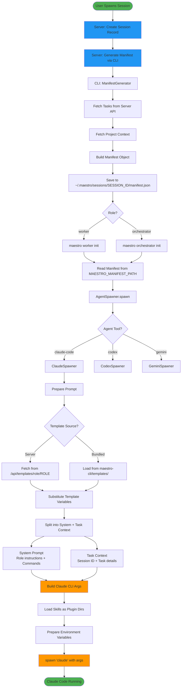
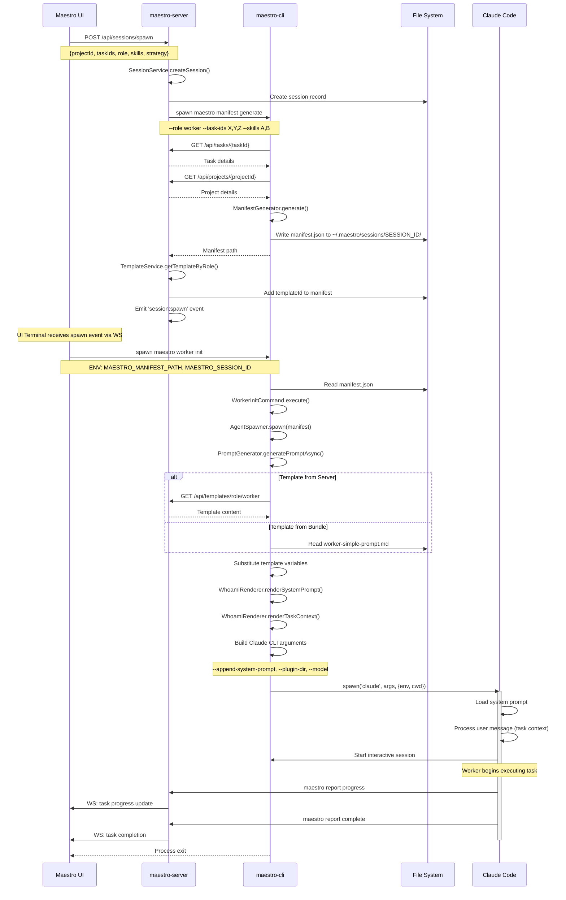

# Maestro Architecture & Flow Documentation

This document provides a comprehensive overview of the Maestro system architecture, focusing on the prompt generation pipeline and Claude Code spawning process.

## Table of Contents

1. [High-Level System Architecture](#high-level-system-architecture)
2. [Component Relationships](#component-relationships)
3. [Prompt Generation Pipeline](#prompt-generation-pipeline)
4. [Claude Spawning Sequence](#claude-spawning-sequence)
5. [Data Flow](#data-flow)
6. [Key Components](#key-components)

---

## High-Level System Architecture



---

## Component Relationships



---

## Prompt Generation Pipeline



---

## Claude Spawning Sequence



---

## Data Flow

### Session Spawn Data Flow

```mermaid
flowchart LR
    subgraph "1. Input"
        Input[User Input<br/>- projectId<br/>- taskIds<br/>- role<br/>- skills<br/>- strategy]
    end

    subgraph "2. Server Processing"
        CreateSess[Create Session Record]
        GenMani[Generate Manifest]
        AddTemplate[Add Template ID]
        EmitEvent[Emit session:spawn]
    end

    subgraph "3. Manifest Data"
        Manifest[manifest.json<br/>- role<br/>- tasks[]<br/>- skills[]<br/>- strategy<br/>- session config<br/>- context]
    end

    subgraph "4. CLI Processing"
        ReadMani[Read Manifest]
        GenPrompt[Generate Prompt]
        BuildCmd[Build CLI Command]
    end

    subgraph "5. Prompt Data"
        SystemPrompt[System Prompt<br/>- Role instructions<br/>- Available commands<br/>- Project standards]
        TaskPrompt[Task Context<br/>- Session ID<br/>- Task details<br/>- Acceptance criteria]
    end

    subgraph "6. Execution"
        EnvVars[Environment Variables<br/>- MAESTRO_SESSION_ID<br/>- MAESTRO_TASK_IDS<br/>- MAESTRO_PROJECT_ID<br/>- MAESTRO_ROLE<br/>- MAESTRO_STRATEGY]
        SpawnClaude[Spawn Claude Process<br/>claude --append-system-prompt<br/>--plugin-dir --model]
    end

    Input --> CreateSess
    CreateSess --> GenMani
    GenMani --> Manifest
    Manifest --> AddTemplate
    AddTemplate --> EmitEvent
    EmitEvent --> ReadMani
    ReadMani --> GenPrompt
    GenPrompt --> SystemPrompt
    GenPrompt --> TaskPrompt
    SystemPrompt --> BuildCmd
    TaskPrompt --> BuildCmd
    BuildCmd --> EnvVars
    BuildCmd --> SpawnClaude

    style Input fill:#e8f5e9
    style CreateSess fill:#fff3e0
    style GenMani fill:#fff3e0
    style Manifest fill:#e1f5ff
    style GenPrompt fill:#f3e5f5
    style SystemPrompt fill:#fce4ec
    style TaskPrompt fill:#fce4ec
    style SpawnClaude fill:#4caf50
```

### Template Variable Substitution Flow

```mermaid
flowchart TD
    Template[Template File<br/>worker-simple-prompt.md] --> LoadTemplate[PromptGenerator.loadTemplate]

    LoadTemplate --> Variables{Template Variables}

    Variables --> TaskVars[Task Variables<br/>${TASK_ID}<br/>${TASK_TITLE}<br/>${TASK_DESCRIPTION}<br/>${TASK_PRIORITY}]

    Variables --> ContextVars[Context Variables<br/>${CODEBASE_CONTEXT}<br/>${RELATED_TASKS}<br/>${PROJECT_STANDARDS}]

    Variables --> StrategyVars[Strategy Variables<br/>${STRATEGY}<br/>${STRATEGY_INSTRUCTIONS}<br/>${ORCHESTRATOR_STRATEGY}]

    Variables --> MultiTaskVars[Multi-Task Variables<br/>${ALL_TASKS}<br/>${TASK_COUNT}]

    TaskVars --> Substitute[substituteVariables]
    ContextVars --> Substitute
    StrategyVars --> Substitute
    MultiTaskVars --> Substitute

    Manifest[Manifest Data] --> FetchData[Fetch from manifest.tasks[0]]
    FetchData --> Substitute

    Substitute --> FinalPrompt[Final Rendered Prompt]

    style Template fill:#e1f5ff
    style Manifest fill:#e1f5ff
    style Substitute fill:#ff9800
    style FinalPrompt fill:#4caf50
```

---

## Key Components

### 1. PromptGenerator (`maestro-cli/src/services/prompt-generator.ts`)

**Purpose**: Generates role-specific prompts from manifest files

**Key Methods**:
- `generatePromptAsync(manifest)` - Async version that fetches templates from server
- `generatePrompt(manifest)` - Sync version using bundled templates
- `loadTemplate(templateName)` - Loads template file with caching
- `substituteVariables(template, manifest)` - Replaces template variables

**Template Resolution Order**:
1. Fetch by `templateId` if specified in manifest
2. Fetch by `role` from server API (`/api/templates/role/{role}`)
3. Fall back to bundled template in `maestro-cli/templates/`

**Template Naming Convention**:
- Worker: `worker-{strategy}-prompt.md` (e.g., `worker-simple-prompt.md`, `worker-queue-prompt.md`)
- Orchestrator: `orchestrator-{orchestratorStrategy}-prompt.md` (e.g., `orchestrator-default-prompt.md`)

**Template Variables**:
```
${TASK_ID}                    - Primary task ID
${TASK_TITLE}                 - Task title
${TASK_DESCRIPTION}           - Task description
${TASK_PRIORITY}              - Task priority (high/medium/low)
${ACCEPTANCE_CRITERIA}        - Formatted acceptance criteria
${CODEBASE_CONTEXT}           - Codebase context (files, changes, architecture)
${RELATED_TASKS}              - Related tasks
${PROJECT_STANDARDS}          - Project coding standards
${ALL_TASKS}                  - All tasks in session (for multi-task)
${TASK_COUNT}                 - Number of tasks
${STRATEGY}                   - Worker strategy (simple/queue/tree)
${STRATEGY_INSTRUCTIONS}      - Strategy-specific instructions
${ORCHESTRATOR_STRATEGY}      - Orchestrator strategy
${ORCHESTRATOR_STRATEGY_INSTRUCTIONS} - Orchestrator-specific instructions
```

---

### 2. ClaudeSpawner (`maestro-cli/src/services/claude-spawner.ts`)

**Purpose**: Spawns Claude Code sessions with manifests

**Key Methods**:
- `spawn(manifest, sessionId, options)` - Main spawn method
- `preparePromptAsync(manifest)` - Generates prompt from manifest
- `prepareEnvironment(manifest, sessionId)` - Sets up environment variables
- `buildClaudeArgs(manifest)` - Constructs CLI arguments

**Claude CLI Arguments Built**:
```bash
claude \
  --plugin-dir ~/.claude/plugins/maestro-worker \
  --plugin-dir /path/to/skill1 \
  --plugin-dir /path/to/skill2 \
  --model sonnet \
  --max-turns 100 \
  --append-system-prompt "System prompt content..." \
  "Task context content..."
```

**Environment Variables Set**:
```
MAESTRO_SESSION_ID           - Unique session identifier
MAESTRO_TASK_IDS             - Comma-separated task IDs
MAESTRO_PROJECT_ID           - Project ID
MAESTRO_ROLE                 - worker | orchestrator
MAESTRO_STRATEGY             - simple | queue | tree
MAESTRO_SERVER_URL           - Server API URL
MAESTRO_MANIFEST_PATH        - Path to manifest.json
MAESTRO_ALL_TASKS            - JSON array of all tasks
MAESTRO_TASK_ACCEPTANCE      - JSON array of acceptance criteria
MAESTRO_TASK_DEPENDENCIES    - JSON array of dependencies
MAESTRO_ORCHESTRATOR_STRATEGY - Orchestrator strategy (if applicable)
```

**Plugin Structure**:
```
~/.claude/plugins/maestro-worker/
├── hooks/
│   ├── SessionStart.sh       - Registers session on startup
│   └── UserPromptSubmit.sh   - Updates session status
└── skills/
    └── maestro-commands.md   - Maestro CLI commands skill
```

---

### 3. WhoamiRenderer (`maestro-cli/src/services/whoami-renderer.ts`)

**Purpose**: Renders full session context and splits into system/task layers

**Key Methods**:
- `renderSystemPrompt(manifest, permissions)` - Static role instructions + commands
- `renderTaskContext(manifest, sessionId)` - Dynamic task details + session info
- `render(manifest, permissions, sessionId)` - Full whoami output (for `maestro whoami` command)

**Two-Layer Prompt Architecture**:

1. **System Prompt Layer** (Static - passed via `--append-system-prompt`)
   - Role-specific instructions (worker vs orchestrator)
   - Strategy-specific guidance
   - Available commands reference
   - Project standards and guidelines

2. **Task Context Layer** (Dynamic - passed as user message)
   - Session ID
   - Task details (ID, title, description)
   - Acceptance criteria
   - Reference task context (if any)

This split allows:
- System prompt to remain stable across multiple prompts
- Task context to be dynamic and updated per interaction
- Better token efficiency by keeping role instructions in system prompt

---

### 4. WorkerInit & OrchestratorInit Commands

**Purpose**: Entry points for spawning worker/orchestrator sessions

**WorkerInit Flow** (`maestro-cli/src/commands/worker-init.ts`):
```
1. Read MAESTRO_MANIFEST_PATH from env
2. Validate manifest has role='worker'
3. Load command permissions from manifest
4. Update session status to 'running'
5. Spawn agent via AgentSpawner
6. Wait for process completion
```

**OrchestratorInit Flow** (`maestro-cli/src/commands/orchestrator-init.ts`):
```
1. Read MAESTRO_MANIFEST_PATH from env
2. Validate manifest has role='orchestrator'
3. Display task information to console
4. Update task statuses to 'in_progress'
5. Spawn agent via AgentSpawner
6. Wait for process completion
```

Both commands:
- Accept manifest path from environment variable
- Auto-update session and task statuses
- Use `AgentSpawner` factory to delegate to appropriate spawner
- Run in interactive mode (`stdio: 'inherit'`)

---

### 5. Manifest Structure

**Generated by**: `maestro manifest generate` command

**Location**: `~/.maestro/sessions/{sessionId}/manifest.json`

**Schema**:
```typescript
interface MaestroManifest {
  version: string;
  role: 'worker' | 'orchestrator';
  agentTool?: 'claude-code' | 'codex' | 'gemini';

  // Worker strategy
  strategy?: 'simple' | 'queue' | 'tree';

  // Orchestrator strategy
  orchestratorStrategy?: 'default' | 'intelligent-batching' | 'dag';

  // Tasks assigned to this session
  tasks: Array<{
    id: string;
    title: string;
    description: string;
    priority: 'high' | 'medium' | 'low';
    status: string;
    projectId: string;
    acceptanceCriteria?: string[];
    dependencies?: string[];
    parentId?: string;
  }>;

  // Skills to load
  skills?: string[];

  // Reference tasks (for context only, not execution)
  referenceTaskIds?: string[];

  // Session configuration
  session: {
    model: 'sonnet' | 'opus' | 'haiku';
    workingDirectory?: string;
    maxTurns?: number;
  };

  // Additional context
  context?: {
    codebaseContext?: CodebaseContext;
    relatedTasks?: RelatedTask[];
    projectStandards?: ProjectStandards;
  };

  // Template override
  templateId?: string;

  // Command permissions
  allowedCommands?: string[];
  hiddenCommands?: string[];
}
```

---

## Template Files

### Worker Templates

#### `worker-simple-prompt.md`
```markdown
You are a Maestro worker. You report your progress, updates, and status using the maestro CLI.

Work on the tasks assigned to you. When you hit milestones, report progress. When blocked, report blockers. When done, report completion. Document your work by adding relevant docs to tasks or sessions using the maestro CLI.
```

#### `worker-queue-prompt.md`
```markdown
You are a Maestro queue worker. Process tasks one at a time using queue commands.

### Queue Workflow
1. Get next task: `maestro queue top`
2. Start task: `maestro queue start`
3. Work on task
4. Complete: `maestro queue complete`
5. Repeat
```

#### `worker-tree-prompt.md`
```markdown
You are a Maestro tree worker. You own a root task and its full subtask tree.

Work through all subtasks holistically. Report progress per subtask.
```

### Orchestrator Templates

#### `orchestrator-default-prompt.md`
```markdown
# Maestro Orchestrator Session

## Your Role
You are the **Maestro Orchestrator**. You coordinate and manage work -- you **never implement tasks directly**.

**Golden Rule: Orchestrators coordinate. Workers implement. Never write code yourself.**

## Workflow
1. Analysis - understand scope
2. Planning - break down tasks
3. Delegation - spawn workers
4. Monitoring - track progress
5. Failure Handling - retry/reassign
6. Completion - verify and report
```

---

## Command Flow Examples

### Example 1: Worker Session Spawn

```bash
# UI sends spawn request
POST /api/sessions/spawn
{
  "projectId": "proj_123",
  "taskIds": ["task_456"],
  "role": "worker",
  "strategy": "simple",
  "skills": ["code-visualizer"],
  "model": "sonnet"
}

# Server creates session and generates manifest
maestro manifest generate \
  --role worker \
  --project-id proj_123 \
  --task-ids task_456 \
  --skills code-visualizer \
  --strategy simple \
  --output ~/.maestro/sessions/sess_789/manifest.json

# Server emits session:spawn event to UI

# UI terminal receives event and spawns init command
MAESTRO_MANIFEST_PATH=~/.maestro/sessions/sess_789/manifest.json \
MAESTRO_SESSION_ID=sess_789 \
MAESTRO_SERVER_URL=http://localhost:3001/api \
maestro worker init

# Worker init reads manifest and spawns Claude
claude \
  --plugin-dir ~/.claude/plugins/maestro-worker \
  --plugin-dir ~/.claude/skills/code-visualizer \
  --model sonnet \
  --append-system-prompt "You are a Maestro worker..." \
  "**Session:** sess_789\n**Task:** task_456..."
```

### Example 2: Orchestrator Session Spawn

```bash
# UI spawns orchestrator for complex task
POST /api/sessions/spawn
{
  "projectId": "proj_123",
  "taskIds": ["task_complex"],
  "role": "orchestrator",
  "orchestratorStrategy": "default",
  "model": "opus"
}

# Orchestrator reads task and spawns worker
maestro session spawn --task task_subtask_1 --skill maestro-worker

# Server receives spawn request from orchestrator session
# Creates new worker session and emits session:spawn

# New worker starts and reports progress back
maestro report progress "Completed subtask 1"
```

---

## Summary

The Maestro system follows a clean separation of concerns:

1. **maestro-ui** - User interface for visual task management
2. **maestro-server** - Central coordination, data storage, and API
3. **maestro-cli** - Command-line interface and agent spawning logic
4. **Templates** - Role-specific prompt templates with variable substitution
5. **Agents** - Claude Code, Codex, or Gemini executing tasks

The prompt generation pipeline:
1. Server creates session and generates manifest via CLI
2. CLI reads manifest and selects appropriate template
3. Template variables are substituted with manifest data
4. Prompt is split into system (static) and task (dynamic) layers
5. Claude Code is spawned with arguments and environment variables
6. Agent reports progress back to server via maestro CLI commands

This architecture enables:
- Multi-agent coordination
- Flexible role-based workflows
- Template-driven prompt generation
- Extensible skill system
- Real-time progress tracking
