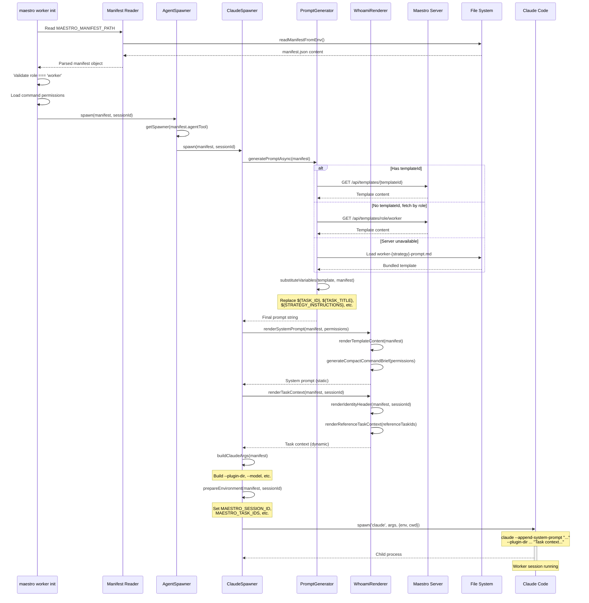
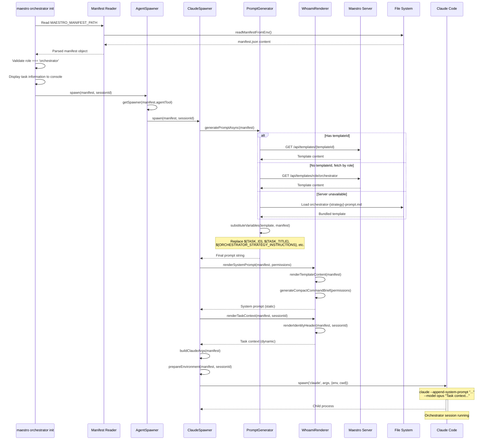
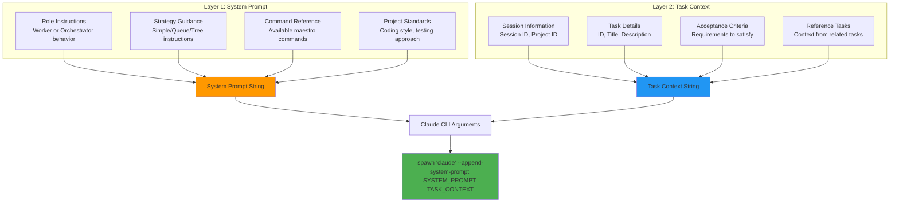

# Prompt Generation Deep Dive

This document provides an in-depth analysis of how worker and orchestrator prompts are generated in Maestro, with detailed code flow diagrams and examples.

## Table of Contents

1. [Overview](#overview)
2. [Prompt Generation Code Flow](#prompt-generation-code-flow)
3. [Worker Prompt Generation](#worker-prompt-generation)
4. [Orchestrator Prompt Generation](#orchestrator-prompt-generation)
5. [Template System](#template-system)
6. [Variable Substitution](#variable-substitution)
7. [Two-Layer Prompt Architecture](#two-layer-prompt-architecture)
8. [Command Line Arguments](#command-line-arguments)
9. [Examples](#examples)

---

## Overview

Maestro uses a template-based system to generate prompts for Claude Code sessions. The prompt generation pipeline transforms a manifest file (containing task details, role, and configuration) into two distinct prompt layers:

1. **System Prompt Layer** - Static role instructions and commands
2. **Task Context Layer** - Dynamic task details and session information

This separation allows for:
- Efficient token usage (system prompt is reused)
- Clear separation of concerns (role vs. task)
- Flexible template customization

## Current Prompt Contract (Plan 2 / Identity V2)

When `MAESTRO_PROMPT_IDENTITY_V2=true`, prompt composition follows the Identity Kernel + Context Lens architecture:

- System prompt:
  - `<identity_kernel>`
    - `<mode_identity>`: role profile + instruction
    - `<self_identity>`: resolved session persona (optional in worker modes; strict single profile in coordinator modes)
  - `<team_context lens="full_expertise|slim_roster">`: mode-selected member view
  - `<coordination_context>`: coordinated modes only
  - `<capability_summary>` and `<commands_reference>`
- Task prompt:
  - `<tasks>`, optional `<task_tree>`, `<context>`, optional `<skills>`
  - `<session_context>` contains only session/project/mode (no coordinator linkage)
  - optional `<reference_tasks>`

Mode matrix:

| Mode | Self Identity | Team Lens | Coordination Context |
|---|---|---|---|
| `worker` | optional | `full_expertise` | no |
| `coordinator` | required (exactly one, strict by policy) | `slim_roster` | no |
| `coordinated-worker` | optional | `full_expertise` | yes |
| `coordinated-coordinator` | required (exactly one, strict by policy) | `slim_roster` | yes |

The detailed legacy sections below still contain useful historical context, but many snippets predate this contract and are stale for exact block names.

---

## Prompt Generation Code Flow

```mermaid
flowchart TD
    Start([Session Spawn Request]) --> ServerReceives[Server: POST /api/sessions/spawn]

    ServerReceives --> CreateSession[SessionService.createSession]
    CreateSession --> GenerateManifest[Spawn: maestro manifest generate]

    GenerateManifest --> ManifestGenerator[ManifestGenerator.generate]
    ManifestGenerator --> FetchTasksFromAPI[GET /api/tasks/{taskId}]
    FetchTasksFromAPI --> FetchProjectContext[GET /api/projects/{projectId}]
    FetchProjectContext --> BuildManifestObject[Build Manifest Object]

    BuildManifestObject --> WriteToFile[Write to ~/.maestro/sessions/SESSION_ID/manifest.json]
    WriteToFile --> AddTemplateId[Server adds templateId from TemplateService]

    AddTemplateId --> EmitSpawnEvent[Server emits 'session:spawn' event]
    EmitSpawnEvent --> UIReceivesEvent[UI Terminal receives event via WebSocket]

    UIReceivesEvent --> SpawnInit{Role?}
    SpawnInit -->|worker| WorkerInitCmd[maestro worker init]
    SpawnInit -->|orchestrator| OrchestratorInitCmd[maestro orchestrator init]

    WorkerInitCmd --> ReadManifestFromEnv[Read MAESTRO_MANIFEST_PATH env var]
    OrchestratorInitCmd --> ReadManifestFromEnv

    ReadManifestFromEnv --> ValidateRole[Validate role matches command]
    ValidateRole --> LoadPermissions[Load command permissions from manifest]
    LoadPermissions --> UpdateSessionStatus[Update session status to 'running']

    UpdateSessionStatus --> AgentSpawnerSpawn[AgentSpawner.spawn]

    AgentSpawnerSpawn --> SelectSpawner{manifest.agentTool?}
    SelectSpawner -->|claude-code| ClaudeSpawner
    SelectSpawner -->|codex| CodexSpawner
    SelectSpawner -->|gemini| GeminiSpawner

    ClaudeSpawner --> PreparePromptAsync[ClaudeSpawner.preparePromptAsync]

    PreparePromptAsync --> PromptGeneratorAsync[PromptGenerator.generatePromptAsync]

    PromptGeneratorAsync --> FetchTemplateLogic{Template Source?}

    FetchTemplateLogic -->|templateId in manifest| FetchById[GET /api/templates/{templateId}]
    FetchTemplateLogic -->|no templateId| FetchByRole[GET /api/templates/role/{role}]
    FetchTemplateLogic -->|server unavailable| LoadBundled[Load from maestro-cli/templates/]

    FetchById --> TemplateContent[Template Content String]
    FetchByRole --> TemplateContent
    LoadBundled --> TemplateContent

    TemplateContent --> SubstituteVars[substituteVariables template, manifest]

    SubstituteVars --> ReplaceTaskVars[Replace ${TASK_ID}, ${TASK_TITLE}, etc.]
    ReplaceTaskVars --> ReplaceContextVars[Replace ${CODEBASE_CONTEXT}, etc.]
    ReplaceContextVars --> ReplaceStrategyVars[Replace ${STRATEGY_INSTRUCTIONS}, etc.]
    ReplaceStrategyVars --> FinalPromptString[Final Prompt String]

    FinalPromptString --> SplitLayers[Split into System + Task Context]

    SplitLayers --> WhoamiRenderer[WhoamiRenderer]
    WhoamiRenderer --> RenderSystemPrompt[renderSystemPrompt<br/>Role instructions + Commands]
    WhoamiRenderer --> RenderTaskContext[renderTaskContext<br/>Session ID + Task details]

    RenderSystemPrompt --> BuildClaudeArgs[Build Claude CLI Arguments]
    RenderTaskContext --> BuildClaudeArgs

    BuildClaudeArgs --> LoadSkills[Load skills as --plugin-dir args]
    LoadSkills --> PrepareEnv[Prepare environment variables]

    PrepareEnv --> SpawnClaude[spawn 'claude' process]
    SpawnClaude --> ClaudeRunning([Claude Code Running])

    style Start fill:#4caf50
    style ClaudeRunning fill:#4caf50
    style ServerReceives fill:#2196f3
    style PromptGeneratorAsync fill:#ff9800
    style SubstituteVars fill:#ff9800
    style WhoamiRenderer fill:#9c27b0
    style SpawnClaude fill:#f44336
```

---

## Worker Prompt Generation

### Code Flow for Worker Prompt



### Worker Prompt Components

#### 1. System Prompt (Static Layer)

The system prompt for a worker includes:

**From Template** (`worker-simple-prompt.md`):
```markdown
You are a Maestro worker. You report your progress, updates, and status using the maestro CLI.

Work on the tasks assigned to you. When you hit milestones, report progress. When blocked, report blockers. When done, report completion. Document your work by adding relevant docs to tasks or sessions using the maestro CLI.
```

**From WhoamiRenderer** (Command Reference):
```markdown
---

## Maestro Commands

- `maestro whoami` — Print current context
- `maestro status` — Show project status
- `maestro report progress "<message>"` — Report work progress
- `maestro report complete "<summary>"` — Report completion
- `maestro report blocked "<reason>"` — Report blocker
- `maestro task get <taskId>` — Get task details
- `maestro task docs add <taskId> "<title>" --file <filePath>` — Add doc to task
```

#### 2. Task Context (Dynamic Layer)

The task context includes current session and task information:

```markdown
**Session:** sess_1771107504690_15ffvossz

**Task:** task_1770978337375_v6caveyy6
**Title:** Improve worker and orchestrator prompts
**Description:** Understand the app. Understand the whole task execution to Claude spawning...
```

### Worker Strategy Variations

#### Simple Strategy (`worker-simple-prompt.md`)
- Minimal prompt
- Worker sees all tasks at once
- Self-organizes task completion

#### Queue Strategy (`worker-queue-prompt.md`)
- Adds queue-specific instructions
- Enforces FIFO task processing
- Includes queue command reference

```markdown
**IMPORTANT**: This is a QUEUE WORKER session. You must follow the queue workflow:

### Queue Workflow
1. Get next task: `maestro queue top`
2. Start task: `maestro queue start`
3. Work on task
4. Complete: `maestro queue complete`
5. Repeat
```

#### Tree Strategy (`worker-tree-prompt.md`)
- Worker owns a root task and all subtasks
- Can work through subtasks holistically
- Reports progress per subtask

```markdown
**Tree Strategy Active**: This session owns a root task and its full subtask tree.
Work through all subtasks holistically — you decide the order based on dependencies and logical flow.
Report progress per subtask using `maestro report progress "SUBTASK COMPLETE [task-id]: summary"`.
```

---

## Orchestrator Prompt Generation

### Code Flow for Orchestrator Prompt



### Orchestrator Prompt Components

#### 1. System Prompt (Static Layer)

The orchestrator system prompt is comprehensive and includes:

**Role Definition**:
```markdown
# Maestro Orchestrator Session

## Your Role
You are the **Maestro Orchestrator**. You coordinate and manage work -- you **never implement tasks directly**.

**Golden Rule: Orchestrators coordinate. Workers implement. Never write code yourself.**
```

**Six-Phase Workflow**:
```markdown
## Phase 1: Analysis
Before taking any action, analyze the full scope of work.
1. Read the task description and acceptance criteria carefully
2. Review all tasks to understand the full picture
3. Identify dependencies
4. Assess priority
5. Evaluate risk
6. Check current state

## Phase 2: Planning and Decomposition
Break down complex tasks into smaller, atomic subtasks.

## Phase 3: Delegation
Spawn worker sessions to execute tasks.

## Phase 4: Monitoring
Continuously track progress and react to changes.

## Phase 5: Failure Handling
When a worker fails or gets blocked, diagnose and retry.

## Phase 6: Completion
Verify all acceptance criteria and report completion.
```

**Command Reference**:
```markdown
| Command | Description |
|---------|-------------|
| `maestro status` | Project summary |
| `maestro task list` | List all tasks with status |
| `maestro task tree` | Hierarchical task view |
| `maestro task create "<title>" --parent <id>` | Create a subtask |
| `maestro session spawn --task <id> --skill maestro-worker` | Spawn a worker |
| `maestro session list` | List active sessions |
| `maestro report progress "<msg>"` | Report progress |
| `maestro report complete "<summary>"` | Mark complete |
```

**Rules**:
```markdown
1. Never implement directly
2. One task per worker
3. Respect dependencies
4. Monitor actively
5. Handle failures promptly
6. Report regularly
7. Complete cleanly
```

#### 2. Task Context (Dynamic Layer)

Similar to workers, but may include multiple tasks:

```markdown
**Session:** sess_abc123

**Task:** task_complex_feature
**Title:** Build authentication system
**Description:** Implement full authentication with login, signup, and password reset.

**Total Tasks:** 3
1. **task_login** - Implement login endpoint
2. **task_signup** - Implement signup endpoint
3. **task_reset** - Implement password reset
```

### Orchestrator Strategy Variations

#### Default Strategy (`orchestrator-default-prompt.md`)
- Standard orchestration workflow
- Six-phase approach (Analysis → Planning → Delegation → Monitoring → Failure Handling → Completion)
- Manual task decomposition and worker spawning

#### Intelligent Batching Strategy
- Analyzes task dependencies
- Groups independent tasks for parallel execution
- Optimizes throughput

```markdown
**Intelligent Batching Strategy Active**: Group related tasks into optimal batches for parallel execution.
Analyze task dependencies and group independent tasks together for maximum throughput.
```

#### DAG Strategy
- Tasks organized as directed acyclic graph
- Respects dependency edges
- Executes in topological order

```markdown
**DAG Strategy Active**: Tasks are organized as a directed acyclic graph.
Respect dependency edges and execute tasks in topological order, parallelizing independent branches.
```

---

## Template System

### Template Resolution Flow

```mermaid
flowchart TD
    Start[PromptGenerator.generatePromptAsync] --> CheckTemplateId{manifest.templateId?}

    CheckTemplateId -->|Yes| FetchById[fetchTemplateById templateId]
    CheckTemplateId -->|No| FetchByRole[fetchTemplateByRole role]

    FetchById --> ServerSuccess1{Server success?}
    ServerSuccess1 -->|Yes| TemplateContent[Template Content]
    ServerSuccess1 -->|No| FetchByRole

    FetchByRole --> ServerSuccess2{Server success?}
    ServerSuccess2 -->|Yes| TemplateContent
    ServerSuccess2 -->|No| FallbackBundled[loadTemplate templateName]

    FallbackBundled --> DetermineTemplateName{Determine template name}

    DetermineTemplateName -->|role=worker| WorkerTemplate[worker-{strategy}-prompt.md]
    DetermineTemplateName -->|role=orchestrator| OrchestratorTemplate[orchestrator-{orchestratorStrategy}-prompt.md]

    WorkerTemplate --> ReadFromFS[Read from maestro-cli/templates/]
    OrchestratorTemplate --> ReadFromFS

    ReadFromFS --> TemplateContent

    TemplateContent --> Substitute[substituteVariables template, manifest]
    Substitute --> FinalPrompt[Final Prompt]

    style Start fill:#2196f3
    style TemplateContent fill:#4caf50
    style FinalPrompt fill:#4caf50
    style Substitute fill:#ff9800
```

### Template Locations

**Server Templates** (Dynamic):
- Stored in: `~/.maestro/data/templates/`
- Managed via: `/api/templates` endpoints
- Can be customized per project
- Fetched at runtime

**Bundled Templates** (Static Fallback):
- Location: `maestro-cli/templates/`
- Packaged with CLI
- Used when server is unavailable
- Version-controlled

**Template Files**:
```
maestro-cli/templates/
├── worker-simple-prompt.md           # Simple worker (minimal prompt)
├── worker-queue-prompt.md            # Queue worker (FIFO processing)
├── worker-tree-prompt.md             # Tree worker (hierarchical tasks)
├── orchestrator-default-prompt.md    # Default orchestrator (6-phase workflow)
├── orchestrator-prompt.md            # Legacy orchestrator (deprecated)
```

---

## Variable Substitution

### Substitution Process

```mermaid
flowchart LR
    Template[Template String] --> Scan[Scan for ${VAR} patterns]

    Scan --> BuildReplacements[Build replacements map]

    BuildReplacements --> TaskVars[Task Variables]
    BuildReplacements --> ContextVars[Context Variables]
    BuildReplacements --> StrategyVars[Strategy Variables]
    BuildReplacements --> MultiTaskVars[Multi-Task Variables]

    TaskVars --> Replace[Replace all ${VAR} with values]
    ContextVars --> Replace
    StrategyVars --> Replace
    MultiTaskVars --> Replace

    Manifest[Manifest Data] --> Extract[Extract values]
    Extract --> Replace

    Replace --> FinalString[Final Prompt String]

    style Template fill:#e1f5ff
    style Manifest fill:#e1f5ff
    style Replace fill:#ff9800
    style FinalString fill:#4caf50
```

### Variable Categories

#### 1. Task Variables
Extracted from `manifest.tasks[0]` (primary task):

| Variable | Source | Example |
|----------|--------|---------|
| `${TASK_ID}` | `task.id` | `task_1770978337375_v6caveyy6` |
| `${TASK_TITLE}` | `task.title` | `Improve worker and orchestrator prompts` |
| `${TASK_DESCRIPTION}` | `task.description` | `Understand the app...` |
| `${TASK_PRIORITY}` | `task.priority` | `medium` |
| `${ACCEPTANCE_CRITERIA}` | Formatted from `task.acceptanceCriteria` | `1. Criterion A\n2. Criterion B` |

#### 2. Context Variables
Extracted from `manifest.context`:

| Variable | Source | Formatted By |
|----------|--------|--------------|
| `${CODEBASE_CONTEXT}` | `context.codebaseContext` | `formatCodebaseContext()` |
| `${RELATED_TASKS}` | `context.relatedTasks` | `formatRelatedTasks()` |
| `${PROJECT_STANDARDS}` | `context.projectStandards` | `formatProjectStandards()` |

#### 3. Strategy Variables
Based on role and strategy:

| Variable | Source | Example |
|----------|--------|---------|
| `${STRATEGY}` | `manifest.strategy` | `simple` / `queue` / `tree` |
| `${STRATEGY_INSTRUCTIONS}` | Computed from strategy | Queue instructions for queue strategy |
| `${ORCHESTRATOR_STRATEGY}` | `manifest.orchestratorStrategy` | `default` / `intelligent-batching` / `dag` |
| `${ORCHESTRATOR_STRATEGY_INSTRUCTIONS}` | Computed from orchestrator strategy | DAG instructions |

#### 4. Multi-Task Variables
For sessions with multiple tasks:

| Variable | Source | Example |
|----------|--------|---------|
| `${ALL_TASKS}` | Formatted from `manifest.tasks` | Task list or tree |
| `${TASK_COUNT}` | `manifest.tasks.length` | `3` |

### Example Substitution

**Template**:
```markdown
**Task ID:** ${TASK_ID}
**Title:** ${TASK_TITLE}
**Priority:** ${TASK_PRIORITY}

${STRATEGY_INSTRUCTIONS}
```

**Manifest Data**:
```json
{
  "tasks": [{
    "id": "task_123",
    "title": "Build login endpoint",
    "priority": "high"
  }],
  "strategy": "queue"
}
```

**After Substitution**:
```markdown
**Task ID:** task_123
**Title:** Build login endpoint
**Priority:** high

**Queue Strategy Active**: This session uses FIFO task processing.
Do NOT work on tasks directly. Instead, use the queue commands to process tasks one at a time.
```

---

## Two-Layer Prompt Architecture

### Why Two Layers?

Maestro uses a two-layer prompt architecture to optimize token usage and maintain clarity:

1. **System Prompt Layer** - Static, reusable instructions
2. **Task Context Layer** - Dynamic, per-session details

### Layer Separation in Code

**In `ClaudeSpawner.spawn()`**:
```typescript
// Split prompt into system (static) and task (dynamic) layers
const renderer = new WhoamiRenderer();
const permissions = getPermissionsFromManifest(manifest);

// System prompt: role instructions + commands
const systemPrompt = renderer.renderSystemPrompt(manifest, permissions);

// Task context: session ID + task details
const taskContext = await renderer.renderTaskContext(manifest, sessionId);

// Static role instructions go into system prompt
args.push('--append-system-prompt', systemPrompt);

// Dynamic task context goes as user message
args.push(taskContext);
```

### System Prompt Layer (Static)

**Content**:
- Role-specific instructions (worker vs orchestrator)
- Strategy-specific guidance
- Available commands reference
- Project standards
- Rules and guidelines

**Passed via**: `--append-system-prompt` argument

**Example**:
```markdown
You are a Maestro worker. Report progress using maestro CLI.

---

## Maestro Commands
- `maestro report progress "<message>"`
- `maestro report complete "<summary>"`
- `maestro task get <taskId>`
```

### Task Context Layer (Dynamic)

**Content**:
- Session ID
- Task ID, title, description
- Acceptance criteria
- Reference task context (if any)

**Passed via**: User message argument (the final positional argument to `claude`)

**Example**:
```markdown
**Session:** sess_abc123

**Task:** task_login
**Title:** Build login endpoint
**Description:** Implement POST /login with JWT authentication
```

### Diagram: Two-Layer Architecture



---

## Command Line Arguments

### Claude Code CLI Arguments Built

The `ClaudeSpawner.buildClaudeArgs()` method constructs the full argument list:

```typescript
async buildClaudeArgs(manifest: MaestroManifest): Promise<string[]> {
  const args: string[] = [];

  // 1. Plugin directory (hooks + skills)
  const pluginDir = this.getPluginDir(manifest.role);
  if (pluginDir) {
    args.push('--plugin-dir', pluginDir);
  }

  // 2. Load skills as additional plugin dirs
  if (manifest.skills && manifest.skills.length > 0) {
    const skillResult = await this.skillLoader.load(manifest.skills);
    for (const skillPath of skillResult.loaded) {
      args.push('--plugin-dir', skillPath);
    }
  }

  // 3. Model selection
  args.push('--model', manifest.session.model);

  // 4. Max turns (if specified)
  if (manifest.session.maxTurns) {
    args.push('--max-turns', manifest.session.maxTurns.toString());
  }

  return args;
}
```

### Full Command Example

**Worker Session**:
```bash
claude \
  --plugin-dir ~/.claude/plugins/maestro-worker \
  --plugin-dir ~/.claude/skills/code-visualizer \
  --model sonnet \
  --max-turns 100 \
  --append-system-prompt "You are a Maestro worker. Report progress using maestro CLI.\n\n---\n\n## Maestro Commands..." \
  "**Session:** sess_abc123\n\n**Task:** task_123\n**Title:** Build login endpoint..."
```

**Orchestrator Session**:
```bash
claude \
  --plugin-dir ~/.claude/plugins/maestro-orchestrator \
  --model opus \
  --max-turns 200 \
  --append-system-prompt "# Maestro Orchestrator Session\n\n## Your Role\nYou are the **Maestro Orchestrator**..." \
  "**Session:** sess_xyz789\n\n**Task:** task_complex\n**Title:** Build authentication system..."
```

### Environment Variables

Set by `ClaudeSpawner.prepareEnvironment()`:

```bash
export MAESTRO_SESSION_ID="sess_abc123"
export MAESTRO_TASK_IDS="task_123,task_456"
export MAESTRO_PROJECT_ID="proj_789"
export MAESTRO_ROLE="worker"
export MAESTRO_STRATEGY="simple"
export MAESTRO_SERVER_URL="http://localhost:3001/api"
export MAESTRO_MANIFEST_PATH="~/.maestro/sessions/sess_abc123/manifest.json"
export MAESTRO_ALL_TASKS='[{"id":"task_123","title":"Build login",...}]'
export MAESTRO_TASK_ACCEPTANCE='["Endpoint responds with 200","JWT token returned"]'
```

---

## Examples

### Example 1: Worker Simple Strategy

**Manifest**:
```json
{
  "version": "1.0",
  "role": "worker",
  "agentTool": "claude-code",
  "strategy": "simple",
  "tasks": [{
    "id": "task_build_api",
    "title": "Build REST API",
    "description": "Create a REST API with CRUD endpoints for users",
    "priority": "high",
    "projectId": "proj_main",
    "acceptanceCriteria": [
      "GET /users returns user list",
      "POST /users creates new user",
      "Tests pass"
    ]
  }],
  "skills": ["code-visualizer"],
  "session": {
    "model": "sonnet",
    "workingDirectory": "/Users/dev/project",
    "maxTurns": 100
  }
}
```

**Generated System Prompt**:
```markdown
You are a Maestro worker. You report your progress, updates, and status using the maestro CLI.

Work on the tasks assigned to you. When you hit milestones, report progress. When blocked, report blockers. When done, report completion. Document your work by adding relevant docs to tasks or sessions using the maestro CLI.

---

## Maestro Commands

- `maestro whoami` — Print current context
- `maestro status` — Show project status
- `maestro report progress "<message>"` — Report work progress
- `maestro report complete "<summary>"` — Report completion
- `maestro report blocked "<reason>"` — Report blocker
- `maestro task get <taskId>` — Get task details
```

**Generated Task Context**:
```markdown
**Session:** sess_1771107504690_15ffvossz

**Task:** task_build_api
**Title:** Build REST API
**Description:** Create a REST API with CRUD endpoints for users

## Acceptance Criteria
1. GET /users returns user list
2. POST /users creates new user
3. Tests pass
```

**CLI Command**:
```bash
claude \
  --plugin-dir ~/.claude/plugins/maestro-worker \
  --plugin-dir ~/.claude/skills/code-visualizer \
  --model sonnet \
  --max-turns 100 \
  --append-system-prompt "You are a Maestro worker..." \
  "**Session:** sess_1771107504690_15ffvossz..."
```

### Example 2: Orchestrator Default Strategy

**Manifest**:
```json
{
  "version": "1.0",
  "role": "orchestrator",
  "agentTool": "claude-code",
  "orchestratorStrategy": "default",
  "tasks": [{
    "id": "task_auth_system",
    "title": "Build authentication system",
    "description": "Implement full auth with login, signup, password reset",
    "priority": "high",
    "projectId": "proj_main",
    "acceptanceCriteria": [
      "Login works with JWT",
      "Signup creates new users",
      "Password reset sends email",
      "All endpoints have tests"
    ]
  }],
  "session": {
    "model": "opus",
    "workingDirectory": "/Users/dev/project",
    "maxTurns": 200
  }
}
```

**Generated System Prompt** (excerpt):
```markdown
# Maestro Orchestrator Session (default Strategy)

## Your Role
You are the **Maestro Orchestrator**. You coordinate and manage work -- you **never implement tasks directly**.

**Golden Rule: Orchestrators coordinate. Workers implement. Never write code yourself.**

## Phase 1: Analysis
Before taking any action, analyze the full scope of work.
1. Read the task description and acceptance criteria carefully
2. Review all tasks: `maestro task list`
3. Identify dependencies
4. Assess priority
5. Evaluate risk
6. Check current state: `maestro status`

## Phase 2: Planning and Decomposition
Break down complex tasks into smaller, atomic subtasks.

### Creating Subtasks
```
maestro task create "<title>" --parent task_auth_system --desc "<description>"
```

## Phase 3: Delegation
Spawn worker sessions to execute tasks.

```
maestro session spawn --task <taskId> --skill maestro-worker
```

...
```

**Generated Task Context**:
```markdown
**Session:** sess_orch_789

**Task:** task_auth_system
**Title:** Build authentication system
**Description:** Implement full auth with login, signup, password reset

## Acceptance Criteria
1. Login works with JWT
2. Signup creates new users
3. Password reset sends email
4. All endpoints have tests
```

**CLI Command**:
```bash
claude \
  --plugin-dir ~/.claude/plugins/maestro-orchestrator \
  --model opus \
  --max-turns 200 \
  --append-system-prompt "# Maestro Orchestrator Session..." \
  "**Session:** sess_orch_789..."
```

---

## Summary

The prompt generation system in Maestro is a sophisticated pipeline that:

1. **Fetches templates** from server or bundled files
2. **Substitutes variables** based on manifest data
3. **Splits into layers** (system + task context)
4. **Builds CLI arguments** with plugins and configuration
5. **Spawns Claude Code** with the complete prompt

Key design principles:
- **Separation of concerns**: Role logic vs. task data
- **Flexibility**: Customizable templates per role/strategy
- **Efficiency**: System prompt reuse across interactions
- **Extensibility**: Plugin-based skills and hooks
- **Observability**: Full command visibility and logging

This architecture enables Maestro to coordinate multiple Claude agents with clear, consistent prompts while maintaining flexibility for different workflows and strategies.
