# Session Spawning Flow Visualization

**Last Updated:** 2026-02-03
**Status:** Complete Analysis with Race Condition & Logging Issues Identified

---

## Table of Contents

1. [Executive Summary](#executive-summary)
2. [Complete Flow Diagram](#complete-flow-diagram)
3. [Detailed Component Analysis](#detailed-component-analysis)
4. [Race Conditions & Issues](#race-conditions--issues)
5. [Logging Analysis](#logging-analysis)
6. [Data Flow Visualization](#data-flow-visualization)
7. [Recommended Fixes](#recommended-fixes)

---

## Executive Summary

This document provides a comprehensive visualization of the session spawning flow from UI button click to terminal process spawn, including all intermediate steps, data transformations, and identified issues.

### Key Findings

- **Multiple Event Emissions**: Server emits multiple session-related events causing UI state thrashing
- **Excessive Logging**: 50+ console logs for a single session spawn, cluttering debugging
- **Race Conditions**: Potential for duplicate spawns and event ordering issues
- **Missing Deduplication**: WebSocket event handlers lack deduplication logic

---

## Complete Flow Diagram

```mermaid
sequenceDiagram
    participant UI as UI (App.tsx)
    participant Client as MaestroClient
    participant Server as Server API
    participant Storage as Storage Layer
    participant CLI as Maestro CLI
    participant WS as WebSocket
    participant Context as MaestroContext
    participant Tauri as Tauri Backend

    %% User initiates session spawn
    Note over UI: User clicks "Spawn Session"
    UI->>UI: createMaestroSession()

    %% API Request Phase
    UI->>Client: spawnSession(params)
    Note right of UI: params = {<br/>projectId, taskIds[],<br/>role, spawnSource,<br/>sessionName, skills[]}

    Client->>Server: POST /api/sessions/spawn
    Note right of Client: HTTP Request Body:<br/>{projectId, taskIds,<br/>sessionName, skills,<br/>spawnSource, role}

    %% Server Processing Phase
    Note over Server: Validation Phase
    Server->>Storage: getTask(taskId) for each task
    Storage-->>Server: Task objects
    Server->>Storage: getProject(projectId)
    Storage-->>Server: Project object

    Note over Server: Session Creation Phase
    Server->>Storage: createSession({...})
    Note right of Server: _suppressCreatedEvent: true<br/>(prevents duplicate events)
    Storage-->>Server: Session object

    %% Manifest Generation Phase
    Note over Server: Manifest Generation Phase
    Server->>CLI: spawn maestro manifest generate
    Note right of Server: CLI Args:<br/>--role worker<br/>--project-id <id><br/>--task-ids <id1,id2><br/>--skills <skill1,skill2><br/>--api-url <url><br/>--output <path>
    CLI-->>Server: Manifest file written
    Server->>Server: Read & validate manifest

    %% Environment Variables Setup
    Note over Server: Environment Setup Phase
    Server->>Server: Prepare env vars
    Note right of Server: MAESTRO_SESSION_ID<br/>MAESTRO_MANIFEST_PATH<br/>MAESTRO_SERVER_URL
    Server->>Storage: Update session with env

    %% Event Emission Phase (ISSUE: Multiple Events)
    Note over Server: Event Emission Phase<br/>⚠️ MULTIPLE EVENTS ISSUE
    Server->>WS: emit('session:created', {...})
    Note right of Server: Event data includes:<br/>session, command, cwd,<br/>envVars, manifest,<br/>_isSpawnCreated: true

    loop For each taskId
        Server->>WS: emit('task:session_added', {...})
    end

    Server-->>Client: HTTP Response
    Note right of Server: {success, sessionId,<br/>manifestPath, session}
    Client-->>UI: Response object

    %% WebSocket Event Handling (ISSUE: State Thrashing)
    Note over WS: Broadcast to all clients<br/>⚠️ STATE THRASHING
    WS->>Context: session:created event
    WS->>Context: task:session_added events (N times)

    %% MaestroContext Processing
    Note over Context: onSessionCreated handler
    Context->>Context: Detect _isSpawnCreated flag
    Context->>Context: Extract spawn data
    Context->>UI: onSpawnTerminalSession callback
    Context->>Context: Update session cache

    %% Terminal Spawning Phase
    Note over UI: handleSpawnTerminalSession
    UI->>UI: Check dedup key
    Note right of UI: dedupKey =<br/>"projectId:sessionName"

    alt Duplicate spawn detected
        UI->>UI: Skip spawn (already in progress)
    else First spawn
        UI->>UI: Add to spawningSessionsRef
        UI->>Tauri: invoke('create_session', {...})
        Note right of UI: Tauri args:<br/>{name, command, cwd,<br/>cols, rows, env_vars,<br/>persistent: false}

        Tauri-->>UI: SessionInfo object
        UI->>UI: Create Session object
        UI->>UI: Add to sessions state
        UI->>UI: Set as active session
        UI->>UI: Schedule dedup cleanup (2s)
    end

    %% Task:Session_Added Events (ISSUE: Multiple Updates)
    loop For each task (N times)
        WS->>Context: task:session_added event
        Context->>Context: Update task cache
        Note right of Context: ⚠️ N separate state updates
    end

    Note over UI,Tauri: Terminal process spawned<br/>with Maestro environment
```



---

## Detailed Component Analysis

### 1. UI Trigger Layer (App.tsx)

**File:** `maestro-ui/src/App.tsx`
**Function:** `createMaestroSession()` (Lines 4556-4611)

#### Input Parameters

```typescript
interface CreateMaestroSessionInput {
  task?: Task;                  // Single task (backward compatible)
  tasks?: Task[];               // Multiple tasks (PHASE IV-A)
  projectBasePath: string | null;
  agentCommand: string;
  skillIds?: string[];          // NEW: Skill IDs to load
}
```

#### Processing Steps

1. **Normalize tasks to array**
   ```typescript
   const taskList = tasks || (task ? [task] : []);
   if (taskList.length === 0) throw new Error('At least one task required');
   ```

2. **Validate active project**
   ```typescript
   const project = projects.find(p => p.id === activeProjectId);
   if (!project) throw new Error('Active project not found');
   ```

3. **Call MaestroClient.spawnSession**
   ```typescript
   const response = await maestroClient.spawnSession({
     projectId: project.id,
     taskIds: taskList.map(t => t.id),
     role: 'worker',
     spawnSource: 'manual',
     sessionName: taskList.length > 1
       ? `Multi-Task: ${taskList[0].title}`
       : taskList[0].title,
     skills: skillIds || ['maestro-worker'],
   });
   ```

4. **Return placeholder session**
   ```typescript
   return {
     id: 'pending',
     maestroSessionId: response.sessionId,
     projectId: project.id,
   } as Session;
   ```

#### Current Logging (Lines 4574-4598)

```typescript
// TOO VERBOSE - 3 logs for simple operation
console.log('[App.createMaestroSession] Using server spawn flow');
console.log('[App.createMaestroSession] Tasks:', taskList.map(t => t.id).join(', '));
console.log('[App.createMaestroSession] ✓ Server spawn request sent:', response.sessionId);
console.log('[App.createMaestroSession] Manifest:', response.manifestPath);
```

---

### 2. API Client Layer (MaestroClient.ts)

**File:** `maestro-ui/src/utils/MaestroClient.ts`
**Method:** `spawnSession()` (Line 217)

#### HTTP Request

```typescript
async spawnSession(params: {
  projectId: string;
  taskIds: string[];
  role: 'worker' | 'orchestrator';
  spawnSource: 'manual' | 'orchestrator';
  sessionName?: string;
  skills?: string[];
}): Promise<{
  success: boolean;
  sessionId: string;
  manifestPath: string;
  session: Session;
}> {
  const response = await fetch(`${this.baseUrl}/api/sessions/spawn`, {
    method: 'POST',
    headers: { 'Content-Type': 'application/json' },
    body: JSON.stringify(params)
  });

  return response.json();
}
```

#### No Logging in Client

- ✅ **GOOD**: Client layer is silent, delegates to server

---

### 3. Server API Layer (sessions.ts)

**File:** `maestro-server/src/api/sessions.ts`
**Endpoint:** `POST /api/sessions/spawn` (Lines 330-608)

#### Request Validation Phase (Lines 362-405)

```typescript
// ⚠️ EXCESSIVE LOGGING: 15+ logs for validation alone
console.log('\n' + '='.repeat(80));
console.log(`🚀 SESSION SPAWN EVENT RECEIVED - ${timestamp}`);
console.log('='.repeat(80));
console.log('\n📋 REQUEST PAYLOAD:');
console.log(JSON.stringify(req.body, null, 2));
console.log('\n✅ PARSING REQUEST PARAMETERS:');
console.log(`   • projectId: ${projectId}`);
console.log(`   • taskIds: [${taskIds?.join(', ') || 'NONE'}]`);
// ... 10 more similar logs
```

**Issues:**
- 80-character separator lines waste space
- Duplicate information (request body + parsed params)
- Validation logs every field individually

#### Session Creation Phase (Lines 443-475)

```typescript
const session = storage.createSession({
  projectId,
  taskIds,
  name: sessionName || `${role}...`,
  status: 'spawning',
  env: envVars,
  metadata: {
    skills: skillsToUse,
    spawnedBy: spawnedBy || null,
    spawnSource,
    role,
    context: context || {}
  },
  _suppressCreatedEvent: true  // ✅ Prevents duplicate event
});
```

**✅ GOOD:** Event suppression prevents double-emission

#### Manifest Generation Phase (Lines 476-511)

```typescript
const apiUrl = process.env.SERVER_URL || 'http://localhost:3000';
const manifestPath = path.join(
  os.homedir(),
  '.maestro',
  'sessions',
  session.id,
  'manifest.json'
);

const cliArgs = [
  'manifest', 'generate',
  '--role', role,
  '--project-id', projectId,
  '--task-ids', taskIds.join(','),
  '--skills', skillsToUse.join(','),
  '--api-url', apiUrl,
  '--output', manifestPath
];

// Spawn maestro CLI
const { spawn } = require('child_process');
const cliProcess = spawn('maestro', cliArgs, {
  stdio: 'inherit'
});

await new Promise((resolve, reject) => {
  cliProcess.on('close', (code) => {
    if (code !== 0) reject(new Error(`Manifest generation failed: ${code}`));
    else resolve();
  });
});

// Read and validate manifest
const manifestContent = await fs.readFile(manifestPath, 'utf-8');
const manifest = JSON.parse(manifestContent);
```

#### Environment Variables Setup (Lines 513-535)

```typescript
// Populate env vars with actual values
envVars.MAESTRO_SESSION_ID = session.id;
envVars.MAESTRO_MANIFEST_PATH = manifestPath;
envVars.MAESTRO_SERVER_URL = apiUrl;

// Update session with env vars
storage.updateSession(session.id, {
  env: envVars,
  status: 'active'
});
```

#### Event Emission Phase (Lines 536-567)

**⚠️ ISSUE: MULTIPLE EVENTS EMITTED**

```typescript
// Consolidated event with ALL spawn data
eventBus.emit('session:created', {
  session: updatedSession,
  command: `maestro ${role} init`,
  cwd: project.workingDir,
  envVars,
  manifest,
  projectId,
  taskIds,
  _isSpawnCreated: true  // Detection flag
});

// ⚠️ PROBLEM: Emit N additional events for task associations
for (const taskId of taskIds) {
  eventBus.emit('task:session_added', {
    taskId,
    sessionId: session.id,
    session: updatedSession
  });
}
```

**Issues Identified:**
1. **Multiple events per spawn**: 1 `session:created` + N `task:session_added`
2. **All broadcast to all clients**: Every client gets all events
3. **State thrashing**: Context updates session cache N+1 times
4. **Event ordering**: Race between events arriving

---

### 4. WebSocket Broadcasting Layer (websocket.ts)

**File:** `maestro-server/src/websocket.ts`
**Function:** `broadcast()` (Lines 23-45)

```typescript
function broadcast(event: string, data: any) {
  const message = JSON.stringify({
    type: event,
    event: event,  // Duplicate for compatibility
    data
  });

  wss.clients.forEach((client) => {
    if (client.readyState === WebSocket.OPEN) {
      client.send(message);
    }
  });
}
```

**Session Event Listener** (Lines 76-110)

```typescript
eventBus.on('session:created', (data) => {
  const isSpawnCreated = data._isSpawnCreated;

  if (isSpawnCreated) {
    console.log('[WebSocket] Broadcasting Maestro spawn session:');
    console.log(`  • Session ID: ${data.session.id}`);
    console.log(`  • Command: ${data.command}`);
    console.log(`  • Env vars: ${Object.keys(data.envVars).join(', ')}`);
    console.log(`  • Manifest path: ${data.envVars.MAESTRO_MANIFEST_PATH}`);
  }

  broadcast('session:created', data);
});
```

**⚠️ MORE EXCESSIVE LOGGING**: 4+ logs per spawn event

---

### 5. UI WebSocket Handler (useMaestroWebSocket.ts)

**File:** `maestro-ui/src/hooks/useMaestroWebSocket.ts`
**Lines:** 56-218

#### Connection Management

```typescript
// Global singleton WebSocket connection
let globalWs: WebSocket | null = null;
const listeners = new Set<MaestroWebSocketCallbacks>();

// Reconnection with exponential backoff
let reconnectDelay = 1000;
const MAX_RECONNECT_DELAY = 30000;

function connect() {
  globalWs = new WebSocket('ws://localhost:3000');

  globalWs.onmessage = (event) => {
    const message = JSON.parse(event.data);

    // Dispatch to all registered listeners
    listeners.forEach(listener => {
      if (message.type === 'session:created') {
        listener.onSessionCreated?.(message.data);
      }
      // ... other events
    });
  };
}
```

**⚠️ ISSUE: No Event Deduplication**
- Multiple listeners can be registered
- Each listener gets every event
- Could trigger multiple callbacks for same event

---

### 6. MaestroContext Handler (MaestroContext.tsx)

**File:** `maestro-ui/src/contexts/MaestroContext.tsx`
**Function:** `onSessionCreated` (Lines 231-276)

```typescript
onSessionCreated: async (data: any) => {
  console.log('[MaestroContext] WebSocket: Session created', data.session?.id || data.id);

  // Detect spawn session
  const isSpawnCreated = data._isSpawnCreated || (data.command && data.envVars);

  if (isSpawnCreated) {
    console.log('[MaestroContext] Maestro spawn session detected - spawning terminal');

    const session = data.session || data;
    const callback = onSpawnTerminalSessionRef.current;

    if (!callback) {
      console.error('[MaestroContext] onSpawnTerminalSession callback not provided');
      return;
    }

    try {
      console.log('[MaestroContext] Calling onSpawnTerminalSession callback...');
      console.log('[MaestroContext] Command:', data.command);
      console.log('[MaestroContext] Env vars:', Object.keys(data.envVars || {}));

      // ⚠️ CRITICAL: Trigger terminal spawn
      await callback({
        name: session.name,
        command: data.command,
        args: [],
        cwd: data.cwd,
        envVars: data.envVars,
        projectId: data.projectId,
      });

      console.log('[MaestroContext] Session spawned successfully');
    } catch (err) {
      console.error('[MaestroContext] Failed to spawn session:', err);
    }
  }

  // ⚠️ ALWAYS UPDATE SESSION CACHE (even for spawn sessions)
  const session = data.session || data;
  setState(prev => ({
    ...prev,
    sessions: new Map(prev.sessions).set(session.id, session),
  }));
},
```

**⚠️ EXCESSIVE LOGGING**: 5 logs per spawn event

---

### 7. Terminal Spawn Handler (App.tsx)

**File:** `maestro-ui/src/App.tsx`
**Function:** `handleSpawnTerminalSession` (Lines 5331-5396)

```typescript
const handleSpawnTerminalSession = useCallback(async (sessionInfo: {
  name: string;
  command: string | null;
  args: string[];
  cwd: string;
  envVars: Record<string, string>;
  projectId: string;
}) => {
  // Deduplication key
  const dedupKey = `${sessionInfo.projectId}:${sessionInfo.name}`;

  // ✅ GOOD: Atomic dedup check
  if (spawningSessionsRef.current.has(dedupKey)) {
    console.log('[App] ⚠️  Session spawn already in progress, skipping:', sessionInfo.name);
    return;
  }

  spawningSessionsRef.current.add(dedupKey);
  console.log('[App] Spawning terminal session:', sessionInfo.name);

  try {
    // ⚠️ EXCESSIVE LOGGING: 5 lines to log env vars
    console.log('[App] ℹ️  Passing env_vars to Tauri:', {
      hasEnvVars: !!sessionInfo.envVars,
      envVarKeys: sessionInfo.envVars ? Object.keys(sessionInfo.envVars) : [],
      hasMaestroManifestPath: sessionInfo.envVars?.['MAESTRO_MANIFEST_PATH'] ? 'YES' : 'NO',
      manifestPathValue: sessionInfo.envVars?.['MAESTRO_MANIFEST_PATH']?.substring(0, 80)
    });

    // ⚠️ MISSING: Log actual invoke arguments
    const info = await invoke<SessionInfo>("create_session", {
      name: sessionInfo.name,
      command: sessionInfo.command,
      cwd: sessionInfo.cwd,
      cols: 200,
      rows: 50,
      env_vars: sessionInfo.envVars,
      persistent: false,
    });

    const newSession: Session = {
      ...info,
      projectId: sessionInfo.projectId,
      persistId: "",
      persistent: false,
      createdAt: Date.now(),
      launchCommand: sessionInfo.command,
      sshTarget: null,
      sshRootDir: null,
      cwd: sessionInfo.cwd,
      agentWorking: false,
      exited: false,
    };

    setSessions((prev) => [...prev, newSession]);
    setActiveId(newSession.id);

    console.log('[App] ✓ Terminal session spawned:', newSession.id);

    // Cleanup dedup key after 2s
    setTimeout(() => {
      spawningSessionsRef.current.delete(dedupKey);
    }, 2000);
  } catch (err) {
    reportError("Failed to spawn terminal session", err);
  }
}, []);
```

**Issues:**
- ⚠️ **Missing invoke args logging**: Don't log what's actually sent to Tauri
- ⚠️ **Verbose env var logging**: 5 lines for basic info
- ✅ **Good dedup logic**: Prevents duplicate spawns

---

## Race Conditions & Issues

### Issue 1: Multiple Session Events from Server

**Problem:** Server emits multiple events for single spawn request:

```typescript
// Event 1: session:created
eventBus.emit('session:created', {
  session,
  command,
  envVars,
  manifest,
  _isSpawnCreated: true
});

// Events 2-N: task:session_added (for each task)
for (const taskId of taskIds) {
  eventBus.emit('task:session_added', {
    taskId,
    sessionId: session.id,
    session
  });
}
```

**Impact:**
- UI receives N+1 separate WebSocket messages
- Context updates session cache N+1 times
- State thrashing: rapid updates to same session data
- Potential for race conditions if events arrive out of order

**Evidence in Logs:**
```
[MaestroContext] WebSocket: Session created abc123
[MaestroContext] WebSocket: Task updated task1
[MaestroContext] WebSocket: Task updated task2
[MaestroContext] WebSocket: Task updated task3
```

---

### Issue 2: Excessive Console Logging

**Current Log Count per Spawn:**

| Component | Log Lines | Purpose |
|-----------|-----------|---------|
| App.createMaestroSession | 4 | Request initiation |
| Server validation | 15+ | Request parsing & validation |
| Server session creation | 5 | DB operations |
| Server manifest generation | 8+ | CLI spawning |
| Server event emission | 4 | Event broadcast |
| WebSocket broadcast | 4 | Network send |
| MaestroContext handler | 5 | Event processing |
| App.handleSpawnTerminal | 5 | Tauri invocation |
| **TOTAL** | **50+** | **Single spawn operation** |

**Problems:**
- 50+ logs clutters debugging
- Duplicate information across components
- Missing critical data (invoke args)
- Wasteful formatting (80-char separators)

---

### Issue 3: Missing Invoke Arguments Logging

**Problem:** UI logs env var metadata but not actual Tauri invoke arguments

**Current:**
```typescript
console.log('[App] ℹ️  Passing env_vars to Tauri:', {
  hasEnvVars: !!sessionInfo.envVars,
  envVarKeys: sessionInfo.envVars ? Object.keys(sessionInfo.envVars) : [],
  // ... more metadata
});

// ⚠️ MISSING: What are the actual arguments?
const info = await invoke<SessionInfo>("create_session", {
  name: sessionInfo.name,
  command: sessionInfo.command,
  cwd: sessionInfo.cwd,
  cols: 200,
  rows: 50,
  env_vars: sessionInfo.envVars,
  persistent: false,
});
```

**Should be:**
```typescript
const invokeArgs = {
  name: sessionInfo.name,
  command: sessionInfo.command,
  cwd: sessionInfo.cwd,
  cols: 200,
  rows: 50,
  env_vars: sessionInfo.envVars,
  persistent: false,
};

console.log('[App] → Tauri invoke("create_session"):', invokeArgs);
const info = await invoke<SessionInfo>("create_session", invokeArgs);
console.log('[App] ← Tauri response:', info);
```

---

### Issue 4: Event Ordering Race Condition

**Scenario:**
```
Client A                    Server                      Client B
  |                            |                            |
  |-- POST /sessions/spawn -->|                            |
  |                            |                            |
  |                            |-- emit session:created -->|
  |                            |-- emit task:session_added ->|
  |                            |-- emit task:session_added ->|
  |<-- HTTP Response ---------|                            |
  |                            |                            |
  |<-- WS session:created ----|                            |
  |<-- WS task:session_added -|                            |
  |<-- WS task:session_added -|                            |
```

**Race:**
- HTTP response might arrive before WebSocket events
- WebSocket events might arrive in different order
- Multiple `task:session_added` events update same data

---

### Issue 5: State Thrashing in MaestroContext

**Problem:** Session cache updated multiple times for single spawn:

```typescript
// Update 1: session:created event
setState(prev => ({
  ...prev,
  sessions: new Map(prev.sessions).set(session.id, session),
}));

// Updates 2-N: task:session_added events
// Each triggers session cache update via optimistic task updates
```

**Impact:**
- Unnecessary re-renders
- Potential for stale state reads
- Performance degradation with many tasks

---

## Logging Analysis

### Current Logging Strategy

**Problems:**
1. **Too verbose**: 50+ logs per spawn
2. **Duplicate info**: Same data logged in multiple places
3. **Missing critical data**: Invoke args not logged
4. **Poor signal-to-noise**: Hard to find important logs
5. **Wasteful formatting**: Decorative separators

### Recommended Logging Strategy

**Principle:** Log only at network boundaries and critical state changes

#### Network Boundaries

1. **HTTP Request/Response**
   ```typescript
   console.log('[MaestroClient] → POST /api/sessions/spawn', { projectId, taskIds });
   console.log('[MaestroClient] ← Response:', { sessionId, manifestPath });
   ```

2. **WebSocket Events**
   ```typescript
   console.log('[WebSocket] ← session:created', { sessionId, _isSpawnCreated });
   ```

3. **Tauri IPC**
   ```typescript
   console.log('[App] → invoke("create_session")', invokeArgs);
   console.log('[App] ← SessionInfo:', info);
   ```

#### Critical State Changes

1. **Session state transitions**
   ```typescript
   console.log('[Storage] Session state: spawning → active', { sessionId });
   ```

2. **Dedup checks**
   ```typescript
   console.log('[App] Dedup check:', { dedupKey, exists: spawningSessionsRef.current.has(dedupKey) });
   ```

---

## Data Flow Visualization

### Request Data Transformation


### Environment Variables Flow


---

## Recommended Fixes

### Fix 1: Consolidate Event Emissions

**Current (BAD):**
```typescript
// Emit 1 + N events
eventBus.emit('session:created', { ... });
for (const taskId of taskIds) {
  eventBus.emit('task:session_added', { taskId, sessionId });
}
```

**Recommended (GOOD):**
```typescript
// Emit SINGLE event with all relationship data
eventBus.emit('session:created', {
  session,
  command,
  envVars,
  manifest,
  _isSpawnCreated: true,
  taskRelationships: taskIds.map(taskId => ({ taskId, sessionId: session.id }))
});
```

---

### Fix 2: Reduce Logging to Network Boundaries

**Current (BAD): 50+ logs**

**Recommended (GOOD): 6-8 logs**

```typescript
// ============= MaestroClient.ts =============
async spawnSession(params) {
  console.log('[MaestroClient] → POST /api/sessions/spawn', {
    projectId: params.projectId,
    taskIds: params.taskIds,
    role: params.role
  });

  const response = await fetch(...);
  const data = await response.json();

  console.log('[MaestroClient] ← Response:', {
    sessionId: data.sessionId,
    manifestPath: data.manifestPath
  });

  return data;
}

// ============= sessions.ts (Server) =============
router.post('/sessions/spawn', async (req, res) => {
  // NO validation logs (validation errors are HTTP errors)

  const session = storage.createSession({ ... });
  console.log('[Server] Session created:', { sessionId: session.id, status: session.status });

  // Generate manifest (no logs unless error)

  // Update session with env
  storage.updateSession(session.id, { env: envVars, status: 'active' });
  console.log('[Server] Session updated with env:', { sessionId: session.id, status: 'active' });

  // Emit consolidated event
  eventBus.emit('session:created', { ... });
  console.log('[Server] Emitted session:created event:', { sessionId: session.id });

  res.json({ success: true, sessionId: session.id, ... });
});

// ============= websocket.ts =============
eventBus.on('session:created', (data) => {
  console.log('[WebSocket] ← Broadcasting session:created:', {
    sessionId: data.session.id,
    isSpawn: data._isSpawnCreated
  });
  broadcast('session:created', data);
});

// ============= MaestroContext.tsx =============
onSessionCreated: async (data) => {
  if (data._isSpawnCreated) {
    console.log('[MaestroContext] ← Received spawn session event:', {
      sessionId: data.session.id,
      command: data.command
    });

    await onSpawnTerminalSessionRef.current({ ... });
  }

  // Update cache (no log needed - not a network boundary)
  setState(prev => ({ ... }));
}

// ============= App.tsx =============
const handleSpawnTerminalSession = async (sessionInfo) => {
  const dedupKey = `${sessionInfo.projectId}:${sessionInfo.name}`;

  if (spawningSessionsRef.current.has(dedupKey)) {
    console.log('[App] Duplicate spawn prevented:', { dedupKey });
    return;
  }

  spawningSessionsRef.current.add(dedupKey);

  const invokeArgs = {
    name: sessionInfo.name,
    command: sessionInfo.command,
    cwd: sessionInfo.cwd,
    cols: 200,
    rows: 50,
    env_vars: sessionInfo.envVars,
    persistent: false,
  };

  console.log('[App] → invoke("create_session")', invokeArgs);
  const info = await invoke<SessionInfo>("create_session", invokeArgs);
  console.log('[App] ← SessionInfo:', { id: info.id, pid: info.pid });

  // Create session and add to state (no log needed)
  // ...

  setTimeout(() => spawningSessionsRef.current.delete(dedupKey), 2000);
}
```

**Result:** 6-8 logs total instead of 50+

---

### Fix 3: Add Invoke Arguments Logging

**Implementation:**

```typescript
const handleSpawnTerminalSession = async (sessionInfo) => {
  // ... dedup check ...

  const invokeArgs = {
    name: sessionInfo.name,
    command: sessionInfo.command,
    cwd: sessionInfo.cwd,
    cols: 200,
    rows: 50,
    env_vars: sessionInfo.envVars,
    persistent: false,
  };

  // ✅ Log what we're actually sending to Tauri
  console.log('[App] → invoke("create_session")', {
    ...invokeArgs,
    env_vars: Object.keys(invokeArgs.env_vars || {})  // Don't log values, just keys
  });

  const info = await invoke<SessionInfo>("create_session", invokeArgs);

  // ✅ Log what Tauri returned
  console.log('[App] ← SessionInfo:', {
    id: info.id,
    pid: info.pid,
    name: info.name
  });

  // ...
};
```

---

### Fix 4: Prevent Event Ordering Race

**Strategy:** Use event sequence numbers

```typescript
// Server: Add sequence number to events
let eventSequence = 0;

eventBus.emit('session:created', {
  _seq: ++eventSequence,
  session,
  command,
  envVars,
  manifest,
  _isSpawnCreated: true
});

// UI: Process events in order
const pendingEvents = new Map<number, any>();
let expectedSeq = 1;

function processEvent(event: any) {
  if (event._seq === expectedSeq) {
    handleEvent(event);
    expectedSeq++;

    // Process any queued events
    while (pendingEvents.has(expectedSeq)) {
      handleEvent(pendingEvents.get(expectedSeq)!);
      pendingEvents.delete(expectedSeq);
      expectedSeq++;
    }
  } else {
    // Queue out-of-order event
    pendingEvents.set(event._seq, event);
  }
}
```

---

### Fix 5: Prevent State Thrashing

**Strategy:** Batch session updates

```typescript
// MaestroContext: Debounce session cache updates
const sessionUpdateQueue = useRef<Map<string, Session>>(new Map());
const sessionUpdateTimer = useRef<NodeJS.Timeout | null>(null);

function queueSessionUpdate(session: Session) {
  sessionUpdateQueue.current.set(session.id, session);

  // Clear existing timer
  if (sessionUpdateTimer.current) {
    clearTimeout(sessionUpdateTimer.current);
  }

  // Batch updates after 50ms
  sessionUpdateTimer.current = setTimeout(() => {
    const updates = new Map(sessionUpdateQueue.current);
    sessionUpdateQueue.current.clear();

    setState(prev => {
      const sessions = new Map(prev.sessions);
      updates.forEach((session, id) => {
        sessions.set(id, session);
      });
      return { ...prev, sessions };
    });
  }, 50);
}

// Use in event handlers
onSessionCreated: (data) => {
  if (data._isSpawnCreated) {
    // ... spawn terminal ...
  }

  // Queue update instead of immediate setState
  queueSessionUpdate(data.session || data);
}
```

---

## Summary of Changes Required

### High Priority (Fixes Race Conditions)

1. ✅ **Consolidate event emissions** (sessions.ts)
   - Remove individual `task:session_added` events
   - Include task relationships in `session:created` event

2. ✅ **Add invoke arguments logging** (App.tsx)
   - Log actual Tauri invoke parameters
   - Log Tauri response

3. ✅ **Reduce excessive logging** (All components)
   - Remove validation logs
   - Remove duplicate logs
   - Remove decorative separators
   - Keep only network boundary logs

### Medium Priority (Performance)

4. ⚡ **Batch session cache updates** (MaestroContext.tsx)
   - Debounce rapid updates
   - Prevent state thrashing

5. ⚡ **Add event sequence numbers** (websocket.ts, hooks)
   - Ensure in-order processing
   - Queue out-of-order events

### Low Priority (Nice to Have)

6. 📝 **Add structured logging**
   - Use consistent log format
   - Add log levels (info, warn, error)
   - Enable filtering by component

---

## Testing Checklist

- [ ] Single task spawn completes successfully
- [ ] Multi-task spawn associates all tasks
- [ ] No duplicate terminal spawns for same session
- [ ] Environment variables passed to terminal correctly
- [ ] Logs reduced to ~6-8 per spawn (from 50+)
- [ ] Invoke arguments appear in logs
- [ ] WebSocket reconnection doesn't cause duplicate spawns
- [ ] Multiple rapid spawns handled correctly
- [ ] Session state updates don't thrash

---

**End of Documentation**
