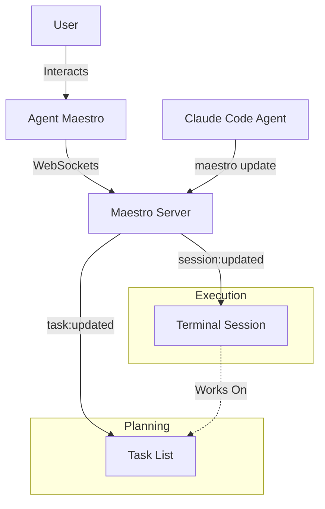

# Maestro UI Architecture & Orchestration

This document details the UI architecture for Phase IV, specifically focusing on the relationship between the **Left Panel (Sessions)** and **Right Panel (Tasks)**, and how they interact with the Maestro Server via WebSockets.

## 1. Core Concept: The Left & Right Panels

The UI is divided into two primary zones of activity that must stay in sync:

### Right Panel: The "What" (Tasks)
- **Source of Truth**: The Maestro Task Database (`~/.maestro/tasks.json`).
- **Content**: A hierarchical list of Tasks and Subtasks.
- **Role**: Planning and Tracking. This is where users define *what* needs to be done.
- **Key Components**: `MaestroPanel`, `TaskCard`, `TaskListItem`.

### Left Panel: The "How" (Sessions)
- **Source of Truth**: The Session Manager (Pty instance + Maestro Session State).
- **Content**: Active Terminal Sessions (Claude Code instances).
- **Role**: Execution. This is where the work *actually happens*.
- **Key Components**: `SessionsSection`, `SessionItem`, `Terminal`.

### The Bridge: Many-to-Many Relationship
Crucially, there is a **Many-to-Many** relationship between Tasks and Sessions:
- **One Task** can have **Multiple Sessions** working on it (e.g., one session coding features, another running tests).
- **One Session** can work on **Multiple Tasks** (e.g., a "Cleanup" session fixing bugs across three different tasks).

---

## 2. Task Architecture: The Tree Structure

In Maestro, everything is fundamentally a **Task**. The distinction between "Task" and "Subtask" is structural, not functional.

### The Recursive Model
```typescript
interface Task {
  id: string;
  title: string;
  // ... other metadata
  subtasks: Task[]; // Recursive structure
  parentId?: string; // Reference to parent
}
```

- **Top-Level Tasks**: Displayed in the main list in the Right Panel.
- **Subtasks**: Nested items within a Task.
- **Depth**: While the UI primarily displays 2 levels (Task -> Subtasks), the data model supports arbitrary depth, allowing for complex orchestration trees.

### UI Representation
- **Right Panel**: Renders the tree. Top-level items are cards; subtasks are items within those cards.
- **Left Panel**: Does *not* show the full tree. It shows which *specific nodes* (Tasks or Subtasks) are currently being "worked on" by that session.

---

## 3. Communication Architecture: WebSockets & Event Loop

The synchronization between the Maestro Server (Orchestrator) and the UI is driven entirely by a persistent WebSocket connection.

### The Cycle of Updates
1.  **Trigger**: User (via UI) or Agent (via CLI) performs an action.
2.  **Server Action**: Maestro Server processes the request (e.g., `maestro update` command).
3.  **State Change**: Server updates its in-memory state and persists to DB.
4.  **Broadcast**: Server emits a WebSocket event to all connected clients.
5.  **React**: UI Components receive the event and re-render.

### Key Events
| Event Name | Trigger Source | UI Reaction |
| :--- | :--- | :--- |
| `task:created` | `maestro task new` or UI | right-panel adds new card |
| `task:updated` | `maestro update` | Task card updates status/progress |
| `subtask:status_change` | Worker completing a subtask | Subtask checkbox checks off |
| `session:log` | Agent outputting text | Terminal (Left Panel) shows log |
| `session:state_change` | Agent finishing/blocking | Session icon/status updates |

---

## 4. State Management: Maestro Session State

The **Maestro Session State** is the glue that holds the execution context together.

### What is "Session State"?
It is a transient state object maintained by the Maestro Server for each active session. It contains:
- `sessionId`: Unique ID.
- `assignedTaskIds`: List of Task IDs this session is allowed to modify.
- `agentStatus`: Current status of the agent (IDLE, BUSY, AWAITING_INPUT).
- `lastUpdate`: Timestamp of last activity.

### Syncing to UI
When a session is active:
1.  The **Left Panel** subscribes to updates for that specific `sessionId`.
2.  The **Right Panel** watches the `assignedTaskIds` tasks. When the session makes progress on a task, the task update event triggers a refresh in the Right Panel.

**Example Flow**:
1.  **Right Panel**: User clicks "Run Task A".
2.  **Server**: Spawns Session 1. Associates Session 1 with Task A.
3.  **Left Panel**: Opens Terminal for Session 1.
4.  **Agent (in Session 1)**: Runs `maestro update "Fixing bug"`.
5.  **Server**: Updates Task A's status -> "In Progress". Emits `task:updated`.
6.  **Right Panel**: Task A's card actively reflects "In Progress - Fixing bug" (flashing/highlighting).

---

## 5. UI Component Implementation Strategy

### MaestroPanel (Right Panel Manager)
- **Responsibility**: Listens to global `task:*` events.
- **Behavior**: Maintains the authoritative list of tasks. When an update arrives, it finds the task in the list and merges the new data (clean React state update).
- **Optimization**: Uses optimistic updates for immediate user feedback, corrected by server application if needed.

### TaskCard (Right Panel Item)
- **Responsibility**: Displaying granular status.
- **Visuals**:
    - **Status Badge**: Changes color based on `status` (pending=gray, in_progress=blue, completed=green).
    - **Progress Bar**: Calculated from completed subtasks / total subtasks.
    - **Session Indicators**: Small icons showing *which* sessions are currently touching this task.

### SessionsSection (Left Panel Manager)
- **Responsibility**: Managing the list of active terminals.
- **Integration**:
    - It wraps the standard Terminal component.
    - It adds a "Meta Layer" above/below the terminal to show Maestro context (e.g., "Working on: Task A, Task B").
    - It listens for `session:ended` to know when to show a "Session Completed" state or close the terminal involved.

## 6. Summary of Relationships



This architecture ensures that the **Left Panel (Execution)** and **Right Panel (Planning)** are always loosely coupled but tightly synchronized through the Maestro Server's event loop.
