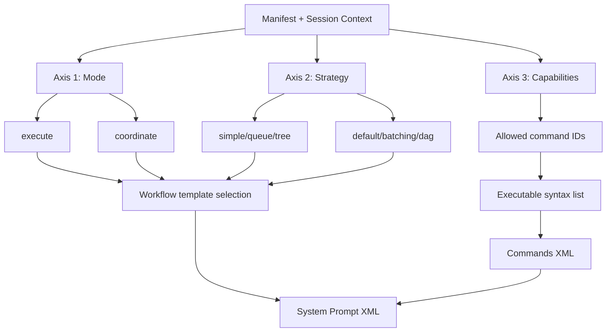
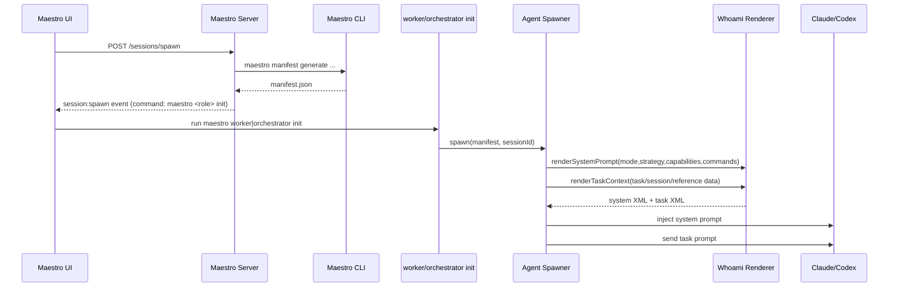
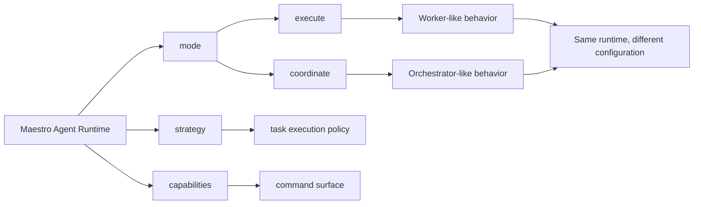

# Maestro Prompt Contract: Mode, Strategy, Capabilities

## Goal

Define a prompt contract that treats "worker" and "orchestrator" as configuration profiles over the same execution model, then generate prompts consistently for Claude and Codex.

## Why Change

Current prompts mix:

- role identity (`worker` vs `orchestrator`)
- strategy (`simple`, `queue`, `default`, `dag`, etc.)
- command affordances (what commands are allowed)

This creates ambiguity and inconsistent workflow behavior in agent output.

## Three-Axis Model

Use three explicit axes:

1. `mode`
- `execute` (implementation-focused)
- `coordinate` (decomposition/delegation-focused)

2. `strategy`
- For `execute`: `simple`, `queue`, `tree` (or future variants)
- For `coordinate`: `default`, `intelligent-batching`, `dag`

3. `capabilities`
- Concrete permissions/affordances, derived from manifest and command permissions.
- Examples: `can_spawn_sessions`, `can_edit_tasks`, `can_use_queue`, `can_report_task_level`, `can_report_session_level`

## Canonical System Prompt Shape

```xml
<maestro_system_prompt mode="execute|coordinate" strategy="..." version="3.0">
  <identity>
    <profile>maestro-agent</profile>
    <instruction>...</instruction>
  </identity>
  <capabilities>
    <capability name="can_spawn_sessions" enabled="false" />
    <capability name="can_edit_tasks" enabled="true" />
    <capability name="can_use_queue" enabled="false" />
    <capability name="can_report_task_level" enabled="true" />
    <capability name="can_report_session_level" enabled="true" />
  </capabilities>
  <workflow>
    <phase name="analyze">...</phase>
    <phase name="plan">...</phase>
    <phase name="execute_or_delegate">...</phase>
    <phase name="report">...</phase>
    <phase name="complete">...</phase>
  </workflow>
  <commands>
    <group name="task">
      <command
        name="task:report:progress"
        syntax="maestro task report progress <taskId> &quot;<message>&quot;"
        description="Report task progress" />
    </group>
  </commands>
</maestro_system_prompt>
```

Notes:

- `name` stays as stable internal ID.
- `syntax` is the executable CLI command and should be treated as the source of truth for agents.
- XML tags are not runtime magic for Claude/Codex; they are structured text for clarity.

## Task Prompt Shape

```xml
<maestro_task_prompt mode="..." strategy="..." version="3.0">
  <task>...</task>
  <session_context>...</session_context>
  <reference_task_context>...</reference_task_context>
</maestro_task_prompt>
```

## Mapping from Current Fields

| Current | New |
|---|---|
| `role=worker` | `mode=execute` |
| `role=orchestrator` | `mode=coordinate` |
| `strategy` / `orchestratorStrategy` | unified `strategy` (validated against mode) |
| `allowedCommands` | capability vector + command syntax list |

## Workflow Matrix

### Mode = execute

- `simple`
  - implement assigned task(s)
  - report session milestones
  - report blockers
  - report completion
- `queue`
  - `queue top` -> `queue start` -> implement -> `queue complete|fail`
  - repeat/poll
- `tree`
  - traverse owned task tree in dependency order
  - use task-level reporting per subtask
  - finish with session completion

### Mode = coordinate

- `default`
  - analyze, decompose, spawn, monitor, close
- `intelligent-batching`
  - group independent work, parallelize by batch
- `dag`
  - topological planning, execute independent branches in parallel

## Diagram 1: Three-Axis Resolution



## Diagram 2: End-to-End Prompt Pipeline



## Diagram 3: Role as Configuration (Not Separate Entity)



## Implementation Contract

1. Keep one renderer contract for all agent tools.
2. Derive `mode + strategy + capabilities` once from manifest.
3. Always emit executable command syntax in system prompt.
4. Keep command IDs as metadata only.
5. Ensure strategy validation depends on mode.

## Migration Plan

1. Add `mode` and capability computation layer (non-breaking, internal).
2. Continue accepting `role` in manifest and map to mode.
3. Update prompt XML schema to include capability section.
4. Remove legacy workflow strings that reference deprecated command forms.
5. Add snapshot tests for generated system/task XML for:
- execute/simple
- execute/queue
- coordinate/default
- coordinate/dag

## Expected Outcome

- Fewer ambiguous agent actions
- Better command correctness for Claude and Codex
- Cleaner extensibility for future strategies without introducing new "roles"
