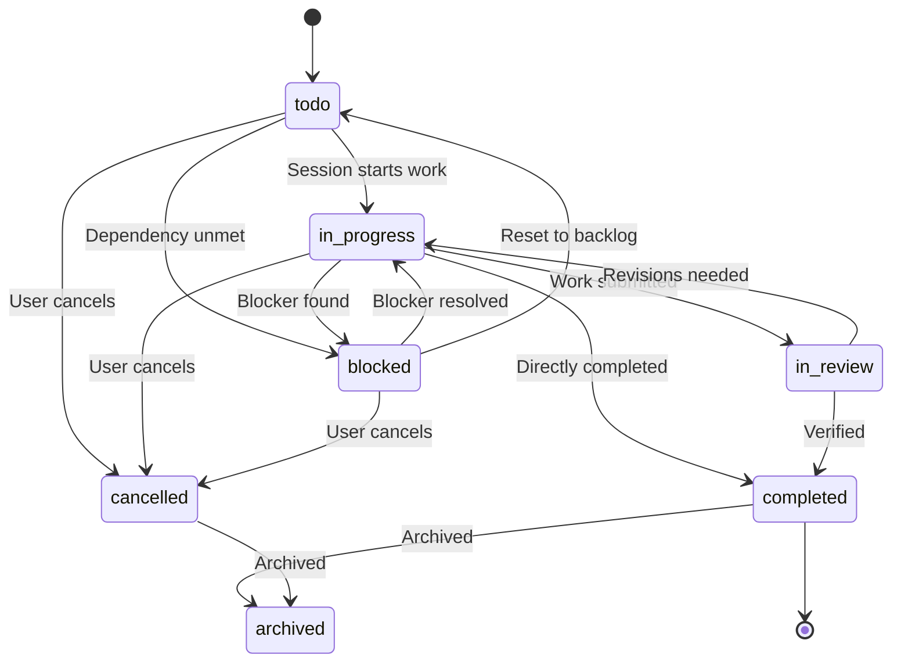
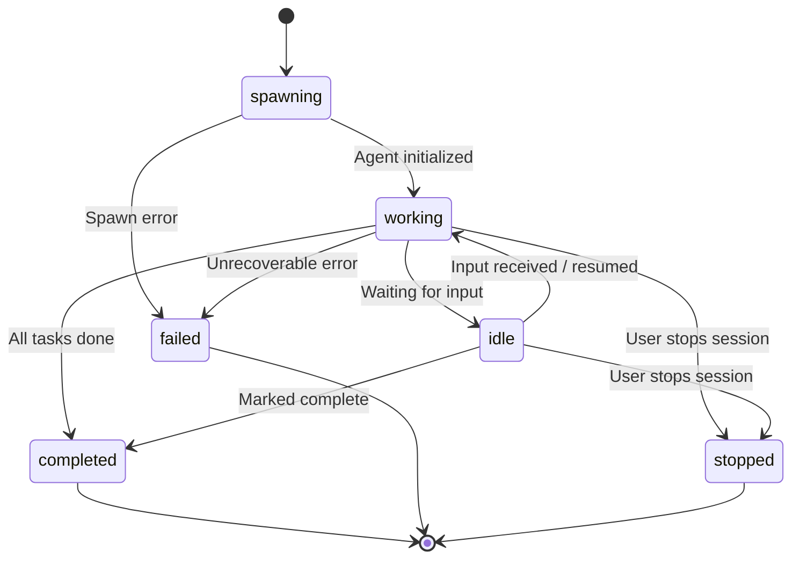
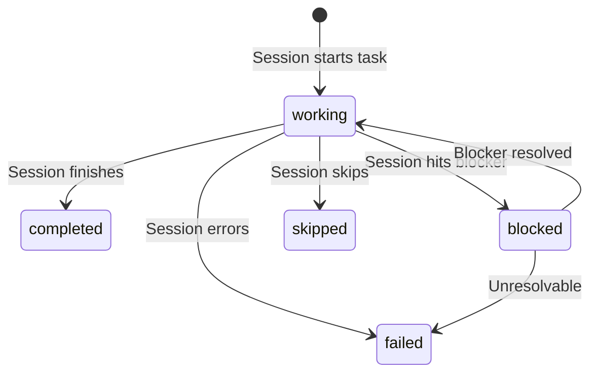

# Status reference

> All status types in Maestro with allowed transitions.

---

## Task statuses

A task progresses through these statuses during its lifecycle.

| Status | Description |
|--------|-------------|
| `todo` | Created but not yet started. |
| `in_progress` | Actively being worked on by one or more sessions. |
| `in_review` | Work is complete and awaiting verification. |
| `completed` | Finished successfully. |
| `cancelled` | Abandoned before completion. |
| `blocked` | Cannot proceed due to a dependency or issue. |
| `archived` | Removed from active view but retained for history. |

### Task status transitions

---

## Session statuses

A session moves through these states from spawn to completion.

| Status | Description |
|--------|-------------|
| `spawning` | Being created. Manifest is generating and PTY is starting. |
| `idle` | Running but not actively processing. Waiting for input or next task. |
| `working` | Actively executing a task. |
| `completed` | Finished all assigned work successfully. |
| `failed` | Terminated due to an error. |
| `stopped` | Manually stopped by a user or coordinator. |

### Session status transitions

---

## Task session statuses

Each session working on a task tracks its own progress independently. This allows parallel awareness — multiple sessions can work on the same task, each with their own status.

Stored in `task.taskSessionStatuses` as a map of `{ [sessionId]: status }`.

| Status | Description |
|--------|-------------|
| `working` | This session is actively working on the task. |
| `blocked` | This session is blocked on the task. |
| `completed` | This session finished its part of the task. |
| `failed` | This session failed while working on the task. |
| `skipped` | This session skipped the task (not applicable). |

### Task session status transitions

---

## User-facing session states

The UI displays simplified statuses derived from session data.

| Display state | When it applies |
|---------------|-----------------|
| **Working** | `session.status === 'working'` |
| **Idle** | `session.status === 'idle'` and `needsInput.active` is false |
| **Needs input** | `session.needsInput.active === true` |
| **Stopped** | `session.status === 'stopped'` |

> **Note:** `needsInput` is an overlay on top of session status. A session can be `idle` or `working` while also having `needsInput.active === true`.

---

## Team member statuses

| Status | Description |
|--------|-------------|
| `active` | Available for assignment to sessions. |
| `archived` | Hidden from default lists. Cannot be assigned to new sessions. |

---

## Team statuses

| Status | Description |
|--------|-------------|
| `active` | Team is operational and visible. |
| `archived` | Team is hidden from default lists. Must be archived before deletion. |

---

## Timeline event types

Events recorded in a session's timeline.

| Type | Description |
|------|-------------|
| `session_started` | Session spawned and initialized. |
| `session_stopped` | Session stopped. |
| `task_started` | Session began working on a task. |
| `task_completed` | Session finished a task. |
| `task_failed` | Session failed a task. |
| `task_skipped` | Session skipped a task. |
| `task_blocked` | Session blocked on a task. |
| `needs_input` | Session is waiting for user input. |
| `progress` | General progress update. |
| `error` | An error occurred. |
| `milestone` | A significant milestone reached. |
| `doc_added` | A document was added. |
| `prompt_received` | A prompt was received from another session. |

---

> **See also:** [Glossary](./glossary.md) for term definitions, [API reference](./api-reference.md) for endpoint details.
