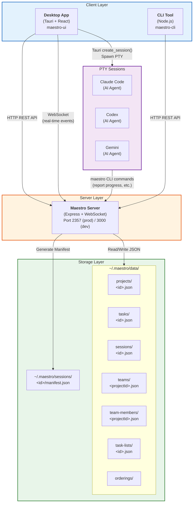

# Architecture Diagram

## Overview

This diagram shows the three-layer architecture of Maestro: the client layer (Desktop App + CLI), the server layer, and the storage layer.

## Mermaid Diagram



## Text Description (for accessibility)

```
+----------------------------------+
|         CLIENT LAYER             |
|  +------------+  +------------+  |
|  | Desktop App|  |   CLI Tool |  |
|  | (Tauri +   |  | (Node.js)  |  |
|  |  React)    |  |            |  |
|  +-----+------+  +-----+------+  |
|        |               |         |
+--------|---------------|----------+
         |               |
    HTTP/WS REST     HTTP REST
         |               |
+--------|---------------|----------+
|        v               v         |
|      SERVER LAYER                |
|  +---------------------------+   |
|  | Maestro Server            |   |
|  | (Express + WebSocket)     |   |
|  | Port 2357 (prod)         |   |
|  +-------------+-------------+   |
+----------------|------------------+
                 |
          Read/Write JSON
                 |
+----------------|------------------+
|                v                  |
|         STORAGE LAYER            |
|  ~/.maestro/data/                |
|  +----------+ +----------+      |
|  | projects | | tasks    |      |
|  +----------+ +----------+      |
|  +----------+ +----------+      |
|  | sessions | | teams    |      |
|  +----------+ +----------+      |
|  +---------------+              |
|  | team-members  |              |
|  +---------------+              |
+----------------------------------+

        PTY SESSIONS
  +--------+ +-------+ +--------+
  | Claude | | Codex | | Gemini |
  +--------+ +-------+ +--------+
      |          |          |
      +----------+----------+
               |
        CLI commands back
         to Server API
```

## Usage

- **Where**: "How It Works" page, "Core Concepts" overview
- **Format**: Render as SVG from Mermaid, or use as inline Mermaid in docs site
- **Key points to convey**: No database (just JSON files), three-package architecture, WebSocket for real-time updates, PTY sessions for AI agents
