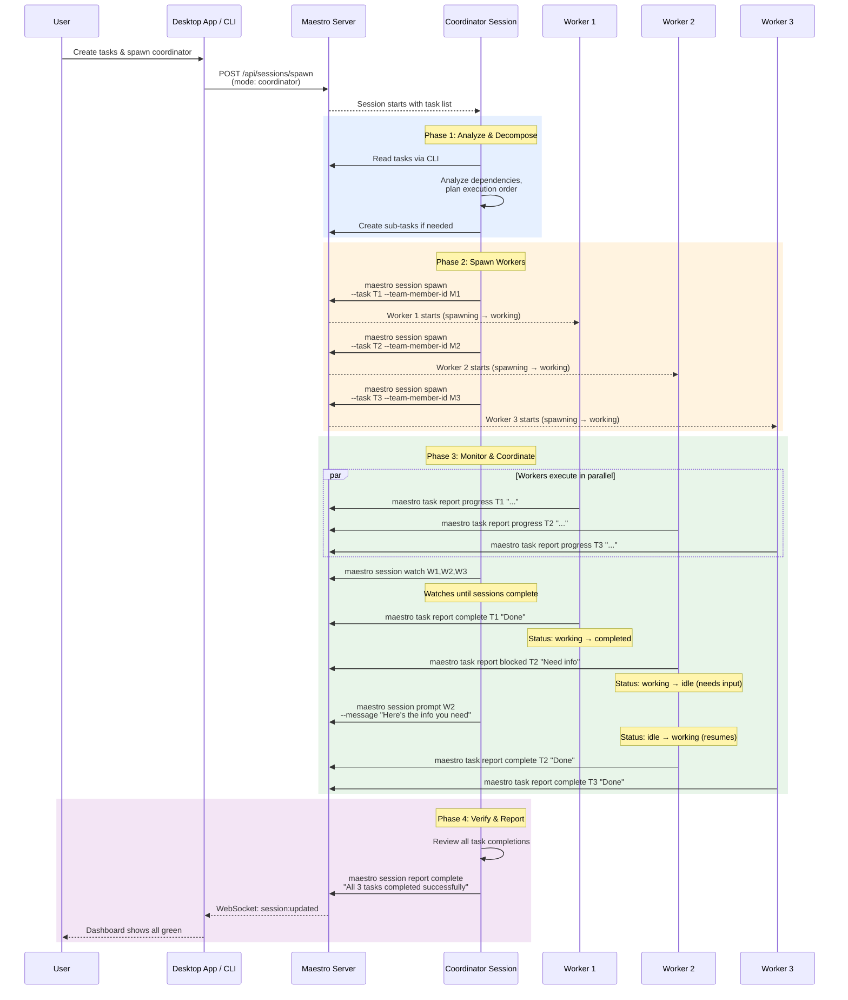
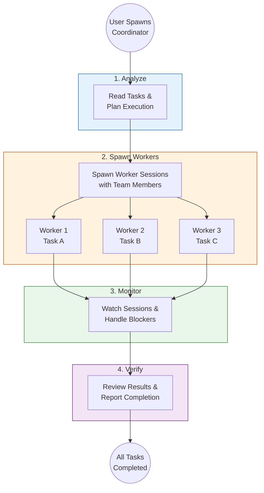
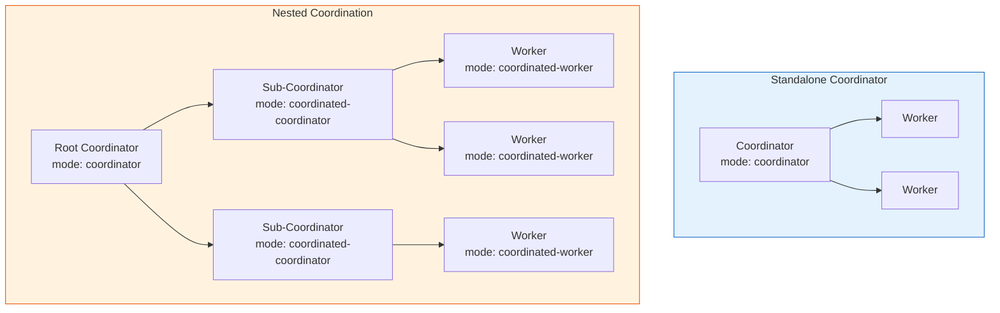

# Orchestrator Flow Diagram

## Overview

The orchestrator pattern shows how a coordinator session decomposes work, spawns worker sessions, monitors progress, and verifies completion.

## Full Orchestrator Sequence Diagram



## Simplified Orchestrator Flow



## Coordinator Modes



## Built-in Workflow Templates

| Template | Strategy | Best For |
|----------|----------|----------|
| `coordinate-default` | Sequential decompose → spawn → monitor → verify | General orchestration |
| `coordinate-batching` | Group independent tasks into parallel batches | Many independent tasks |
| `coordinate-dag` | DAG-based execution in topological waves | Tasks with dependencies |

## Text Description

```
ORCHESTRATOR 4-PHASE FLOW:

1. ANALYZE
   - Coordinator receives task list
   - Reads task descriptions and dependencies
   - Plans execution order and parallelism

2. SPAWN WORKERS
   - Creates worker sessions for each task/group
   - Assigns team members with appropriate skills
   - Workers start executing independently

3. MONITOR & COORDINATE
   - Watches all worker sessions (session watch)
   - Handles blockers by prompting workers
   - Resolves dependencies between tasks
   - Can spawn additional workers if needed

4. VERIFY & REPORT
   - Reviews all task completions
   - Validates output quality
   - Reports final status to parent/user
```

## Usage

- **Where**: "Orchestrator" workflow guide, "How It Works" deep dive
- **Format**: Use full sequence diagram for detailed reference; simplified flow for overview
- **Key points**: 4-phase pattern, parallel worker execution, coordinator handles inter-worker communication, nested coordination is possible
