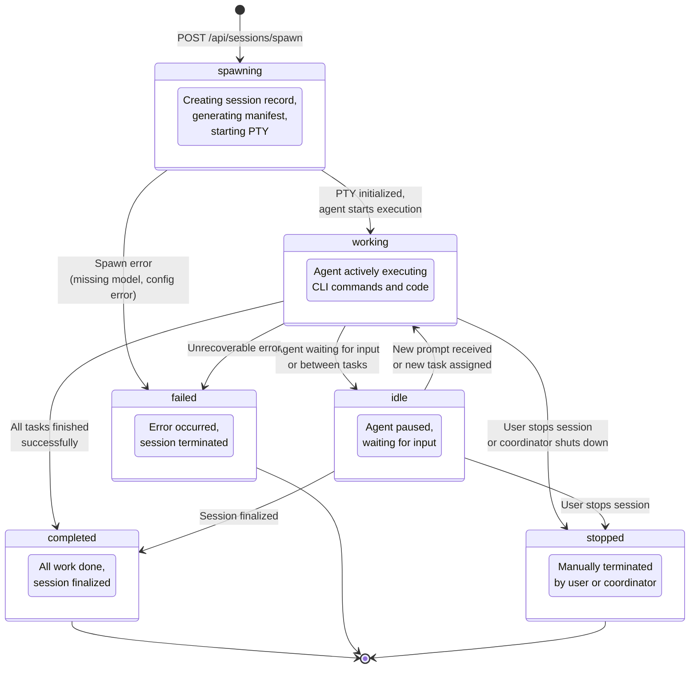
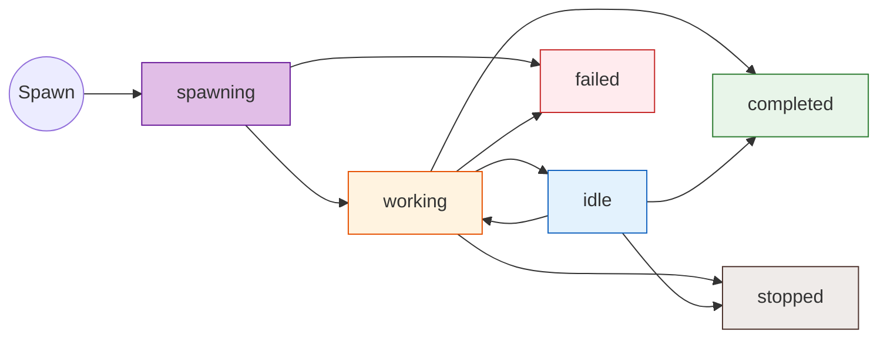
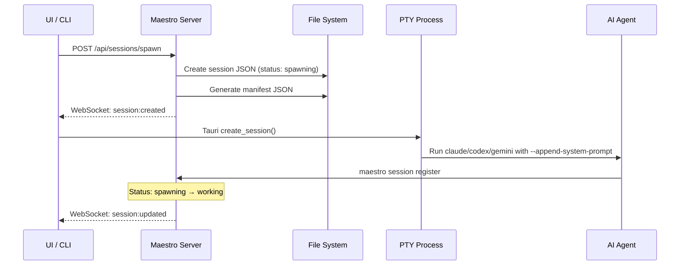
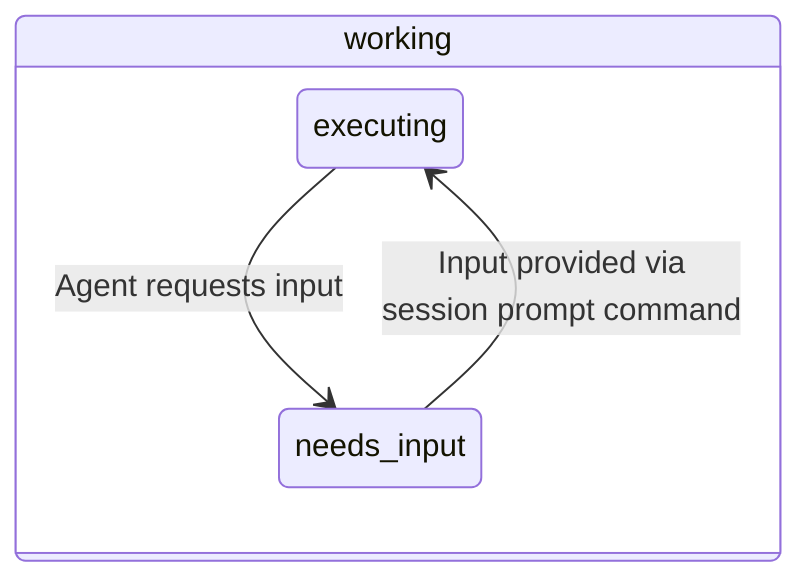

# Session Lifecycle Diagram

## Overview

Sessions in Maestro represent active AI agent processes. They follow a lifecycle with 6 possible statuses.

## Mermaid State Diagram



## Simplified Flow Diagram



## Spawn Sequence Detail

The transition from `spawning` to `working` involves multiple steps:



## needsInput Sub-State

While in `working` or `idle`, a session can signal it needs human input:



The `needsInput` field (`{ active: boolean, message?: string }`) allows the UI to display a prompt indicator.

## Text Description

```
HAPPY PATH:
  spawning ──→ working ──→ completed

WITH IDLE:
  spawning ──→ working ──→ idle ──→ working ──→ completed

FAILURE PATH:
  spawning ──→ failed
  spawning ──→ working ──→ failed

MANUAL STOP:
  working ──→ stopped
  idle ──→ stopped

STATUS COLORS:
  spawning  = Purple (initializing)
  working   = Orange (active)
  idle      = Blue (waiting)
  completed = Green (success)
  failed    = Red (error)
  stopped   = Brown (terminated)
```

## Usage

- **Where**: "Sessions" concept page, session management guides
- **Format**: Use simplified flow for overview; full state diagram for reference; spawn sequence for "How It Works"
- **Key points**: Sessions cycle between working/idle, needsInput is a sub-state, spawn is a multi-step process
