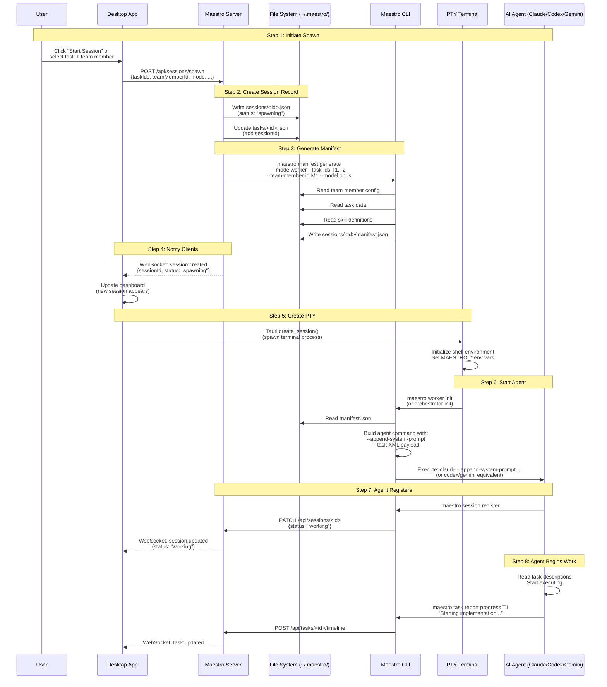
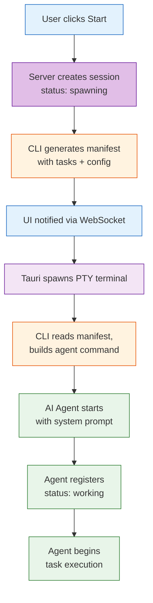
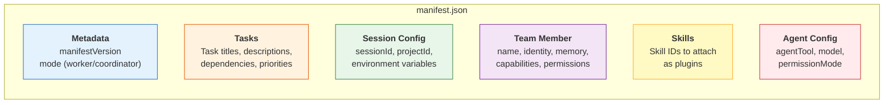
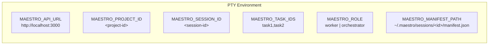

# Session Spawn Flow Diagram

## Overview

This diagram shows the complete end-to-end sequence of spawning a new session, from the initial API call through manifest generation to the AI agent starting work.

## Full Spawn Sequence



## Simplified Spawn Flow



## Manifest Contents

The generated manifest (`~/.maestro/sessions/<id>/manifest.json`) contains:



## Environment Variables Set for Agent



## CLI vs Desktop App Spawn

```mermaid
graph TB
    subgraph CLISpawn ["CLI Spawn"]
        CL1["maestro session spawn<br/>--task T1 --mode worker"] --> CL2[Server creates session]
        CL2 --> CL3[CLI generates manifest]
        CL3 --> CL4[CLI directly runs<br/>agent in current terminal]
    end

    subgraph UISpawn ["Desktop App Spawn"]
        UI1["Click Start in UI"] --> UI2[Server creates session]
        UI2 --> UI3[CLI generates manifest]
        UI3 --> UI4[WebSocket notifies UI]
        UI4 --> UI5[Tauri creates PTY<br/>in managed terminal]
    end

    style CLISpawn fill:#e3f2fd,stroke:#1565c0
    style UISpawn fill:#fff3e0,stroke:#e65100
```



## Text Description

```
END-TO-END SPAWN FLOW:

1. INITIATE
   - User clicks "Start" in UI, or runs `maestro session spawn` in CLI
   - Request sent to server: POST /api/sessions/spawn

2. CREATE SESSION
   - Server creates session JSON file (status: spawning)
   - Server updates task records with new session ID

3. GENERATE MANIFEST
   - CLI runs `maestro manifest generate`
   - Reads team member config, task data, skill definitions
   - Writes manifest.json to ~/.maestro/sessions/<id>/

4. NOTIFY CLIENTS
   - Server emits WebSocket event: session:created
   - UI updates dashboard to show new spawning session

5. CREATE PTY (Desktop App only)
   - Tauri creates new PTY terminal process
   - Sets MAESTRO_* environment variables

6. START AGENT
   - CLI reads manifest and builds agent command
   - Runs claude/codex/gemini with --append-system-prompt
   - System prompt includes Maestro context + task XML

7. REGISTER
   - Agent calls `maestro session register`
   - Status transitions: spawning → working
   - UI updates to show active session

8. BEGIN WORK
   - Agent reads task descriptions from system prompt
   - Starts executing, reports progress via CLI
```

## Usage

- **Where**: "How It Works" page, "Sessions" concept page, contributor docs
- **Format**: Full sequence for deep dives; simplified flow for overviews
- **Key points**: Manifest is the bridge between config and execution; WebSocket keeps UI in sync; environment variables connect agent to Maestro
