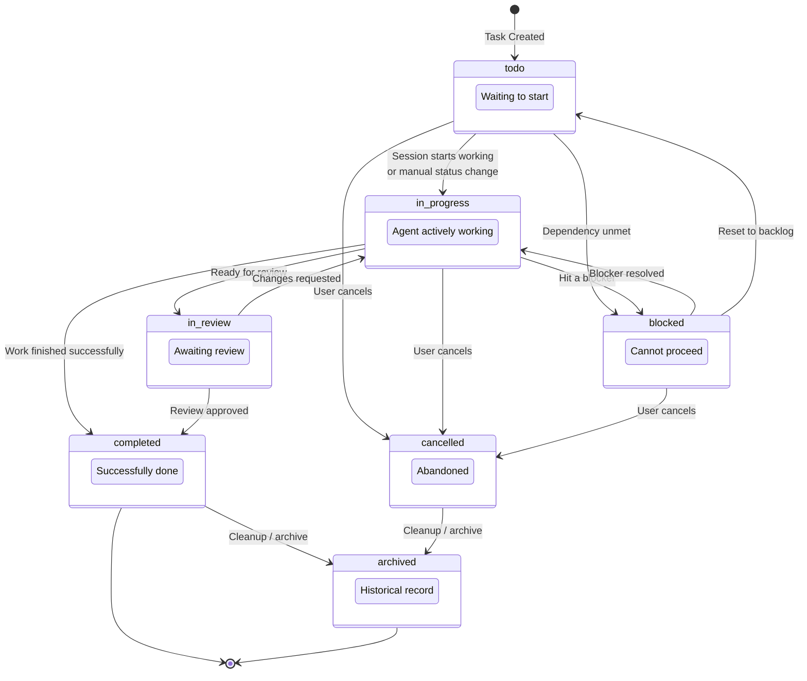
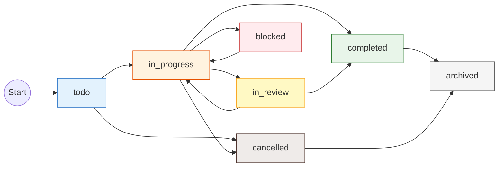
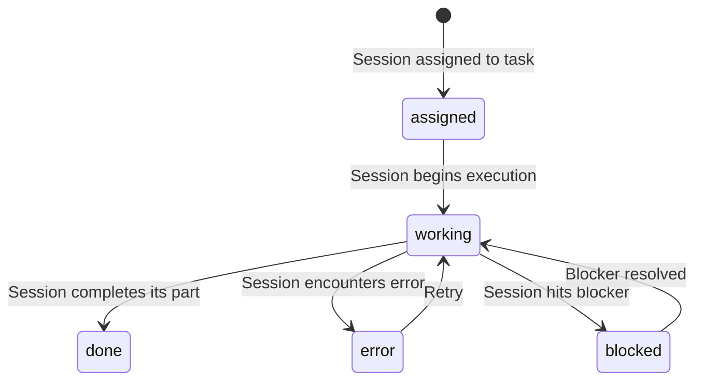

# Task Lifecycle Diagram

## Overview

Tasks in Maestro follow a state machine with 7 possible statuses. This diagram shows all valid transitions.

## Mermaid State Diagram



## Simplified Flow Diagram



## Per-Session Task Status

Tasks also track per-session status via `taskSessionStatuses`:



This allows multiple sessions to work on the same task, each tracking their own progress independently.

## Text Description

```
HAPPY PATH:
  todo ──→ in_progress ──→ completed ──→ archived

WITH REVIEW:
  todo ──→ in_progress ──→ in_review ──→ completed

BLOCKED PATH:
  todo ──→ in_progress ──→ blocked ──→ in_progress ──→ completed

CANCELLED PATH:
  todo ──→ cancelled ──→ archived
  in_progress ──→ cancelled ──→ archived

STATUS COLORS:
  todo        = Blue (waiting)
  in_progress = Orange (active)
  completed   = Green (success)
  in_review   = Yellow (pending review)
  blocked     = Red (stuck)
  cancelled   = Brown (abandoned)
  archived    = Gray (historical)
```

## Usage

- **Where**: "Tasks" concept page, task management guides
- **Format**: Render the simplified flow for inline use; full state diagram for detailed reference
- **Key points**: Tasks can move backward (review → in_progress), blocked is recoverable, per-session status exists independently
