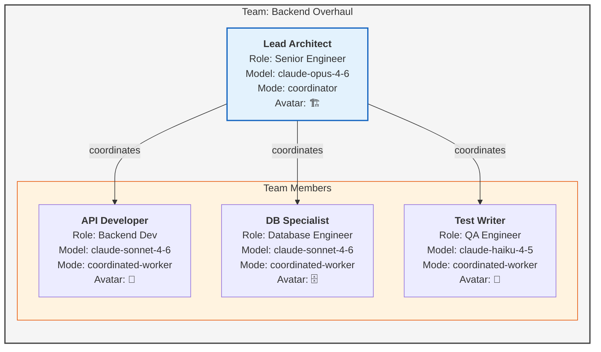
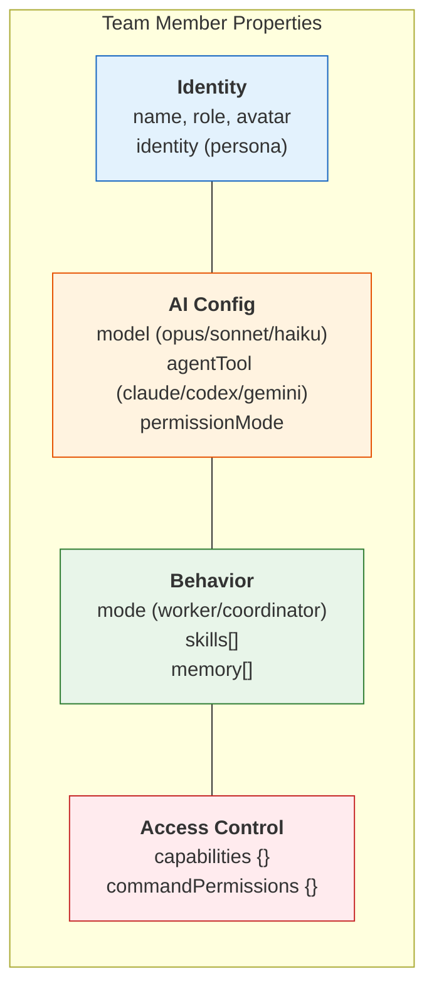
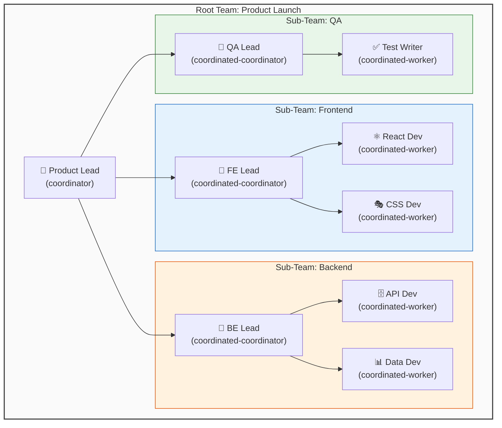
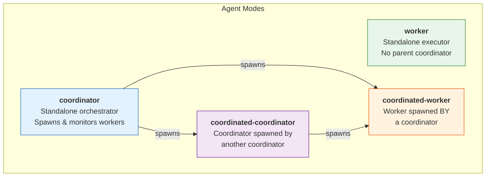

# Team Structure Diagram

## Overview

Teams in Maestro organize team members into hierarchies with leaders, members, roles, and sub-teams. Each team member has a specific configuration controlling their AI agent behavior.

## Team Hierarchy Diagram



## Team Member Configuration



## Sub-Team Structure



## Agent Modes in Team Context



## Capability Matrix

| Capability | worker | coordinator | coordinated-worker | coordinated-coordinator |
|------------|--------|-------------|-------------------|------------------------|
| Execute tasks | Yes | No (delegates) | Yes | No (delegates) |
| Spawn sessions | No | Yes | No | Yes |
| Edit tasks | Yes | Yes | Configurable | Yes |
| Report to parent | N/A | N/A | Yes | Yes |
| Monitor workers | No | Yes | No | Yes |

## Text Description

```
TEAM HIERARCHY:

Team
├── Leader (coordinator mode)
│   ├── Member A (coordinated-worker)
│   ├── Member B (coordinated-worker)
│   └── Sub-Team
│       ├── Sub-Leader (coordinated-coordinator)
│       ├── Member C (coordinated-worker)
│       └── Member D (coordinated-worker)

TEAM MEMBER PROPERTIES:
- name: Display name (e.g., "API Developer")
- role: What they do (e.g., "Backend Developer")
- avatar: Emoji identifier
- identity: Persona/instructions
- model: AI model to use (opus/sonnet/haiku)
- agentTool: Which AI tool (claude-code/codex/gemini)
- mode: How they operate in the team
- permissionMode: Security level
- skills: Attached skill IDs
- memory: Persistent memory entries
- capabilities: What actions they can perform
- commandPermissions: Which CLI commands they can run
```

## Usage

- **Where**: "Teams" concept page, "Team Members" concept page, team management guides
- **Format**: Use hierarchy diagram for overview; sub-team structure for advanced usage; capability matrix as reference table
- **Key points**: Leaders coordinate, members execute; sub-teams enable nested orchestration; each member has granular configuration
