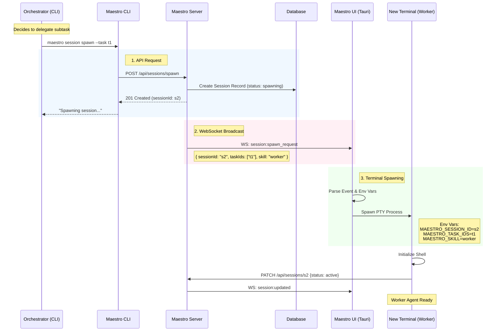

# Phase I Architecture Visualization

## Session Spawning Architecture

This diagram illustrates the flow when an Orchestrator spawns a new Worker session.

```mermaid
sequenceDiagram
    participant Orch as Orchestrator (CLI)
    participant CLI as Maestro CLI
    participant Server as Maestro Server
    participant DB as Database
    participant UI as Maestro UI (Tauri)
    participant Term as New Terminal (Worker)

    Note over Orch: Decides to delegate subtask
    Orch->>CLI: maestro session spawn --task t1
    
    rect rgb(240, 248, 255)
        note right of CLI: 1. API Request
        CLI->>Server: POST /api/sessions/spawn
        Server->>DB: Create Session Record (status: spawning)
        Server-->>CLI: 201 Created (sessionId: s2)
        CLI-->>Orch: "Spawning session..."
    end

    rect rgb(255, 240, 245)
        note right of Server: 2. WebSocket Broadcast
        Server->>UI: WS: session:spawn_request
        Note right of Server: { sessionId: "s2", taskIds: ["t1"], skill: "worker" }
    end

    rect rgb(240, 255, 240)
        note right of UI: 3. Terminal Spawning
        UI->>UI: Parse Event & Env Vars
        UI->>Term: Spawn PTY Process
        Note right of Term: Env Vars:<br/>MAESTRO_SESSION_ID=s2<br/>MAESTRO_TASK_IDS=t1<br/>MAESTRO_SKILL=worker
    end

    Term->>Term: Initialize Shell
    Term->>Server: PATCH /api/sessions/s2 {status: active}
    Server->>UI: WS: session:updated
    
    Note over Term: Worker Agent Ready
```
