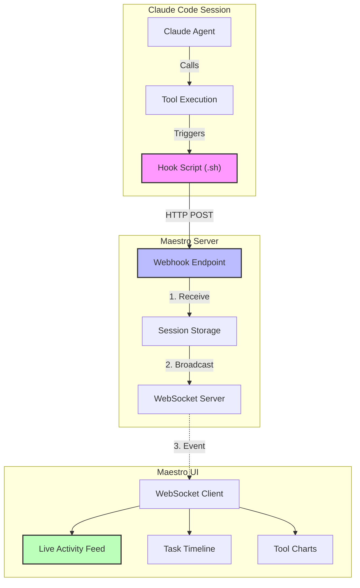
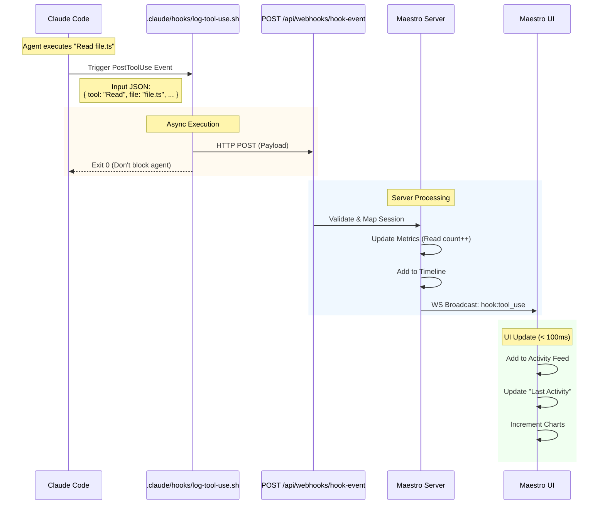
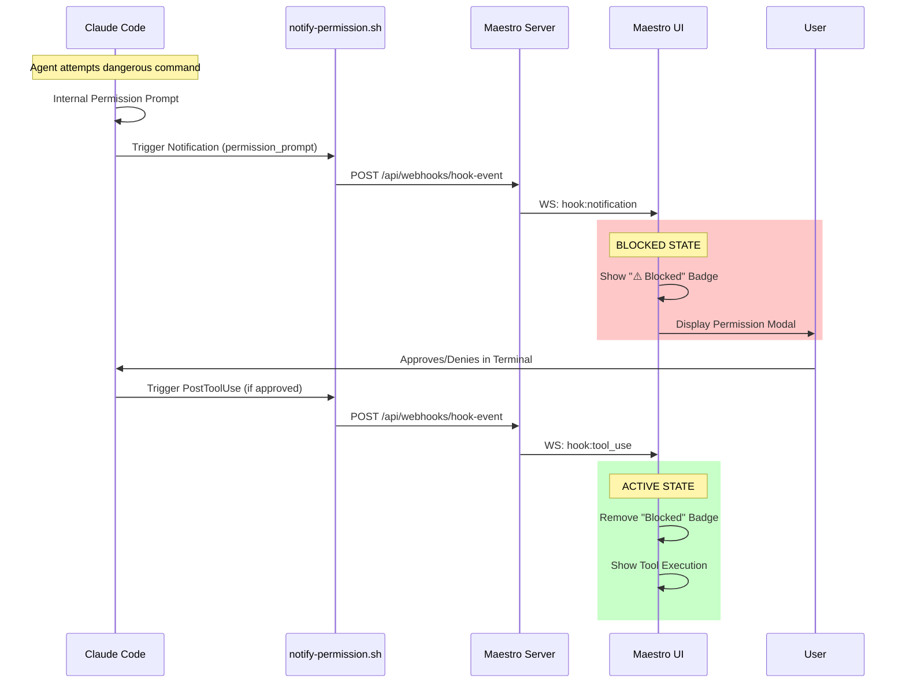

# Phase II Architecture Visualization

## Hooks & Real-time Observability

This diagram shows how Claude Code hooks provide real-time visibility into agent actions.

### High-Level Architecture

### Detailed Hook Event Flow

This sequence diagram details the lifecycle of a single tool use event (e.g., "Read File").

## Permission Blocking Flow

This diagram illustrates how the system handles blocking permissions (e.g., preventing dangerous commands).

