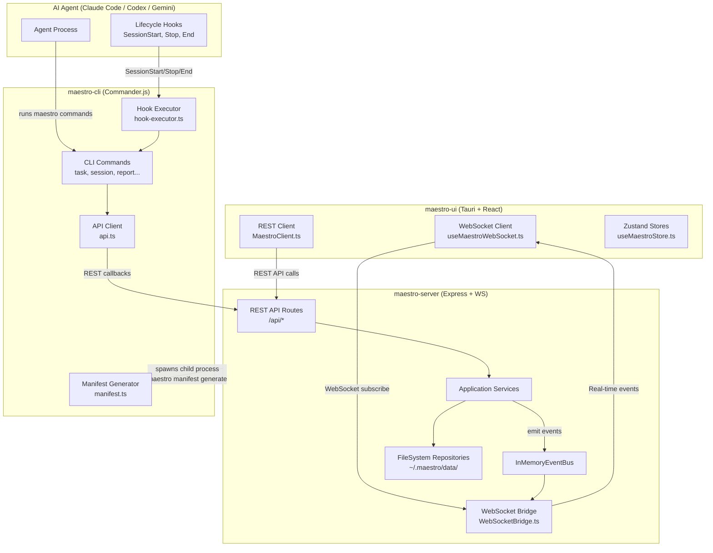
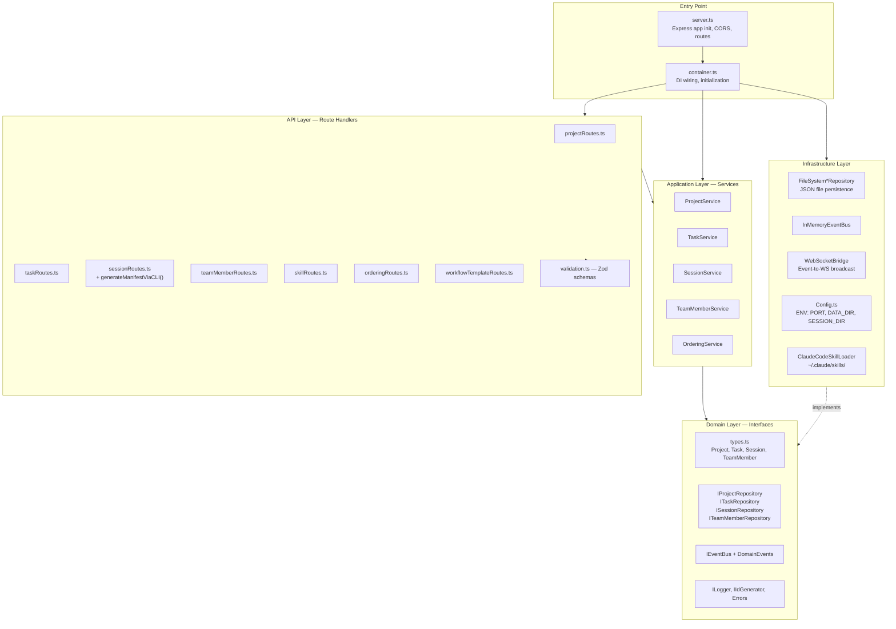
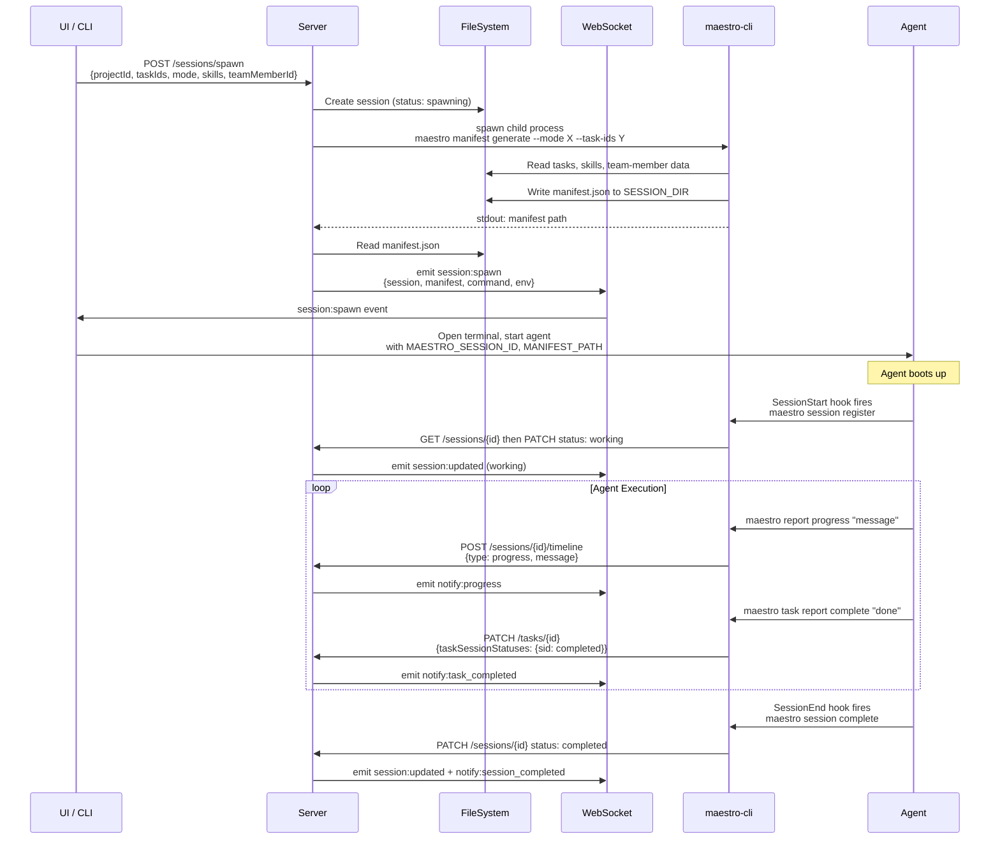
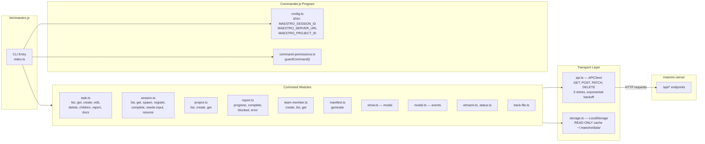
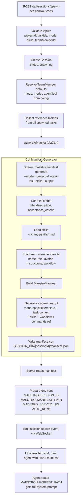
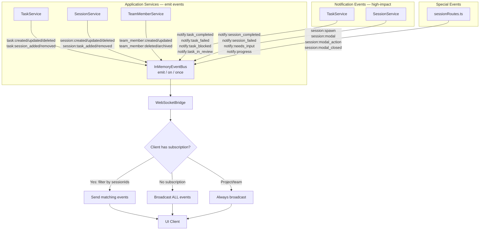

# Agent Maestro — Backend Architecture Reference (Mermaid Diagrams)

## 1. System Overview

## 2. Server Architecture — DDD Layers

## 3. Session Lifecycle Flow

## 4. CLI Command Architecture

## 5. Manifest Generation Pipeline

## 6. Event System & WebSocket Bridge

## Key File Reference

| Layer | Files | Purpose |
|-------|-------|---------|
| **Server Entry** | `server.ts`, `container.ts`, `types.ts` | App init, DI, type defs |
| **API Routes** | `projectRoutes.ts`, `taskRoutes.ts`, `sessionRoutes.ts`, `teamMemberRoutes.ts`, `skillRoutes.ts`, `orderingRoutes.ts`, `workflowTemplateRoutes.ts`, `validation.ts` | HTTP endpoints, Zod validation |
| **Services** | `ProjectService.ts`, `TaskService.ts`, `SessionService.ts`, `TeamMemberService.ts`, `OrderingService.ts` | Business logic, event emission |
| **Domain** | `I*Repository.ts`, `DomainEvents.ts`, `IEventBus.ts`, `ILogger.ts`, `IIdGenerator.ts`, `Errors.ts` | Interfaces & contracts |
| **Infrastructure** | `FileSystem*Repository.ts`, `WebSocketBridge.ts`, `Config.ts`, `InMemoryEventBus.ts`, `ConsoleLogger.ts`, `TimestampIdGenerator.ts`, `ClaudeCodeSkillLoader.ts` | Persistence, WS, config |
| **CLI Entry** | `bin/maestro.js`, `index.ts`, `config.ts` | CLI bootstrap |
| **CLI Commands** | `task.ts`, `session.ts`, `project.ts`, `report.ts`, `team-member.ts`, `manifest.ts`, `show.ts`, `modal.ts`, `whoami.ts`, `status.ts`, `track-file.ts` | Command implementations |
| **CLI Transport** | `api.ts`, `storage.ts` | REST client with retry, local read-only cache |
| **CLI Hooks** | `hook-executor.ts`, `hooks.json` | Claude Code lifecycle hooks |
| **CLI Types** | `types/manifest.ts`, `types/storage.ts` | Manifest and storage type definitions |

## API Endpoints Quick Reference

### Projects
| Method | Endpoint | Purpose |
|--------|----------|---------|
| GET | `/api/projects` | List all projects |
| POST | `/api/projects` | Create project |
| GET | `/api/projects/:id` | Get project |
| PUT | `/api/projects/:id` | Update project |
| DELETE | `/api/projects/:id` | Delete project |

### Tasks
| Method | Endpoint | Purpose |
|--------|----------|---------|
| GET | `/api/tasks` | List tasks (filter: projectId, status, parentId) |
| POST | `/api/tasks` | Create task |
| GET | `/api/tasks/:id` | Get task |
| PATCH | `/api/tasks/:id` | Update task |
| DELETE | `/api/tasks/:id` | Delete task (cascade children) |
| GET | `/api/tasks/:id/children` | Get child tasks |
| GET | `/api/tasks/:id/docs` | Get aggregated docs |
| POST | `/api/tasks/:id/timeline` | Add timeline event |

### Sessions
| Method | Endpoint | Purpose |
|--------|----------|---------|
| GET | `/api/sessions` | List sessions |
| POST | `/api/sessions` | Create session |
| GET | `/api/sessions/:id` | Get session |
| PATCH | `/api/sessions/:id` | Update session |
| DELETE | `/api/sessions/:id` | Delete session |
| POST | `/api/sessions/spawn` | Spawn session with manifest |
| GET | `/api/sessions/:id/docs` | Get docs |
| POST | `/api/sessions/:id/docs` | Add doc |
| POST | `/api/sessions/:id/events` | Add event |
| POST | `/api/sessions/:id/timeline` | Add timeline event |
| POST | `/api/sessions/:id/modal` | Show modal |

### Team Members
| Method | Endpoint | Purpose |
|--------|----------|---------|
| GET | `/api/team-members` | List (defaults + custom) |
| POST | `/api/team-members` | Create custom |
| GET | `/api/team-members/:id` | Get by ID |
| PATCH | `/api/team-members/:id` | Update |
| DELETE | `/api/team-members/:id` | Delete (must archive first) |
| POST | `/api/team-members/:id/archive` | Archive |
| POST | `/api/team-members/:id/unarchive` | Unarchive |

### Skills & Workflows
| Method | Endpoint | Purpose |
|--------|----------|---------|
| GET | `/api/skills` | List skills |
| GET | `/api/workflow-templates` | List workflow templates |
