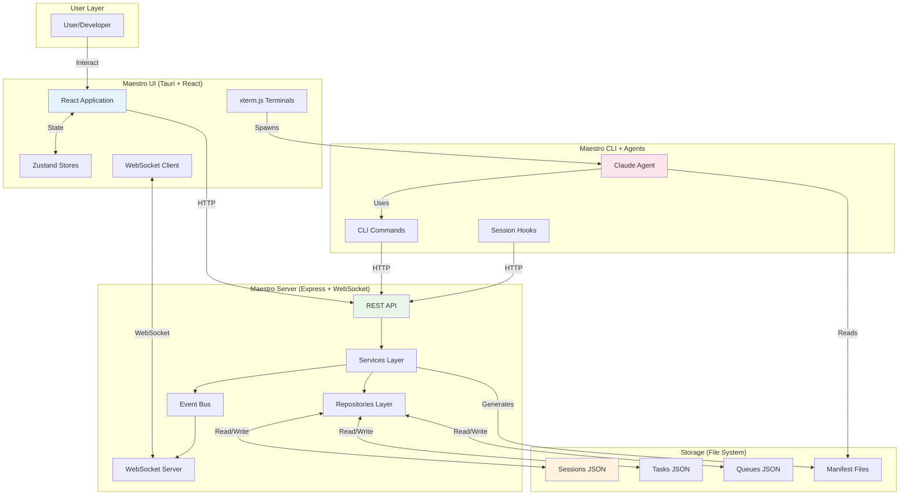
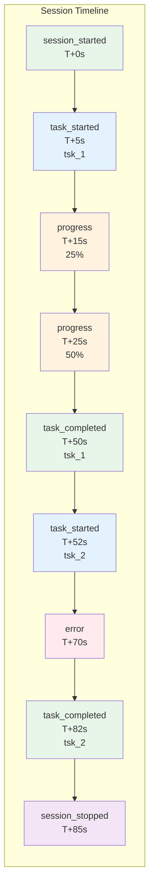
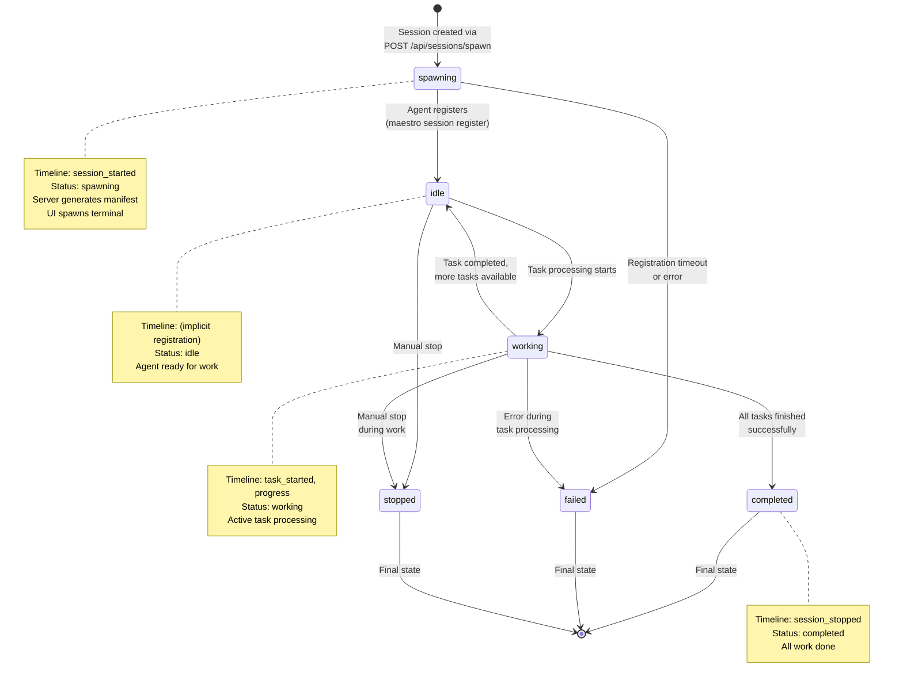
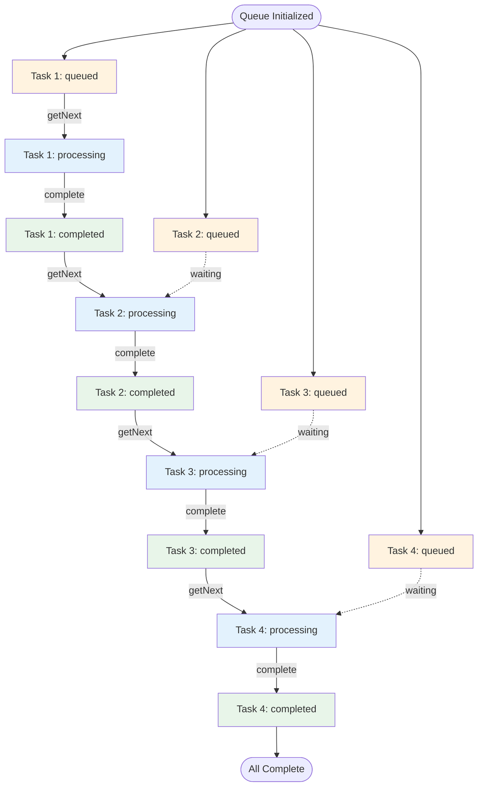
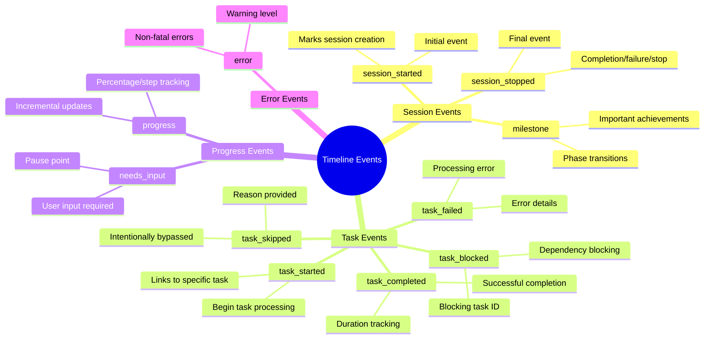
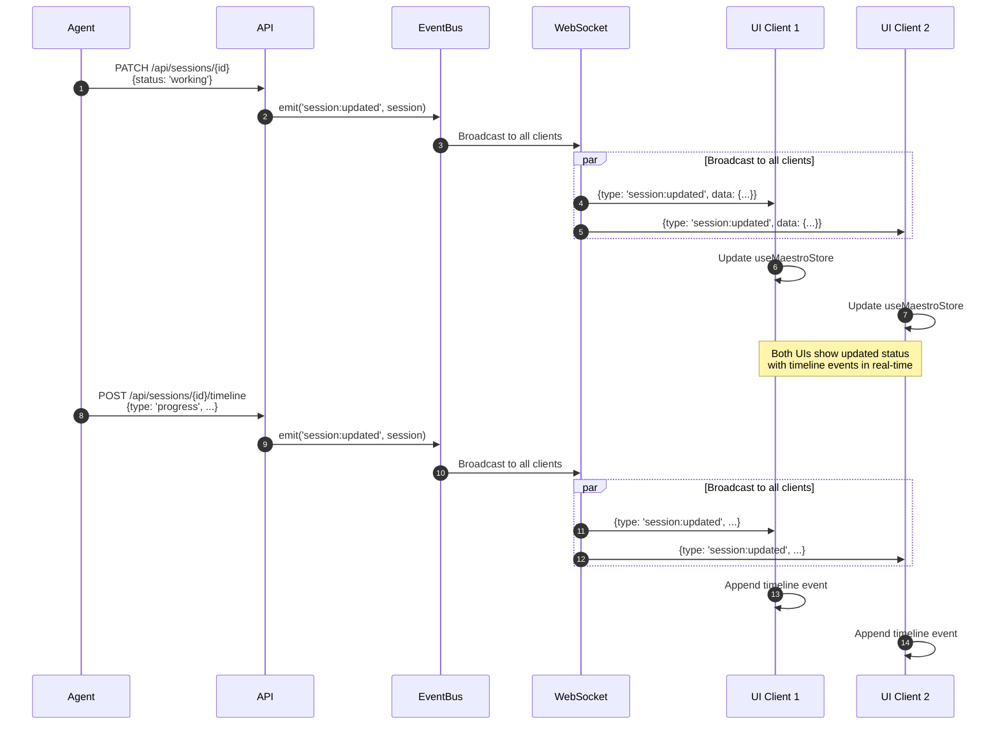

# Architecture Overview

## System Architecture

### High-Level Component Diagram



---

## Session Timeline Visualization

### Complete Session Timeline Example

```mermaid
gantt
    title Session Timeline: Worker Session (ses_abc123)
    dateFormat  HH:mm:ss
    axisFormat  %H:%M:%S

    section Session Lifecycle
    Session Created (spawning)      :milestone, m1, 14:30:00, 0s
    Manifest Generated              :active, gen, 14:30:00, 2s
    Terminal Spawned                :active, term, 14:30:02, 1s
    Session Registered (idle)       :milestone, m2, 14:30:03, 0s

    section Task Processing
    Task 1 Started (working)        :milestone, t1s, 14:30:05, 0s
    Task 1 Processing               :active, t1p, 14:30:05, 45s
    Progress: 25%                   :crit, p1, 14:30:15, 0s
    Progress: 50%                   :crit, p2, 14:30:25, 0s
    Progress: 75%                   :crit, p3, 14:30:35, 0s
    Task 1 Completed                :milestone, t1c, 14:30:50, 0s

    section Task 2
    Task 2 Started                  :milestone, t2s, 14:30:52, 0s
    Task 2 Processing               :active, t2p, 14:30:52, 30s
    Error Encountered               :crit, err, 14:31:10, 1s
    Recovery                        :active, rec, 14:31:11, 5s
    Task 2 Completed                :milestone, t2c, 14:31:22, 0s

    section Completion
    All Tasks Done                  :milestone, m3, 14:31:24, 0s
    Session Completed               :milestone, m4, 14:31:25, 0s
```

### Timeline Event Flow



---

## Session Status State Machine



---

## Queue Strategy Timeline

### Queue Processing Visualization

```mermaid
gantt
    title Queue Strategy Session: Processing 4 Tasks
    dateFormat  HH:mm:ss
    axisFormat  %H:%M:%S

    section Queue State
    Queue Initialized              :milestone, q0, 14:30:00, 0s
    All Tasks Queued               :active, qa, 14:30:00, 2s

    section Task 1 (Backend)
    Task 1: Queued → Processing    :crit, t1q, 14:30:02, 1s
    Task 1: Processing             :active, t1p, 14:30:03, 30s
    Task 1: Processing → Completed :milestone, t1c, 14:30:33, 0s

    section Task 2 (Frontend)
    Task 2: Queued → Processing    :crit, t2q, 14:30:34, 1s
    Task 2: Processing             :active, t2p, 14:30:35, 25s
    Task 2: Processing → Completed :milestone, t2c, 14:31:00, 0s

    section Task 3 (Tests)
    Task 3: Queued → Processing    :crit, t3q, 14:31:01, 1s
    Task 3: Processing             :active, t3p, 14:31:02, 20s
    Task 3: Processing → Completed :milestone, t3c, 14:31:22, 0s

    section Task 4 (Docs)
    Task 4: Queued → Processing    :crit, t4q, 14:31:23, 1s
    Task 4: Processing             :active, t4p, 14:31:24, 15s
    Task 4: Processing → Completed :milestone, t4c, 14:31:39, 0s

    section Queue Complete
    All Tasks Completed            :milestone, qc, 14:31:40, 0s
    Session Completed              :milestone, sc, 14:31:41, 0s
```

### Queue Item Status Flow



---

## Parent-Child Session Timeline

### Orchestrator-Worker Pattern Timeline

```mermaid
gantt
    title Orchestrator-Worker Pattern: Multi-Session Timeline
    dateFormat  HH:mm:ss
    axisFormat  %H:%M:%S

    section Orchestrator
    Orchestrator Created            :milestone, o1, 14:30:00, 0s
    Orchestrator Planning           :active, op, 14:30:05, 10s
    Spawn Worker 1                  :crit, sw1, 14:30:15, 2s
    Spawn Worker 2                  :crit, sw2, 14:30:17, 2s
    Spawn Worker 3                  :crit, sw3, 14:30:19, 2s
    Monitor Workers                 :active, mon, 14:30:21, 60s
    All Workers Done                :milestone, o2, 14:31:21, 0s
    Orchestrator Complete           :milestone, o3, 14:31:25, 0s

    section Worker 1 (Backend)
    W1 Created                      :milestone, w1c, 14:30:15, 0s
    W1 Processing Tasks             :active, w1p, 14:30:18, 40s
    W1 Completed                    :milestone, w1d, 14:30:58, 0s

    section Worker 2 (Frontend)
    W2 Created                      :milestone, w2c, 14:30:17, 0s
    W2 Processing Tasks             :active, w2p, 14:30:20, 55s
    W2 Completed                    :milestone, w2d, 14:31:15, 0s

    section Worker 3 (Tests)
    W3 Created                      :milestone, w3c, 14:30:19, 0s
    W3 Processing Tasks             :active, w3p, 14:30:22, 60s
    W3 Completed                    :milestone, w3d, 14:31:22, 0s
```



### Parent-Child Session Hierarchy

```mermaid
graph TB
    subgraph "Orchestrator Session"
        O[Orchestrator<br/>ses_orch_123<br/>Status: working]
        OT1[Timeline:<br/>1. session_started<br/>2. milestone: "Planning complete"<br/>3. milestone: "Spawned 3 workers"<br/>4. progress: "2/3 workers done"<br/>5. progress: "3/3 workers done"<br/>6. session_stopped]
    end

    subgraph "Worker 1"
        W1[Backend Worker<br/>ses_worker_456<br/>Status: completed]
        W1T[Timeline:<br/>1. session_started<br/>2. task_started: tsk_1<br/>3. task_completed: tsk_1<br/>4. task_started: tsk_2<br/>5. task_completed: tsk_2<br/>6. session_stopped]
    end

    subgraph "Worker 2"
        W2[Frontend Worker<br/>ses_worker_789<br/>Status: completed]
        W2T[Timeline:<br/>1. session_started<br/>2. task_started: tsk_3<br/>3. progress: 50%<br/>4. task_completed: tsk_3<br/>5. session_stopped]
    end

    subgraph "Worker 3"
        W3[Test Worker<br/>ses_worker_012<br/>Status: working]
        W3T[Timeline:<br/>1. session_started<br/>2. task_started: tsk_4<br/>3. progress: 30%<br/>4. ...]
    end

    O -->|Spawned| W1
    O -->|Spawned| W2
    O -->|Spawned| W3
    O -.->|Monitors| W1T
    O -.->|Monitors| W2T
    O -.->|Monitors| W3T

    style O fill:#e8f5e9
    style W1 fill:#e3f2fd
    style W2 fill:#e3f2fd
    style W3 fill:#e3f2fd
    style OT1 fill:#f3e5f5
    style W1T fill:#fff3e0
    style W2T fill:#fff3e0
    style W3T fill:#fff3e0
```

---

## Data Flow Diagrams

### Session Creation Data Flow

```mermaid
flowchart TD
    Start([User clicks<br/>"Spawn Session"]) --> UI_Send[UI: maestroClient.spawnSession]
    UI_Send --> API_Receive[Server API:<br/>POST /api/sessions/spawn]
    API_Receive --> Validate[Validate:<br/>- Project exists<br/>- Tasks exist<br/>- Parent session (if spawned)]
    Validate --> Service_Create[SessionService.createSession]
    Service_Create --> Repo_Create[SessionRepository.create]
    Repo_Create --> FS_Write[Write session.json]
    FS_Write --> Timeline_Add[Add timeline event:<br/>session_started]
    Timeline_Add --> Manifest_Gen[Generate manifest<br/>via CLI]
    Manifest_Gen --> Event_Emit[Emit session:spawn event]
    Event_Emit --> WS_Broadcast[WebSocket broadcast<br/>to all clients]
    WS_Broadcast --> UI_Receive[UI receives event]
    UI_Receive --> UI_Store[Update useMaestroStore]
    UI_Store --> Terminal_Spawn[Spawn terminal session]
    Terminal_Spawn --> End([Agent starts])

    style Start fill:#e8f5e9
    style API_Receive fill:#e3f2fd
    style FS_Write fill:#fff3e0
    style WS_Broadcast fill:#fce4ec
    style End fill:#e8f5e9
```

### Timeline Event Data Flow

```mermaid
flowchart TD
    Agent([Agent reports progress]) --> API_Call[POST /api/sessions/{id}/timeline]
    API_Call --> Repo_Load[Load session from storage]
    Repo_Load --> Event_Create[Create timeline event:<br/>- Generate ID<br/>- Add timestamp<br/>- Include taskId, metadata]
    Event_Create --> Timeline_Append[Append to timeline array]
    Timeline_Append --> Update_Activity[Update lastActivity timestamp]
    Update_Activity --> FS_Save[Save to session.json]
    FS_Save --> Event_Bus[EventBus.emit<br/>'session:updated']
    Event_Bus --> WS_Broadcast[WebSocket broadcast]
    WS_Broadcast --> UI_Update[UI updates session timeline]
    UI_Update --> Display[Display in timeline view]

    style Agent fill:#fce4ec
    style Event_Create fill:#fff3e0
    style FS_Save fill:#fff3e0
    style WS_Broadcast fill:#e3f2fd
    style Display fill:#e8f5e9
```

---

## Timeline Event Types and Flow

### Event Type Classification



### Timeline Event Density by Strategy

```mermaid
gantt
    title Timeline Event Density Comparison
    dateFormat  ss
    axisFormat  %S

    section Simple Strategy (Low Density)
    session_started    :milestone, s1, 00, 0s
    task_started       :milestone, s2, 05, 0s
    task_completed     :milestone, s3, 30, 0s
    session_stopped    :milestone, s4, 35, 0s

    section Queue Strategy (Medium Density)
    session_started    :milestone, q1, 00, 0s
    task_started       :milestone, q2, 02, 0s
    task_completed     :milestone, q3, 15, 0s
    task_started       :milestone, q4, 16, 0s
    task_completed     :milestone, q5, 30, 0s
    task_started       :milestone, q6, 31, 0s
    task_completed     :milestone, q7, 45, 0s
    session_stopped    :milestone, q8, 46, 0s

    section With Progress Updates (High Density)
    session_started    :milestone, p1, 00, 0s
    task_started       :milestone, p2, 02, 0s
    progress 20%       :crit, p3, 06, 0s
    progress 40%       :crit, p4, 10, 0s
    progress 60%       :crit, p5, 14, 0s
    progress 80%       :crit, p6, 18, 0s
    task_completed     :milestone, p7, 22, 0s
    task_started       :milestone, p8, 23, 0s
    progress 25%       :crit, p9, 28, 0s
    progress 50%       :crit, p10, 33, 0s
    progress 75%       :crit, p11, 38, 0s
    task_completed     :milestone, p12, 43, 0s
    session_stopped    :milestone, p13, 44, 0s
```



---

## Session Storage Structure

### File System Layout

```
~/.maestro/data/
├── sessions/
│   ├── ses_abc123.json                    # Session data with timeline
│   ├── ses_abc123/
│   │   └── manifest.md                    # Session manifest
│   ├── ses_def456.json
│   ├── ses_def456/
│   │   └── manifest.md
│   └── ses_worker_789.json                # Child session
├── tasks/
│   ├── tsk_123.json                       # Task with sessionIds array
│   ├── tsk_456.json
│   └── tsk_789.json
├── queues/
│   ├── que_ses_abc123.json                # Queue state for ses_abc123
│   └── que_ses_def456.json
└── projects/
    └── prj_xyz.json                       # Project data
```

### Session JSON with Timeline

```json
{
  "id": "ses_abc123",
  "projectId": "prj_xyz",
  "taskIds": ["tsk_123", "tsk_456"],
  "name": "Worker Session",
  "status": "completed",
  "strategy": "simple",
  "createdAt": 1707260400000,
  "updatedAt": 1707260485000,
  "completedAt": 1707260485000,
  "lastActivity": 1707260485000,
  "env": {},
  "metadata": {
    "skills": ["maestro-worker"],
    "spawnedBy": null,
    "spawnSource": "ui",
    "role": "worker"
  },
  "events": [],
  "timeline": [
    {
      "id": "evt_1",
      "type": "session_started",
      "timestamp": 1707260400000,
      "message": "Session created"
    },
    {
      "id": "evt_2",
      "type": "task_started",
      "timestamp": 1707260405000,
      "message": "Started task: Implement authentication",
      "taskId": "tsk_123"
    },
    {
      "id": "evt_3",
      "type": "progress",
      "timestamp": 1707260420000,
      "message": "Database schema created",
      "taskId": "tsk_123",
      "metadata": { "progress": 0.3 }
    },
    {
      "id": "evt_4",
      "type": "progress",
      "timestamp": 1707260435000,
      "message": "API routes implemented",
      "taskId": "tsk_123",
      "metadata": { "progress": 0.6 }
    },
    {
      "id": "evt_5",
      "type": "task_completed",
      "timestamp": 1707260450000,
      "message": "Completed task: Implement authentication",
      "taskId": "tsk_123",
      "metadata": { "duration": 45000 }
    },
    {
      "id": "evt_6",
      "type": "task_started",
      "timestamp": 1707260455000,
      "message": "Started task: Write tests",
      "taskId": "tsk_456"
    },
    {
      "id": "evt_7",
      "type": "task_completed",
      "timestamp": 1707260480000,
      "message": "Completed task: Write tests",
      "taskId": "tsk_456",
      "metadata": { "duration": 25000 }
    },
    {
      "id": "evt_8",
      "type": "session_stopped",
      "timestamp": 1707260485000,
      "message": "Session completed successfully"
    }
  ]
}
```

---

## Real-Time Update Flow

### WebSocket Message Timeline



---

## Performance Characteristics

### Timeline Growth

| Session Type | Duration | Events | File Size |
|-------------|----------|--------|-----------|
| Simple (no progress) | 5 min | 5-10 | ~2 KB |
| Simple (with progress) | 5 min | 20-50 | ~5-10 KB |
| Queue (3 tasks) | 10 min | 15-30 | ~5 KB |
| Queue (10 tasks) | 30 min | 50-100 | ~15-20 KB |
| Long-running (progress) | 2 hours | 200-500 | ~50-100 KB |

### WebSocket Event Frequency

| Event Type | Frequency | Example |
|-----------|-----------|---------|
| `session:updated` | High | 1-10/sec (with progress) |
| `task:updated` | Medium | 1-5/min |
| `session:spawn` | Low | < 1/min |
| `session:created` | Low | < 1/min |
| `session:deleted` | Very Low | < 1/hour |

---

## Summary

This architecture provides:

✅ **Real-time synchronization** via WebSocket
✅ **Complete timeline tracking** with granular events
✅ **Hierarchical sessions** (parent-child/orchestrator-worker)
✅ **Queue-based processing** for ordered execution
✅ **Multi-client support** with automatic state sync
✅ **Persistent storage** with human-readable JSON
✅ **Flexible strategies** (simple vs queue)

---

## Related Documentation

- [SESSION-STATUS-FLOW.md](./SESSION-STATUS-FLOW.md) - Status state machine details
- [SESSION-LIFECYCLE.md](./SESSION-LIFECYCLE.md) - Complete lifecycle walkthrough
- [SESSION-TIMELINE.md](./SESSION-TIMELINE.md) - Timeline event specifications
- [COMPONENT-FLOWS.md](./COMPONENT-FLOWS.md) - Detailed component interactions
- [WEBSOCKET-EVENTS.md](./WEBSOCKET-EVENTS.md) - WebSocket event details
- [QUEUE-STRATEGY.md](./QUEUE-STRATEGY.md) - Queue processing strategy
- [PARENT-CHILD-SESSIONS.md](./PARENT-CHILD-SESSIONS.md) - Hierarchical sessions
