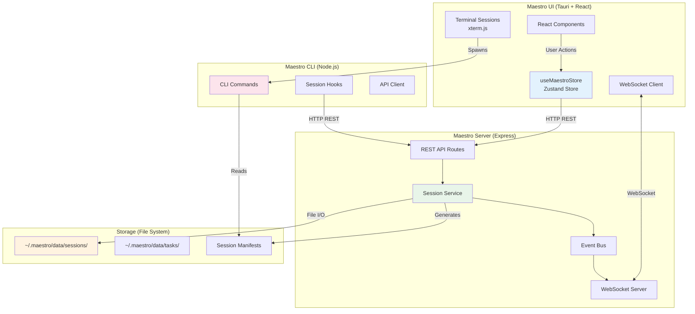
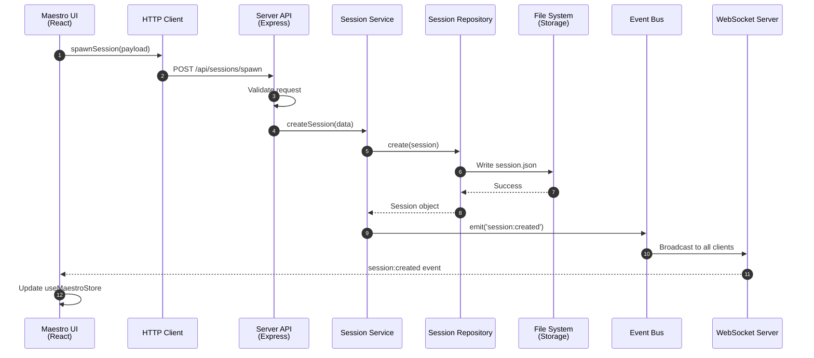
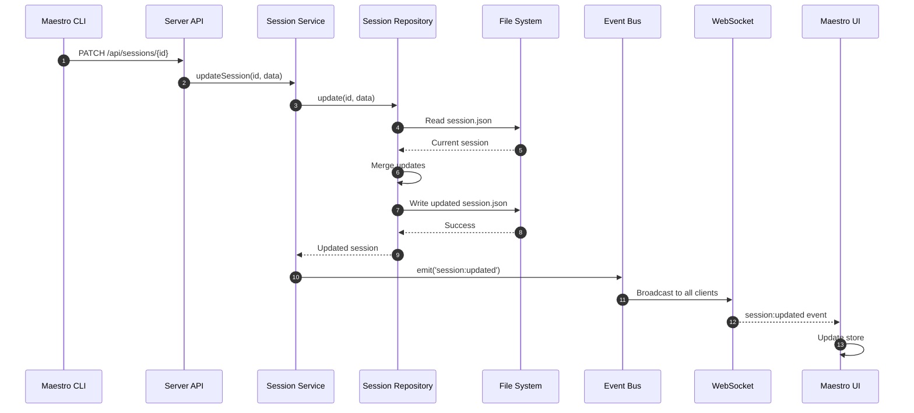
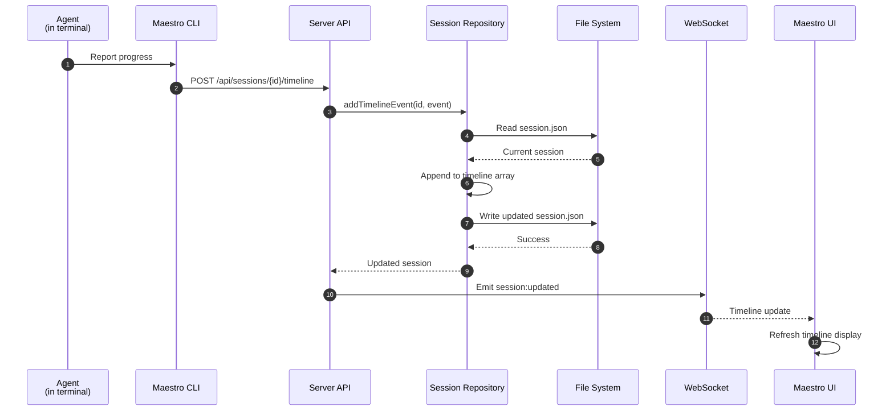
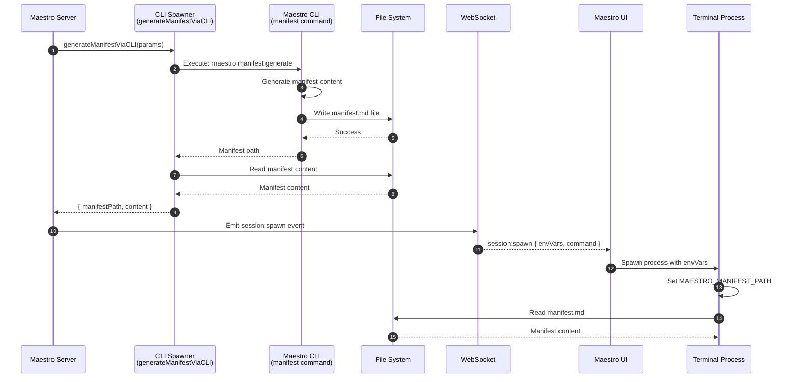
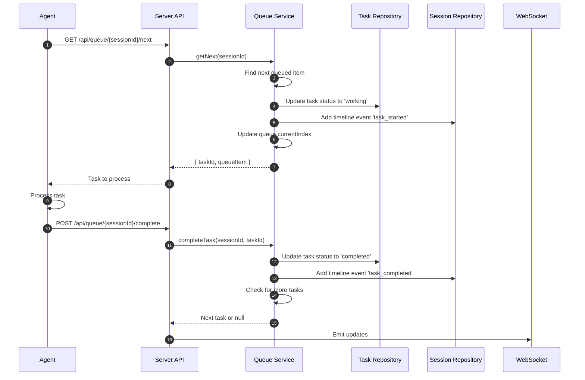

# Component Flows

## Overview

This document details how sessions flow between the four main components of the Maestro system: UI, Server, Storage, and CLI. It explains data flow, API calls, event broadcasting, and state synchronization.

## Component Architecture



---

## Flow 1: Session Creation (UI → Server → Storage → UI)

### Sequence



### Detailed Steps

#### Step 1-2: UI Initiates Spawn

**File:** `maestro-ui/src/services/maestroService.ts:33`

```typescript
export const spawnSession = async (payload: SpawnSessionPayload) => {
  const response = await maestroClient.spawnSession({
    projectId: project.id,
    taskIds: [taskId],
    role: 'worker',
    strategy: 'simple',
    spawnSource: 'ui',
    sessionName: 'Worker Session',
    skills: ['maestro-worker']
  });
  return response;
};
```

**HTTP Request:**
```http
POST http://localhost:3000/api/sessions/spawn
Content-Type: application/json

{
  "projectId": "prj_xyz",
  "taskIds": ["tsk_123"],
  "role": "worker",
  "strategy": "simple",
  "spawnSource": "ui",
  "sessionName": "Worker Session",
  "skills": ["maestro-worker"]
}
```

#### Step 3: Server API Validates

**File:** `maestro-server/src/api/sessionRoutes.ts:293-346`

Validations:
- ✓ `projectId` is provided and exists
- ✓ `taskIds` array is provided and all tasks exist
- ✓ `role` is 'worker' or 'orchestrator'
- ✓ `strategy` is 'simple' or 'queue'
- ✓ `spawnSource` is 'ui' or 'session'
- ✓ If `spawnSource === 'session'`, parent session exists

#### Step 4-5: Service Creates Session

**File:** `maestro-server/src/application/services/SessionService.ts:25`

```typescript
async createSession(input: CreateSessionPayload): Promise<Session> {
  // 1. Validate project exists
  const project = await this.projectRepository.findById(input.projectId);
  if (!project) throw new Error('Project not found');

  // 2. Validate all tasks exist
  for (const taskId of input.taskIds) {
    const task = await this.taskRepository.findById(taskId);
    if (!task) throw new Error(`Task ${taskId} not found`);
  }

  // 3. Create session via repository
  const session = await this.sessionRepository.create({
    projectId: input.projectId,
    taskIds: input.taskIds,
    name: input.name,
    strategy: input.strategy || 'simple',
    status: input.status || 'spawning',
    metadata: input.metadata || {}
  });

  // 4. Add session ID to all associated tasks
  for (const taskId of input.taskIds) {
    await this.taskRepository.addSession(taskId, session.id);
  }

  // 5. Emit events (unless suppressed)
  if (!input._suppressCreatedEvent) {
    await this.eventBus.emit('session:created', { session });
  }

  return session;
}
```

#### Step 6-7: Repository Writes to Storage

**File:** `maestro-server/src/infrastructure/repositories/FileSystemSessionRepository.ts:95-154`

```typescript
async create(input: Partial<Session>): Promise<Session> {
  const now = Date.now();
  const sessionId = this.idGenerator.generate('ses');

  const session: Session = {
    id: sessionId,
    projectId: input.projectId!,
    taskIds: input.taskIds || [],
    name: input.name || `Session ${sessionId}`,
    status: input.status || 'spawning',
    strategy: input.strategy || 'simple',
    createdAt: now,
    updatedAt: now,
    lastActivity: now,
    env: input.env || {},
    metadata: input.metadata || {},
    events: [],
    timeline: [
      {
        id: this.idGenerator.generate('evt'),
        type: 'session_started',
        timestamp: now,
        message: 'Session created',
      }
    ],
  };

  // Write to file system
  const filePath = path.join(this.dataDir, 'sessions', `${sessionId}.json`);
  await fs.writeFile(filePath, JSON.stringify(session, null, 2), 'utf-8');

  // Add to in-memory cache
  this.sessions.set(sessionId, session);

  return session;
}
```

**File Created:**
```
~/.maestro/data/sessions/ses_abc123.json
```

#### Step 8-10: Event Broadcasting

**File:** `maestro-server/src/infrastructure/websocket/WebSocketBridge.ts:96-117`

```typescript
// Event bus emits session:created
eventBus.on('session:created', (data) => {
  // Broadcast to all WebSocket clients
  wss.clients.forEach((client) => {
    if (client.readyState === WebSocket.OPEN) {
      client.send(JSON.stringify({
        type: 'session:created',
        event: 'session:created',
        data: data.session,
        timestamp: Date.now()
      }));
    }
  });
});
```

#### Step 11: UI Receives Event

**File:** `maestro-ui/src/stores/useMaestroStore.ts:98-102`

```typescript
case 'session:created': {
  const session = message.data.session || message.data;
  set((prev) => ({
    sessions: new Map(prev.sessions).set(session.id, session)
  }));
  break;
}
```

---

## Flow 2: Session Update (CLI → Server → Storage → UI)

### Sequence



### Detailed Steps

#### Step 1: CLI Sends Update

**File:** `maestro-cli/src/commands/session.ts:269`

```bash
# Example: Register session
maestro session register
```

```typescript
await api.patch(`/api/sessions/${sessionId}`, {
  status: 'running',
  projectId,
  taskIds,
  strategy: process.env.MAESTRO_STRATEGY,
});
```

**HTTP Request:**
```http
PATCH http://localhost:3000/api/sessions/ses_abc123
Content-Type: application/json

{
  "status": "running",
  "projectId": "prj_xyz",
  "taskIds": ["tsk_123"],
  "strategy": "simple"
}
```

#### Step 2-3: Service Updates Session

**File:** `maestro-server/src/application/services/SessionService.ts:112`

```typescript
async updateSession(id: string, updates: Partial<Session>): Promise<Session> {
  const updated = await this.sessionRepository.update(id, updates);
  await this.eventBus.emit('session:updated', updated);
  return updated;
}
```

#### Step 4-8: Repository Updates Storage

**File:** `maestro-server/src/infrastructure/repositories/FileSystemSessionRepository.ts:156-195`

```typescript
async update(id: string, updates: Partial<Session>): Promise<Session> {
  // 1. Load current session (from cache or file)
  const session = await this.findById(id);
  if (!session) throw new Error(`Session ${id} not found`);

  // 2. Merge updates
  const updated = {
    ...session,
    ...updates,
    updatedAt: Date.now(),
    lastActivity: Date.now(),
  };

  // 3. Write to file
  const filePath = path.join(this.dataDir, 'sessions', `${id}.json`);
  await fs.writeFile(filePath, JSON.stringify(updated, null, 2), 'utf-8');

  // 4. Update cache
  this.sessions.set(id, updated);

  return updated;
}
```

#### Step 9-12: Event Broadcast to UI

Same as Flow 1, steps 8-11.

---

## Flow 3: Timeline Event Addition (Agent → Server → Storage → UI)

### Sequence



### Detailed Steps

#### Step 1-2: Agent Reports Progress

```typescript
// Agent code (conceptual)
await fetch('http://localhost:3000/api/sessions/ses_abc123/timeline', {
  method: 'POST',
  headers: { 'Content-Type': 'application/json' },
  body: JSON.stringify({
    type: 'progress',
    message: 'Completed step 3 of 5',
    taskId: 'tsk_123',
    metadata: { progress: 0.6 }
  })
});
```

#### Step 3-7: Repository Appends Event

**File:** `maestro-server/src/infrastructure/repositories/FileSystemSessionRepository.ts:333-352`

```typescript
async addTimelineEvent(
  sessionId: string,
  event: Omit<SessionTimelineEvent, 'id' | 'timestamp'>
): Promise<Session> {
  const session = await this.findById(sessionId);
  if (!session) throw new Error(`Session ${sessionId} not found`);

  const timelineEvent: SessionTimelineEvent = {
    id: this.idGenerator.generate('evt'),
    timestamp: Date.now(),
    ...event,
  };

  session.timeline.push(timelineEvent);
  session.lastActivity = timelineEvent.timestamp;
  session.updatedAt = Date.now();

  // Save to file
  await this.save(session);

  return session;
}
```

#### Step 8-11: Real-Time Update

WebSocket broadcasts updated session with new timeline event to all UIs.

---

## Flow 4: Session Spawn with Manifest (Server → CLI → Storage → UI)

### Sequence



### Detailed Steps

#### Step 1-3: Server Generates Manifest

**File:** `maestro-server/src/api/sessionRoutes.ts:427-456`

```typescript
const result = await generateManifestViaCLI({
  role: 'worker',
  projectId,
  taskIds,
  skills: ['maestro-worker'],
  sessionId: session.id,
  strategy: 'simple',
});

// Spawns CLI process:
// maestro manifest generate \
//   --role worker \
//   --project-id prj_xyz \
//   --task-ids tsk_123,tsk_456 \
//   --skills maestro-worker \
//   --session-id ses_abc123 \
//   --strategy simple
```

**File:** `maestro-server/src/services/claude-spawner.ts` (generateManifestViaCLI)

```typescript
function generateManifestViaCLI(params: ManifestParams): Promise<ManifestResult> {
  return new Promise((resolve, reject) => {
    const args = [
      'manifest', 'generate',
      '--role', params.role,
      '--project-id', params.projectId,
      '--task-ids', params.taskIds.join(','),
      '--skills', params.skills.join(','),
      '--session-id', params.sessionId,
      '--strategy', params.strategy
    ];

    const child = spawn('maestro', args);

    child.on('close', (code) => {
      if (code === 0) {
        const manifestPath = `~/.maestro/data/sessions/${params.sessionId}/manifest.md`;
        const content = fs.readFileSync(manifestPath, 'utf-8');
        resolve({ manifestPath, content });
      } else {
        reject(new Error(`Manifest generation failed with code ${code}`));
      }
    });
  });
}
```

#### Step 4-6: CLI Writes Manifest

**File:** `maestro-cli/src/commands/manifest-generator.ts`

```typescript
const manifestContent = await generateManifest({
  role,
  projectId,
  taskIds,
  skills,
  strategy
});

const manifestDir = path.join(
  os.homedir(),
  '.maestro',
  'data',
  'sessions',
  sessionId
);

await fs.mkdir(manifestDir, { recursive: true });
await fs.writeFile(
  path.join(manifestDir, 'manifest.md'),
  manifestContent,
  'utf-8'
);
```

**File Created:**
```
~/.maestro/data/sessions/ses_abc123/manifest.md
```

#### Step 7-10: Server Emits Spawn Event

**File:** `maestro-server/src/api/sessionRoutes.ts:461-486`

```typescript
const finalEnvVars = {
  MAESTRO_SESSION_ID: session.id,
  MAESTRO_MANIFEST_PATH: manifestPath,
  MAESTRO_SERVER_URL: 'http://localhost:3000',
  MAESTRO_STRATEGY: strategy
};

const spawnEvent = {
  session: { ...session, env: finalEnvVars },
  command: 'claude',
  cwd: projectPath,
  envVars: finalEnvVars,
  manifest: manifestContent,
  projectId,
  taskIds,
  spawnSource: 'ui',
  parentSessionId: null,
  _isSpawnCreated: true
};

await eventBus.emit('session:spawn', spawnEvent);
```

#### Step 11-15: UI Spawns Terminal

**File:** `maestro-ui/src/stores/useMaestroStore.ts:109-121`

```typescript
case 'session:spawn': {
  void useSessionStore.getState().handleSpawnTerminalSession({
    maestroSessionId: session.id,
    name: session.name,
    command: message.data.command,
    cwd: message.data.cwd,
    envVars: message.data.envVars,  // Contains MAESTRO_MANIFEST_PATH
    projectId: message.data.projectId,
  });
}
```

Terminal process starts with environment variables:
```bash
MAESTRO_SESSION_ID=ses_abc123
MAESTRO_MANIFEST_PATH=~/.maestro/data/sessions/ses_abc123/manifest.md
MAESTRO_SERVER_URL=http://localhost:3000
MAESTRO_STRATEGY=simple
```

---

## Flow 5: Queue Strategy Task Processing (Agent → Server → Storage)

### Sequence



### Detailed Steps

#### Step 1-7: Get Next Task

**File:** `maestro-server/src/application/services/QueueService.ts:51-123`

```typescript
async getNext(sessionId: string): Promise<{ task: Task; queueItem: QueueItem } | null> {
  const queue = await this.queueRepository.getBySessionId(sessionId);
  if (!queue) return null;

  // Find next queued item
  const nextItem = queue.items.find(item => item.status === 'queued');
  if (!nextItem) return null;

  // Update task to 'working'
  await this.taskRepository.update(nextItem.taskId, {
    sessionStatus: 'working',
    updatedAt: Date.now()
  });

  // Update queue item
  nextItem.status = 'processing';
  nextItem.startedAt = Date.now();
  queue.currentIndex = queue.items.indexOf(nextItem);

  // Add timeline event
  await this.sessionRepository.addTimelineEvent(sessionId, {
    type: 'task_started',
    message: `Started working on task ${nextItem.taskId}`,
    taskId: nextItem.taskId,
    metadata: { queueIndex: queue.currentIndex }
  });

  await this.queueRepository.update(queue);

  const task = await this.taskRepository.findById(nextItem.taskId);
  return { task, queueItem: nextItem };
}
```

#### Step 8-14: Complete Task

**File:** `maestro-server/src/application/services/QueueService.ts:125-172`

```typescript
async completeTask(
  sessionId: string,
  taskId: string,
  result: 'completed' | 'failed' | 'skipped'
): Promise<void> {
  const queue = await this.queueRepository.getBySessionId(sessionId);
  if (!queue) throw new Error('Queue not found');

  const item = queue.items.find(i => i.taskId === taskId);
  if (!item) throw new Error('Task not in queue');

  // Update queue item
  item.status = result;
  item.completedAt = Date.now();

  // Update task
  await this.taskRepository.update(taskId, {
    sessionStatus: result,
    completedAt: Date.now(),
    updatedAt: Date.now()
  });

  // Add timeline event
  await this.sessionRepository.addTimelineEvent(sessionId, {
    type: result === 'completed' ? 'task_completed' : 'task_failed',
    message: `${result} task ${taskId}`,
    taskId,
    metadata: {
      queueIndex: queue.items.indexOf(item),
      duration: item.completedAt - (item.startedAt || item.createdAt)
    }
  });

  // Check if all tasks complete
  const allComplete = queue.items.every(i =>
    ['completed', 'failed', 'skipped'].includes(i.status)
  );

  if (allComplete) {
    // Update session to completed
    await this.sessionRepository.update(sessionId, {
      status: 'completed',
      completedAt: Date.now()
    });
  }

  await this.queueRepository.update(queue);
}
```

---

## Data Flow Summary

### Session Creation Flow

```
UI → HTTP → Server API → Service → Repository → File System
File System → Repository → Service → Event Bus → WebSocket → UI
```

### Session Update Flow

```
CLI → HTTP → Server API → Service → Repository → File System
File System → Repository → Service → Event Bus → WebSocket → UI
```

### Timeline Event Flow

```
Agent → HTTP → Server API → Repository → File System
File System → Repository → Event Bus → WebSocket → UI
```

### Manifest Generation Flow

```
Server → CLI Spawner → CLI Process → File System
File System → CLI Process → CLI Spawner → Server → WebSocket → UI → Terminal
Terminal → File System (reads manifest)
```

### Queue Processing Flow

```
Agent → HTTP → Server API → Queue Service → Task Repository
Queue Service → Session Repository → File System
File System → Event Bus → WebSocket → UI
```

---

## Storage File Locations

### Session Files

```
~/.maestro/data/
├── sessions/
│   ├── ses_abc123.json              # Session data
│   ├── ses_abc123/
│   │   └── manifest.md              # Session manifest
│   ├── ses_def456.json
│   └── ses_def456/
│       └── manifest.md
├── tasks/
│   ├── tsk_123.json
│   └── tsk_456.json
├── projects/
│   └── prj_xyz.json
└── queues/
    ├── que_ses_abc123.json          # Queue state (if strategy: queue)
    └── que_ses_def456.json
```

### Session JSON Structure

```json
{
  "id": "ses_abc123",
  "projectId": "prj_xyz",
  "taskIds": ["tsk_123", "tsk_456"],
  "name": "Worker Session",
  "status": "working",
  "strategy": "simple",
  "createdAt": 1707260400000,
  "updatedAt": 1707260410000,
  "lastActivity": 1707260410000,
  "env": {
    "CUSTOM_VAR": "value"
  },
  "metadata": {
    "skills": ["maestro-worker"],
    "spawnedBy": null,
    "spawnSource": "ui",
    "role": "worker",
    "strategy": "simple"
  },
  "events": [],
  "timeline": [
    {
      "id": "evt_1",
      "type": "session_started",
      "timestamp": 1707260400000,
      "message": "Session created"
    },
    {
      "id": "evt_2",
      "type": "task_started",
      "timestamp": 1707260405000,
      "message": "Started task tsk_123",
      "taskId": "tsk_123"
    }
  ]
}
```

---

## WebSocket Event Flow

### Events Broadcast by Server

```typescript
// maestro-server/src/infrastructure/websocket/WebSocketBridge.ts:66-81

const events: EventName[] = [
  'session:created',       // New session created
  'session:spawn',         // Spawn request (special)
  'session:updated',       // Session data changed
  'session:deleted',       // Session removed
  'session:task_added',    // Task added to session
  'session:task_removed',  // Task removed from session
  'task:created',          // New task created
  'task:updated',          // Task data changed
  'task:deleted',          // Task removed
  'task:session_added',    // Session added to task
  'task:session_removed'   // Session removed from task
];
```

### WebSocket Message Format

```typescript
{
  type: 'session:updated',
  event: 'session:updated',
  data: {
    id: 'ses_abc123',
    status: 'working',
    timeline: [...],
    // ... full session object
  },
  timestamp: 1707260410000
}
```

---

## API Endpoints Reference

### Session Endpoints

| Method | Endpoint | Purpose | Emits Event |
|--------|----------|---------|-------------|
| POST | `/api/sessions` | Create session | `session:created` |
| GET | `/api/sessions` | List sessions | - |
| GET | `/api/sessions/:id` | Get session | - |
| PATCH | `/api/sessions/:id` | Update session | `session:updated` |
| DELETE | `/api/sessions/:id` | Delete session | `session:deleted` |
| POST | `/api/sessions/spawn` | Spawn session | `session:spawn` |
| POST | `/api/sessions/:id/tasks/:taskId` | Add task | `session:task_added`, `task:session_added` |
| DELETE | `/api/sessions/:id/tasks/:taskId` | Remove task | `session:task_removed`, `task:session_removed` |
| POST | `/api/sessions/:id/timeline` | Add timeline event | `session:updated` |

### Queue Endpoints

| Method | Endpoint | Purpose | Emits Event |
|--------|----------|---------|-------------|
| GET | `/api/queue/:sessionId` | Get queue state | - |
| GET | `/api/queue/:sessionId/next` | Get next task | `session:updated`, `task:updated` |
| POST | `/api/queue/:sessionId/complete` | Complete current task | `session:updated`, `task:updated` |

---

## Code Locations Reference

### UI Components

| Component | File | Purpose |
|-----------|------|---------|
| Maestro Store | `maestro-ui/src/stores/useMaestroStore.ts` | Global state management |
| Maestro Service | `maestro-ui/src/services/maestroService.ts` | API client wrapper |
| Maestro Client | `maestro-ui/src/utils/MaestroClient.ts` | HTTP API client |
| WebSocket Hook | `maestro-ui/src/hooks/useMaestroWebSocket.ts` | WebSocket listener hook |
| Sessions Section | `maestro-ui/src/components/SessionsSection.tsx` | Session list UI |

### Server Components

| Component | File | Purpose |
|-----------|------|---------|
| Session Routes | `maestro-server/src/api/sessionRoutes.ts` | REST API endpoints |
| Session Service | `maestro-server/src/application/services/SessionService.ts` | Business logic |
| Session Repository | `maestro-server/src/infrastructure/repositories/FileSystemSessionRepository.ts` | Data persistence |
| Queue Service | `maestro-server/src/application/services/QueueService.ts` | Queue management |
| WebSocket Bridge | `maestro-server/src/infrastructure/websocket/WebSocketBridge.ts` | Event broadcasting |
| Event Bus | `maestro-server/src/domain/events/DomainEvents.ts` | Event system |

### CLI Components

| Component | File | Purpose |
|-----------|------|---------|
| Session Commands | `maestro-cli/src/commands/session.ts` | CLI session commands |
| Manifest Generator | `maestro-cli/src/commands/manifest-generator.ts` | Manifest creation |
| Claude Spawner | `maestro-cli/src/services/claude-spawner.ts` | CLI process spawning |
| SessionStart Hook | `maestro-cli/src/hooks/SessionStart.ts` | Auto-registration |
| SessionEnd Hook | `maestro-cli/src/hooks/SessionEnd.ts` | Auto-completion |

---

## Related Documentation

- [SESSION-STATUS-FLOW.md](./SESSION-STATUS-FLOW.md) - Status transitions
- [SESSION-LIFECYCLE.md](./SESSION-LIFECYCLE.md) - Complete lifecycle
- [SESSION-TIMELINE.md](./SESSION-TIMELINE.md) - Timeline events
- [WEBSOCKET-EVENTS.md](./WEBSOCKET-EVENTS.md) - WebSocket details
- [QUEUE-STRATEGY.md](./QUEUE-STRATEGY.md) - Queue processing
