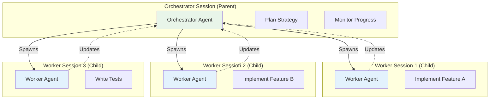
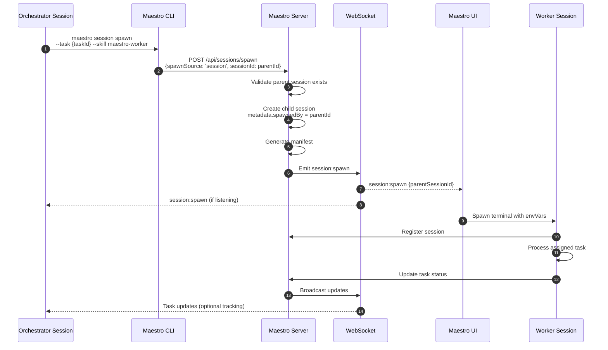

# Parent-Child Sessions

## Overview

Parent-child sessions enable hierarchical session orchestration where one session (parent/orchestrator) can spawn additional sessions (children/workers). This pattern is essential for distributed task execution and orchestrator-worker architectures.

## Architecture Pattern



---

## Spawn Source

### Two Spawn Sources

```typescript
type SpawnSource = 'ui' | 'session';
```

| Source | Description | Parent Session | Use Case |
|--------|-------------|----------------|----------|
| `'ui'` | Spawned by user via UI | `null` | User-initiated sessions |
| `'session'` | Spawned by another session | Parent session ID | Orchestrator patterns |

---

## Session-Spawned Session Flow

### Complete Sequence



---

## Parent-Child Relationship Data Model

### Session Metadata

```typescript
// Parent session metadata
{
  "id": "ses_orchestrator_123",
  "metadata": {
    "role": "orchestrator",
    "spawnSource": "ui",
    "spawnedBy": null,  // No parent (top-level)
    "childSessions": [   // Track spawned children (optional)
      "ses_worker_456",
      "ses_worker_789"
    ]
  }
}

// Child session metadata
{
  "id": "ses_worker_456",
  "metadata": {
    "role": "worker",
    "spawnSource": "session",
    "spawnedBy": "ses_orchestrator_123",  // Parent session ID
    "parentSessionId": "ses_orchestrator_123"  // Redundant for clarity
  }
}
```

**Key Fields:**
- `spawnSource`: `'session'` for child sessions
- `metadata.spawnedBy`: Parent session ID
- `metadata.role`: `'orchestrator'` or `'worker'`

---

## CLI Session Spawn Command

### Command Syntax

```bash
maestro session spawn \
  --task <taskId> \
  --skill <skillName> \
  [--session-name <name>] \
  [--reason <reason>]
```

### Command Implementation

**File:** `maestro-cli/src/commands/session.ts:162-233`

```typescript
session
  .command('spawn')
  .description('Spawn a new session from current session')
  .requiredOption('--task <id>', 'Task ID to assign to new session')
  .option('--skill <skill>', 'Skill to use', 'maestro-worker')
  .option('--session-name <name>', 'Name for new session')
  .option('--reason <reason>', 'Reason for spawning')
  .action(async (cmdOpts) => {
    const { task: taskId, skill, sessionName, reason } = cmdOpts;
    const config = loadConfig();

    // Validate running in a session
    if (!config.sessionId) {
      console.error('Error: Must be run within a Maestro session');
      process.exit(1);
    }

    const role = skill === 'maestro-orchestrator' ? 'orchestrator' : 'worker';

    const spawnRequest = {
      projectId: config.projectId,
      taskIds: [taskId],
      role,
      spawnSource: 'session',                    // KEY: Session-initiated
      sessionId: config.sessionId,               // Parent session ID
      skills: [skill],
      sessionName: sessionName || `${role}-${Date.now()}`,
      context: reason ? { reason } : {}
    };

    try {
      const api = createApiClient(config.serverUrl);
      const result: any = await api.post('/api/sessions/spawn', spawnRequest);

      console.log(`Spawned ${role} session: ${result.session.id}`);
      console.log(`Assigned to task: ${taskId}`);

      if (reason) {
        console.log(`Reason: ${reason}`);
      }
    } catch (error: any) {
      console.error('Failed to spawn session:', error.message);
      process.exit(1);
    }
  });
```

### Example Usage

```bash
# Orchestrator spawns worker for a specific task
maestro session spawn \
  --task tsk_implement_auth \
  --skill maestro-worker \
  --session-name "Auth Worker" \
  --reason "Delegate authentication implementation"
```

---

## Server Spawn Validation

### Parent Session Validation

**File:** `maestro-server/src/api/sessionRoutes.ts:318-346`

```typescript
// Validate spawnSource
if (spawnSource === 'session') {
  // Session-initiated spawn requires parent session ID
  if (!sessionId) {
    return res.status(400).json({
      error: true,
      code: 'missing_session_id',
      message: 'sessionId is required when spawnSource is "session"'
    });
  }

  // Verify parent session exists
  const parentSession = await sessionService.getSession(sessionId);
  if (!parentSession) {
    return res.status(404).json({
      error: true,
      code: 'parent_session_not_found',
      message: `Parent session ${sessionId} not found`
    });
  }

  // Optional: Check parent session is active
  if (!['idle', 'working'].includes(parentSession.status)) {
    return res.status(400).json({
      error: true,
      code: 'parent_session_not_active',
      message: `Parent session ${sessionId} is not active (status: ${parentSession.status})`
    });
  }
}
```

---

## Child Session Creation

### Metadata Setup

**File:** `maestro-server/src/api/sessionRoutes.ts:391-407`

```typescript
const session = await sessionService.createSession({
  projectId,
  taskIds,
  name: sessionName || `${role}-${Date.now()}`,
  strategy,
  status: 'spawning',
  metadata: {
    skills: skillsToUse,
    spawnedBy: sessionId || null,        // Parent session ID (or null if UI-spawned)
    spawnSource,                          // 'ui' or 'session'
    role,                                 // 'orchestrator' or 'worker'
    strategy,
    context: context || {},               // Optional context (e.g., reason)
    parentSessionId: sessionId || null    // Redundant for clarity
  },
  _suppressCreatedEvent: true  // Emit spawn event instead
});
```

---

## Spawn Event Propagation

### Spawn Event Data

**File:** `maestro-server/src/api/sessionRoutes.ts:472-486`

```typescript
const spawnEvent = {
  session: { ...session, env: finalEnvVars },
  command,
  cwd,
  envVars: finalEnvVars,
  manifest,
  projectId,
  taskIds,
  spawnSource,                              // 'ui' or 'session'
  parentSessionId: sessionId || null,       // Parent session ID
  _isSpawnCreated: true
};

await eventBus.emit('session:spawn', spawnEvent);
```

**WebSocket Broadcast:**
- All connected UI clients receive spawn event
- Parent orchestrator session CAN listen for spawn events (if monitoring)
- Child session will be spawned in UI terminal

---

## Orchestrator Pattern Example

### Orchestrator Session Flow

```typescript
// Orchestrator agent logic (pseudocode)

async function orchestrateProject(projectId: string, tasks: Task[]) {
  console.log(`Orchestrating ${tasks.length} tasks`);

  // 1. Create strategy: which tasks to delegate
  const backendTasks = tasks.filter(t => t.tags.includes('backend'));
  const frontendTasks = tasks.filter(t => t.tags.includes('frontend'));
  const testTasks = tasks.filter(t => t.tags.includes('tests'));

  // 2. Spawn worker sessions
  console.log('Spawning backend worker...');
  await spawnWorkerSession({
    taskIds: backendTasks.map(t => t.id),
    sessionName: 'Backend Worker',
    skill: 'maestro-worker'
  });

  console.log('Spawning frontend worker...');
  await spawnWorkerSession({
    taskIds: frontendTasks.map(t => t.id),
    sessionName: 'Frontend Worker',
    skill: 'maestro-worker'
  });

  // 3. Monitor progress
  await monitorChildSessions();

  // 4. When all workers complete, spawn test worker
  console.log('Spawning test worker...');
  await spawnWorkerSession({
    taskIds: testTasks.map(t => t.id),
    sessionName: 'Test Worker',
    skill: 'maestro-worker'
  });

  console.log('Orchestration complete');
}

function spawnWorkerSession(config: {
  taskIds: string[];
  sessionName: string;
  skill: string;
}) {
  // Uses CLI command
  return execCommand(
    `maestro session spawn --task ${config.taskIds[0]} --skill ${config.skill} --session-name "${config.sessionName}"`
  );
}
```

---

## Parent-Child Communication

### Option 1: WebSocket Monitoring (Passive)

Orchestrator listens to WebSocket events for child session updates:

```typescript
// Orchestrator monitoring child sessions

const childSessions = new Set(['ses_worker_1', 'ses_worker_2']);

function listenForChildUpdates() {
  // Connect to WebSocket
  const ws = new WebSocket('ws://localhost:3000');

  ws.on('message', (data) => {
    const message = JSON.parse(data);

    // Filter events from child sessions
    if (message.type === 'session:updated' && childSessions.has(message.data.id)) {
      console.log(`Child session ${message.data.id} updated:`, message.data.status);

      if (message.data.status === 'completed') {
        console.log(`Child session ${message.data.id} completed!`);
        childSessions.delete(message.data.id);

        if (childSessions.size === 0) {
          console.log('All child sessions completed');
        }
      }
    }

    // Monitor task updates from children
    if (message.type === 'task:updated') {
      console.log(`Task ${message.data.id} updated:`, message.data.sessionStatus);
    }
  });
}
```

---

### Option 2: Polling (Active)

Orchestrator polls API for child session status:

```typescript
async function monitorChildSessions(childSessionIds: string[]) {
  const POLL_INTERVAL = 5000;  // 5 seconds

  while (true) {
    const statuses = await Promise.all(
      childSessionIds.map(async (id) => {
        const res = await fetch(`http://localhost:3000/api/sessions/${id}`);
        const session = await res.json();
        return { id, status: session.status };
      })
    );

    console.log('Child session statuses:', statuses);

    const allComplete = statuses.every(s =>
      ['completed', 'failed', 'stopped'].includes(s.status)
    );

    if (allComplete) {
      console.log('All child sessions finished');
      break;
    }

    await sleep(POLL_INTERVAL);
  }
}
```

---

### Option 3: Shared Task Updates (Indirect)

Orchestrator and workers share tasks, orchestrator monitors task `sessionStatus`:

```typescript
async function monitorSharedTasks(taskIds: string[]) {
  while (true) {
    const tasks = await Promise.all(
      taskIds.map(async (id) => {
        const res = await fetch(`http://localhost:3000/api/tasks/${id}`);
        return res.json();
      })
    );

    const completed = tasks.filter(t => t.sessionStatus === 'completed').length;
    const total = tasks.length;

    console.log(`Progress: ${completed}/${total} tasks completed`);

    if (completed === total) {
      console.log('All tasks completed');
      break;
    }

    await sleep(5000);
  }
}
```

---

## Use Cases

### 1. Orchestrator-Worker Pattern

**Scenario:** Complex project with multiple parallel tracks

```
Orchestrator
├─ Analyzes project requirements
├─ Creates task breakdown
├─ Spawns 3 workers:
│  ├─ Backend Worker → API tasks
│  ├─ Frontend Worker → UI tasks
│  └─ DevOps Worker → Infrastructure tasks
└─ Monitors progress and coordinates
```

### 2. Recursive Delegation

**Scenario:** Task requires sub-orchestration

```
Top-Level Orchestrator
└─ Spawns Feature Orchestrator
    ├─ Spawns Implementation Worker
    ├─ Spawns Testing Worker
    └─ Spawns Documentation Worker
```

### 3. Specialized Workers

**Scenario:** Different skills for different tasks

```
Orchestrator
├─ Spawns Python Specialist → Backend tasks
├─ Spawns React Specialist → Frontend tasks
├─ Spawns Security Specialist → Security review
└─ Spawns QA Specialist → Testing
```

---

## Session Hierarchy Query

### Get All Child Sessions

```typescript
async function getChildSessions(parentSessionId: string): Promise<Session[]> {
  // Query all sessions
  const allSessions = await sessionRepository.findAll();

  // Filter by parent
  return allSessions.filter(session =>
    session.metadata?.spawnedBy === parentSessionId
  );
}
```

### Get Session Hierarchy

```typescript
interface SessionNode {
  session: Session;
  children: SessionNode[];
}

async function getSessionHierarchy(sessionId: string): Promise<SessionNode> {
  const session = await sessionRepository.findById(sessionId);
  if (!session) throw new Error('Session not found');

  const children = await getChildSessions(sessionId);

  return {
    session,
    children: await Promise.all(
      children.map(child => getSessionHierarchy(child.id))
    )
  };
}
```

**Example Output:**
```json
{
  "session": { "id": "ses_orch_1", "name": "Main Orchestrator" },
  "children": [
    {
      "session": { "id": "ses_worker_1", "name": "Backend Worker" },
      "children": []
    },
    {
      "session": { "id": "ses_worker_2", "name": "Frontend Worker" },
      "children": []
    },
    {
      "session": { "id": "ses_orch_2", "name": "Sub-Orchestrator" },
      "children": [
        {
          "session": { "id": "ses_worker_3", "name": "Specialized Worker" },
          "children": []
        }
      ]
    }
  ]
}
```

---

## UI Visualization

### Session Tree View

```typescript
function SessionTreeView({ rootSessionId }: { rootSessionId: string }) {
  const [hierarchy, setHierarchy] = useState<SessionNode | null>(null);

  useEffect(() => {
    fetch(`/api/sessions/${rootSessionId}/hierarchy`)
      .then(res => res.json())
      .then(setHierarchy);
  }, [rootSessionId]);

  if (!hierarchy) return <div>Loading...</div>;

  return (
    <div className="session-tree">
      <SessionNode node={hierarchy} level={0} />
    </div>
  );
}

function SessionNode({ node, level }: { node: SessionNode; level: number }) {
  const indent = level * 20;

  return (
    <div>
      <div style={{ paddingLeft: indent }}>
        {level > 0 && '└─ '}
        <SessionBadge session={node.session} />
      </div>
      {node.children.map(child => (
        <SessionNode key={child.session.id} node={child} level={level + 1} />
      ))}
    </div>
  );
}
```

**Visual Output:**
```
Orchestrator Session (working)
└─ Backend Worker (completed)
└─ Frontend Worker (working)
└─ Sub-Orchestrator (working)
    └─ API Worker (completed)
    └─ UI Worker (working)
```

---

## Best Practices

### 1. Clear Parent-Child Relationships

```typescript
// GOOD: Explicit parent tracking
metadata: {
  spawnedBy: 'ses_parent_123',
  parentSessionId: 'ses_parent_123',
  role: 'worker',
  delegatedTask: 'tsk_456'
}

// BAD: No parent tracking
metadata: {
  role: 'worker'
}
```

### 2. Limit Nesting Depth

```typescript
// GOOD: 2-3 levels max
Orchestrator → Workers
Orchestrator → Sub-Orchestrators → Workers

// BAD: Deep nesting (hard to manage)
Orchestrator → Sub-Orch → Sub-Sub-Orch → Workers → Sub-Workers
```

### 3. Monitor Child Completion

```typescript
// GOOD: Orchestrator waits for children
await spawnWorkers(tasks);
await waitForChildCompletion();
await spawnTestWorker();

// BAD: Fire and forget
spawnWorkers(tasks);
// No tracking of completion
```

### 4. Handle Child Failures

```typescript
// GOOD: Check child statuses
const childStatuses = await getChildStatuses();
const anyFailed = childStatuses.some(s => s.status === 'failed');
if (anyFailed) {
  console.error('Some child sessions failed');
  // Handle failure
}

// BAD: Assume all succeed
await waitForChildCompletion();
// Proceed without checking for failures
```

---

## Code Locations

| Component | File | Lines |
|-----------|------|-------|
| CLI Spawn Command | `maestro-cli/src/commands/session.ts` | 162-233 |
| Spawn Validation | `maestro-server/src/api/sessionRoutes.ts` | 318-346 |
| Session Creation | `maestro-server/src/api/sessionRoutes.ts` | 391-407 |
| Spawn Event | `maestro-server/src/api/sessionRoutes.ts` | 472-486 |
| Session Service | `maestro-server/src/application/services/SessionService.ts` | Full file |

---

## Related Documentation

- [SESSION-LIFECYCLE.md](./SESSION-LIFECYCLE.md) - Session lifecycle with parent-child
- [SESSION-STATUS-FLOW.md](./SESSION-STATUS-FLOW.md) - Status for parent and child sessions
- [COMPONENT-FLOWS.md](./COMPONENT-FLOWS.md) - Parent-child spawn flow
- [WEBSOCKET-EVENTS.md](./WEBSOCKET-EVENTS.md) - Spawn event details
