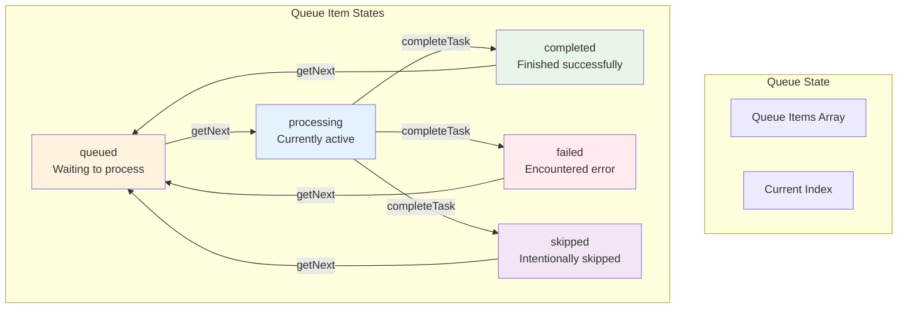
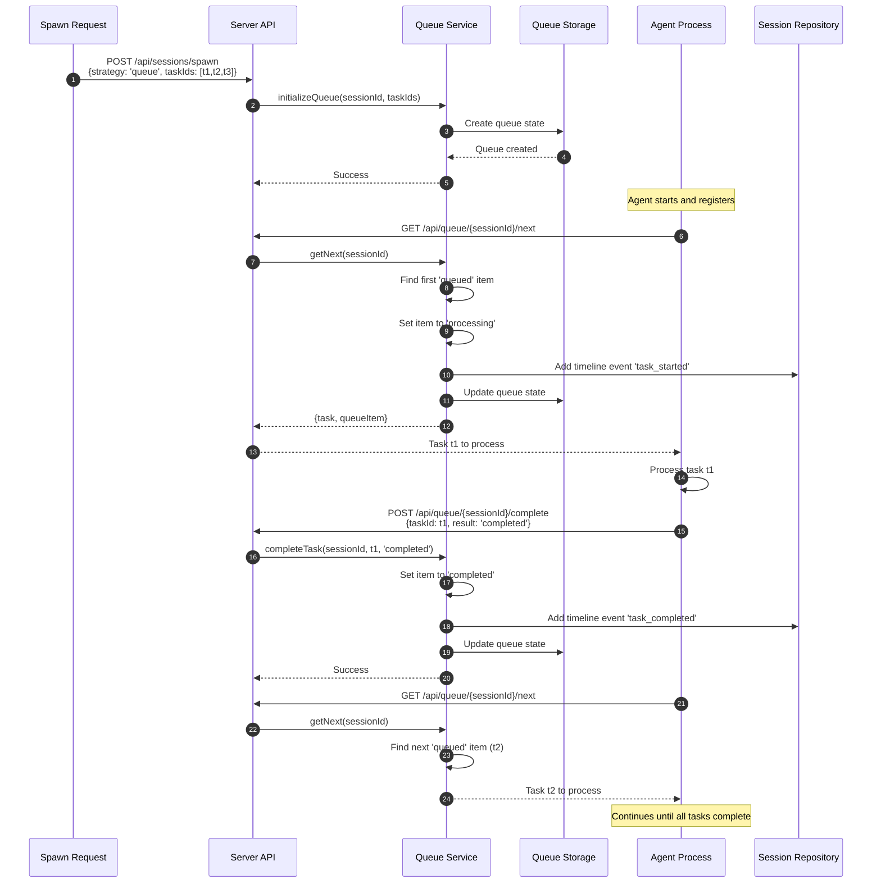

# Queue Strategy

## Overview

The Queue Strategy is one of two session processing strategies in Maestro (the other being Simple Strategy). It provides sequential task processing with automatic queue management, ensuring tasks are executed one at a time in a defined order.

## Strategy Comparison

| Feature | Simple Strategy | Queue Strategy |
|---------|----------------|----------------|
| **Task Processing** | Agent decides order | Sequential, ordered queue |
| **Task Management** | Manual | Automatic advancement |
| **Concurrency** | Agent-controlled | One task at a time |
| **State Tracking** | Basic | Detailed queue state |
| **Use Case** | Flexible workflows | Ordered workflows |
| **Complexity** | Lower | Higher |

## Queue Architecture



---

## Queue Data Model

### QueueState

```typescript
// Location: maestro-server/src/types.ts

export interface QueueState {
  sessionId: string;              // Associated session
  strategy: WorkerStrategy;       // Always 'queue' for this strategy
  items: QueueItem[];            // Ordered array of queue items
  currentIndex: number;          // Index of currently processing item (-1 if none)
  createdAt: number;             // Queue creation timestamp
  updatedAt: number;             // Last update timestamp
}
```

### QueueItem

```typescript
export interface QueueItem {
  taskId: string;                           // Task being processed
  status: QueueItemStatus;                  // Current item status
  createdAt: number;                        // When item was queued
  startedAt?: number;                       // When processing started
  completedAt?: number;                     // When processing finished
  metadata?: Record<string, any>;           // Extensible metadata
}

export type QueueItemStatus =
  | 'queued'       // Waiting to be processed
  | 'processing'   // Currently being worked on
  | 'completed'    // Successfully finished
  | 'failed'       // Processing failed
  | 'skipped';     // Intentionally skipped
```

---

## Queue Lifecycle

### Sequence Diagram



---

## Queue Operations

### 1. Initialize Queue

**When:** Session spawn with `strategy: 'queue'`

**File:** `maestro-server/src/application/services/QueueService.ts:23-49`

```typescript
async initializeQueue(
  sessionId: string,
  taskIds: string[]
): Promise<QueueState> {
  const now = Date.now();

  // Create queue items in order
  const items: QueueItem[] = taskIds.map((taskId) => ({
    taskId,
    status: 'queued',
    createdAt: now,
  }));

  const queueState: QueueState = {
    sessionId,
    strategy: 'queue',
    items,
    currentIndex: -1,  // No item processing yet
    createdAt: now,
    updatedAt: now,
  };

  await this.queueRepository.create(queueState);

  return queueState;
}
```

**Result:**
- Queue file created: `~/.maestro/data/queues/que_{sessionId}.json`
- All tasks start in `'queued'` status
- `currentIndex = -1` (no active task)

---

### 2. Get Next Task

**When:** Agent requests next task to process

**Endpoint:** `GET /api/queue/{sessionId}/next`

**File:** `maestro-server/src/application/services/QueueService.ts:51-123`

```typescript
async getNext(
  sessionId: string
): Promise<{ task: Task; queueItem: QueueItem } | null> {
  const queue = await this.queueRepository.getBySessionId(sessionId);
  if (!queue) throw new Error('Queue not found');

  // Find next queued item
  const nextItem = queue.items.find(item => item.status === 'queued');
  if (!nextItem) {
    // No more tasks to process
    return null;
  }

  // Update task to 'working' status
  await this.taskRepository.update(nextItem.taskId, {
    sessionStatus: 'working',
    updatedAt: Date.now()
  });

  // Update queue item to 'processing'
  nextItem.status = 'processing';
  nextItem.startedAt = Date.now();
  queue.currentIndex = queue.items.indexOf(nextItem);
  queue.updatedAt = Date.now();

  // Add timeline event
  await this.sessionRepository.addTimelineEvent(sessionId, {
    type: 'task_started',
    message: `Started working on task ${nextItem.taskId}`,
    taskId: nextItem.taskId,
    metadata: {
      queueIndex: queue.currentIndex,
      totalTasks: queue.items.length
    }
  });

  await this.queueRepository.update(queue);

  const task = await this.taskRepository.findById(nextItem.taskId);
  return { task, queueItem: nextItem };
}
```

**Side Effects:**
- Task `sessionStatus` → `'working'`
- Queue item status → `'processing'`
- Queue `currentIndex` updated
- Timeline event added: `task_started`
- Queue state saved to disk

---

### 3. Complete Task

**When:** Agent finishes processing current task

**Endpoint:** `POST /api/queue/{sessionId}/complete`

**Payload:**
```typescript
{
  taskId: string,
  result: 'completed' | 'failed' | 'skipped'
}
```

**File:** `maestro-server/src/application/services/QueueService.ts:125-172`

```typescript
async completeTask(
  sessionId: string,
  taskId: string,
  result: 'completed' | 'failed' | 'skipped'
): Promise<void> {
  const queue = await this.queueRepository.getBySessionId(sessionId);
  if (!queue) throw new Error('Queue not found');

  const item = queue.items.find(i => i.taskId === taskId);
  if (!item) throw new Error('Task not in queue');

  // Update queue item
  item.status = result;
  item.completedAt = Date.now();
  queue.updatedAt = Date.now();

  // Update task
  await this.taskRepository.update(taskId, {
    sessionStatus: result,
    completedAt: Date.now(),
    updatedAt: Date.now()
  });

  // Add timeline event
  const eventType = result === 'completed' ? 'task_completed' :
                    result === 'failed' ? 'task_failed' :
                    'task_skipped';

  await this.sessionRepository.addTimelineEvent(sessionId, {
    type: eventType,
    message: `${result} task ${taskId}`,
    taskId,
    metadata: {
      queueIndex: queue.items.indexOf(item),
      duration: item.completedAt - (item.startedAt || item.createdAt)
    }
  });

  // Check if all tasks are done
  const allComplete = queue.items.every(i =>
    ['completed', 'failed', 'skipped'].includes(i.status)
  );

  if (allComplete) {
    // Mark session as completed
    await this.sessionRepository.update(sessionId, {
      status: 'completed',
      completedAt: Date.now()
    });

    // Add final timeline event
    await this.sessionRepository.addTimelineEvent(sessionId, {
      type: 'session_stopped',
      message: 'All tasks completed',
    });
  }

  await this.queueRepository.update(queue);
}
```

**Side Effects:**
- Queue item status updated to result
- Task `sessionStatus` updated
- Task `completedAt` timestamp set
- Timeline event added
- If all tasks done: session → `'completed'`
- Queue state saved to disk

---

### 4. Get Queue State

**When:** UI or agent wants to check queue progress

**Endpoint:** `GET /api/queue/{sessionId}`

**File:** `maestro-server/src/application/services/QueueService.ts`

```typescript
async getQueueState(sessionId: string): Promise<QueueState | null> {
  return this.queueRepository.getBySessionId(sessionId);
}
```

**Response Example:**
```json
{
  "sessionId": "ses_abc123",
  "strategy": "queue",
  "items": [
    {
      "taskId": "tsk_1",
      "status": "completed",
      "createdAt": 1707260400000,
      "startedAt": 1707260405000,
      "completedAt": 1707260450000
    },
    {
      "taskId": "tsk_2",
      "status": "processing",
      "createdAt": 1707260400000,
      "startedAt": 1707260455000
    },
    {
      "taskId": "tsk_3",
      "status": "queued",
      "createdAt": 1707260400000
    }
  ],
  "currentIndex": 1,
  "createdAt": 1707260400000,
  "updatedAt": 1707260455000
}
```

---

## Queue Storage

### File Location

```
~/.maestro/data/queues/que_{sessionId}.json
```

### File Structure

```json
{
  "sessionId": "ses_abc123",
  "strategy": "queue",
  "items": [
    {
      "taskId": "tsk_1",
      "status": "completed",
      "createdAt": 1707260400000,
      "startedAt": 1707260405000,
      "completedAt": 1707260450000,
      "metadata": {}
    },
    {
      "taskId": "tsk_2",
      "status": "processing",
      "createdAt": 1707260400000,
      "startedAt": 1707260455000,
      "metadata": {}
    },
    {
      "taskId": "tsk_3",
      "status": "queued",
      "createdAt": 1707260400000,
      "metadata": {}
    }
  ],
  "currentIndex": 1,
  "createdAt": 1707260400000,
  "updatedAt": 1707260455000
}
```

---

## Queue API Endpoints

### Queue Routes

**File:** `maestro-server/src/api/queueRoutes.ts`

```typescript
import { Router } from 'express';

const router = Router();

// Get queue state
router.get('/queue/:sessionId', async (req, res) => {
  const { sessionId } = req.params;
  const queueState = await queueService.getQueueState(sessionId);
  res.json(queueState);
});

// Get next task
router.get('/queue/:sessionId/next', async (req, res) => {
  const { sessionId } = req.params;
  const result = await queueService.getNext(sessionId);
  res.json(result);
});

// Complete current task
router.post('/queue/:sessionId/complete', async (req, res) => {
  const { sessionId } = req.params;
  const { taskId, result } = req.body;
  await queueService.completeTask(sessionId, taskId, result);
  res.json({ success: true });
});
```

---

## Agent Usage Pattern

### Worker Agent Flow

```typescript
// Worker agent using queue strategy

async function processQueuedTasks(sessionId: string) {
  while (true) {
    // Get next task
    const response = await fetch(
      `http://localhost:3000/api/queue/${sessionId}/next`
    );

    if (response.status === 404) {
      // No more tasks
      console.log('Queue complete');
      break;
    }

    const { task, queueItem } = await response.json();

    console.log(`Processing task ${task.id}: ${task.title}`);

    try {
      // Do the work
      await performTaskWork(task);

      // Mark as completed
      await fetch(
        `http://localhost:3000/api/queue/${sessionId}/complete`,
        {
          method: 'POST',
          headers: { 'Content-Type': 'application/json' },
          body: JSON.stringify({
            taskId: task.id,
            result: 'completed'
          })
        }
      );

      console.log(`Completed task ${task.id}`);
    } catch (error) {
      // Mark as failed
      await fetch(
        `http://localhost:3000/api/queue/${sessionId}/complete`,
        {
          method: 'POST',
          headers: { 'Content-Type': 'application/json' },
          body: JSON.stringify({
            taskId: task.id,
            result: 'failed'
          })
        }
      );

      console.error(`Failed task ${task.id}:`, error);
    }
  }
}
```

---

## Queue Progress Tracking

### Calculate Progress

```typescript
function calculateQueueProgress(queueState: QueueState): {
  total: number;
  completed: number;
  failed: number;
  skipped: number;
  processing: number;
  queued: number;
  percentage: number;
} {
  const total = queueState.items.length;
  const completed = queueState.items.filter(i => i.status === 'completed').length;
  const failed = queueState.items.filter(i => i.status === 'failed').length;
  const skipped = queueState.items.filter(i => i.status === 'skipped').length;
  const processing = queueState.items.filter(i => i.status === 'processing').length;
  const queued = queueState.items.filter(i => i.status === 'queued').length;

  const done = completed + failed + skipped;
  const percentage = total > 0 ? (done / total) * 100 : 0;

  return {
    total,
    completed,
    failed,
    skipped,
    processing,
    queued,
    percentage
  };
}
```

**Example Usage:**
```typescript
const progress = calculateQueueProgress(queueState);
console.log(`Progress: ${progress.percentage.toFixed(1)}%`);
console.log(`Completed: ${progress.completed}/${progress.total}`);
console.log(`Failed: ${progress.failed}`);
console.log(`Remaining: ${progress.queued + progress.processing}`);
```

---

## UI Integration

### Display Queue Progress

```typescript
function QueueProgressBar({ sessionId }: { sessionId: string }) {
  const [queueState, setQueueState] = useState<QueueState | null>(null);

  useEffect(() => {
    // Fetch queue state
    fetch(`/api/queue/${sessionId}`)
      .then(res => res.json())
      .then(setQueueState);
  }, [sessionId]);

  // Listen for updates
  useMaestroWebSocket((message) => {
    if (message.type === 'session:updated' && message.data.id === sessionId) {
      // Refetch queue state
      fetch(`/api/queue/${sessionId}`)
        .then(res => res.json())
        .then(setQueueState);
    }
  });

  if (!queueState) return null;

  const progress = calculateQueueProgress(queueState);

  return (
    <div>
      <div className="progress-bar">
        <div
          className="progress-fill"
          style={{ width: `${progress.percentage}%` }}
        />
      </div>
      <div className="progress-text">
        {progress.completed} of {progress.total} completed
        {progress.failed > 0 && ` (${progress.failed} failed)`}
      </div>
      <ul>
        {queueState.items.map((item, index) => (
          <li key={item.taskId}>
            {index === queueState.currentIndex ? '▶' : ' '}
            Task {index + 1}: {item.status}
          </li>
        ))}
      </ul>
    </div>
  );
}
```

---

## Queue vs Simple Strategy Decision Tree

```
Choose Queue Strategy if:
├─ Tasks must be processed in specific order
├─ Sequential dependencies between tasks
├─ Need automatic task advancement
├─ Want simple agent logic (just process next)
└─ Progress tracking is important

Choose Simple Strategy if:
├─ Agent should decide task order
├─ Tasks can be processed in parallel
├─ Complex task selection logic needed
├─ More flexibility required
└─ Agent has advanced orchestration logic
```

---

## Queue Metadata Extensions

### Custom Metadata

Queue items support extensible metadata:

```typescript
const queueItem: QueueItem = {
  taskId: 'tsk_123',
  status: 'processing',
  createdAt: Date.now(),
  startedAt: Date.now(),
  metadata: {
    priority: 'high',
    estimatedDuration: 300000,  // 5 minutes
    dependencies: ['tsk_100', 'tsk_101'],
    assignedWorker: 'worker-1',
    retryCount: 0,
    tags: ['backend', 'api']
  }
};
```

**Use Cases:**
- Priority scheduling (future enhancement)
- Retry logic
- Dependency tracking
- Worker assignment
- Performance metrics
- Custom categorization

---

## Error Handling

### Queue Not Found

```typescript
// If queue doesn't exist for session
const queue = await queueRepository.getBySessionId(sessionId);
if (!queue) {
  throw new Error(`Queue not found for session ${sessionId}`);
}
```

### Task Not in Queue

```typescript
// If task ID not found in queue items
const item = queue.items.find(i => i.taskId === taskId);
if (!item) {
  throw new Error(`Task ${taskId} not found in queue`);
}
```

### No More Tasks

```typescript
// When getNext() finds no queued items
const nextItem = queue.items.find(i => i.status === 'queued');
if (!nextItem) {
  return null;  // Agent should stop polling
}
```

---

## Performance Considerations

### Queue Size

- Small queues (< 10 tasks): No performance impact
- Medium queues (10-100 tasks): Negligible impact
- Large queues (100+ tasks): Consider pagination for UI display

### Polling Frequency

Recommended agent polling strategy:
```typescript
// Poll for next task every 2 seconds
const POLL_INTERVAL = 2000;

async function pollForNextTask() {
  const result = await getNext(sessionId);
  if (!result) {
    // No more tasks, stop polling
    return;
  }
  // Process task
  await processTask(result.task);
  // Complete task
  await completeTask(sessionId, result.task.id, 'completed');
  // Immediately poll for next (no delay)
  await pollForNextTask();
}
```

---

## Code Locations

| Component | File | Lines |
|-----------|------|-------|
| Queue Service | `maestro-server/src/application/services/QueueService.ts` | Full file |
| Queue Repository | `maestro-server/src/infrastructure/repositories/FileSystemQueueRepository.ts` | Full file |
| Queue Routes | `maestro-server/src/api/queueRoutes.ts` | Full file |
| Queue Types | `maestro-server/src/types.ts` | Queue interfaces |
| Spawn Integration | `maestro-server/src/api/sessionRoutes.ts` | 412-420 |

---

## Related Documentation

- [SESSION-LIFECYCLE.md](./SESSION-LIFECYCLE.md) - Queue in session lifecycle
- [SESSION-STATUS-FLOW.md](./SESSION-STATUS-FLOW.md) - Status during queue processing
- [SESSION-TIMELINE.md](./SESSION-TIMELINE.md) - Queue timeline events
- [COMPONENT-FLOWS.md](./COMPONENT-FLOWS.md) - Queue API flows
