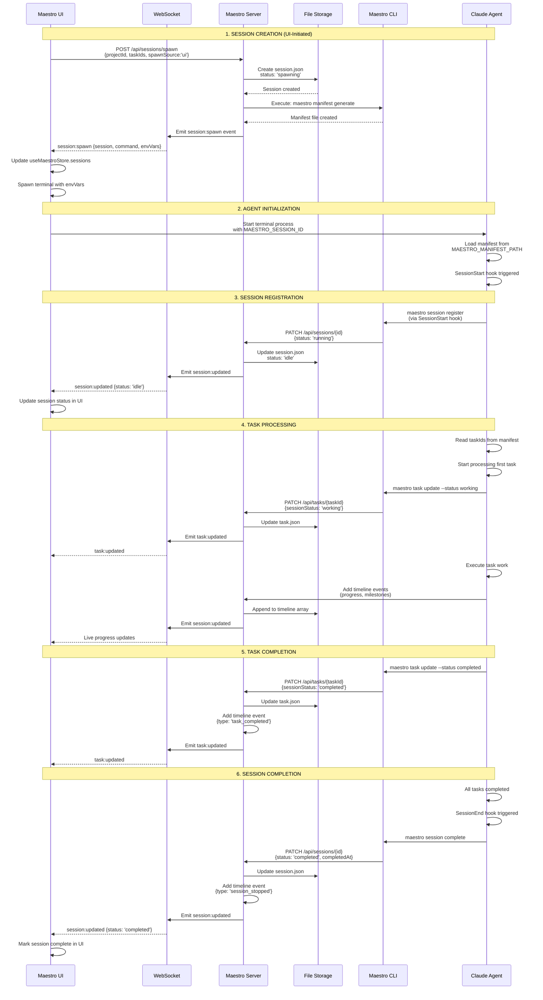
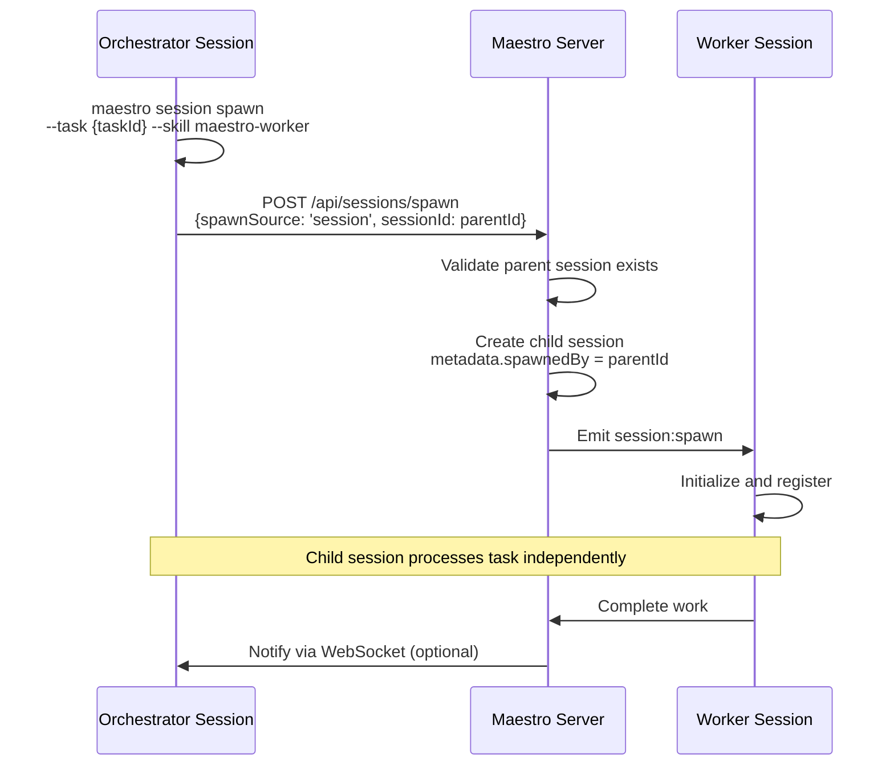
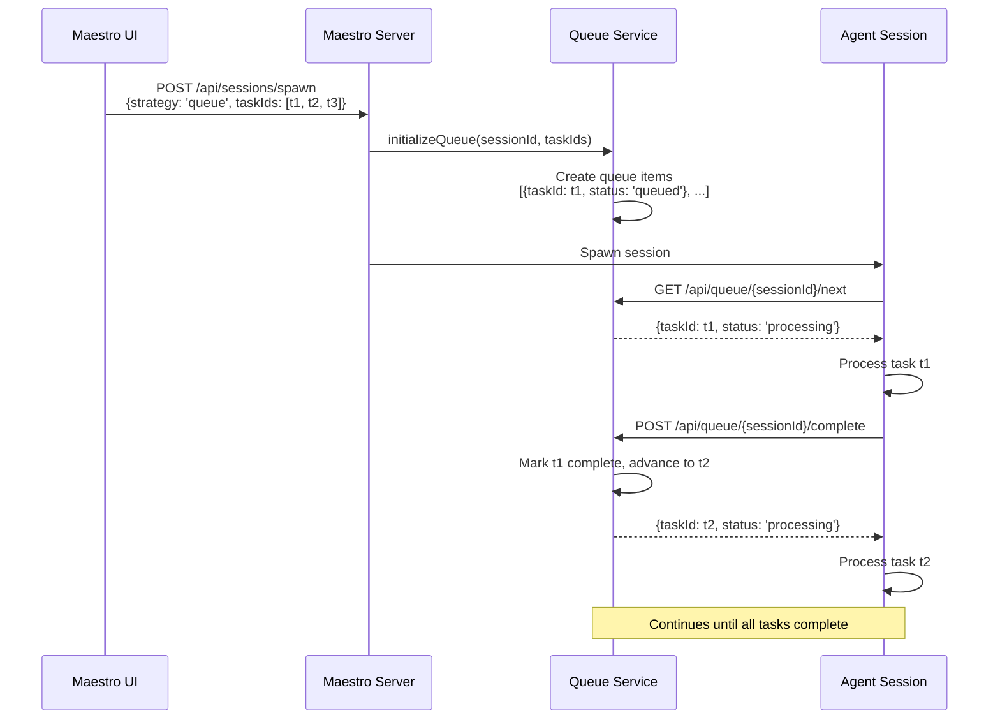
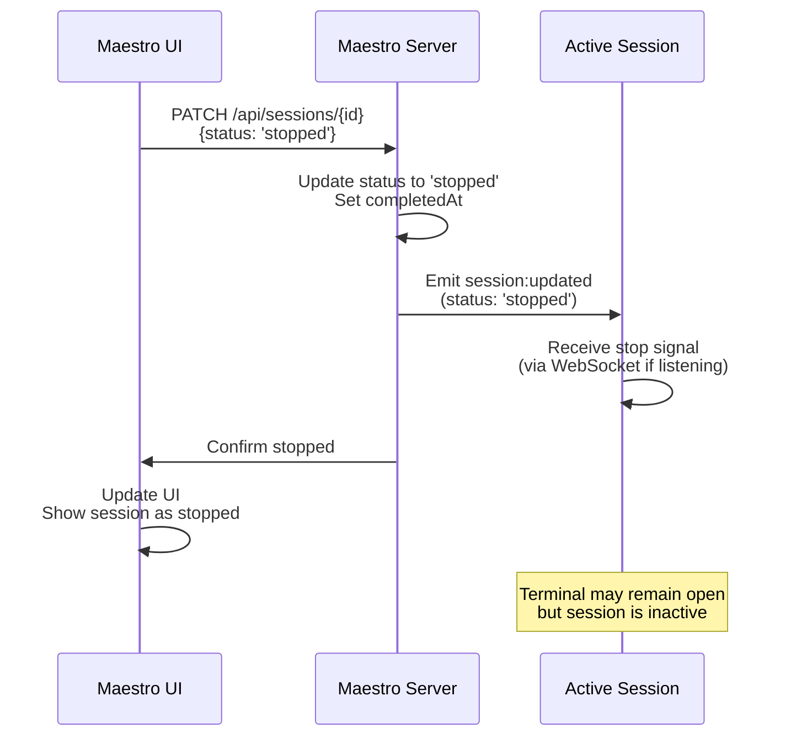

# Session Lifecycle

## Overview

This document provides a comprehensive walkthrough of a session's complete lifecycle from creation to completion, including all component interactions, API calls, WebSocket events, and state changes.

## Complete Session Lifecycle Diagram



## Lifecycle Phases Explained

### Phase 1: Session Creation (UI-Initiated)

**Duration:** ~500ms - 2s

**Trigger:** User clicks "Spawn Session" button in UI or calls spawn API

**Steps:**

1. **UI sends spawn request**
   ```typescript
   // maestro-ui/src/services/maestroService.ts:33
   const response = await maestroClient.spawnSession({
     projectId: project.id,
     taskIds: [taskId],
     role: 'worker',
     strategy: 'simple',
     spawnSource: 'ui',
     sessionName: 'Worker Session',
     skills: ['maestro-worker']
   });
   ```

2. **Server validates request**
   ```typescript
   // maestro-server/src/api/sessionRoutes.ts:293-346
   // - Validates projectId exists
   // - Validates all taskIds exist
   // - Validates role and strategy
   // - Checks spawnSource (if 'session', validates parent exists)
   ```

3. **Server creates session with 'spawning' status**
   ```typescript
   // maestro-server/src/api/sessionRoutes.ts:391-407
   const session = await sessionService.createSession({
     projectId,
     taskIds,
     name: sessionName || `worker-${Date.now()}`,
     strategy: 'simple',
     status: 'spawning',  // Initial status
     metadata: {
       skills: ['maestro-worker'],
       spawnedBy: null,
       spawnSource: 'ui',
       role: 'worker',
       strategy: 'simple',
       context: {}
     },
     _suppressCreatedEvent: true  // Will emit spawn event instead
   });
   ```

4. **Server initializes queue (if strategy === 'queue')**
   ```typescript
   // maestro-server/src/api/sessionRoutes.ts:412-420
   if (strategy === 'queue') {
     await queueService.initializeQueue(session.id, taskIds);
   }
   ```

5. **Server generates manifest via CLI**
   ```typescript
   // maestro-server/src/api/sessionRoutes.ts:427-456
   const result = await generateManifestViaCLI({
     role: 'worker',
     projectId,
     taskIds,
     skills: ['maestro-worker'],
     sessionId: session.id,
     strategy: 'simple',
   });

   // Spawns: maestro manifest generate --role worker --project-id ... --task-ids ...
   // Reads generated manifest from: ~/.maestro/data/sessions/{sessionId}/manifest.md
   ```

6. **Server prepares environment variables**
   ```typescript
   // maestro-server/src/api/sessionRoutes.ts:461-466
   const finalEnvVars = {
     MAESTRO_SESSION_ID: session.id,
     MAESTRO_MANIFEST_PATH: manifestPath,
     MAESTRO_SERVER_URL: 'http://localhost:3000',
     MAESTRO_STRATEGY: 'simple'
   };
   ```

7. **Server emits spawn event**
   ```typescript
   // maestro-server/src/api/sessionRoutes.ts:472-486
   const spawnEvent = {
     session: { ...session, env: finalEnvVars },
     command: 'claude',  // or custom command
     cwd: projectPath,
     envVars: finalEnvVars,
     manifest: manifestContent,
     projectId,
     taskIds,
     spawnSource: 'ui',
     parentSessionId: null,
     _isSpawnCreated: true
   };

   await eventBus.emit('session:spawn', spawnEvent);
   ```

8. **WebSocket broadcasts to all clients**
   ```typescript
   // maestro-server/src/infrastructure/websocket/WebSocketBridge.ts:96-117
   // Sends to ALL connected WebSocket clients
   {
     type: 'session:spawn',
     event: 'session:spawn',
     data: spawnEvent,
     timestamp: Date.now()
   }
   ```

9. **UI receives spawn event**
   ```typescript
   // maestro-ui/src/stores/useMaestroStore.ts:109-121
   case 'session:spawn': {
     const session = message.data.session;

     // 1. Update Maestro store
     set((prev) => ({
       sessions: new Map(prev.sessions).set(session.id, session)
     }));

     // 2. Spawn terminal session
     void useSessionStore.getState().handleSpawnTerminalSession({
       maestroSessionId: session.id,
       name: session.name,
       command: message.data.command,
       cwd: message.data.cwd,
       envVars: message.data.envVars,
       projectId: message.data.projectId,
     });
   }
   ```

10. **UI spawns terminal session**
    ```typescript
    // Terminal process started with environment variables:
    // - MAESTRO_SESSION_ID=ses_abc123
    // - MAESTRO_MANIFEST_PATH=~/.maestro/data/sessions/ses_abc123/manifest.md
    // - MAESTRO_SERVER_URL=http://localhost:3000
    // - MAESTRO_STRATEGY=simple
    ```

**Result:**
- Session created with status `'spawning'`
- Manifest file generated
- Terminal process starting in UI
- All clients notified via WebSocket

---

### Phase 2: Agent Initialization

**Duration:** ~1-3s

**Trigger:** Terminal process starts with environment variables

**Steps:**

1. **Agent process starts**
   ```bash
   # In terminal with environment variables set
   claude --dangerously-skip-permissions
   ```

2. **Agent reads environment variables**
   ```typescript
   // Claude Code reads:
   const sessionId = process.env.MAESTRO_SESSION_ID;
   const manifestPath = process.env.MAESTRO_MANIFEST_PATH;
   const serverUrl = process.env.MAESTRO_SERVER_URL;
   const strategy = process.env.MAESTRO_STRATEGY;
   ```

3. **Agent loads manifest file**
   ```typescript
   // Reads from MAESTRO_MANIFEST_PATH
   // Contains:
   // - Session context
   // - Task details
   // - Project information
   // - Skills to use
   // - Instructions
   ```

4. **SessionStart hook triggered**
   ```typescript
   // maestro-cli/src/hooks/SessionStart.ts
   // Automatically runs when Claude Code session starts
   // Calls: maestro session register
   ```

**Result:**
- Agent process running
- Manifest loaded
- Ready to register with server

---

### Phase 3: Session Registration

**Duration:** ~200-500ms

**Trigger:** SessionStart hook executes automatically

**Steps:**

1. **CLI executes register command**
   ```bash
   # Automatically called by SessionStart hook
   maestro session register
   ```

2. **CLI reads configuration**
   ```typescript
   // maestro-cli/src/commands/session.ts:239-298
   const sessionId = process.env.MAESTRO_SESSION_ID;
   const projectId = process.env.MAESTRO_PROJECT_ID;
   const taskIds = JSON.parse(process.env.MAESTRO_TASK_IDS || '[]');
   ```

3. **CLI sends registration request**
   ```typescript
   // maestro-cli/src/commands/session.ts:269
   await api.patch(`/api/sessions/${sessionId}`, {
     status: 'running',  // Maps to 'idle' in server
     projectId,
     taskIds,
     strategy: process.env.MAESTRO_STRATEGY,
   });
   ```

4. **Server updates session**
   ```typescript
   // maestro-server/src/api/sessionRoutes.ts:177
   const updated = await sessionService.updateSession(sessionId, {
     status: 'idle',  // Registered and ready
     // ... other fields
   });
   ```

5. **Server emits update event**
   ```typescript
   // maestro-server/src/application/services/SessionService.ts:115
   await this.eventBus.emit('session:updated', updated);
   ```

6. **WebSocket broadcasts update**
   ```typescript
   // All connected clients receive:
   {
     type: 'session:updated',
     data: { id: 'ses_abc123', status: 'idle', ... }
   }
   ```

7. **UI updates session status**
   ```typescript
   // maestro-ui/src/stores/useMaestroStore.ts:103
   case 'session:updated':
     set((prev) => ({
       sessions: new Map(prev.sessions).set(message.data.id, message.data)
     }));
   ```

**Result:**
- Session status: `'spawning'` → `'idle'`
- Agent registered and ready
- UI shows session as ready

---

### Phase 4: Task Processing

**Duration:** Variable (seconds to hours)

**Trigger:** Agent begins executing task logic

**Steps:**

1. **Agent reads task from manifest**
   ```typescript
   // Agent processes task information from manifest
   const tasks = manifest.tasks;  // Array of task IDs with details
   ```

2. **Agent updates task status to 'working'**
   ```bash
   maestro task update {taskId} --status working
   ```

3. **Server updates task**
   ```typescript
   // maestro-server/src/api/taskRoutes.ts
   await taskService.updateTask(taskId, {
     sessionStatus: 'working',
     updatedAt: Date.now()
   });
   ```

4. **Agent performs task work**
   - Reads files
   - Executes commands
   - Makes API calls
   - Processes data

5. **Agent sends progress updates**
   ```typescript
   // Adds timeline events via API
   POST /api/sessions/{sessionId}/timeline
   {
     type: 'progress',
     message: 'Completed step 1 of 5',
     taskId: 'tsk_123',
     metadata: { progress: 0.2 }
   }
   ```

6. **Server appends to timeline**
   ```typescript
   // maestro-server/src/infrastructure/repositories/FileSystemSessionRepository.ts
   await sessionRepository.addTimelineEvent(sessionId, {
     id: 'evt_xyz',
     type: 'progress',
     timestamp: Date.now(),
     message: 'Completed step 1 of 5',
     taskId: 'tsk_123',
     metadata: { progress: 0.2 }
   });
   ```

7. **Server emits session:updated**
   ```typescript
   // UI receives real-time progress updates
   // Timeline grows with each event
   ```

**Result:**
- Task actively being processed
- Timeline events track progress
- UI shows live updates

---

### Phase 5: Task Completion

**Duration:** ~200-500ms per task

**Trigger:** Agent finishes task work

**Steps:**

1. **Agent updates task status**
   ```bash
   maestro task update {taskId} --status completed
   ```

2. **Server updates task**
   ```typescript
   // maestro-server/src/api/taskRoutes.ts
   await taskService.updateTask(taskId, {
     sessionStatus: 'completed',
     completedAt: Date.now(),
     updatedAt: Date.now()
   });
   ```

3. **Server adds timeline event**
   ```typescript
   await sessionRepository.addTimelineEvent(sessionId, {
     type: 'task_completed',
     message: `Completed task ${taskId}`,
     taskId,
     timestamp: Date.now()
   });
   ```

4. **Server emits events**
   ```typescript
   // Two events emitted:
   await eventBus.emit('task:updated', updatedTask);
   await eventBus.emit('session:updated', session);
   ```

5. **UI updates both task and session**
   ```typescript
   // Task marked as completed
   // Session timeline updated
   // Progress indicators refresh
   ```

6. **Agent checks for more tasks**
   ```typescript
   // If more tasks in manifest:
   //   Continue to next task (repeat Phase 4)
   // If no more tasks:
   //   Proceed to Phase 6 (completion)
   ```

**Result:**
- Task marked completed
- Timeline event recorded
- Agent moves to next task or completes

---

### Phase 6: Session Completion

**Duration:** ~200-500ms

**Trigger:** Agent finishes all tasks or SessionEnd hook

**Steps:**

1. **SessionEnd hook triggered**
   ```typescript
   // maestro-cli/src/hooks/SessionEnd.ts
   // Automatically runs when Claude Code session ends
   // Calls: maestro session complete
   ```

2. **CLI executes complete command**
   ```bash
   maestro session complete
   ```

3. **CLI sends completion request**
   ```typescript
   // maestro-cli/src/commands/session.ts:315
   await api.patch(`/api/sessions/${sessionId}`, {
     status: 'completed',
     completedAt: Date.now()
   });
   ```

4. **Server updates session**
   ```typescript
   // maestro-server/src/api/sessionRoutes.ts:177
   const updated = await sessionService.updateSession(sessionId, {
     status: 'completed',
     completedAt: Date.now()
   });
   ```

5. **Server adds final timeline event**
   ```typescript
   await sessionRepository.addTimelineEvent(sessionId, {
     type: 'session_stopped',
     message: 'Session completed',
     timestamp: Date.now()
   });
   ```

6. **Server emits update event**
   ```typescript
   await eventBus.emit('session:updated', updated);
   ```

7. **WebSocket broadcasts to all clients**
   ```typescript
   // All UIs receive completion notification
   {
     type: 'session:updated',
     data: { id: 'ses_abc123', status: 'completed', completedAt: 1707260400000 }
   }
   ```

8. **UI marks session complete**
   ```typescript
   // maestro-ui/src/stores/useMaestroStore.ts
   // Session displayed as completed
   // Terminal may remain open for review
   ```

**Result:**
- Session status: `'working'` → `'completed'`
- Completion timestamp recorded
- Terminal session preserved for review
- All work finalized

---

## Lifecycle Variations

### Variation 1: Session-Spawned Session (Orchestrator → Worker)



**Key Differences:**
- `spawnSource: 'session'` instead of `'ui'`
- `sessionId` field contains parent session ID
- Server validates parent session exists
- Metadata includes `spawnedBy` field
- Both sessions track each other

---

### Variation 2: Queue Strategy Session



**Key Differences:**
- Queue initialized on spawn
- Tasks processed sequentially by queue order
- Agent polls for next task via queue API
- Queue manages task transitions
- Session doesn't complete until queue empty

---

### Variation 3: Manual Stop



**Key Differences:**
- User-initiated instead of agent-initiated
- Session may stop mid-task
- `completedAt` set but work incomplete
- Timeline event: "Session stopped by user"
- Tasks may remain in `'working'` state

---

## Error Scenarios

### Error 1: Registration Timeout

If agent doesn't register within timeout period:

```
spawning → (timeout) → failed
Timeline: { type: 'error', message: 'Registration timeout' }
```

### Error 2: Task Processing Error

If task processing encounters error:

```
working → failed
Timeline: { type: 'task_failed', message: 'Error: ...', taskId }
```

### Error 3: Spawn Validation Failure

If spawn request validation fails:

```
No session created
HTTP 400 response to UI
Error displayed in UI
```

---

## Timeline Throughout Lifecycle

**Example timeline array progression:**

```typescript
// After spawn
timeline: [
  { type: 'session_started', timestamp: 1707260400000, message: 'Session created' }
]

// After registration
timeline: [
  { type: 'session_started', ... },
  { type: 'milestone', timestamp: 1707260402000, message: 'Session registered' }
]

// During task processing
timeline: [
  { type: 'session_started', ... },
  { type: 'milestone', ... },
  { type: 'task_started', timestamp: 1707260405000, taskId: 'tsk_1', message: 'Started task tsk_1' },
  { type: 'progress', timestamp: 1707260410000, taskId: 'tsk_1', message: 'Step 1 complete' },
  { type: 'progress', timestamp: 1707260415000, taskId: 'tsk_1', message: 'Step 2 complete' },
  { type: 'task_completed', timestamp: 1707260420000, taskId: 'tsk_1', message: 'Completed task tsk_1' }
]

// After completion
timeline: [
  // ... all previous events ...
  { type: 'session_stopped', timestamp: 1707260430000, message: 'Session completed' }
]
```

---

## Storage Changes Throughout Lifecycle

**Session file evolution:**

```json
// After spawn (spawning)
{
  "id": "ses_abc123",
  "projectId": "prj_xyz",
  "taskIds": ["tsk_1"],
  "status": "spawning",
  "strategy": "simple",
  "createdAt": 1707260400000,
  "timeline": [{ "type": "session_started", ... }]
}

// After registration (idle)
{
  "id": "ses_abc123",
  "status": "idle",  // CHANGED
  "env": { ... },    // ADDED
  "timeline": [ ... ] // APPENDED
}

// During work (working)
{
  "status": "working",  // CHANGED
  "timeline": [ ... ]   // MULTIPLE NEW EVENTS
}

// After completion (completed)
{
  "status": "completed",      // CHANGED
  "completedAt": 1707260430000,  // ADDED
  "timeline": [ ... ]         // FINAL EVENT ADDED
}
```

---

## Code Locations Reference

| Phase | Component | File | Lines |
|-------|-----------|------|-------|
| Creation | UI | `maestro-ui/src/services/maestroService.ts` | 33-48 |
| Creation | Server | `maestro-server/src/api/sessionRoutes.ts` | 273-486 |
| Creation | Storage | `maestro-server/src/infrastructure/repositories/FileSystemSessionRepository.ts` | 95-154 |
| Registration | CLI | `maestro-cli/src/commands/session.ts` | 239-298 |
| Registration | Hook | `maestro-cli/src/hooks/SessionStart.ts` | - |
| Processing | Queue | `maestro-server/src/application/services/QueueService.ts` | 51-172 |
| Completion | CLI | `maestro-cli/src/commands/session.ts` | 315-330 |
| Completion | Hook | `maestro-cli/src/hooks/SessionEnd.ts` | - |
| WebSocket | Server | `maestro-server/src/infrastructure/websocket/WebSocketBridge.ts` | 66-117 |
| UI Updates | UI | `maestro-ui/src/stores/useMaestroStore.ts` | 98-131 |

---

## Related Documentation

- [SESSION-STATUS-FLOW.md](./SESSION-STATUS-FLOW.md) - Detailed status transitions
- [SESSION-TIMELINE.md](./SESSION-TIMELINE.md) - Timeline event types
- [COMPONENT-FLOWS.md](./COMPONENT-FLOWS.md) - Component interaction details
- [WEBSOCKET-EVENTS.md](./WEBSOCKET-EVENTS.md) - WebSocket event specifications
