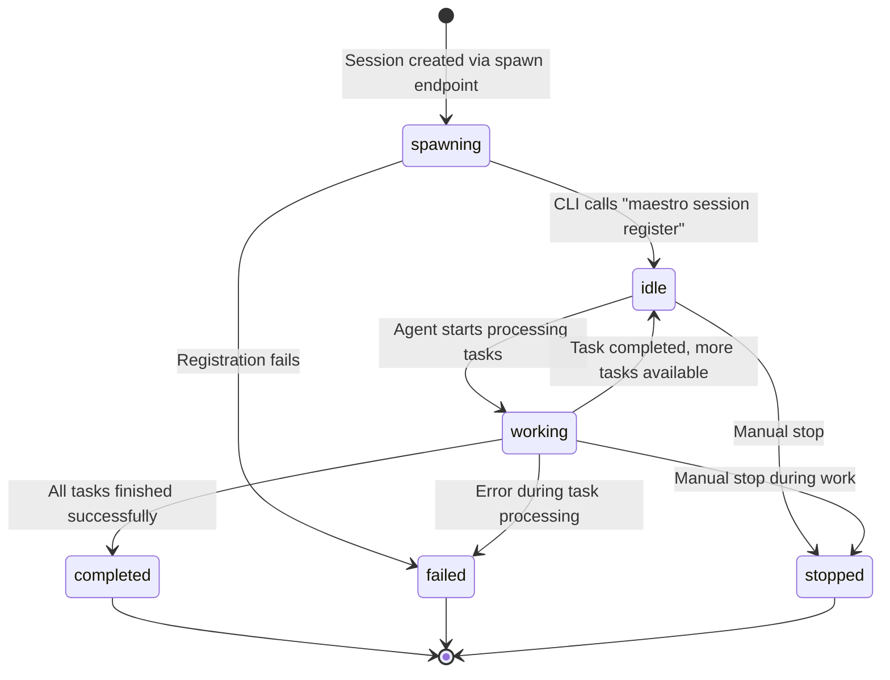

# Session Status Flow

## Overview

Session status represents the current state of an agent session in the Maestro system. This document explains all status types, their transitions, and what triggers each change.

## Session Status Types

```typescript
// Location: maestro-server/src/types.ts:83
export type SessionStatus =
  | 'spawning'    // Session is being created and initialized
  | 'idle'        // Session is registered and ready to work
  | 'working'     // Session is actively processing tasks
  | 'completed'   // Session finished all work successfully
  | 'failed'      // Session encountered an error and stopped
  | 'stopped';    // Session was manually stopped
```

## Status Transition Diagram



## Detailed Status Descriptions

### 1. `spawning` (Initial State)

**When Set:**
- Session is created via `POST /api/sessions/spawn` endpoint
- Server has created the session record but agent hasn't started yet

**Characteristics:**
- Manifest file is being generated
- Environment variables are prepared
- Terminal session is being spawned in UI
- WebSocket `session:spawn` event sent to clients

**Code Reference:**
```typescript
// maestro-server/src/api/sessionRoutes.ts:396
const session = await sessionService.createSession({
  projectId,
  taskIds,
  strategy,
  status: 'spawning',  // Initial status
  // ...
});
```

**Transition Out:**
- → `idle`: Agent successfully registers (normal flow)
- → `failed`: Registration fails or timeout

---

### 2. `idle` (Ready State)

**When Set:**
- CLI agent calls `maestro session register` command
- Agent has initialized and is ready to work

**Characteristics:**
- Agent process is running
- Terminal session is active
- Manifest has been loaded
- Session is waiting for task assignment or user input

**Code Reference:**
```typescript
// maestro-cli/src/commands/session.ts:269
await api.patch(`/api/sessions/${sessionId}`, {
  status: 'running',  // Note: 'running' is mapped to 'idle' in some contexts
  // ...
});
```

**Transition Out:**
- → `working`: Agent starts processing a task
- → `stopped`: Manual stop command or UI action

---

### 3. `working` (Active State)

**When Set:**
- Agent begins processing a task
- Queue service advances to next task (queue strategy)

**Characteristics:**
- Agent is actively executing task commands
- Timeline events are being added
- Task `sessionStatus` is set to `'working'`
- Progress updates are emitted

**Code Reference:**
```typescript
// maestro-server/src/application/services/QueueService.ts:119
await this.taskRepository.update(item.taskId, {
  sessionStatus: 'working',
});
```

**Transition Out:**
- → `idle`: Task completed, more tasks in queue
- → `completed`: All tasks finished successfully
- → `failed`: Task fails or error occurs
- → `stopped`: Manual stop during execution

---

### 4. `completed` (Success Terminal State)

**When Set:**
- Agent calls `maestro session complete` command
- All assigned tasks have been processed successfully

**Characteristics:**
- No more tasks to process
- `completedAt` timestamp is set
- Terminal session remains active but idle
- Final timeline event: `session_stopped` with "Session completed" message

**Code Reference:**
```typescript
// maestro-cli/src/commands/session.ts:315
session.command('complete')
  .action(async () => {
    await api.patch(`/api/sessions/${sessionId}`, {
      status: 'completed',
      completedAt: Date.now(),
    });
  });
```

**Transition Out:**
- ✗ Terminal state (no further transitions)

---

### 5. `failed` (Error Terminal State)

**When Set:**
- Task processing encounters an error
- Agent crashes or exits unexpectedly
- Validation failures during execution

**Characteristics:**
- `completedAt` timestamp is set
- Error details stored in metadata or timeline
- Timeline event: `error` type with failure message
- Terminal session may still be active for debugging

**Code Reference:**
```typescript
// Error handling in various services
await sessionService.updateSession(sessionId, {
  status: 'failed',
  completedAt: Date.now(),
  metadata: {
    ...session.metadata,
    error: errorMessage,
  },
});
```

**Transition Out:**
- ✗ Terminal state (no further transitions)

---

### 6. `stopped` (Manual Terminal State)

**When Set:**
- User manually stops session from UI
- `maestro session stop` CLI command
- Parent session stops and cascades to children

**Characteristics:**
- `completedAt` timestamp is set
- Timeline event: `session_stopped` type
- Terminal session may be killed or detached
- Partial task completion is preserved

**Code Reference:**
```typescript
// UI stop action
await maestroClient.updateSession(sessionId, {
  status: 'stopped',
  completedAt: Date.now(),
});
```

**Transition Out:**
- ✗ Terminal state (no further transitions)

---

## Session vs Task-Session Status

**Important:** Session status is different from task-session status!

### Session Status (Per Session)

Represents the overall state of the agent session itself.

```typescript
type SessionStatus = 'spawning' | 'idle' | 'working' | 'completed' | 'failed' | 'stopped';
```

### Task-Session Status (Per Task-Session Relationship)

Represents the status of a specific task **within** a session context.

```typescript
// Location: maestro-server/src/types.ts
type TaskSessionStatus =
  | 'queued'       // Task is waiting to be processed
  | 'working'      // Task is currently being worked on
  | 'needs_input'  // Task needs user input
  | 'blocked'      // Task is blocked by dependencies
  | 'completed'    // Task finished successfully
  | 'failed'       // Task failed
  | 'skipped';     // Task was skipped
```

**Example Scenario:**
```javascript
// A session can be 'working' (session status)
// while Task A is 'completed' (task-session status)
// and Task B is 'working' (task-session status)
// and Task C is 'queued' (task-session status)
```

---

## Status Transition Triggers

### API Triggers

| Endpoint | Action | Status Change |
|----------|--------|---------------|
| `POST /api/sessions/spawn` | Create session | → `spawning` |
| `PATCH /api/sessions/{id}` (register) | Agent registers | `spawning` → `idle` |
| `PATCH /api/sessions/{id}` (update) | Agent updates status | Any → Any (explicit) |
| `POST /api/sessions/{id}/tasks/{taskId}` | Add task | May trigger → `working` |
| `PATCH /api/sessions/{id}` (complete) | Agent completes | → `completed` |

### CLI Triggers

| Command | Status Change |
|---------|---------------|
| `maestro session register` | `spawning` → `idle` |
| `maestro session complete` | → `completed` |
| `maestro session stop` | → `stopped` |
| Task processing starts | `idle` → `working` |
| Task processing ends | `working` → `idle` (if more tasks) |

### UI Triggers

| User Action | Status Change |
|-------------|---------------|
| Click "Spawn Session" | Create → `spawning` |
| Click "Stop Session" | → `stopped` |
| Terminal session closes | → `stopped` (implicit) |

---

## Timeline Event Correlation

Session status changes typically generate timeline events:

| Status Change | Timeline Event Type | Message |
|---------------|---------------------|---------|
| Create → `spawning` | `session_started` | "Session created" |
| `spawning` → `idle` | (no specific event) | - |
| `idle` → `working` | `task_started` | "Started task {taskId}" |
| Task completes | `task_completed` | "Completed task {taskId}" |
| Task fails | `task_failed` | "Failed task {taskId}: {error}" |
| → `completed` | `session_stopped` | "Session completed" |
| → `failed` | `error` | "Session failed: {error}" |
| → `stopped` | `session_stopped` | "Session stopped by user" |

---

## Queue Strategy Impact

When using **queue strategy**, status transitions are managed by the Queue Service:

```typescript
// maestro-server/src/application/services/QueueService.ts

// Starting a task
queueService.startNext() {
  // Sets session status to 'working'
  // Sets task sessionStatus to 'working'
  // Updates queue currentIndex
}

// Completing a task
queueService.completeTask() {
  // Sets task sessionStatus to 'completed'
  // If more tasks: stays 'working', advances to next
  // If no more tasks: session → 'completed'
}
```

---

## Status Persistence

Session status is persisted in:

1. **File System**: `~/.maestro/data/sessions/{sessionId}.json`
   ```json
   {
     "id": "ses_abc123",
     "status": "working",
     "taskIds": ["tsk_1", "tsk_2"],
     "timeline": [
       {
         "type": "session_started",
         "timestamp": 1707260400000
       }
     ]
   }
   ```

2. **In-Memory Cache**: `FileSystemSessionRepository` Map
   - Lazy-loaded on first access
   - Updated on every status change
   - Synchronized to disk immediately

3. **UI State**: Zustand store `useMaestroStore.sessions`
   - Updated via WebSocket events
   - Real-time synchronization across all clients

---

## Best Practices

### For Agent Developers

1. **Always register on startup**
   ```bash
   maestro session register
   ```

2. **Update status appropriately**
   - Set `working` when starting a task
   - Set `idle` when waiting between tasks
   - Set `completed` when all work is done

3. **Handle errors gracefully**
   ```bash
   # On error
   maestro session update --status failed --metadata '{"error": "..."}'
   ```

### For UI Developers

1. **Check status before actions**
   ```typescript
   if (session.status === 'working') {
     // Show stop button
   } else if (session.status === 'idle') {
     // Show assign task button
   }
   ```

2. **Listen to WebSocket updates**
   ```typescript
   useMaestroWebSocket((event) => {
     if (event.type === 'session:updated') {
       // Update UI accordingly
     }
   });
   ```

3. **Display status visually**
   - `spawning`: Loading spinner
   - `idle`: Ready indicator (green)
   - `working`: Active indicator (blue, animated)
   - `completed`: Success checkmark (green)
   - `failed`: Error indicator (red)
   - `stopped`: Stopped indicator (gray)

---

## Code Locations

### Type Definitions
- **Session Status**: `maestro-server/src/types.ts:83`
- **Task-Session Status**: `maestro-server/src/types.ts` (TaskSessionStatus type)

### Status Updates
- **Session Service**: `maestro-server/src/application/services/SessionService.ts`
- **Session Routes**: `maestro-server/src/api/sessionRoutes.ts`
- **CLI Commands**: `maestro-cli/src/commands/session.ts`

### Storage
- **Repository**: `maestro-server/src/infrastructure/repositories/FileSystemSessionRepository.ts`

### UI
- **Maestro Store**: `maestro-ui/src/stores/useMaestroStore.ts`
- **Session Components**: `maestro-ui/src/components/SessionsSection.tsx`

---

## Related Documentation

- [SESSION-LIFECYCLE.md](./SESSION-LIFECYCLE.md) - Complete session lifecycle
- [SESSION-TIMELINE.md](./SESSION-TIMELINE.md) - Timeline events
- [WEBSOCKET-EVENTS.md](./WEBSOCKET-EVENTS.md) - WebSocket event details
