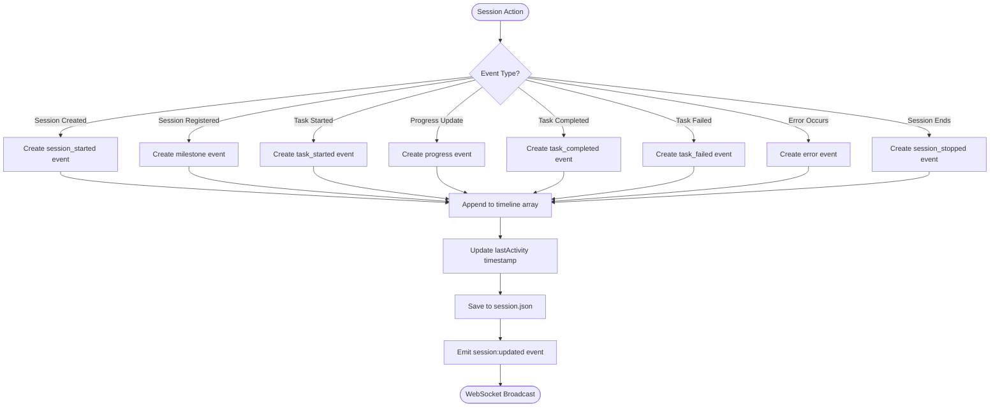

# Session Timeline

## Overview

The session timeline is a chronological record of all significant events that occur during a session's lifecycle. Each session maintains its own timeline array that grows as events occur, providing a complete audit trail and progress tracking.

## Timeline Event Types

```typescript
// Location: maestro-server/src/types.ts:86-98
export type SessionTimelineEventType =
  | 'session_started'    // Session was spawned and created
  | 'session_stopped'    // Session stopped (completed, failed, or manually stopped)
  | 'task_started'       // Agent began working on a task
  | 'task_completed'     // Agent finished a task successfully
  | 'task_failed'        // Task processing failed
  | 'task_skipped'       // Task was skipped
  | 'task_blocked'       // Task is blocked by dependencies
  | 'needs_input'        // Session waiting for user input
  | 'progress'           // General progress update
  | 'error'              // Error occurred
  | 'milestone';         // Significant milestone reached
```

## Timeline Event Structure

```typescript
// Location: maestro-server/src/types.ts:99-106
export interface SessionTimelineEvent {
  id: string;                       // Unique event ID (evt_xxxxx)
  type: SessionTimelineEventType;   // Event type from enum
  timestamp: number;                // Unix timestamp in milliseconds
  message?: string;                 // Human-readable description
  taskId?: string;                  // Associated task ID (if task-related)
  metadata?: Record<string, any>;   // Extensible data (progress %, errors, etc.)
}
```

**Key Characteristics:**

- **Immutable**: Events are never modified after creation, only appended
- **Chronological**: Sorted by timestamp (ascending)
- **Per-Session**: Each session has its own independent timeline
- **Persistent**: Stored in session JSON file
- **Real-time**: Updates broadcast via WebSocket

---

## Timeline Event Lifecycle

### When Events Are Created



---

## Event Type Details

### 1. `session_started`

**When Created:** Session is first created

**Created By:** `FileSystemSessionRepository.create()`

**Location:** `maestro-server/src/infrastructure/repositories/FileSystemSessionRepository.ts:121-128`

**Example:**
```typescript
{
  id: 'evt_abc123',
  type: 'session_started',
  timestamp: 1707260400000,
  message: 'Session created'
}
```

**Usage:**
- Marks beginning of session timeline
- Always the first event in timeline array
- Used to calculate session duration

---

### 2. `session_stopped`

**When Created:** Session completes, fails, or is manually stopped

**Created By:** Session update logic when status changes to terminal state

**Location:** `maestro-server/src/application/services/SessionService.ts` (on status update)

**Examples:**

```typescript
// Successful completion
{
  id: 'evt_xyz789',
  type: 'session_stopped',
  timestamp: 1707263000000,
  message: 'Session completed successfully'
}

// Manual stop
{
  id: 'evt_def456',
  type: 'session_stopped',
  timestamp: 1707262000000,
  message: 'Session stopped by user'
}

// Failure
{
  id: 'evt_ghi789',
  type: 'session_stopped',
  timestamp: 1707262500000,
  message: 'Session failed: Connection error',
  metadata: { error: 'ECONNREFUSED' }
}
```

**Usage:**
- Marks end of session timeline
- Always the last event for completed sessions
- Used to calculate total session duration

---

### 3. `task_started`

**When Created:** Agent begins processing a task

**Created By:** Agent or queue service when task status changes to 'working'

**Location:** `maestro-server/src/application/services/QueueService.ts:119` (queue strategy)

**Example:**
```typescript
{
  id: 'evt_task_start_1',
  type: 'task_started',
  timestamp: 1707260500000,
  message: 'Started working on task: Implement authentication',
  taskId: 'tsk_123',
  metadata: {
    taskTitle: 'Implement authentication',
    queueIndex: 0  // If queue strategy
  }
}
```

**Usage:**
- Tracks when work begins on each task
- Links timeline event to specific task
- Paired with `task_completed` or `task_failed`

---

### 4. `task_completed`

**When Created:** Task processing finishes successfully

**Created By:** Agent or queue service when task status changes to 'completed'

**Location:** `maestro-server/src/application/services/QueueService.ts:153` (queue strategy)

**Example:**
```typescript
{
  id: 'evt_task_done_1',
  type: 'task_completed',
  timestamp: 1707261500000,
  message: 'Completed task: Implement authentication',
  taskId: 'tsk_123',
  metadata: {
    duration: 1000000,  // 1000 seconds
    linesOfCode: 450,
    filesChanged: 8
  }
}
```

**Usage:**
- Marks successful task completion
- Can include custom metadata about work done
- Used to calculate per-task duration

---

### 5. `task_failed`

**When Created:** Task processing encounters error

**Created By:** Agent or queue service when task status changes to 'failed'

**Location:** Error handling in queue service or manual updates

**Example:**
```typescript
{
  id: 'evt_task_fail_1',
  type: 'task_failed',
  timestamp: 1707261000000,
  message: 'Failed to complete task: Test failing with dependency error',
  taskId: 'tsk_456',
  metadata: {
    error: 'Module not found: express',
    errorCode: 'MODULE_NOT_FOUND',
    stackTrace: '...'
  }
}
```

**Usage:**
- Records task failures
- Stores error details in metadata
- Helps debug session issues

---

### 6. `task_skipped`

**When Created:** Task is intentionally skipped

**Created By:** Queue service or agent logic

**Example:**
```typescript
{
  id: 'evt_task_skip_1',
  type: 'task_skipped',
  timestamp: 1707260800000,
  message: 'Skipped task: Already completed in previous session',
  taskId: 'tsk_789',
  metadata: {
    reason: 'already_completed',
    previousSession: 'ses_previous_123'
  }
}
```

**Usage:**
- Documents why tasks were skipped
- Helps understand session flow
- Prevents duplicate work tracking

---

### 7. `task_blocked`

**When Created:** Task cannot proceed due to dependencies

**Created By:** Agent when detecting blocking condition

**Example:**
```typescript
{
  id: 'evt_task_block_1',
  type: 'task_blocked',
  timestamp: 1707260700000,
  message: 'Task blocked: Waiting for database setup',
  taskId: 'tsk_101',
  metadata: {
    blockingTask: 'tsk_100',
    reason: 'database_not_ready'
  }
}
```

**Usage:**
- Indicates task dependencies
- Shows why session is waiting
- Can trigger notifications

---

### 8. `needs_input`

**When Created:** Session requires user input to continue

**Created By:** Agent when encountering user input requirement

**Example:**
```typescript
{
  id: 'evt_input_1',
  type: 'needs_input',
  timestamp: 1707260900000,
  message: 'Waiting for user to approve database migration',
  taskId: 'tsk_202',
  metadata: {
    inputType: 'confirmation',
    question: 'Apply migration to production database?',
    options: ['yes', 'no', 'cancel']
  }
}
```

**Usage:**
- Alerts user of required input
- Can pause session execution
- Tracks user interaction points

---

### 9. `progress`

**When Created:** Agent reports incremental progress

**Created By:** Agent during task execution

**Location:** Agent can POST to `/api/sessions/{id}/timeline`

**Example:**
```typescript
{
  id: 'evt_progress_1',
  type: 'progress',
  timestamp: 1707261100000,
  message: 'Completed step 3 of 5: Database schema updated',
  taskId: 'tsk_303',
  metadata: {
    progress: 0.6,  // 60% complete
    step: 3,
    totalSteps: 5,
    currentAction: 'updating_schema'
  }
}
```

**Usage:**
- Provides real-time progress tracking
- Can update progress bars in UI
- Helps estimate time remaining

---

### 10. `error`

**When Created:** Non-fatal error occurs

**Created By:** Agent or server when encountering errors

**Example:**
```typescript
{
  id: 'evt_error_1',
  type: 'error',
  timestamp: 1707261200000,
  message: 'Warning: API rate limit approaching',
  metadata: {
    errorLevel: 'warning',
    remaining: 10,
    resetAt: 1707262000000
  }
}
```

**Usage:**
- Records non-blocking errors
- Helps diagnose issues
- Can trigger alerts or retries

---

### 11. `milestone`

**When Created:** Significant milestone reached

**Created By:** Agent or server for important events

**Example:**
```typescript
{
  id: 'evt_milestone_1',
  type: 'milestone',
  timestamp: 1707261300000,
  message: 'All tests passing',
  metadata: {
    totalTests: 150,
    passedTests: 150,
    testDuration: 45000
  }
}
```

**Usage:**
- Highlights important achievements
- Marks session phases
- Can trigger notifications or celebrations

---

## Timeline Operations

### Adding Timeline Events

**Method 1: Via Repository (Server-side)**

```typescript
// maestro-server/src/infrastructure/repositories/FileSystemSessionRepository.ts:333-352

await sessionRepository.addTimelineEvent(sessionId, {
  type: 'progress',
  message: 'Step 2 complete',
  taskId: 'tsk_123',
  metadata: { progress: 0.4 }
});

// Automatically:
// - Generates event ID
// - Adds timestamp
// - Appends to timeline array
// - Updates lastActivity
// - Saves to file
```

**Method 2: Via API Endpoint (Agent-side)**

```typescript
// Agent calls:
POST /api/sessions/{sessionId}/timeline
{
  type: 'progress',
  message: 'Processing file 5 of 10',
  taskId: 'tsk_456',
  metadata: { filesProcessed: 5, totalFiles: 10 }
}

// Server validates and adds event
```

**Method 3: CLI Helper (Not yet implemented)**

```bash
# Future: maestro session timeline add \
#   --type progress \
#   --message "Database backup complete" \
#   --task-id tsk_789
```

---

### Querying Timeline Events

**Get All Events for Session:**

```typescript
// From repository
const session = await sessionRepository.findById(sessionId);
const timeline = session.timeline;  // Array of events
```

**Filter Events by Type:**

```typescript
const taskEvents = session.timeline.filter(e =>
  e.type.startsWith('task_')
);
```

**Get Events for Specific Task:**

```typescript
const taskTimeline = session.timeline.filter(e =>
  e.taskId === 'tsk_123'
);
```

**Calculate Duration:**

```typescript
const startEvent = session.timeline.find(e => e.type === 'session_started');
const endEvent = session.timeline.find(e => e.type === 'session_stopped');

if (startEvent && endEvent) {
  const duration = endEvent.timestamp - startEvent.timestamp;
  console.log(`Session duration: ${duration}ms`);
}
```

---

## Timeline Growth Patterns

### Simple Strategy Session

```typescript
timeline: [
  { type: 'session_started', timestamp: T+0 },
  { type: 'task_started', timestamp: T+2000, taskId: 'tsk_1' },
  { type: 'progress', timestamp: T+5000, taskId: 'tsk_1' },
  { type: 'task_completed', timestamp: T+10000, taskId: 'tsk_1' },
  { type: 'session_stopped', timestamp: T+11000 }
]
// Total events: 5
```

### Queue Strategy Session (Multiple Tasks)

```typescript
timeline: [
  { type: 'session_started', timestamp: T+0 },
  { type: 'task_started', timestamp: T+2000, taskId: 'tsk_1' },
  { type: 'progress', timestamp: T+4000, taskId: 'tsk_1' },
  { type: 'progress', timestamp: T+6000, taskId: 'tsk_1' },
  { type: 'task_completed', timestamp: T+8000, taskId: 'tsk_1' },
  { type: 'task_started', timestamp: T+9000, taskId: 'tsk_2' },
  { type: 'progress', timestamp: T+11000, taskId: 'tsk_2' },
  { type: 'task_completed', timestamp: T+14000, taskId: 'tsk_2' },
  { type: 'task_started', timestamp: T+15000, taskId: 'tsk_3' },
  { type: 'error', timestamp: T+17000, taskId: 'tsk_3' },
  { type: 'task_failed', timestamp: T+18000, taskId: 'tsk_3' },
  { type: 'session_stopped', timestamp: T+19000 }
]
// Total events: 12
```

### Long-Running Session with Frequent Updates

```typescript
// Can grow to hundreds of events
timeline: [
  { type: 'session_started', ... },
  // ... 100+ progress events ...
  { type: 'milestone', message: '25% complete' },
  // ... more progress events ...
  { type: 'milestone', message: '50% complete' },
  // ... more progress events ...
  { type: 'milestone', message: '75% complete' },
  // ... more progress events ...
  { type: 'session_stopped', ... }
]
```

---

## Timeline Storage

### File System Storage

```json
// ~/.maestro/data/sessions/ses_abc123.json
{
  "id": "ses_abc123",
  "projectId": "prj_xyz",
  "taskIds": ["tsk_1", "tsk_2"],
  "status": "working",
  "timeline": [
    {
      "id": "evt_1",
      "type": "session_started",
      "timestamp": 1707260400000,
      "message": "Session created"
    },
    {
      "id": "evt_2",
      "type": "task_started",
      "timestamp": 1707260405000,
      "message": "Started task: Fix login bug",
      "taskId": "tsk_1"
    },
    {
      "id": "evt_3",
      "type": "progress",
      "timestamp": 1707260410000,
      "message": "Identified root cause",
      "taskId": "tsk_1",
      "metadata": { "progress": 0.3 }
    }
  ],
  "lastActivity": 1707260410000
}
```

**Storage Characteristics:**

- Timeline grows with each event (append-only)
- Events never deleted or modified
- File size grows proportionally to event count
- Typical session: 10-50 events (~2-10 KB)
- Long session: 100-500 events (~20-100 KB)

---

## Timeline in UI

### Display Patterns

**1. Timeline View (Chronological List)**

```
Session Timeline
├─ 🟢 Session started                    2:30:00 PM
├─ 📋 Started task: Implement login      2:30:05 PM
├─ ⚙️  Progress: Database schema ready    2:30:20 PM
├─ ⚙️  Progress: API routes created       2:32:10 PM
├─ ✅ Completed task: Implement login    2:35:30 PM
├─ 📋 Started task: Write tests          2:35:35 PM
├─ ⚠️  Error: Test dependency missing     2:37:00 PM
├─ ⚙️  Progress: Installing dependencies  2:37:15 PM
└─ ✅ Completed task: Write tests        2:40:00 PM
```

**2. Progress Bar (Derived from Events)**

```typescript
const progressEvents = timeline.filter(e =>
  e.type === 'progress' && e.metadata?.progress
);
const latestProgress = progressEvents[progressEvents.length - 1];
const progressPercent = latestProgress?.metadata?.progress ?? 0;

// Display: [████████░░] 60%
```

**3. Task-Specific Timeline**

```typescript
// Filter timeline for specific task
const taskTimeline = session.timeline.filter(e =>
  e.taskId === selectedTaskId
);

// Display only events related to this task
```

---

## WebSocket Updates

Timeline events trigger WebSocket broadcasts:

```typescript
// Server emits after adding timeline event
await eventBus.emit('session:updated', session);

// WebSocket broadcasts to all clients
{
  type: 'session:updated',
  data: {
    id: 'ses_abc123',
    status: 'working',
    timeline: [
      // ... full timeline array with new event
    ],
    lastActivity: 1707260410000
  }
}

// UI receives and updates
useMaestroStore.setState((prev) => ({
  sessions: new Map(prev.sessions).set(session.id, updatedSession)
}));
```

**Performance Consideration:**

For sessions with large timelines (100+ events), consider:
- Incremental updates (send only new events)
- Pagination in UI
- Virtual scrolling for timeline display

---

## Best Practices

### For Agent Developers

1. **Use appropriate event types**
   ```typescript
   // Good: Specific type
   await addTimelineEvent({
     type: 'task_completed',
     message: 'Fixed authentication bug',
     taskId: 'tsk_123'
   });

   // Bad: Generic type
   await addTimelineEvent({
     type: 'milestone',
     message: 'Task done'
   });
   ```

2. **Include context in metadata**
   ```typescript
   // Good: Rich metadata
   await addTimelineEvent({
     type: 'progress',
     message: 'Tests passing',
     metadata: {
       totalTests: 45,
       passedTests: 45,
       duration: 2300
     }
   });

   // Bad: No context
   await addTimelineEvent({
     type: 'progress',
     message: 'Done'
   });
   ```

3. **Don't spam progress events**
   ```typescript
   // Good: Meaningful intervals
   await addTimelineEvent({ type: 'progress', message: '25% complete' });
   // ... significant work ...
   await addTimelineEvent({ type: 'progress', message: '50% complete' });

   // Bad: Too frequent
   for (let i = 0; i < 100; i++) {
     await addTimelineEvent({ type: 'progress', message: `${i}% complete` });
   }
   ```

---

### For UI Developers

1. **Handle large timelines efficiently**
   ```typescript
   // Use virtual scrolling for long timelines
   import { VirtualScroll } from 'some-library';

   <VirtualScroll
     items={session.timeline}
     itemHeight={40}
     renderItem={(event) => <TimelineEvent event={event} />}
   />
   ```

2. **Group events by type or task**
   ```typescript
   const groupedTimeline = session.timeline.reduce((acc, event) => {
     const key = event.taskId || 'session';
     if (!acc[key]) acc[key] = [];
     acc[key].push(event);
     return acc;
   }, {});
   ```

3. **Show relative timestamps**
   ```typescript
   // Instead of absolute timestamp
   const formatRelativeTime = (timestamp: number) => {
     const now = Date.now();
     const diff = now - timestamp;
     if (diff < 60000) return `${Math.floor(diff / 1000)}s ago`;
     if (diff < 3600000) return `${Math.floor(diff / 60000)}m ago`;
     return new Date(timestamp).toLocaleTimeString();
   };
   ```

---

## Code Locations

| Operation | File | Lines |
|-----------|------|-------|
| Timeline Types | `maestro-server/src/types.ts` | 86-106 |
| Add Event (Repository) | `FileSystemSessionRepository.ts` | 333-352 |
| Add Event (API) | `sessionRoutes.ts` | (timeline endpoint) |
| Session Started Event | `FileSystemSessionRepository.ts` | 121-128 |
| Task Events (Queue) | `QueueService.ts` | 119, 153 |
| WebSocket Broadcast | `WebSocketBridge.ts` | 96-117 |
| UI Timeline Display | `maestro-ui/src/components/` | (component files) |

---

## Related Documentation

- [SESSION-STATUS-FLOW.md](./SESSION-STATUS-FLOW.md) - Status transitions
- [SESSION-LIFECYCLE.md](./SESSION-LIFECYCLE.md) - Complete lifecycle
- [WEBSOCKET-EVENTS.md](./WEBSOCKET-EVENTS.md) - WebSocket events
- [COMPONENT-FLOWS.md](./COMPONENT-FLOWS.md) - Component interactions
