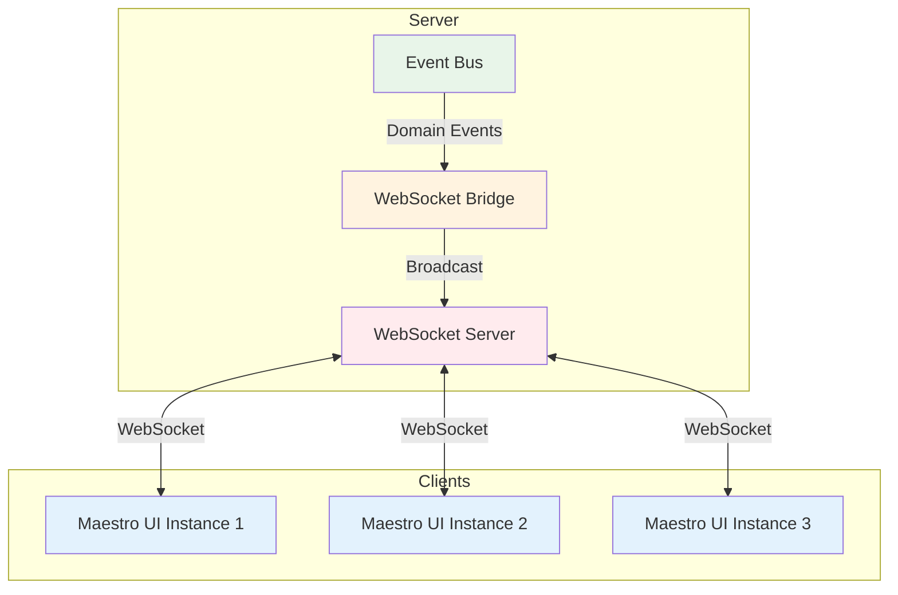

# WebSocket Events

## Overview

The Maestro system uses WebSocket for real-time bidirectional communication between the server and all connected clients (UI applications). This document details all WebSocket events, their payloads, and usage patterns.

## WebSocket Architecture



## WebSocket Connection

### Server Setup

**File:** `maestro-server/src/infrastructure/websocket/WebSocketBridge.ts`

```typescript
import { WebSocket, WebSocketServer } from 'ws';

const wss = new WebSocketServer({
  server: httpServer,  // Attached to Express HTTP server
  path: '/ws'         // Optional: WebSocket endpoint path
});

// Connection handler
wss.on('connection', (ws: WebSocket) => {
  console.log('Client connected');

  ws.on('message', (data) => {
    // Handle client messages (if bidirectional)
  });

  ws.on('close', () => {
    console.log('Client disconnected');
  });

  ws.on('error', (error) => {
    console.error('WebSocket error:', error);
  });
});
```

### Client Connection

**File:** `maestro-ui/src/stores/useMaestroStore.ts:38-93`

```typescript
function connectWebSocket() {
  if (wsConnection) {
    wsConnection.close();
  }

  const ws = new WebSocket('ws://localhost:3000');

  ws.addEventListener('open', () => {
    console.log('WebSocket connected');
    reconnectAttempts = 0;
  });

  ws.addEventListener('message', (event) => {
    try {
      const message = JSON.parse(event.data);
      handleWebSocketMessage(message);
    } catch (error) {
      console.error('Failed to parse WebSocket message:', error);
    }
  });

  ws.addEventListener('close', () => {
    console.log('WebSocket closed');
    scheduleReconnect();
  });

  ws.addEventListener('error', (error) => {
    console.error('WebSocket error:', error);
  });

  wsConnection = ws;
}
```

### Reconnection Strategy

```typescript
function scheduleReconnect() {
  if (reconnectAttempts >= MAX_RECONNECT_ATTEMPTS) {
    console.error('Max reconnection attempts reached');
    return;
  }

  const delay = Math.min(1000 * Math.pow(2, reconnectAttempts), 30000);
  reconnectAttempts++;

  setTimeout(() => {
    connectWebSocket();
  }, delay);
}
```

**Backoff Schedule:**
- Attempt 1: 1 second
- Attempt 2: 2 seconds
- Attempt 3: 4 seconds
- Attempt 4: 8 seconds
- Attempt 5: 16 seconds
- Attempt 6+: 30 seconds (max)

---

## Event Types

### All Registered Events

**File:** `maestro-server/src/infrastructure/websocket/WebSocketBridge.ts:66-81`

```typescript
const events: EventName[] = [
  // Session events
  'session:created',
  'session:spawn',
  'session:updated',
  'session:deleted',
  'session:task_added',
  'session:task_removed',

  // Task events
  'task:created',
  'task:updated',
  'task:deleted',
  'task:session_added',
  'task:session_removed',

  // Project events
  'project:created',
  'project:updated',
  'project:deleted',
];
```

---

## Session Events

### 1. `session:created`

**When Emitted:** New session is created via REST API

**Emitted By:** `SessionService.createSession()`

**Payload:**
```typescript
{
  type: 'session:created',
  event: 'session:created',
  data: {
    session: Session  // Full session object
  },
  timestamp: number
}
```

**Example:**
```json
{
  "type": "session:created",
  "event": "session:created",
  "data": {
    "session": {
      "id": "ses_abc123",
      "projectId": "prj_xyz",
      "taskIds": ["tsk_123"],
      "name": "Worker Session",
      "status": "spawning",
      "strategy": "simple",
      "createdAt": 1707260400000,
      "updatedAt": 1707260400000,
      "timeline": [
        {
          "id": "evt_1",
          "type": "session_started",
          "timestamp": 1707260400000,
          "message": "Session created"
        }
      ]
    }
  },
  "timestamp": 1707260400123
}
```

**UI Handler:**
```typescript
// maestro-ui/src/stores/useMaestroStore.ts:98-102
case 'session:created': {
  const session = message.data.session || message.data;
  set((prev) => ({
    sessions: new Map(prev.sessions).set(session.id, session)
  }));
  break;
}
```

---

### 2. `session:spawn` (Special)

**When Emitted:** Spawn endpoint creates a session and triggers terminal spawn

**Emitted By:** `POST /api/sessions/spawn` endpoint

**Payload:**
```typescript
{
  type: 'session:spawn',
  event: 'session:spawn',
  data: {
    session: Session,           // Full session object with env
    command: string,            // Command to execute (e.g., 'claude')
    cwd: string,                // Working directory
    envVars: Record<string, string>,  // Environment variables
    manifest: string,           // Manifest content
    projectId: string,
    taskIds: string[],
    spawnSource: 'ui' | 'session',  // Who initiated spawn
    parentSessionId: string | null, // Parent session (if session-spawned)
    _isSpawnCreated: boolean    // Internal flag
  },
  timestamp: number
}
```

**Example:**
```json
{
  "type": "session:spawn",
  "event": "session:spawn",
  "data": {
    "session": {
      "id": "ses_abc123",
      "projectId": "prj_xyz",
      "taskIds": ["tsk_123"],
      "status": "spawning",
      "env": {
        "MAESTRO_SESSION_ID": "ses_abc123",
        "MAESTRO_MANIFEST_PATH": "~/.maestro/data/sessions/ses_abc123/manifest.md",
        "MAESTRO_SERVER_URL": "http://localhost:3000",
        "MAESTRO_STRATEGY": "simple"
      }
    },
    "command": "claude",
    "cwd": "/Users/user/project",
    "envVars": {
      "MAESTRO_SESSION_ID": "ses_abc123",
      "MAESTRO_MANIFEST_PATH": "~/.maestro/data/sessions/ses_abc123/manifest.md",
      "MAESTRO_SERVER_URL": "http://localhost:3000",
      "MAESTRO_STRATEGY": "simple"
    },
    "manifest": "# Maestro Worker Manifest\n...",
    "projectId": "prj_xyz",
    "taskIds": ["tsk_123"],
    "spawnSource": "ui",
    "parentSessionId": null,
    "_isSpawnCreated": true
  },
  "timestamp": 1707260400456
}
```

**UI Handler:**
```typescript
// maestro-ui/src/stores/useMaestroStore.ts:109-121
case 'session:spawn': {
  const session = message.data.session;

  // 1. Store session
  set((prev) => ({
    sessions: new Map(prev.sessions).set(session.id, session)
  }));

  // 2. Spawn terminal
  void useSessionStore.getState().handleSpawnTerminalSession({
    maestroSessionId: session.id,
    name: session.name,
    command: message.data.command,
    cwd: message.data.cwd,
    envVars: message.data.envVars,
    projectId: message.data.projectId,
  });
  break;
}
```

**Key Characteristics:**
- **Only event that triggers terminal spawn**
- Includes full environment configuration
- Contains manifest content for reference
- Indicates spawn source (UI vs session-initiated)
- Parent session tracking for orchestrator patterns

---

### 3. `session:updated`

**When Emitted:** Session data is modified

**Emitted By:** `SessionService.updateSession()`, timeline events, status changes

**Payload:**
```typescript
{
  type: 'session:updated',
  event: 'session:updated',
  data: Session,  // Full updated session object
  timestamp: number
}
```

**Example:**
```json
{
  "type": "session:updated",
  "event": "session:updated",
  "data": {
    "id": "ses_abc123",
    "status": "working",
    "updatedAt": 1707260500000,
    "lastActivity": 1707260500000,
    "timeline": [
      {
        "id": "evt_1",
        "type": "session_started",
        "timestamp": 1707260400000
      },
      {
        "id": "evt_2",
        "type": "task_started",
        "timestamp": 1707260500000,
        "taskId": "tsk_123"
      }
    ]
  },
  "timestamp": 1707260500123
}
```

**UI Handler:**
```typescript
// maestro-ui/src/stores/useMaestroStore.ts:103
case 'session:updated':
  set((prev) => ({
    sessions: new Map(prev.sessions).set(message.data.id, message.data)
  }));
  break;
```

**Common Triggers:**
- Status change (`spawning` → `idle` → `working` → `completed`)
- Timeline event added
- Task added/removed
- Metadata updated
- Environment variables changed

---

### 4. `session:deleted`

**When Emitted:** Session is deleted

**Emitted By:** `SessionService.deleteSession()`

**Payload:**
```typescript
{
  type: 'session:deleted',
  event: 'session:deleted',
  data: {
    id: string  // Deleted session ID
  },
  timestamp: number
}
```

**Example:**
```json
{
  "type": "session:deleted",
  "event": "session:deleted",
  "data": {
    "id": "ses_abc123"
  },
  "timestamp": 1707260600000
}
```

**UI Handler:**
```typescript
// maestro-ui/src/stores/useMaestroStore.ts:104-107
case 'session:deleted':
  set((prev) => {
    const sessions = new Map(prev.sessions);
    sessions.delete(message.data.id);
    return { sessions };
  });
  break;
```

---

### 5. `session:task_added`

**When Emitted:** Task is added to a session

**Emitted By:** `SessionService.addTaskToSession()`

**Payload:**
```typescript
{
  type: 'session:task_added',
  event: 'session:task_added',
  data: {
    sessionId: string,
    taskId: string
  },
  timestamp: number
}
```

**Example:**
```json
{
  "type": "session:task_added",
  "event": "session:task_added",
  "data": {
    "sessionId": "ses_abc123",
    "taskId": "tsk_456"
  },
  "timestamp": 1707260700000
}
```

**UI Handler:**
```typescript
// maestro-ui/src/stores/useMaestroStore.ts:127-129
case 'session:task_added':
case 'session:task_removed':
  get().fetchSession(message.data.sessionId);
  break;
```

**Note:** UI refetches full session to get updated `taskIds` array.

---

### 6. `session:task_removed`

**When Emitted:** Task is removed from a session

**Emitted By:** `SessionService.removeTaskFromSession()`

**Payload:**
```typescript
{
  type: 'session:task_removed',
  event: 'session:task_removed',
  data: {
    sessionId: string,
    taskId: string
  },
  timestamp: number
}
```

**Example:**
```json
{
  "type": "session:task_removed",
  "event": "session:task_removed",
  "data": {
    "sessionId": "ses_abc123",
    "taskId": "tsk_456"
  },
  "timestamp": 1707260800000
}
```

**UI Handler:** Same as `session:task_added` (refetch session)

---

## Task Events

### 7. `task:created`

**When Emitted:** New task is created

**Emitted By:** `TaskService.createTask()`

**Payload:**
```typescript
{
  type: 'task:created',
  event: 'task:created',
  data: {
    task: Task  // Full task object
  },
  timestamp: number
}
```

**UI Handler:**
```typescript
case 'task:created': {
  const task = message.data.task || message.data;
  set((prev) => ({
    tasks: new Map(prev.tasks).set(task.id, task)
  }));
  break;
}
```

---

### 8. `task:updated`

**When Emitted:** Task data is modified

**Emitted By:** `TaskService.updateTask()`

**Payload:**
```typescript
{
  type: 'task:updated',
  event: 'task:updated',
  data: Task,  // Full updated task object
  timestamp: number
}
```

**UI Handler:**
```typescript
case 'task:updated':
  set((prev) => ({
    tasks: new Map(prev.tasks).set(message.data.id, message.data)
  }));
  break;
```

---

### 9. `task:deleted`

**When Emitted:** Task is deleted

**Emitted By:** `TaskService.deleteTask()`

**Payload:**
```typescript
{
  type: 'task:deleted',
  event: 'task:deleted',
  data: {
    id: string  // Deleted task ID
  },
  timestamp: number
}
```

**UI Handler:**
```typescript
case 'task:deleted':
  set((prev) => {
    const tasks = new Map(prev.tasks);
    tasks.delete(message.data.id);
    return { tasks };
  });
  break;
```

---

### 10. `task:session_added`

**When Emitted:** Session is added to a task (reverse of session:task_added)

**Emitted By:** `SessionService.addTaskToSession()` (emits both directions)

**Payload:**
```typescript
{
  type: 'task:session_added',
  event: 'task:session_added',
  data: {
    taskId: string,
    sessionId: string
  },
  timestamp: number
}
```

**UI Handler:**
```typescript
case 'task:session_added':
case 'task:session_removed':
  get().fetchTask(message.data.taskId);
  break;
```

---

### 11. `task:session_removed`

**When Emitted:** Session is removed from a task

**Emitted By:** `SessionService.removeTaskFromSession()`

**Payload:**
```typescript
{
  type: 'task:session_removed',
  event: 'task:session_removed',
  data: {
    taskId: string,
    sessionId: string
  },
  timestamp: number
}
```

**UI Handler:** Same as `task:session_added` (refetch task)

---

## Project Events

### 12. `project:created`

**When Emitted:** New project is created

**Payload:**
```typescript
{
  type: 'project:created',
  event: 'project:created',
  data: {
    project: Project
  },
  timestamp: number
}
```

### 13. `project:updated`

**When Emitted:** Project data is modified

**Payload:**
```typescript
{
  type: 'project:updated',
  event: 'project:updated',
  data: Project,
  timestamp: number
}
```

### 14. `project:deleted`

**When Emitted:** Project is deleted

**Payload:**
```typescript
{
  type: 'project:deleted',
  event: 'project:deleted',
  data: {
    id: string
  },
  timestamp: number
}
```

---

## Event Broadcasting Implementation

### Server-Side Broadcasting

**File:** `maestro-server/src/infrastructure/websocket/WebSocketBridge.ts:96-117`

```typescript
export function createWebSocketBridge(
  eventBus: DomainEventBus,
  wss: WebSocketServer
): void {
  const events: EventName[] = [
    'session:created',
    'session:spawn',
    'session:updated',
    // ... all events
  ];

  events.forEach((eventName) => {
    eventBus.on(eventName, (data: any) => {
      const message = {
        type: eventName,
        event: eventName,
        data,
        timestamp: Date.now(),
      };

      // Broadcast to ALL connected clients
      wss.clients.forEach((client) => {
        if (client.readyState === WebSocket.OPEN) {
          client.send(JSON.stringify(message));
        }
      });

      // Log low-frequency events
      if (!HIGH_FREQUENCY_EVENTS.includes(eventName)) {
        console.log(`[WebSocket] Broadcast ${eventName} to ${wss.clients.size} clients`);
      }
    });
  });
}
```

**Key Points:**
- Events are broadcast to **ALL** connected clients
- No client-specific filtering (broadcast model)
- High-frequency events (`task:updated`, `session:updated`) are not logged to reduce noise
- WebSocket state checked before sending

---

## High-Frequency Event Filtering

### Server Logging Filter

```typescript
// maestro-server/src/infrastructure/websocket/WebSocketBridge.ts:83-94

const HIGH_FREQUENCY_EVENTS: EventName[] = [
  'task:updated',
  'session:updated',
  'project:updated',
];

// Only log events that are NOT high-frequency
if (!HIGH_FREQUENCY_EVENTS.includes(eventName)) {
  console.log(`[WebSocket] Broadcast ${eventName}`);
}
```

### Client Logging Filter

```typescript
// maestro-ui/src/hooks/useMaestroWebSocket.ts:36-40

const HIGH_FREQUENCY_EVENTS = new Set([
  'task:updated',
  'session:updated',
  'project:updated'
]);

if (!HIGH_FREQUENCY_EVENTS.has(message.type)) {
  console.log('[WebSocket]', message.type, message.data);
}
```

**Rationale:**
- `task:updated` and `session:updated` can fire many times per second
- Timeline events trigger `session:updated` on every progress update
- Logging every event would flood console
- Non-high-frequency events are still logged for debugging

---

## WebSocket Hook Pattern

### Alternative: Hook-Based WebSocket Listening

**File:** `maestro-ui/src/hooks/useMaestroWebSocket.ts`

```typescript
import { useEffect } from 'react';

export function useMaestroWebSocket(
  callback: (message: WebSocketMessage) => void
) {
  useEffect(() => {
    // Register listener
    const listenerId = registerListener(callback);

    // Cleanup on unmount
    return () => {
      unregisterListener(listenerId);
    };
  }, [callback]);
}
```

**Usage in Components:**

```typescript
function SessionComponent({ sessionId }: Props) {
  useMaestroWebSocket((message) => {
    if (message.type === 'session:updated' && message.data.id === sessionId) {
      // Update local state
      setSession(message.data);
    }
  });

  return <div>{/* Render session */}</div>;
}
```

**Advantages:**
- Component-level WebSocket handling
- Automatic cleanup on unmount
- Multiple independent listeners
- Type-safe message handling

---

## Message Flow Timeline

### Example: Session Status Update

```
1. Agent Updates Session
   ├─ HTTP PATCH /api/sessions/{id} {status: 'working'}
   │
2. Server Processes Request
   ├─ SessionService.updateSession()
   ├─ SessionRepository.update()
   ├─ Write to ses_abc123.json
   │
3. Server Emits Event
   ├─ eventBus.emit('session:updated', session)
   │
4. WebSocket Bridge Receives Event
   ├─ Formats message: {type, event, data, timestamp}
   ├─ Broadcast to all clients (wss.clients.forEach)
   │
5. UI Clients Receive Message
   ├─ WebSocket 'message' event fires
   ├─ JSON.parse(event.data)
   ├─ handleWebSocketMessage(message)
   │
6. Store Updates State
   ├─ useMaestroStore.setState()
   ├─ sessions.set(session.id, updatedSession)
   │
7. React Re-renders
   ├─ Components using session data re-render
   └─ UI reflects new status
```

**Total Latency:** ~10-50ms (local), ~50-200ms (network)

---

## Error Handling

### Server-Side Errors

```typescript
// WebSocket send with error handling
wss.clients.forEach((client) => {
  if (client.readyState === WebSocket.OPEN) {
    try {
      client.send(JSON.stringify(message));
    } catch (error) {
      console.error('Failed to send WebSocket message:', error);
    }
  }
});
```

### Client-Side Errors

```typescript
ws.addEventListener('error', (error) => {
  console.error('WebSocket error:', error);
  // Connection will auto-close and trigger reconnection
});

ws.addEventListener('close', (event) => {
  if (!event.wasClean) {
    console.error('WebSocket closed unexpectedly:', event.code, event.reason);
  }
  scheduleReconnect();
});
```

---

## Performance Considerations

### Message Size

Typical message sizes:
- `session:updated` with timeline: 1-10 KB
- `task:updated`: 500 bytes - 2 KB
- `session:spawn`: 5-15 KB (includes manifest)

### Broadcast Frequency

- High-frequency events: 1-10 per second
- Medium-frequency events: 1-10 per minute
- Low-frequency events: < 1 per minute

### Client Count

- Typical: 1-5 connected UIs
- Each broadcast: O(n) where n = number of clients
- Low overhead for typical use cases

---

## Testing WebSocket Events

### Manual Testing

```bash
# Install wscat
npm install -g wscat

# Connect to server
wscat -c ws://localhost:3000

# Server will broadcast events
# Example output:
{
  "type": "session:updated",
  "event": "session:updated",
  "data": { "id": "ses_abc123", ... },
  "timestamp": 1707260500000
}
```

### Programmatic Testing

```typescript
import WebSocket from 'ws';

const ws = new WebSocket('ws://localhost:3000');

ws.on('message', (data) => {
  const message = JSON.parse(data.toString());
  console.log('Received:', message.type);

  if (message.type === 'session:updated') {
    console.log('Session status:', message.data.status);
  }
});
```

---

## Code Locations

| Component | File | Lines |
|-----------|------|-------|
| WebSocket Bridge | `maestro-server/src/infrastructure/websocket/WebSocketBridge.ts` | 66-117 |
| Event Registration | `maestro-server/src/infrastructure/websocket/WebSocketBridge.ts` | 66-81 |
| UI Store Handler | `maestro-ui/src/stores/useMaestroStore.ts` | 98-131 |
| WebSocket Hook | `maestro-ui/src/hooks/useMaestroWebSocket.ts` | Full file |
| Event Types | `maestro-server/src/domain/events/DomainEvents.ts` | Full file |

---

## Related Documentation

- [SESSION-LIFECYCLE.md](./SESSION-LIFECYCLE.md) - When events are emitted
- [SESSION-STATUS-FLOW.md](./SESSION-STATUS-FLOW.md) - Status change events
- [SESSION-TIMELINE.md](./SESSION-TIMELINE.md) - Timeline event triggers
- [COMPONENT-FLOWS.md](./COMPONENT-FLOWS.md) - Complete data flows
