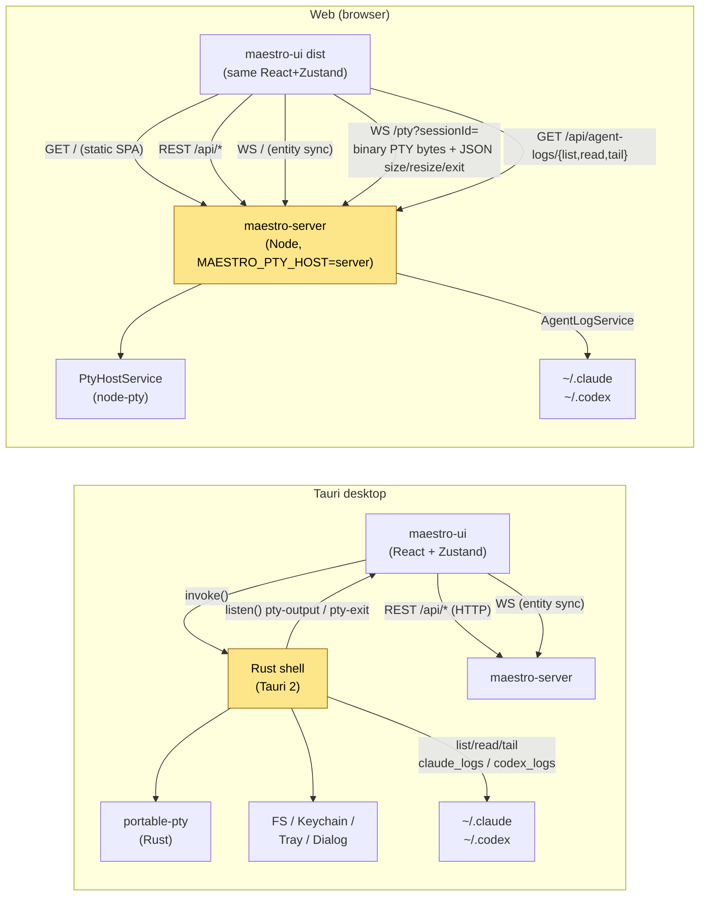

# maestro-ui Web Hybrid Architecture

> Branch: `feat/web-ui-responsive` · scope: how the same React SPA in `maestro-ui/` runs both inside the Tauri 2 desktop shell **and** as a plain browser app served by `maestro-server`, and exactly where the two paths diverge.

The headline: there is **one UI codebase**. A single boolean — `IS_TAURI` — selects between two implementations of a small platform seam (terminal transport + agent-log reader) and gates the small set of host-only features (file explorer, native dialogs, drag plugin, secure storage, tray, recordings, SSH, path picker, persistent local sessions). Everything else — projects, tasks, sessions, teams, spells, modals, prompt routing — is entity state synced over REST + WebSocket and is identical in both hosts.

---

## 1. The platform adapter seam

The seam lives in `maestro-ui/src/platform/`:

```
platform/
  detect.ts      ← IS_TAURI
  index.ts       ← exports platform = { isTauri, terminal, logs }
  types.ts       ← TerminalTransport interface
  terminal.ts    ← tauriTerminal  vs  webTerminal
  logs.ts        ← tauriLogs      vs  webLogs
```

### 1.1 Detection (`platform/detect.ts`)

```ts
export const IS_TAURI: boolean =
  import.meta.env.VITE_APP_MODE !== 'browser' &&
  typeof window !== 'undefined' &&
  '__TAURI_INTERNALS__' in window;
```

Two important consequences:

1. **`VITE_APP_MODE=browser` wins**, even when `__TAURI_INTERNALS__` is present. This is what lets `maestro-ui` `dev:web` / `build:web` produce a true browser bundle even when run from a developer machine that also has the Tauri shell installed.
2. The check is at module-evaluation time. `IS_TAURI` is a static module constant the whole app branches on — there is no runtime "switch host" code path.

### 1.2 Dispatch (`platform/index.ts`)

```ts
export const platform = {
  isTauri: IS_TAURI,
  terminal: IS_TAURI ? tauriTerminal : webTerminal,
  logs: IS_TAURI ? tauriLogs : webLogs,
} as const;
```

Every consumer that needs to talk to a PTY or read an agent transcript imports `platform.*` (or directly `IS_TAURI` to gate host-only features). The downstream code never sees `invoke()` or `fetch()` at the call site.

### 1.3 Shape (`platform/types.ts`)

The `TerminalTransport` interface is the same surface on both hosts:

```ts
createSession(opts): Promise<TerminalSessionInfo>
write(id, data, source?): Promise<void>
resize(id, cols, rows): Promise<void>
closeSession(id): Promise<void>
onOutput(handler): Promise<Unlisten>
onExit(handler): Promise<Unlisten>
onSize?(handler): Promise<Unlisten>   // web only
```

`onSize` is intentionally optional and **only present on `webTerminal`** — the Tauri PTY is sized by the desktop window's `FitAddon`, so there is no late-join width mismatch to correct.

### 1.4 Consumer matrix

Files that branch on `IS_TAURI` and what each one does in browser mode:

| File | Tauri behavior | Web behavior |
|---|---|---|
| `App.tsx` | spawns terminals, registers `tauri://` close handler, listens to `app-menu` / tray | runs `checkAuthStatus()`, renders `<LoginOverlay/>` if auth is enabled & user not logged in |
| `stores/initApp.ts` | listens `pty-output` / `pty-exit` / `app-menu` / `tray-menu`, calls `homeDir()`, `get_startup_flags`, `prepare_secure_storage`, `load_persisted_state*`, restores sessions via `invoke('list_sessions')` | skips every one of those; early-returns after seeding an empty `useSessionStore` (`setSessions([]); setActiveId(null); setHydrated(true)`) — entity sync runs over REST+WS only |
| `stores/useSessionStore.ts` | uses Tauri PTY events wired by `initApp.ts` | wires `platform.terminal.onOutput / onSize / onExit` once in `initSessionStoreRefs()`; `onSize` populates `serverPtySizes` so xterm matches the server's authored width before scrollback replay |
| `stores/useMaestroStore.ts` | identical REST+WS — but PTY writes go through `platform.terminal.write` | identical |
| `stores/useAuthStore.ts` | force-sets `{authEnabled:false, authenticated:true}` (desktop never needs auth) | hits `GET /api/auth/status`, owns the login flow (`/api/auth/login`, `/api/auth/logout`) |
| `stores/useSecureStorageStore.ts` | macOS Keychain–backed env/recording encryption via `invoke('prepare_secure_storage')` etc. | early-returns from every method; persistence disabled |
| `stores/useRecordingStore.ts` | full recording + replay via Tauri | `recordings = []`, replay error: *"Replay is not available in the browser."* |
| `stores/useAssetStore.ts` | invokes Tauri asset bridge | `list/refresh` return `[]` |
| `stores/useSshStore.ts` | uses Tauri SSH commands | early-returns; SSH targets hidden |
| `stores/usePathPickerStore.ts` | opens native dialog | early-returns; picker is hidden in browser |
| `stores/usePersistentSessionStore.ts` | local "kept-alive" terminals via `kill_persistent_session` etc. | feature disabled; the entity-synced session list is authoritative |
| `stores/persistence.ts` | writes local state via Tauri commands | no-op |
| `utils/MaestroClient.ts` | normal | on 401 surfaces login overlay (`!IS_TAURI` only) |
| `utils/serverConfig.ts` | hardcoded defaults from `VITE_*` env vars | defaults to **same-origin** (`window.location.origin/api`, `ws(s)://location.host`) so the bundle the server statically served talks to that same origin |
| `components/FileExplorerPanel.tsx` | full FS browse, drag-drop, watch | hidden — early-returns from `mount`/`refresh`/`watch` etc. |
| `components/CodeEditorPanel.tsx` | reads/writes via Tauri FS | throws *"File read/write is not available in browser mode."* |
| `components/app/AppWorkspace.tsx` | registers Tauri drag-plugin handlers, close-requested | skips both |
| `components/maestro/SessionStatsView.tsx` | shows stats panel | `return null` (depends on Tauri telemetry) |
| `components/session-log/SessionLogModal.tsx` | reads Claude/Codex JSONL via Tauri | reads via the REST `/api/agent-logs/*` endpoints |
| `components/session-log/TerminalStrip.tsx` | uses `platform.logs` | uses `platform.logs` — identical call site, different transport |
| `hooks/useFileAutocomplete.ts` | Tauri FS listing | disabled |
| `hooks/usePathPicker.ts`, `useSshManager.ts`, `useAssetManager.ts`, `useRecordingManager.ts` | full | disabled |

The takeaway: the divergence is wide in *features*, but narrow in *mechanism*. Two seam implementations (`platform.terminal`, `platform.logs`) cover the live data plane; the rest of the divergence is one boolean (`!IS_TAURI`) used as an early-return gate so host-only stores degrade to no-ops without crashing.

---

## 2. Terminal transport divergence — the headline

This is the only piece of the live data plane that fundamentally has to be different on each host.

### 2.1 Tauri path (`tauriTerminal`)

`maestro-ui/src/platform/terminal.ts`:

- **Create** — `invoke('create_session', {...})` → a Rust-side `portable-pty` PTY.
- **Write** — `invoke('write_to_session', { id, data, source })`.
- **Resize** — `invoke('resize_session', { id, cols, rows })`.
- **Close** — `invoke('close_session', { id })`.
- **Output** — `listen('pty-output')`, coerces payload to UTF-8 string (handles `string | Uint8Array | ArrayBuffer | number[]`).
- **Exit** — `listen('pty-exit')`.

The PTY lives in the Rust shell. Inputs go through Tauri's IPC. Streams come back as Tauri events. There is no notion of *width handoff* — the desktop window's `FitAddon` sizes the PTY at creation, so the buffer is always authored at the current xterm width.

### 2.2 Web path (`webTerminal`)

Also in `maestro-ui/src/platform/terminal.ts`. The implementation owns:

- A per-session WebSocket map (`_sockets`).
- A per-session **streaming TextDecoder** map (`_decoders`).
- A pending-send queue (`_pendingSends`) — `resize` may arrive before `onopen`.
- Three handler arrays (`_outputHandlers`, `_exitHandlers`, `_sizeHandlers`).

Connection: `${PTY_WS_URL}?sessionId=${encodeURIComponent(id)}`, `binaryType = 'arraybuffer'`. `id` is the maestro session id (not the terminal-info id), because the server-side PTY is keyed by the maestro session id — there is no separate "create PTY" step on the wire in web mode (the server already owns the PTY by the time the WS connects; see §3).

Protocol (one socket per session):

| Direction | Frame type | Meaning |
|---|---|---|
| server → client | **text** (JSON) `{type:'size', cols, rows}` | sent **once on attach, before scrollback replay** — the authoritative PTY size |
| server → client | **text** (JSON) `{type:'exit', exitCode}` | PTY exited |
| server → client | **binary** | raw PTY output bytes (scrollback chunks first, then live) |
| client → server | **binary** | keystroke bytes (`TextEncoder().encode(data)`) |
| client → server | **text** (JSON) `{type:'resize', cols, rows}` | resize request |

Two subtleties that exist only in this path:

1. **Streaming UTF-8 decoder per session.** PTY output arrives split on arbitrary byte boundaries, so a multi-byte glyph (box-drawing chars, emoji, Claude's `⏺`/`✻` markers) can straddle two WS frames. A non-streaming `TextDecoder().decode(bytes)` on each frame would emit `�` at the split. The implementation keeps `TextDecoder({stream:true})` per session in `_decoders` so the incomplete tail is buffered until the next frame. Per-session (not global) because two interleaved sessions would otherwise bleed each other's partial bytes.

2. **Late-join width handoff.** When a tab is reopened or the WS re-attaches to an already-running PTY, the scrollback the server is about to replay was authored at *some* width. If the client's xterm is sized differently, the replay wraps at the wrong column → garbled history. The server therefore sends `{type:'size', cols, rows}` **before** any replay bytes, and `useSessionStore` either resizes the existing xterm immediately (in `platform.terminal.onSize`) or stashes the size in `serverPtySizes` for the terminal to adopt on mount.

### 2.3 PTY URL derivation (`utils/serverConfig.ts`)

```ts
PTY_WS_URL = rawPtyWsUrl
  ? normalizeWsUrl(rawPtyWsUrl, API_BASE_URL)
  : `${WS_URL}/pty`;
```

`WS_URL` defaults to `ws(s)://${location.host}` in web mode, so the default `PTY_WS_URL` is same-origin. `VITE_PTY_WS_URL` (or `VITE_WS_URL`) override it for split-origin deployments. The bridge channel is `ws(s)://host/` and the PTY channel is `ws(s)://host/pty` — the server demultiplexes on `request.url.pathname` (see §3.4).

---

## 3. Server-side changes

### 3.1 `MAESTRO_PTY_HOST` config

`maestro-server/src/infrastructure/config/Config.ts`:

```ts
ptyHost: 'tauri' | 'server'
// from env: MAESTRO_PTY_HOST, default 'tauri'
// validated: must be 'tauri' or 'server'
```

This is the single switch that says "the server owns the PTY lifecycle." When `'tauri'`, spawn/resume emit `session:spawn` / `session:resume` events and rely on the Tauri shell to actually start the agent process. When `'server'`, the routes additionally call `ptyHostService.spawn(...)` so the PTY is born inside the Node process.

### 3.2 `PtyHostService` (`application/services/PtyHostService.ts`)

A server-side PTY lifecycle manager that replaces the Tauri-hosted PTY for headless/web deployments. Internals:

- **`spawn({sessionId, command, cwd, env, cols, rows})`** — `pty.spawn(shell, ['-c', command], {...})` with `encoding: null` so it emits raw `Buffer`s. Default `80×24`. `process.env` is merged so the child still sees `HOME` etc.; caller `env` wins.
- **Ring buffer per session** — `ring: Buffer[]`, capped at 256 KiB total via `RING_CAP_BYTES`. On every `proc.onData`, the chunk is pushed onto the ring (evicting from the front if needed) **and** fanned out to all subscribed sockets.
- **`addSubscriber(sessionId, ws)`** — replays the entire ring to the new socket **before** wiring it into the live fan-out set. This is the "scrollback on connect" behavior the client relies on.
- **`getSize(sessionId)`** — returns current `{cols, rows}`. Used by `PtyWebSocketServer` to send the leading `size` control frame.
- **`onExit`** — updates the entity `Session.status` to `completed` (exit 0) or `failed` (otherwise), closes all subscriber sockets, deletes the entry.
- **`shutdownAll()`** — called from the container shutdown path.

Why NodeJS and not Bun: `node-pty`'s `onData` callback does not fire reliably under Bun, **and** Bun's package install strips the executable bit from `node-pty`'s `spawn-helper` binary. (See `package.json` `postinstall`: `chmod +x node_modules/node-pty/prebuilds/*/spawn-helper`.) The web launcher (`scripts/start-web.sh`) therefore execs `node maestro-server/dist/server.js`, not `bun`.

### 3.3 `PtyWebSocketServer` (`infrastructure/websocket/PtyWebSocketServer.ts`)

The dedicated PTY WebSocket channel, separate from `WebSocketBridge` so terminal bytes never hit its 50ms JSON batching, per-entity throttling, or 1 MB cap. Flow per connection:

1. Parse `?sessionId=<id>` from `req.url`. Missing → close `1008 'missing sessionId'`.
2. Set `ws.binaryType = 'nodebuffer'`.
3. Look up `ptyHostService.getSize(sessionId)` and, if present, send `{"type":"size","cols":n,"rows":n}` as a **text frame** so the client decodes it as a control message rather than raw PTY bytes. This goes out *before* the scrollback replay so the xterm grid is resized first.
4. `ptyHostService.addSubscriber(sessionId, ws)` — replays the ring and joins the live fan-out. If no live PTY exists, close `1011 'no live PTY for session'`.
5. `ws.on('message', (data, isBinary))`:
   - **binary** → forwarded to `ptyHostService.write(sessionId, buf)` (keystrokes).
   - **text** → parsed as JSON; the only currently-handled control is `{type:'resize', cols, rows}` → `ptyHostService.resize(...)`.
6. `ws.on('close' | 'error')` → `removeSubscriber`.

### 3.4 HTTP server wiring (`server.ts`)

Two `WebSocketServer({noServer: true})` instances are created — one for the entity-sync bridge, one for PTYs (`maxPayload: 10 MB` to comfortably accept pasted multi-MB input). The HTTP `upgrade` handler routes by `pathname`:

- `/pty` → `ptyWss`
- everything else → `wss` (bridge), gated by `MAX_WS_CLIENTS` (default 50)

Auth gating happens **before** the path switch: cookie or `?token=` is verified against `AuthService`; failure writes `HTTP/1.1 401` and destroys the socket.

### 3.5 Spawn & Resume parity (`api/sessionRoutes.ts`)

```ts
// SPAWN  (~lines 1885-1902)
await eventBus.emit('session:spawn', spawnEvent);
if (config.ptyHost === 'server') {
  ptyHostService.spawn({ sessionId: session.id, command, cwd, env: finalEnvVars });
}

// RESUME (~lines 2129-2148)  ← previously missing; now mirrors spawn
await eventBus.emit('session:resume', resumeEvent);
if (config.ptyHost === 'server') {
  ptyHostService.spawn({ sessionId: session.id, command, cwd, env: finalEnvVars });
}
```

**Why this matters (the bug):** before the resume branch was added, RESUME emitted `session:resume` but never started the server-side PTY. The browser then opened `/pty?sessionId=<id>`, `addSubscriber` returned `false` because no PTY was registered, and the server closed the socket with `1011 'no live PTY for session'`. Resume hung forever from the browser. Tauri was unaffected because its desktop shell spawns the PTY locally in response to the `session:resume` event. The fix is the symmetric `ptyHostService.spawn(...)` call.

### 3.6 Agent session-log REST (`api/agentLogRoutes.ts`, `services/AgentLogService.ts`)

The Session Log strip (`components/session-log/TerminalStrip.tsx`) reads the agent's JSONL transcript — Claude under `~/.claude/projects/<encoded-cwd>/*.jsonl`, Codex under `~/.codex/sessions/**/*.jsonl`. In the Tauri build it does this via Rust `invoke('list_claude_session_logs' | 'read_claude_session_log' | 'tail_claude_session_log' | ...)`. In the browser those commands do not exist, so the strip used to early-return — the bottom log strip simply never rendered.

`AgentLogService` is a server-side **TypeScript port of the same Rust readers**. It exposes:

- `list(provider, cwd)` — returns `AgentLogFile[]` sorted newest first; for each file extracts the maestro session id by scanning the first 8 KiB (Claude) or 256 KiB (Codex) for `<session_id>sess_*</session_id>`.
- `read(provider, cwd, filename)` — returns the whole file (10 MB cap).
- `tail(provider, cwd, filename, offset)` — returns the bytes after `offset`.

Behavioral parity points:

- **Path encoding for Claude** — every non-alphanumeric character of the absolute cwd becomes `-`, with the trailing slash stripped first. Matches the Rust `claude_logs.rs` encoding exactly.
- **Codex cwd matching** — Codex doesn't use path encoding; instead each transcript's first line is `{"type":"session_meta","payload":{"cwd":"..."}}`. The service stream-reads only the first line of each file (with a 1 MB safety cap) and compares `cwd`. Discovery is recursive under `~/.codex/sessions` via an iterative DFS.
- **Traversal guards** — Claude `filename` may not contain `/`, `\`, or be missing `.jsonl`. Codex paths must be relative, can't contain `..`, and the realpath must be a descendant of `~/.codex/sessions`. A 10 MB read ceiling applies to both `read` and `tail`.

`api/agentLogRoutes.ts` exposes them under `/api/agent-logs/{list,read,tail}` with Zod-validated query params. `platform/logs.ts` `webLogs` is a thin `fetch()` adapter against this surface, exposing the same `SessionLogs` shape as `tauriLogs` so `TerminalStrip` is host-agnostic at the call site.

### 3.7 Static-serving the SPA

In `server.ts`, **after** all `/api`, `/ws`, `/pty` routes:

```ts
const uiDistPath = join(__dirname, '../../maestro-ui/dist');
if (existsSync(uiDistPath)) {
  app.use(express.static(uiDistPath));
  app.use((req, res, next) => {
    if (req.path.startsWith('/api') ||
        req.path.startsWith('/ws') ||
        req.path.startsWith('/pty')) return next();
    res.sendFile(join(uiDistPath, 'index.html'));
  });
}
```

This is what makes the browser path **single-origin**: REST, the bridge WS, the PTY WS, and the static bundle all share the same `host:port`. `serverConfig.ts` then defaults to `window.location.origin` everywhere, so no env vars are needed in the production browser build. The fallback handler serves `index.html` for any non-API route — that is the SPA's history-router fallback.

---

## 4. Diagram: Tauri vs Web data paths

Also saved as `diagram.mmd` for standalone rendering.



What to read off the diagram:

- The **only** path that fundamentally differs is the PTY: Tauri IPC + events vs `/pty` WebSocket.
- **Agent-log access** crosses the same divide — Rust commands vs REST.
- Entity sync (REST `/api/*` + the bridge WebSocket) is **identical** in both hosts.
- The seam (highlighted) — Rust shell on the desktop, `maestro-server` on the web — is what owns the PTY in each case.

---

## 5. Build / Run

### 5.1 Scripts

Root `package.json`:

| Script | What it does |
|---|---|
| `bun run web` | `bash scripts/start-web.sh` — builds UI+server, runs server under **node** with `MAESTRO_PTY_HOST=server` |
| `bun run web:nobuild` | `SKIP_BUILD=1` variant for fast iteration when only the server changed |
| `bun run dev:all` | Tauri dev (port 4568) + server (port 4567), hot-reload |
| `bun run prod:build` / `prod` | Build + launch the installed macOS Tauri app bundle |
| `bun run staging:server` / `staging` | Staging server on `:4569` with data at `~/.maestro-staging/` |

`maestro-ui/package.json`:

| Script | What it does |
|---|---|
| `dev:web` | `VITE_APP_MODE=browser VITE_API_URL=http://localhost:4569/api vite --port 4570` — Vite dev server in browser mode, talking to a staging server |
| `build:web` | `VITE_APP_MODE=browser tsc -b && VITE_APP_MODE=browser vite build` — produces `maestro-ui/dist/` for the server to static-serve |

### 5.2 `scripts/start-web.sh`

```
PORT=4570 HOST=0.0.0.0
MAESTRO_PTY_HOST=server
SERVER_URL=http://localhost:4570
DATA_DIR=~/.maestro/data
SESSION_DIR=~/.maestro/sessions
NODE_ENV=production
exec node maestro-server/dist/server.js
```

Subtleties of the launcher:

- **It runs `node`, not `bun`.** Reason recorded in the script header: `node-pty`'s `onData` doesn't fire under Bun, which would break the server-hosted terminals. The repo also has a `postinstall` step (`chmod +x node_modules/node-pty/prebuilds/*/spawn-helper`) because Bun's install strips the exec bit from that prebuilt helper.
- **It checks output existence, not the build's exit code.** `tsc` regularly exits non-zero on pre-existing type warnings (e.g. `node-pty` declaration mismatches) while still emitting valid JS, so the script greps for `maestro-ui/dist/index.html` and `maestro-server/dist/server.js` and aborts only if those are missing. This means *real* build failures still abort, but spurious type noise doesn't block deploys.
- The single same-origin URL is `http://localhost:4570` — open the browser there and it gets the static SPA, REST, both WebSockets, and `/pty` all from the same origin.

### 5.3 Tauri vs Web boot (see `boot.md` for details)

The bootstrap branches in `stores/initApp.ts` are extensive — `IS_TAURI`-gated calls include `listen('pty-output' | 'pty-exit' | 'app-menu' | 'tray-menu')`, `homeDir()`, `get_startup_flags`, `prepare_secure_storage`, `load_persisted_state[_meta]`, `list_sessions`. In browser mode the early-return at line ~545 (`if (!IS_TAURI) { ... return; }`) skips all native-session restoration and seeds an empty `useSessionStore`; the UI then catches up over REST + bridge WS via `useMaestroStore.initWebSocket()` (called at the top of `setup()`, before the branch). `App.tsx` mounts a web-only auth path (`useAuthStore.checkStatus()` → `<LoginOverlay/>` if auth is enabled).

---

## 6. Degraded-in-web features

These work in Tauri and are **stubbed/hidden** in the browser. The bundle still loads cleanly; calls into these modules are no-ops or fail with an explicit "not available in browser" error rather than crashing.

| Area | What it does (Tauri) | Browser behavior |
|---|---|---|
| File Explorer (`FileExplorerPanel`) | Full FS browse, watch, drag-drop, SSH file panes | The whole panel renders a placeholder; `mount`/`refresh`/`watch`/`unwatch` early-return |
| Code Editor (`CodeEditorPanel`) | Read/write project files via Tauri FS | `read`/`write` throw `"File … is not available in browser mode."` |
| Native dialogs / path picker (`usePathPickerStore`, `usePathPicker`) | Native open/save dialogs, `@tauri-apps/plugin-dialog` | Picker disabled; entries that normally accept a path show a text field only |
| Drag plugin (`@crabnebula/tauri-plugin-drag`) in `AppWorkspace` | Native drag-out of files, app drop handlers | Skipped |
| Secure storage (`useSecureStorageStore`) | macOS Keychain–encrypted environments + recording inputs | All methods early-return; persistence is reported as disabled |
| Tray (`useTrayManager`) | macOS tray menu + actions | Not wired; tray events ignored |
| Recordings (`useRecordingStore`) | Capture, list, replay (Tauri-only API surface) | `recordings = []`, replay surface returns `"Replay is not available in the browser."` |
| Assets (`useAssetStore`) | Project asset bridge backed by Tauri FS | `list/refresh` return `[]` |
| SSH (`useSshStore`, `useSshManager`) | SSH targets, keys, terminal | Disabled; SSH-related UI hidden |
| Persistent local sessions (`usePersistentSessionStore`) | Keep-alive PTYs owned by the Tauri shell | Feature off; the server-hosted PTY lifecycle is authoritative |
| Auto-update / `checkForUpdates` | Polled from the Tauri updater | The store still runs the periodic check, but the underlying call is a no-op |
| File autocomplete (`useFileAutocomplete`) | Filesystem-backed autocomplete in prompts | Disabled |

The pattern is uniform: each store/component imports `IS_TAURI` from `platform/detect` and bails at the top of any method that would call `invoke()`. Nothing throws into React's render path; nothing leaks an unhandled `Promise`.

---

## 7. Operational gotcha (development-time)

During the development of this branch, the running web server on `:4570` was being built out of a separate worktree (`web-wt/foundation`), not the canonical `agent-maestro/` checkout. As a result, fixes landed in `agent-maestro/` did **not** appear in the served bundle until they were merged into the worktree the server was being built from. This is a development workflow quirk, not part of the steady-state architecture — in production the server statically serves whatever `maestro-ui/dist/` was built in *its* tree, so single-tree builds are unambiguous.

If you see "fix didn't take effect", first check which checkout's `maestro-ui/dist/index.html` the live server is serving (`ls -l` the file's mtime and trace the `dist` path the server's `__dirname` resolves to).

---

## 8. Related docs

- `boot.md` — startup/boot sequence side-by-side, including which `initApp.ts` steps run on each host.
- `wiring.md` — REST endpoint inventory, both WebSocket channels, and the PTY frame protocol in detail.
- `diagram.mmd` — the data-path diagram in §4, standalone.
