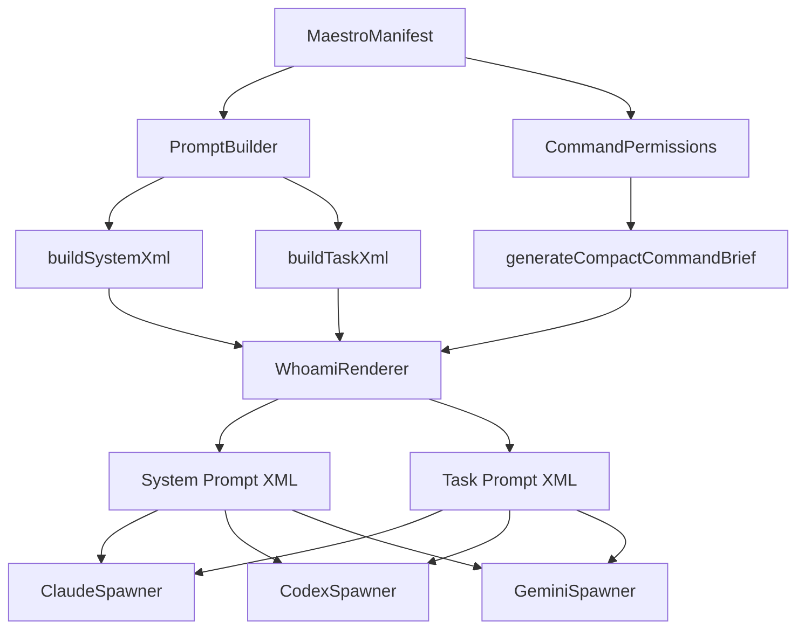
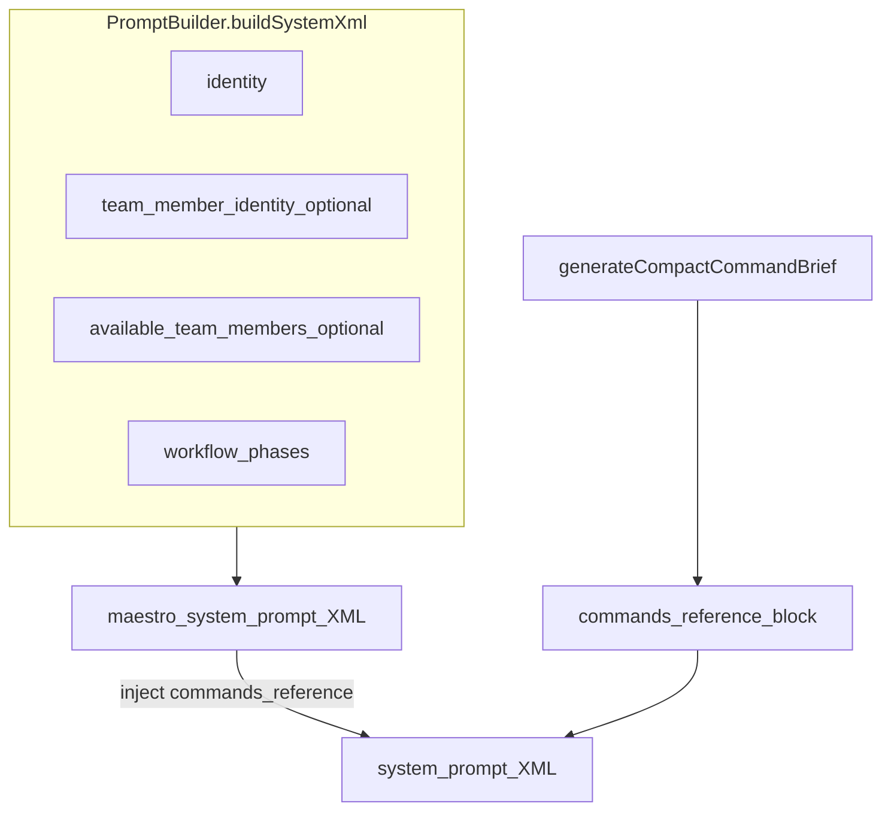
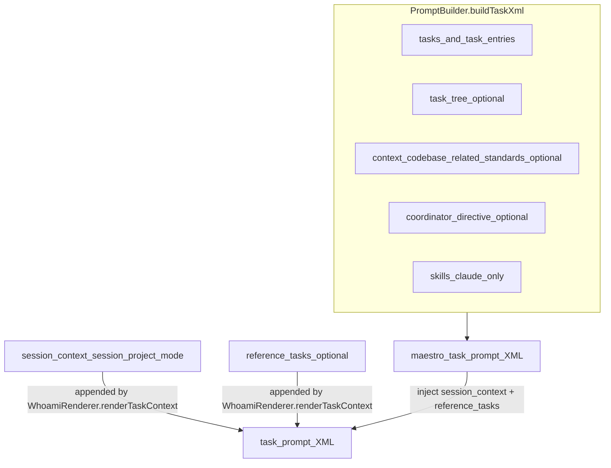
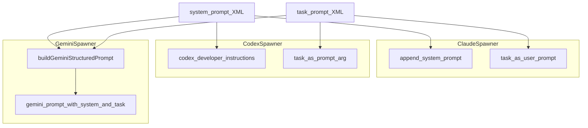

# Maestro CLI Prompt Generation

This document explains how Maestro CLI builds system prompts and initial (task) prompts, and how each agent tool receives them.

## Overview Flow (Manifest -> Prompt Text)

## System Prompt Assembly (Static)

### System Prompt Contents

- Identity: role profile + instruction (worker/coordinator) + optional project id
- Team member identity: single or multi-identity, with optional memory + expertise
- Team roster: available members (filtered to exclude self)
- Workflow phases: default or team member template/custom workflow
- Commands reference: compact command listing generated from permissions

## Task (Initial) Prompt Assembly (Dynamic)

### Task Prompt Contents

- Tasks list + optional task tree
- Session context: session id, project id, mode (always injected by WhoamiRenderer)
- Coordinator directive (if present)
- Context: codebase, related tasks, project standards (if present)
- Skills: only included when agent tool is `claude-code`
- Reference task IDs: appended by WhoamiRenderer if manifest has `referenceTaskIds`

## Agent Tool Injection (System + Initial Prompt)

## Key Files

- Prompt assembly: `maestro-cli/src/services/prompt-builder.ts`
- System/task rendering: `maestro-cli/src/services/whoami-renderer.ts`
- Command brief injection: `maestro-cli/src/services/command-permissions.ts`
- Agent tool wiring: `maestro-cli/src/services/claude-spawner.ts`, `maestro-cli/src/services/codex-spawner.ts`, `maestro-cli/src/services/gemini-spawner.ts`
- Gemini wrapping: `maestro-cli/src/prompts/spawner.ts`

## Notes

- The system prompt intentionally excludes task-specific data.
- The task prompt intentionally excludes identity/workflow.
- Only Claude loads skills in the prompt XML (other tools do not include skill tags).
- `whoami` output uses `PromptBuilder.build` (combined XML) but is separate from the spawn flows.
