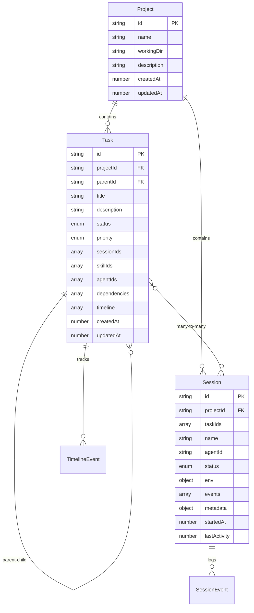

# Maestro Server - Overview

## What is Maestro Server?

Maestro Server is a **task orchestration backend** that provides real-time state management for multi-agent development workflows. It serves as the central coordination hub for the Maestro CLI-first architecture, managing projects, tasks, sessions, and their relationships.

## Core Purpose

The server acts as a **persistent data layer and event broadcaster** for:

1. **Project Management** - Organizing work into structured projects with working directories
2. **Task Orchestration** - Creating, tracking, and managing hierarchical tasks via parent-child relationships
3. **Session Coordination** - Tracking multiple concurrent agent sessions and their relationships to tasks
4. **Real-time Updates** - Broadcasting state changes to connected UIs via WebSocket
5. **Skill Integration** - Loading and managing agent skill configurations

## Architecture Philosophy: CLI-First

**CRITICAL:** Maestro Server follows a **CLI-first architecture**:

- The **server** is a dumb data store + event broadcaster
- The **CLI (maestro)** contains all orchestration logic, prompt generation, and command execution
- The **UI** is a visualization layer that spawns terminals and displays state

```
┌─────────────────────────────────────────────────────────────┐
│                        Maestro CLI                          │
│                   (Orchestration Brain)                     │
│  • Generates prompts                                        │
│  • Executes commands                                        │
│  • Spawns Claude sessions                                   │
│  • Manages workflow logic                                   │
└───────────────┬─────────────────────────────────────────────┘
                │ HTTP API calls
                │ (CRUD operations only)
                ▼
┌─────────────────────────────────────────────────────────────┐
│                      Maestro Server                         │
│                   (Data Store + Events)                     │
│  • Stores projects, tasks, sessions                         │
│  • Persists to disk (~/.maestro/data)                      │
│  • Broadcasts WebSocket events                              │
│  • NO prompt generation                                     │
│  • NO command execution                                     │
└───────────────┬─────────────────────────────────────────────┘
                │ WebSocket events
                │ (State change broadcasts)
                ▼
┌─────────────────────────────────────────────────────────────┐
│                        Agents UI                            │
│                   (Visualization Layer)                     │
│  • Displays projects, tasks, sessions                       │
│  • Spawns terminals with env vars                           │
│  • Subscribes to WebSocket events                           │
│  • NO business logic                                        │
└─────────────────────────────────────────────────────────────┘
```

## Key Responsibilities

### 1. Data Persistence
- Store projects, tasks, sessions to disk at `~/.maestro/data/`
- File-based storage with JSON files per entity
- Automatic loading on startup and saving on changes

### 2. State Management
- In-memory maps for fast access (projects, tasks, sessions)
- Bidirectional relationship tracking (tasks ↔ sessions)
- Timeline tracking for task history

### 3. Real-time Broadcasting
- WebSocket server for live updates to connected clients
- Event emission for all CRUD operations
- Global broadcast function accessible throughout codebase

### 4. API Gateway
- RESTful HTTP API for CRUD operations
- Validation and error handling
- Session spawning coordination (but NOT execution)

### 5. Skill Loading
- Read skill manifests from `~/.agents-ui/maestro-skills/`
- Format skills for inclusion in prompts
- Support for role-based skill assignment (worker, orchestrator)

## Core Entities



## Technology Stack

- **Runtime:** Node.js with TypeScript
- **Web Framework:** Express.js v5
- **WebSocket:** ws library
- **Storage:** File-based JSON (no database)
- **Build Tool:** TypeScript compiler (tsc)

## File Structure

```
maestro-server/
├── src/
│   ├── server.ts              # Main entry point, HTTP server setup
│   ├── storage.ts             # Data persistence + in-memory store
│   ├── websocket.ts           # WebSocket event broadcasting
│   ├── types.ts               # TypeScript type definitions
│   ├── skills.ts              # Skill loading and management
│   ├── api/
│   │   ├── projects.ts        # Project CRUD endpoints
│   │   ├── tasks.ts           # Task CRUD endpoints (includes hierarchical support)
│   │   └── sessions.ts        # Session CRUD + spawn endpoint
│   └── services/
│       └── promptGenerator.ts # Prompt templates (deprecated, kept for reference)
├── dist/                      # Compiled JavaScript output
├── package.json
└── tsconfig.json
```

## Data Storage Layout

```
~/.maestro/data/
├── projects/
│   ├── proj_123.json
│   └── proj_456.json
├── tasks/
│   ├── proj_123/              # Tasks organized by project
│   │   ├── task_001.json
│   │   └── task_002.json
│   └── proj_456/
│       └── task_003.json
└── sessions/
    ├── sess_abc.json
    └── sess_def.json
```

## Port Configuration

- **HTTP Server:** Port 3000 (configurable via `PORT` env var)
- **WebSocket:** Shares HTTP server port (upgrade connection)
- **Health Check:** `GET http://localhost:3000/health`

## Deployment

The server is designed to run locally on the developer's machine:

```bash
# Development
npm run dev

# Production
npm run build
npm start

# Docker (for multi-machine scenarios)
docker build -t maestro-server .
docker run -p 3000:3000 -v ~/.maestro/data:/data maestro-server
```

## Integration Points

### 1. Maestro CLI
- Calls HTTP API for CRUD operations
- Manages its own prompt generation and command execution
- Spawns Claude sessions with appropriate context

### 2. Agents UI
- Connects via WebSocket for real-time updates
- Spawns terminals when receiving `session:spawn_request` events
- Sets environment variables for CLI context (`MAESTRO_SESSION_ID`, etc.)

### 3. Skills System
- Skills stored at `~/.agents-ui/maestro-skills/`
- Each skill has `manifest.json` and `skill.md`
- Server loads and formats skills for CLI consumption

## Key Design Decisions

### Why CLI-First?

1. **Separation of Concerns:** Data storage separate from business logic
2. **Flexibility:** CLI can evolve independently of server
3. **Simplicity:** Server remains a thin data layer
4. **Testability:** CLI logic can be tested without server

### Why File-Based Storage?

1. **Simplicity:** No database setup required
2. **Portability:** Data travels with user
3. **Transparency:** JSON files are human-readable
4. **Sufficient:** Scale needs are local/single-machine

### Why Many-to-Many Task-Session?

Phase IV-A architecture supports:
- Multiple sessions working on one task (parallel workers)
- One session working on multiple tasks (orchestrator managing workflow)
- Dynamic task assignment during session lifecycle

## Next Steps

- [02-API-REFERENCE.md](./02-API-REFERENCE.md) - Complete API endpoint documentation
- [03-STORAGE-LAYER.md](./03-STORAGE-LAYER.md) - Storage implementation details
- [04-WEBSOCKET-EVENTS.md](./04-WEBSOCKET-EVENTS.md) - Real-time event system
- [05-DATA-MODELS.md](./05-DATA-MODELS.md) - Entity schemas and relationships
- [06-FLOWS.md](./06-FLOWS.md) - End-to-end workflow diagrams
