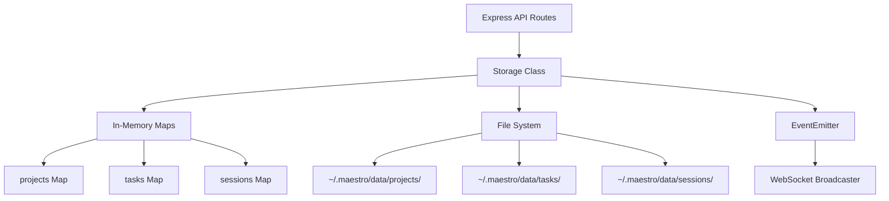
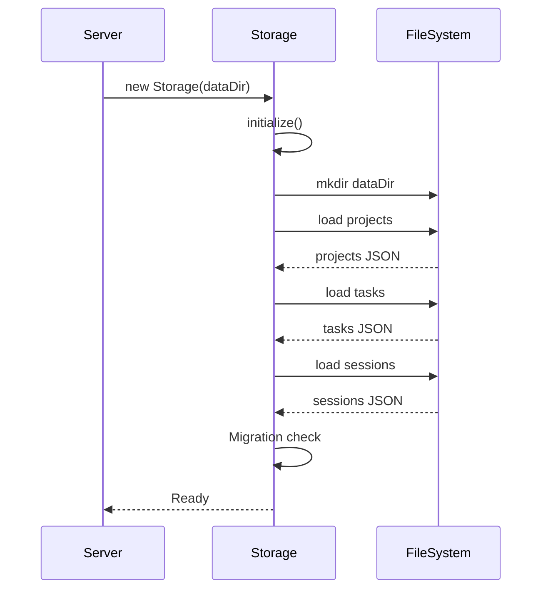

# Maestro Server - Storage Layer

Deep dive into the storage implementation, data persistence, and in-memory caching.

## Architecture Overview



## Storage Class

**Location:** `src/storage.ts`

The Storage class extends Node.js `EventEmitter` to provide:
1. In-memory data access (Map structures)
2. Persistent file-based storage
3. Event emission for state changes

### Class Structure

```typescript
class Storage extends EventEmitter {
  private dataDir: string;
  private projects: Map<string, Project>;
  private tasks: Map<string, Task>;
  private sessions: Map<string, Session>;

  constructor(dataDir?: string)
  async initialize(): Promise<void>
  async load(): Promise<void>
  async save(): Promise<void>

  // Project methods
  createProject(projectData): Project
  getProject(id): Project | undefined
  listProjects(): Project[]
  updateProject(id, updates): Project
  deleteProject(id): {success, id}

  // Task methods
  createTask(taskData): Task
  getTask(id): Task | undefined
  listTasks(filter): Task[]
  updateTask(id, updates): Task
  deleteTask(id): {success, id}

  // Session methods
  createSession(sessionData): Session
  getSession(id): Session | undefined
  listSessions(filter): Session[]
  updateSession(id, updates): Session
  deleteSession(id): {success, id}

  // Phase IV-A: Bidirectional relationship methods
  async addTaskToSession(sessionId, taskId): Promise<void>
  async removeTaskFromSession(sessionId, taskId): Promise<void>

  // Helper
  makeId(prefix): string
}
```

## Data Directory Structure

### Default Location

```
~/.maestro/data/
```

Can be overridden with `DATA_DIR` environment variable:

```bash
DATA_DIR=/custom/path npm start
```

### Directory Layout

```
~/.maestro/data/
├── projects/
│   ├── proj_1706789123456_abc123.json
│   ├── proj_1706789234567_def456.json
│   └── ...
├── tasks/
│   ├── proj_1706789123456_abc123/      # Tasks organized by project
│   │   ├── task_1706790000000_xyz789.json
│   │   ├── task_1706790111111_uvw012.json
│   │   └── ...
│   └── proj_1706789234567_def456/
│       └── task_1706791111111_rst345.json
└── sessions/
    ├── sess_1706792222222_lmn678.json
    ├── sess_1706793333333_opq901.json
    └── ...
```

### Why Project-Specific Task Directories?

**Advantages:**
- Easier to find all tasks for a project
- Cleaner deletion (remove entire project directory)
- Better organization at scale

**Migration Support:**
- Server still reads legacy tasks from root `tasks/` directory
- New tasks are saved in project directories

## ID Generation

```typescript
makeId(prefix: string): string {
  return `${prefix}_${Date.now()}_${Math.random().toString(36).substr(2, 9)}`;
}
```

**Format:** `{prefix}_{timestamp}_{random}`

**Examples:**
- `proj_1706789123456_k2j4n5l6m`
- `task_1706789234567_a1b2c3d4e`
- `sess_1706789345678_x9y8z7w6v`

**Properties:**
- Unique (timestamp + random)
- Sortable (timestamp first)
- Identifiable (prefix)
- Collision-resistant (random suffix)

## Initialization Flow



### Load Process

```typescript
async load(): Promise<void> {
  // 1. Load projects from individual files
  const projectsDir = path.join(this.dataDir, 'projects');
  const projectFiles = await fs.readdir(projectsDir);
  for (const file of projectFiles) {
    const project = JSON.parse(await fs.readFile(...));
    this.projects.set(project.id, project);
  }

  // 2. Load tasks from project directories
  const tasksDir = path.join(this.dataDir, 'tasks');
  const projectDirs = await fs.readdir(tasksDir);
  for (const projectDir of projectDirs) {
    const taskFiles = await fs.readdir(projectDir);
    for (const file of taskFiles) {
      const task = JSON.parse(await fs.readFile(...));

      // Migration: Initialize Phase IV-A fields
      if (!task.sessionIds) task.sessionIds = [];
      if (!task.skillIds) task.skillIds = [];
      if (!task.agentIds) task.agentIds = [];

      this.tasks.set(task.id, task);
    }
  }

  // 3. Load sessions
  const sessionsDir = path.join(this.dataDir, 'sessions');
  const sessionFiles = await fs.readdir(sessionsDir);
  for (const file of sessionFiles) {
    const session = JSON.parse(await fs.readFile(...));

    // Migration: Convert old taskId to taskIds array
    if (session.taskId && !session.taskIds) {
      session.taskIds = [session.taskId];
      delete session.taskId;
    }

    this.sessions.set(session.id, session);
  }
}
```

## Save Process

```typescript
async save(): Promise<void> {
  // Save all projects as individual files
  for (const project of this.projects.values()) {
    await fs.writeFile(
      path.join(projectsDir, `${project.id}.json`),
      JSON.stringify(project, null, 2)
    );
  }

  // Save all tasks in project-specific directories
  for (const task of this.tasks.values()) {
    const projectTasksDir = path.join(tasksDir, task.projectId);
    await fs.mkdir(projectTasksDir, { recursive: true });
    await fs.writeFile(
      path.join(projectTasksDir, `${task.id}.json`),
      JSON.stringify(task, null, 2)
    );
  }

  // Save all sessions as individual files
  for (const session of this.sessions.values()) {
    await fs.writeFile(
      path.join(sessionsDir, `${session.id}.json`),
      JSON.stringify(session, null, 2)
    );
  }
}
```

### When Save is Triggered

Save is called automatically after:
- `createProject()`, `updateProject()`, `deleteProject()`
- `createTask()`, `updateTask()`, `deleteTask()`
- `createSession()`, `updateSession()`, `deleteSession()`
- `addTaskToSession()`, `removeTaskFromSession()`

**Also** on graceful shutdown (SIGINT handler).

## In-Memory Data Structures

### Projects Map

```typescript
private projects: Map<string, Project>
```

**Key:** Project ID
**Value:** Project object

**Methods:**
- `set(id, project)` - Add/update
- `get(id)` - Retrieve
- `delete(id)` - Remove
- `values()` - Iterate all

### Tasks Map

```typescript
private tasks: Map<string, Task>
```

**Key:** Task ID
**Value:** Task object (with embedded subtasks)

**Filtering:**
```typescript
listTasks(filter: { projectId?, status? }): Task[] {
  let tasks = Array.from(this.tasks.values());

  if (filter.projectId) {
    tasks = tasks.filter(t => t.projectId === filter.projectId);
  }

  if (filter.status) {
    tasks = tasks.filter(t => t.status === filter.status);
  }

  return tasks;
}
```

### Sessions Map

```typescript
private sessions: Map<string, Session>
```

**Key:** Session ID
**Value:** Session object

**Filtering:**
```typescript
listSessions(filter: { projectId?, taskId?, status? }): Session[] {
  let sessions = Array.from(this.sessions.values());

  if (filter.projectId) {
    sessions = sessions.filter(s => s.projectId === filter.projectId);
  }

  if (filter.taskId) {
    sessions = sessions.filter(s => s.taskIds.includes(filter.taskId));
  }

  if (filter.status) {
    sessions = sessions.filter(s => s.status === filter.status);
  }

  return sessions;
}
```

## Event Emission

The Storage class emits events for all state changes:

```typescript
// Project events
this.emit('project:created', project);
this.emit('project:updated', project);
this.emit('project:deleted', { id });

// Task events
this.emit('task:created', task);
this.emit('task:updated', task);
this.emit('task:deleted', { id });

// Session events
this.emit('session:created', session);
this.emit('session:updated', session);
this.emit('session:deleted', { id });
this.emit('session:spawn_request', { session, projectId, taskIds, skillIds });

// Phase IV-A: Bidirectional relationship events
this.emit('session:task_added', { sessionId, taskId });
this.emit('session:task_removed', { sessionId, taskId });
this.emit('task:session_added', { taskId, sessionId });
this.emit('task:session_removed', { taskId, sessionId });

// Subtask events
this.emit('subtask:created', { taskId, subtask });
this.emit('subtask:updated', { taskId, subtask });
this.emit('subtask:deleted', { taskId, subtaskId });
```

These events are picked up by the WebSocket broadcaster (see [04-WEBSOCKET-EVENTS.md](./04-WEBSOCKET-EVENTS.md)).

## Bidirectional Relationships

Phase IV-A introduced many-to-many relationships between tasks and sessions.

### Add Task to Session

```typescript
async addTaskToSession(sessionId: string, taskId: string): Promise<void> {
  const session = this.sessions.get(sessionId);
  const task = this.tasks.get(taskId);

  if (!session) throw new Error('Session not found');
  if (!task) throw new Error('Task not found');

  // Add to session.taskIds (if not already present)
  if (!session.taskIds.includes(taskId)) {
    session.taskIds.push(taskId);
    this.sessions.set(sessionId, session);
  }

  // Add to task.sessionIds (if not already present)
  if (!task.sessionIds.includes(sessionId)) {
    task.sessionIds.push(sessionId);
    task.timeline.push({
      id: this.makeId('evt'),
      type: 'session_started',
      timestamp: Date.now(),
      sessionId: sessionId
    });
    this.tasks.set(taskId, task);
  }

  await this.save();
  this.emit('session:task_added', { sessionId, taskId });
  this.emit('task:session_added', { taskId, sessionId });
}
```

### Remove Task from Session

```typescript
async removeTaskFromSession(sessionId: string, taskId: string): Promise<void> {
  const session = this.sessions.get(sessionId);
  const task = this.tasks.get(taskId);

  if (!session) throw new Error('Session not found');
  if (!task) throw new Error('Task not found');

  // Remove from session.taskIds
  session.taskIds = session.taskIds.filter(id => id !== taskId);
  this.sessions.set(sessionId, session);

  // Remove from task.sessionIds
  task.sessionIds = task.sessionIds.filter(id => id !== sessionId);
  task.timeline.push({
    id: this.makeId('evt'),
    type: 'session_ended',
    timestamp: Date.now(),
    sessionId: sessionId
  });
  this.tasks.set(taskId, task);

  await this.save();
  this.emit('session:task_removed', { sessionId, taskId });
  this.emit('task:session_removed', { taskId, sessionId });
}
```

## Data Migration

### Phase IV-A Migration

When loading data, the storage layer automatically migrates old data formats:

**Tasks:**
```typescript
// Initialize new Phase IV-A fields if missing
if (!task.sessionIds) task.sessionIds = [];
if (!task.skillIds) task.skillIds = [];
if (!task.agentIds) task.agentIds = [];
```

**Sessions:**
```typescript
// Convert old taskId to taskIds array
if (session.taskId && !session.taskIds) {
  session.taskIds = [session.taskId];
  delete session.taskId;
}

// Initialize new fields
if (!session.taskIds) session.taskIds = [];
if (!session.name) session.name = `Session ${session.id}`;
if (!session.env) session.env = {};
```

## Deletion Cascades

### Delete Project

```typescript
deleteProject(id: string) {
  // Check if there are any tasks associated with this project
  const projectTasks = this.listTasks({ projectId: id });
  if (projectTasks.length > 0) {
    throw new Error(`Cannot delete project with ${projectTasks.length} existing task(s)`);
  }

  // Check if there are any sessions associated with this project
  const projectSessions = this.listSessions({ projectId: id });
  if (projectSessions.length > 0) {
    throw new Error(`Cannot delete project with ${projectSessions.length} existing session(s)`);
  }

  // Safe to delete
  this.projects.delete(id);
  this.save();
  this.emit('project:deleted', { id });
}
```

**Policy:** Projects cannot be deleted if they have tasks or sessions.

### Delete Session

```typescript
deleteSession(id: string) {
  const session = this.sessions.get(id);
  if (!session) throw new Error('Session not found');

  // Remove session ID from all associated tasks
  for (const taskId of session.taskIds) {
    const task = this.tasks.get(taskId);
    if (task) {
      task.sessionIds = task.sessionIds.filter(sid => sid !== id);
      task.timeline.push({
        id: this.makeId('evt'),
        type: 'session_ended',
        timestamp: Date.now(),
        sessionId: id
      });
      this.tasks.set(taskId, task);
    }
  }

  // Delete the session
  this.sessions.delete(id);
  this.save();
  this.emit('session:deleted', { id });
}
```

**Policy:** Deleting a session cleans up references in all associated tasks.

### Delete Task

```typescript
deleteTask(id: string) {
  const task = this.tasks.get(id);
  if (!task) throw new Error('Task not found');

  // No cascade cleanup (sessions are independent)
  this.tasks.delete(id);
  this.save();
  this.emit('task:deleted', { id });
}
```

**Policy:** Tasks can be deleted without checking sessions (sessions remain valid).

## Performance Characteristics

### Read Operations
- **O(1)** - Get by ID (Map lookup)
- **O(n)** - List all (iterate Map values)
- **O(n)** - Filtered list (iterate + filter)

### Write Operations
- **O(1)** - Create/Update (Map set + file write)
- **O(1)** - Delete (Map delete + file delete)

### File I/O
- **Asynchronous** - All file operations use async/await
- **Pretty-printed** - JSON files use 2-space indentation for readability
- **Individual files** - Each entity is a separate file (not bulk dumps)

## Error Handling

```typescript
try {
  const task = storage.getTask(id);
  if (!task) {
    throw new Error('Task not found');
  }
  // ... operation
} catch (err: any) {
  if (err.message === 'Task not found') {
    res.status(404).json({
      error: true,
      message: 'Task not found',
      code: 'TASK_NOT_FOUND'
    });
  } else {
    res.status(500).json({
      error: true,
      message: err.message,
      code: 'INTERNAL_ERROR'
    });
  }
}
```

## Backup and Recovery

### Manual Backup

```bash
# Backup data directory
cp -r ~/.maestro/data ~/.maestro/data.backup

# Restore from backup
rm -rf ~/.maestro/data
cp -r ~/.maestro/data.backup ~/.maestro/data
```

### Automated Backup

Not currently implemented, but can be added via:
- Cron job to copy data directory
- Git-based versioning of data files
- External backup tools

## Future Improvements

### Potential Enhancements

1. **Database Option:** Add PostgreSQL/SQLite support for larger deployments
2. **Indexing:** Add indexes for common queries (projectId, status)
3. **Caching:** Add Redis layer for distributed setups
4. **Compression:** Compress old task/session files
5. **Archival:** Move completed tasks to archive directory
6. **Transactions:** Add transaction support for atomic operations
7. **Validation:** Add schema validation (JSON Schema or Zod)

### Current Limitations

- **Single-machine:** File-based storage limits to one server instance
- **No transactions:** Multi-step operations can partially fail
- **No backup:** User must manually backup data directory
- **No archival:** All data kept indefinitely
