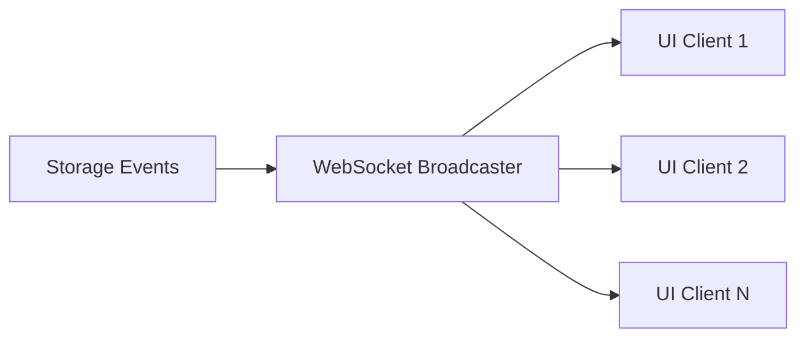
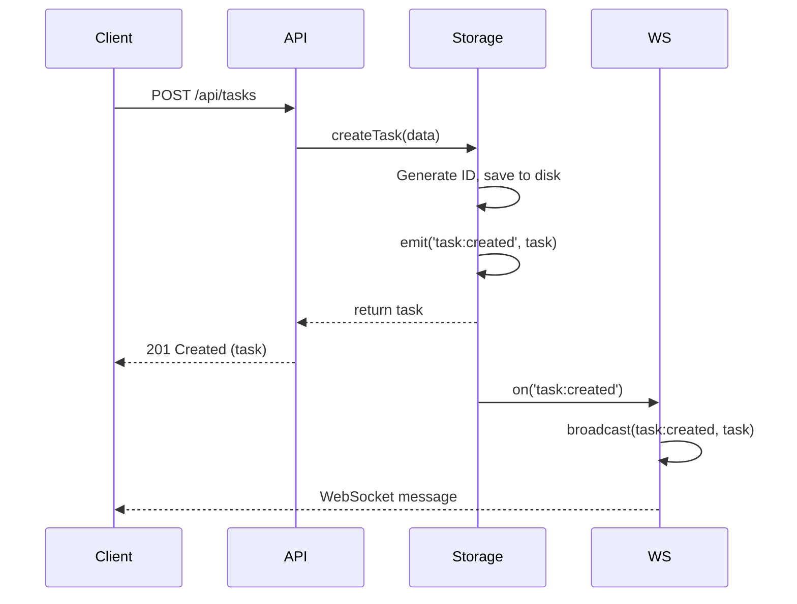
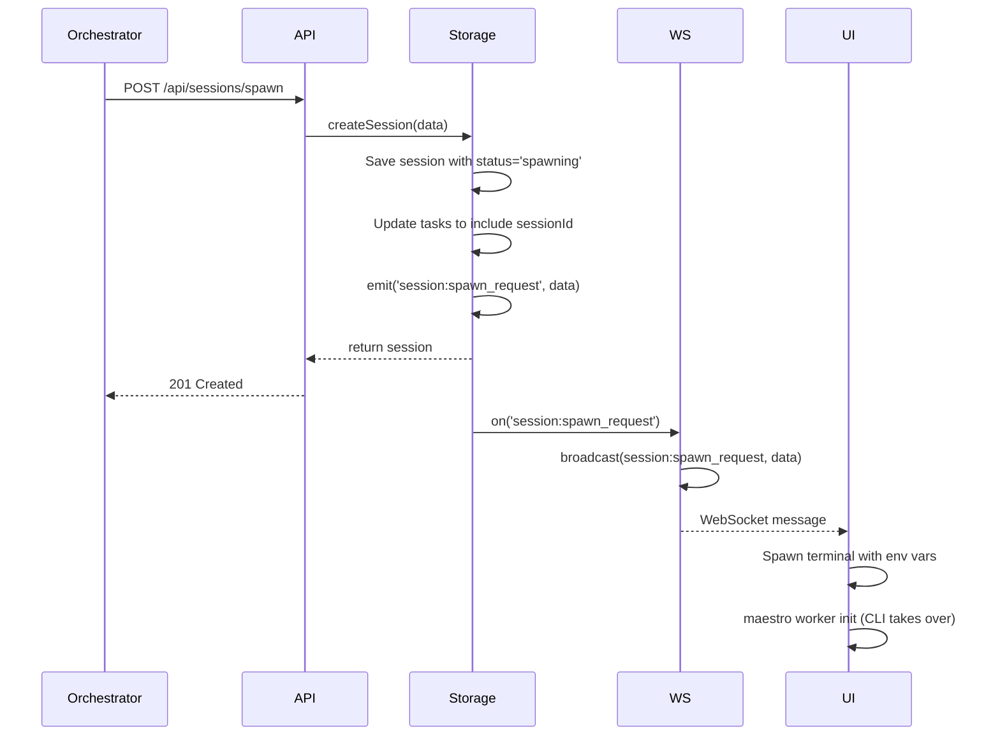
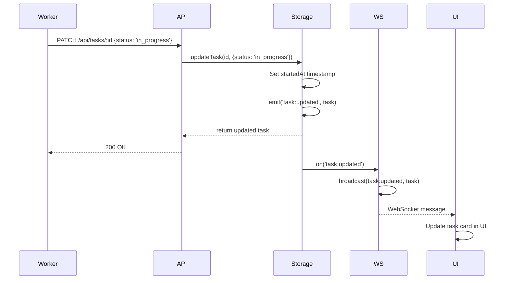

# Maestro Server - WebSocket Events

Complete documentation of the real-time event broadcasting system.

## Overview

The WebSocket server provides real-time updates to connected clients (UI) whenever server state changes.

**Architecture:**



## Connection Setup

### Server Side

**Location:** `src/websocket.ts`

```typescript
import { WebSocketServer, WebSocket } from 'ws';

// WebSocket server shares HTTP server port
const server = app.listen(3000);
const wss = new WebSocketServer({ server });

setupWebSocket(wss, storage);
```

### Client Side

```javascript
// Connect to WebSocket server
const ws = new WebSocket('ws://localhost:3000');

ws.addEventListener('open', () => {
  console.log('Connected to Maestro Server');
});

ws.addEventListener('message', (event) => {
  const message = JSON.parse(event.data);
  console.log('Event:', message.type, message.data);

  // Handle specific events
  switch (message.type) {
    case 'task:created':
      handleTaskCreated(message.data);
      break;
    case 'task:updated':
      handleTaskUpdated(message.data);
      break;
    // ... etc
  }
});

ws.addEventListener('close', () => {
  console.log('Disconnected from Maestro Server');
});

ws.addEventListener('error', (error) => {
  console.error('WebSocket error:', error);
});
```

## Message Format

All WebSocket messages follow this structure:

```json
{
  "type": "event_name",
  "event": "event_name",  // Duplicate for backward compatibility
  "data": {
    // Event-specific payload
  }
}
```

**Example:**
```json
{
  "type": "task:updated",
  "event": "task:updated",
  "data": {
    "id": "task_123",
    "title": "Updated Task",
    "status": "in_progress",
    "updatedAt": 1706789123456
  }
}
```

## Event Catalog

### Project Events

#### project:created

Emitted when a new project is created.

**Payload:** Complete Project object

```json
{
  "type": "project:created",
  "data": {
    "id": "proj_1706789123456_abc123",
    "name": "New Project",
    "workingDir": "/path/to/project",
    "description": "Project description",
    "createdAt": 1706789123456,
    "updatedAt": 1706789123456
  }
}
```

#### project:updated

Emitted when a project is modified.

**Payload:** Complete updated Project object

#### project:deleted

Emitted when a project is deleted.

**Payload:**
```json
{
  "type": "project:deleted",
  "data": {
    "id": "proj_123"
  }
}
```

---

### Task Events

#### task:created

Emitted when a new task is created.

**Payload:** Complete Task object

```json
{
  "type": "task:created",
  "data": {
    "id": "task_1706790000000_xyz789",
    "projectId": "proj_123",
    "parentId": null,
    "title": "New Task",
    "description": "Task details",
    "status": "pending",
    "priority": "medium",
    "sessionIds": [],
    "skillIds": [],
    "agentIds": [],
    "dependencies": [],
    "subtasks": [],
    "timeline": [
      {
        "id": "evt_001",
        "type": "created",
        "timestamp": 1706790000000,
        "message": "Task created"
      }
    ],
    "createdAt": 1706790000000,
    "updatedAt": 1706790000000,
    "startedAt": null,
    "completedAt": null,
    "initialPrompt": ""
  }
}
```

#### task:updated

Emitted when a task is modified (includes status changes, timeline updates, subtask changes).

**Payload:** Complete updated Task object

**Triggers:**
- Status change (pending → in_progress → completed)
- Title/description edit
- Priority change
- Timeline event added
- Session added/removed
- Subtask modified

#### task:deleted

Emitted when a task is deleted.

**Payload:**
```json
{
  "type": "task:deleted",
  "data": {
    "id": "task_123"
  }
}
```

---

### Session Events

#### session:created

Emitted when a new session is created.

**Payload:** Complete Session object

```json
{
  "type": "session:created",
  "data": {
    "id": "sess_1706792222222_lmn678",
    "projectId": "proj_123",
    "taskIds": ["task_001", "task_002"],
    "name": "Worker Session",
    "agentId": "agent_123",
    "env": {
      "MAESTRO_SESSION_ID": "sess_1706792222222_lmn678",
      "MAESTRO_PROJECT_ID": "proj_123"
    },
    "status": "running",
    "startedAt": 1706792222222,
    "lastActivity": 1706792222222,
    "completedAt": null,
    "hostname": "MacBook-Pro.local",
    "platform": "darwin",
    "events": [],
    "metadata": {
      "skills": ["maestro-worker"],
      "spawnedBy": null,
      "spawnReason": null
    }
  }
}
```

#### session:updated

Emitted when a session is modified.

**Payload:** Complete updated Session object

**Triggers:**
- Status change
- Task added/removed
- Event appended
- lastActivity timestamp updated

#### session:deleted

Emitted when a session is deleted.

**Payload:**
```json
{
  "type": "session:deleted",
  "data": {
    "id": "sess_123"
  }
}
```

#### session:spawn_request

**CRITICAL EVENT** - Triggers UI to spawn a terminal.

Emitted when `/api/sessions/spawn` endpoint is called.

**Payload:**
```json
{
  "type": "session:spawn_request",
  "data": {
    "session": {
      "id": "sess_789",
      "projectId": "proj_123",
      "taskIds": ["task_001"],
      "name": "Worker for task_001",
      "status": "spawning",
      "env": {},
      "metadata": {
        "skills": ["maestro-worker"],
        "spawnedBy": "orchestrator_sess_id",
        "spawnReason": "Task delegation"
      }
      // ... complete session object
    },
    "projectId": "proj_123",
    "taskIds": ["task_001"],
    "skillIds": ["maestro-worker"],
    "name": "Worker for task_001"
  }
}
```

**UI Response:**
1. Receive event
2. Get project details (working directory)
3. Spawn terminal with environment variables:
   ```bash
   MAESTRO_SESSION_ID=sess_789
   MAESTRO_PROJECT_ID=proj_123
   MAESTRO_TASK_IDS=task_001
   MAESTRO_SERVER_URL=http://localhost:3000
   MAESTRO_SKILLS=maestro-worker
   ```
4. CLI auto-initializes in terminal

---

### Phase IV-A: Bidirectional Relationship Events

#### session:task_added

Emitted when a task is added to a session.

**Payload:**
```json
{
  "type": "session:task_added",
  "data": {
    "sessionId": "sess_123",
    "taskId": "task_456"
  }
}
```

#### session:task_removed

Emitted when a task is removed from a session.

**Payload:**
```json
{
  "type": "session:task_removed",
  "data": {
    "sessionId": "sess_123",
    "taskId": "task_456"
  }
}
```

#### task:session_added

Emitted when a session is added to a task (mirrors `session:task_added`).

**Payload:**
```json
{
  "type": "task:session_added",
  "data": {
    "taskId": "task_456",
    "sessionId": "sess_123"
  }
}
```

#### task:session_removed

Emitted when a session is removed from a task (mirrors `session:task_removed`).

**Payload:**
```json
{
  "type": "task:session_removed",
  "data": {
    "taskId": "task_456",
    "sessionId": "sess_123"
  }
}
```

---

### Subtask Events

#### subtask:created

Emitted when a subtask is created.

**Payload:**
```json
{
  "type": "subtask:created",
  "data": {
    "taskId": "task_123",
    "subtask": {
      "id": "xyz789",
      "taskId": "task_123",
      "title": "New Subtask",
      "description": "Details",
      "completed": false,
      "order": 0,
      "createdAt": 1706793333333,
      "updatedAt": 1706793333333,
      "completedAt": null
    }
  }
}
```

**Note:** Also triggers `task:updated` event with full task object.

#### subtask:updated

Emitted when a subtask is modified.

**Payload:**
```json
{
  "type": "subtask:updated",
  "data": {
    "taskId": "task_123",
    "subtask": {
      "id": "xyz789",
      "taskId": "task_123",
      "title": "Updated Subtask",
      "completed": true,
      "updatedAt": 1706793444444,
      "completedAt": 1706793444444
      // ... complete updated subtask
    }
  }
}
```

**Note:** Also triggers `task:updated` event with full task object.

#### subtask:deleted

Emitted when a subtask is deleted.

**Payload:**
```json
{
  "type": "subtask:deleted",
  "data": {
    "taskId": "task_123",
    "subtaskId": "xyz789"
  }
}
```

**Note:** Also triggers `task:updated` event with full task object.

---

## Event Flow Diagrams

### Task Creation Flow



### Session Spawn Flow



### Task Status Update Flow



---

## Broadcast Implementation

### Global Broadcast Function

**Location:** `src/websocket.ts`

```typescript
function broadcast(event: string, data: any) {
  const message = JSON.stringify({
    type: event,
    event: event, // Duplicate for compatibility
    data
  });

  let sent = 0;
  clients.forEach(client => {
    if (client.readyState === WebSocket.OPEN) {
      client.send(message);
      sent++;
    }
  });

  if (process.env.DEBUG) {
    console.log(`📡 Broadcast to ${sent}/${clients.size} clients: ${event}`);
  }
}

// Make broadcast available globally
(global as any).wsBroadcast = broadcast;
```

### Storage Event Listeners

**Location:** `src/websocket.ts`

```typescript
// Listen to storage events
storage.on('task:created', (task) => {
  broadcast('task:created', task);
});

storage.on('task:updated', (task) => {
  broadcast('task:updated', task);
});

storage.on('task:deleted', (data) => {
  broadcast('task:deleted', data);
});

storage.on('session:created', (session) => {
  broadcast('session:created', session);
});

// ... etc for all events
```

---

## Client Implementation Examples

### React/TypeScript Client

```typescript
import { useEffect, useState } from 'react';

interface WebSocketMessage {
  type: string;
  event: string;
  data: any;
}

export function useWebSocket(url: string) {
  const [ws, setWs] = useState<WebSocket | null>(null);
  const [connected, setConnected] = useState(false);

  useEffect(() => {
    const socket = new WebSocket(url);

    socket.addEventListener('open', () => {
      console.log('WebSocket connected');
      setConnected(true);
    });

    socket.addEventListener('close', () => {
      console.log('WebSocket disconnected');
      setConnected(false);
    });

    socket.addEventListener('error', (error) => {
      console.error('WebSocket error:', error);
    });

    setWs(socket);

    return () => {
      socket.close();
    };
  }, [url]);

  return { ws, connected };
}

// Usage in component
export function TaskList() {
  const { ws } = useWebSocket('ws://localhost:3000');
  const [tasks, setTasks] = useState<Task[]>([]);

  useEffect(() => {
    if (!ws) return;

    const handler = (event: MessageEvent) => {
      const message: WebSocketMessage = JSON.parse(event.data);

      switch (message.type) {
        case 'task:created':
          setTasks(prev => [...prev, message.data]);
          break;
        case 'task:updated':
          setTasks(prev =>
            prev.map(t => t.id === message.data.id ? message.data : t)
          );
          break;
        case 'task:deleted':
          setTasks(prev => prev.filter(t => t.id !== message.data.id));
          break;
      }
    };

    ws.addEventListener('message', handler);
    return () => ws.removeEventListener('message', handler);
  }, [ws]);

  return <div>{/* Render tasks */}</div>;
}
```

### Event Filtering

```typescript
// Filter events by project
function handleMessage(message: WebSocketMessage) {
  const currentProjectId = 'proj_123';

  switch (message.type) {
    case 'task:created':
    case 'task:updated':
      if (message.data.projectId === currentProjectId) {
        updateTaskInUI(message.data);
      }
      break;

    case 'session:created':
      if (message.data.projectId === currentProjectId) {
        addSessionToUI(message.data);
      }
      break;
  }
}
```

---

## Connection Management

### Reconnection Strategy

The server does not implement automatic reconnection. Clients should:

```typescript
class WebSocketClient {
  private ws: WebSocket | null = null;
  private reconnectInterval = 5000;
  private maxReconnectAttempts = 10;
  private reconnectAttempts = 0;

  connect(url: string) {
    this.ws = new WebSocket(url);

    this.ws.addEventListener('open', () => {
      console.log('Connected');
      this.reconnectAttempts = 0;
    });

    this.ws.addEventListener('close', () => {
      console.log('Disconnected');
      this.attemptReconnect(url);
    });

    this.ws.addEventListener('error', (error) => {
      console.error('Error:', error);
    });
  }

  private attemptReconnect(url: string) {
    if (this.reconnectAttempts >= this.maxReconnectAttempts) {
      console.error('Max reconnection attempts reached');
      return;
    }

    this.reconnectAttempts++;
    console.log(`Reconnecting (${this.reconnectAttempts}/${this.maxReconnectAttempts})...`);

    setTimeout(() => {
      this.connect(url);
    }, this.reconnectInterval);
  }
}
```

### Heartbeat/Ping-Pong

Currently not implemented. For production, add:

```typescript
// Server side
wss.on('connection', (ws) => {
  const interval = setInterval(() => {
    if (ws.readyState === WebSocket.OPEN) {
      ws.ping();
    }
  }, 30000); // Ping every 30s

  ws.on('close', () => {
    clearInterval(interval);
  });
});

// Client side
ws.addEventListener('ping', () => {
  ws.pong();
});
```

---

## Debugging

### Enable Debug Logging

```bash
DEBUG=1 npm start
```

This logs every broadcast:

```
📡 Broadcast to 2/2 clients: task:updated
📡 Broadcast to 2/2 clients: session:spawn_request
```

### Monitor WebSocket Traffic

Using browser DevTools:

1. Open DevTools → Network tab
2. Filter by "WS" (WebSocket)
3. Click on connection
4. View "Messages" tab

### Test Events Manually

```typescript
// In browser console (if connected to WebSocket)
ws.send(JSON.stringify({
  type: 'ping',
  data: { test: true }
}));
```

---

## Performance Considerations

### Current Implementation

- **No filtering:** All events sent to all connected clients
- **No compression:** Messages sent as plain JSON
- **No batching:** Each event sent immediately

### Potential Optimizations

1. **Client-side filtering:** Clients specify which events they want
2. **Compression:** Use permessage-deflate extension
3. **Batching:** Group rapid events into batches
4. **Rate limiting:** Throttle high-frequency events
5. **Selective broadcasting:** Only send to relevant clients (by project)

---

## Security

### Current State

- No authentication
- No authorization
- All clients receive all events

### Production Considerations

1. **Authentication:** Require token on connection
2. **Authorization:** Filter events by user permissions
3. **Rate limiting:** Prevent event flooding
4. **Input validation:** Sanitize event data
5. **TLS/WSS:** Use secure WebSocket (wss://)

---

## Testing

### Manual Testing with wscat

```bash
npm install -g wscat
wscat -c ws://localhost:3000

# Wait for events...
# Create a task in another terminal:
curl -X POST http://localhost:3000/api/tasks \
  -H "Content-Type: application/json" \
  -d '{"projectId":"proj_123","title":"Test Task"}'

# You should see task:created event
```

### Automated Testing

```typescript
import WebSocket from 'ws';

describe('WebSocket Events', () => {
  let ws: WebSocket;

  beforeEach(() => {
    ws = new WebSocket('ws://localhost:3000');
    await new Promise(resolve => ws.once('open', resolve));
  });

  afterEach(() => {
    ws.close();
  });

  it('broadcasts task:created event', (done) => {
    ws.on('message', (data) => {
      const message = JSON.parse(data.toString());
      if (message.type === 'task:created') {
        expect(message.data).toHaveProperty('id');
        expect(message.data).toHaveProperty('title');
        done();
      }
    });

    // Trigger task creation
    fetch('http://localhost:3000/api/tasks', {
      method: 'POST',
      headers: { 'Content-Type': 'application/json' },
      body: JSON.stringify({
        projectId: 'proj_123',
        title: 'Test Task'
      })
    });
  });
});
```
