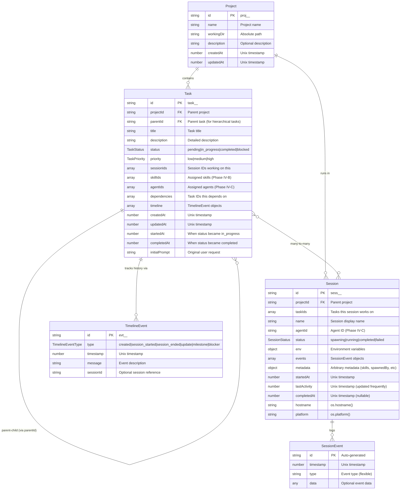

# Maestro Server - Data Models

Complete schema documentation for all entities, their fields, types, and relationships.

## Entity Relationship Diagram



---

## Project

A project represents a codebase or workspace with a working directory.

### Schema

```typescript
interface Project {
  id: string;                // Primary key: proj_<timestamp>_<random>
  name: string;              // Display name
  workingDir: string;        // Absolute file system path
  description?: string;      // Optional markdown description
  createdAt: number;         // Unix timestamp (milliseconds)
  updatedAt: number;         // Unix timestamp (milliseconds)
}
```

### Field Details

| Field | Type | Required | Description |
|-------|------|----------|-------------|
| `id` | string | Yes | Generated by `storage.makeId('proj')` |
| `name` | string | Yes | User-provided project name |
| `workingDir` | string | No | Absolute path to project directory |
| `description` | string | No | Markdown-formatted project description |
| `createdAt` | number | Yes | Timestamp when project was created |
| `updatedAt` | number | Yes | Timestamp of last modification |

### Validation Rules

- `name` must be non-empty
- `workingDir` should be absolute path (not enforced)
- Cannot delete project with existing tasks or sessions

### Example

```json
{
  "id": "proj_1706789123456_k2j4n5l6m",
  "name": "E-commerce Platform",
  "workingDir": "/Users/dev/projects/ecommerce",
  "description": "Main e-commerce platform with React frontend and Node.js backend",
  "createdAt": 1706789123456,
  "updatedAt": 1706789234567
}
```

---

## Task

A task represents a unit of work within a project. Tasks can have child tasks (via parentId) and be worked on by multiple sessions.

### Schema

```typescript
interface Task {
  // Identity
  id: string;
  projectId: string;
  parentId: string | null;

  // Content
  title: string;
  description: string;
  initialPrompt: string;

  // Status
  status: TaskStatus;           // 'pending' | 'in_progress' | 'completed' | 'blocked'
  priority: TaskPriority;       // 'low' | 'medium' | 'high'

  // Relationships (Phase IV-A: Many-to-many)
  sessionIds: string[];         // Sessions working on this task
  skillIds: string[];           // Skills assigned (Phase IV-B, future)
  agentIds: string[];           // Agents assigned (Phase IV-C, future)
  dependencies: string[];       // Task IDs this depends on

  // Nested data
  timeline: TimelineEvent[];    // Event history

  // Timestamps
  createdAt: number;
  updatedAt: number;
  startedAt: number | null;     // Set when status becomes 'in_progress'
  completedAt: number | null;   // Set when status becomes 'completed'
}
```

### Field Details

| Field | Type | Required | Description |
|-------|------|----------|-------------|
| `id` | string | Yes | Generated by `storage.makeId('task')` |
| `projectId` | string | Yes | Foreign key to Project |
| `parentId` | string | No | Parent task ID for hierarchical tasks |
| `title` | string | Yes | Brief task title |
| `description` | string | No | Detailed task description (markdown) |
| `initialPrompt` | string | No | Original user request that created task |
| `status` | TaskStatus | Yes | Current status (default: 'pending') |
| `priority` | TaskPriority | Yes | Priority level (default: 'medium') |
| `sessionIds` | string[] | Yes | Array of session IDs (default: []) |
| `skillIds` | string[] | Yes | Array of skill IDs (default: []) |
| `agentIds` | string[] | Yes | Array of agent IDs (default: []) |
| `dependencies` | string[] | Yes | Array of task IDs (default: []) |
| `timeline` | TimelineEvent[] | Yes | Event history (default: [created event]) |
| `createdAt` | number | Yes | Creation timestamp |
| `updatedAt` | number | Yes | Last update timestamp |
| `startedAt` | number | No | When task started (null if not started) |
| `completedAt` | number | No | When task completed (null if not done) |

### Status Enum

```typescript
type TaskStatus = 'pending' | 'in_progress' | 'completed' | 'blocked';
```

**Transitions:**
- `pending` → `in_progress` (sets `startedAt`)
- `in_progress` → `completed` (sets `completedAt`)
- `in_progress` → `blocked` (task cannot proceed)
- `blocked` → `in_progress` (blocker resolved)

### Priority Enum

```typescript
type TaskPriority = 'low' | 'medium' | 'high';
```

### Example

**Parent Task:**
```json
{
  "id": "task_1706790000000_xyz789",
  "projectId": "proj_1706789123456_k2j4n5l6m",
  "parentId": null,
  "title": "Implement user authentication",
  "description": "Add JWT-based authentication with login, logout, and token refresh",
  "initialPrompt": "add user auth to the app",
  "status": "in_progress",
  "priority": "high",
  "sessionIds": ["sess_1706792222222_lmn678"],
  "skillIds": [],
  "agentIds": [],
  "dependencies": [],
  "timeline": [
    {
      "id": "evt_001",
      "type": "created",
      "timestamp": 1706790000000,
      "message": "Task created"
    },
    {
      "id": "evt_002",
      "type": "session_started",
      "timestamp": 1706792222222,
      "sessionId": "sess_1706792222222_lmn678"
    }
  ],
  "createdAt": 1706790000000,
  "updatedAt": 1706792500000,
  "startedAt": 1706792222222,
  "completedAt": null
}
```

**Child Tasks (same entity type, different parentId):**
```json
{
  "id": "task_1706790100000_abc123",
  "projectId": "proj_1706789123456_k2j4n5l6m",
  "parentId": "task_1706790000000_xyz789",
  "title": "Create User model",
  "description": "Define User schema with email, password hash",
  "status": "completed",
  "priority": "medium",
  "sessionIds": ["sess_1706792222222_lmn678"],
  "skillIds": [],
  "agentIds": [],
  "dependencies": [],
  "timeline": [
    {
      "id": "evt_001",
      "type": "created",
      "timestamp": 1706790100000,
      "message": "Task created"
    }
  ],
  "createdAt": 1706790100000,
  "updatedAt": 1706790200000,
  "startedAt": 1706790100000,
  "completedAt": 1706790200000
}
```

---

## Session

A session represents an active agent session (CLI instance) working on tasks.

### Schema

```typescript
interface Session {
  // Identity
  id: string;
  projectId: string;
  name: string;

  // Relationships (Phase IV-A: Many-to-many)
  taskIds: string[];            // Tasks this session works on

  // Assignment (Phase IV-C, future)
  agentId?: string;             // Specific agent running this session

  // Status
  status: SessionStatus;        // 'spawning' | 'running' | 'completed' | 'failed'

  // Environment
  env: Record<string, string>;  // Environment variables for CLI

  // Events
  events: SessionEvent[];       // Session activity log

  // Metadata
  metadata?: Record<string, any>; // Flexible metadata (skills, spawnedBy, etc)

  // Timestamps
  startedAt: number;
  lastActivity: number;         // Updated on any activity
  completedAt: number | null;

  // System info
  hostname: string;             // os.hostname()
  platform: string;             // os.platform()
}
```

### Field Details

| Field | Type | Required | Description |
|-------|------|----------|-------------|
| `id` | string | Yes | Generated by `storage.makeId('sess')` or user-provided |
| `projectId` | string | Yes | Foreign key to Project |
| `taskIds` | string[] | Yes | Array of task IDs (default: []) |
| `name` | string | Yes | Display name for session |
| `agentId` | string | No | Agent ID (Phase IV-C) |
| `status` | SessionStatus | Yes | Current status (default: 'running') |
| `env` | object | Yes | Environment variables (default: {}) |
| `events` | SessionEvent[] | Yes | Activity log (default: []) |
| `metadata` | object | No | Flexible metadata storage |
| `startedAt` | number | Yes | When session was created |
| `lastActivity` | number | Yes | Last update timestamp |
| `completedAt` | number | No | When session ended (null if active) |
| `hostname` | string | Yes | Hostname where session runs |
| `platform` | string | Yes | OS platform (darwin, linux, win32) |

### Status Enum

```typescript
type SessionStatus = 'spawning' | 'running' | 'completed' | 'failed';
```

**States:**
- `spawning` - Session created, UI spawning terminal
- `running` - Terminal spawned, CLI active
- `completed` - Session finished successfully
- `failed` - Session encountered fatal error

### Metadata Schema

While `metadata` is flexible, common fields:

```typescript
interface SessionMetadata {
  skills?: string[];                                              // Skill names (e.g., ['maestro-worker'])
  spawnSource?: 'manual' | 'orchestrator' | 'ui' | 'cli' | 'api'; // Who/what initiated spawn
  spawnedBy?: string;                                             // Parent session ID (if spawned by agent)
  spawnReason?: string;                                           // Why session was spawned
  context?: {                                                     // Additional context
    projectOverview?: string;
    workflowSteps?: string[];
  };
}
```

**Spawn Source Types:**
- `manual` - User clicked "Start Task" button in UI
- `orchestrator` - Spawned by orchestrator agent
- `ui` - UI automation/workflows
- `cli` - Direct CLI invocation
- `api` - External API call (CI/CD, webhooks, etc.)

**Spawn Tracking:**
- `spawnSource` indicates who/what initiated the spawn
- `spawnedBy` contains session ID if spawned by another agent
- Enables analytics, debugging, and workflow visualization

### Example

```json
{
  "id": "sess_1706792222222_lmn678",
  "projectId": "proj_1706789123456_k2j4n5l6m",
  "taskIds": ["task_1706790000000_xyz789", "task_1706790111111_uvw012"],
  "name": "Worker: User Auth",
  "agentId": null,
  "status": "running",
  "env": {
    "MAESTRO_SESSION_ID": "sess_1706792222222_lmn678",
    "MAESTRO_PROJECT_ID": "proj_1706789123456_k2j4n5l6m",
    "MAESTRO_TASK_IDS": "task_1706790000000_xyz789,task_1706790111111_uvw012",
    "MAESTRO_SERVER_URL": "http://localhost:3000",
    "MAESTRO_SKILLS": "maestro-worker"
  },
  "events": [
    {
      "id": "evt_001",
      "timestamp": 1706792222222,
      "type": "spawn",
      "data": { "trigger": "orchestrator" }
    },
    {
      "id": "evt_002",
      "timestamp": 1706792300000,
      "type": "task_start",
      "data": { "taskId": "task_1706790000000_xyz789" }
    }
  ],
  "metadata": {
    "skills": ["maestro-worker"],
    "spawnSource": "orchestrator",
    "spawnedBy": "sess_orchestrator_123",
    "spawnReason": "Task delegation for auth implementation"
  },
  "startedAt": 1706792222222,
  "lastActivity": 1706792500000,
  "completedAt": null,
  "hostname": "MacBook-Pro.local",
  "platform": "darwin"
}
```

---

## Hierarchical Tasks

Tasks support parent-child relationships via the `parentId` field. A child task is simply a Task with `parentId` set to another task's ID.

### Benefits

- **Full Task Capabilities**: Child tasks have all properties of regular tasks (status, sessions, timeline, dependencies)
- **Recursive Nesting**: Tasks can have children, which can have children, etc.
- **Independent Tracking**: Each child task can be worked on by different sessions
- **Flexible Status**: Child tasks have their own status lifecycle (pending → in_progress → completed)

### Querying Child Tasks

```typescript
// Get all child tasks of a parent
GET /api/tasks?parentId=task_123

// Get root tasks only (no parent)
GET /api/tasks?parentId=null

// Convenience endpoint
GET /api/tasks/:id/children
```

### Example Hierarchy

```
Task: "Implement Authentication" (parentId: null)
  └─ Task: "Create User model" (parentId: task_001)
  └─ Task: "Add JWT generation" (parentId: task_001)
  └─ Task: "Write auth tests" (parentId: task_001)
     └─ Task: "Unit tests" (parentId: task_004)
     └─ Task: "Integration tests" (parentId: task_004)
```

---

## TimelineEvent

A timeline event tracks task history (creation, updates, session changes, milestones, blockers).

### Schema

```typescript
interface TimelineEvent {
  id: string;                               // evt_<timestamp>_<random>
  type: TimelineEventType;
  timestamp: number;
  message?: string;                         // Optional description
  sessionId?: string;                       // Optional session reference
}

type TimelineEventType =
  | 'created'           // Task created
  | 'session_started'   // Session started working on task
  | 'session_ended'     // Session stopped working on task
  | 'update'            // General progress update
  | 'milestone'         // Significant milestone reached
  | 'blocker';          // Blocker encountered
```

### Example

```json
{
  "id": "evt_1706792500000_abc123",
  "type": "milestone",
  "timestamp": 1706792500000,
  "message": "All authentication endpoints implemented and tested",
  "sessionId": "sess_1706792222222_lmn678"
}
```

---

## SessionEvent

A session event logs activity within a session. Schema is flexible to support various event types.

### Schema

```typescript
interface SessionEvent {
  id: string;                   // Auto-generated
  timestamp: number;            // Unix timestamp
  type: string;                 // Event type (flexible)
  data?: any;                   // Optional event-specific data
}
```

### Common Event Types

| Type | Description | Data Schema |
|------|-------------|-------------|
| `spawn` | Session spawned | `{ trigger: string }` |
| `task_start` | Started working on task | `{ taskId: string }` |
| `task_complete` | Completed task | `{ taskId: string }` |
| `command` | CLI command executed | `{ command: string, exitCode: number }` |
| `log` | General log message | `{ level: string, message: string }` |
| `error` | Error occurred | `{ error: string, stack?: string }` |

### Example

```json
{
  "id": "evt_abc123",
  "timestamp": 1706792600000,
  "type": "command",
  "data": {
    "command": "npm test",
    "exitCode": 0,
    "duration": 3452
  }
}
```

---

## API Request/Response Types

### CreateTaskPayload

```typescript
interface CreateTaskPayload {
  projectId: string;            // Required
  parentId?: string;            // Optional: parent task ID
  title: string;                // Required
  description?: string;         // Optional
  priority?: TaskPriority;      // Optional (default: 'medium')
  initialPrompt?: string;       // Optional
}
```

### UpdateTaskPayload

```typescript
interface UpdateTaskPayload {
  title?: string;
  description?: string;
  status?: TaskStatus;
  priority?: TaskPriority;
  parentId?: string | null;     // Update parent relationship
  sessionIds?: string[];        // Replace session IDs
  skillIds?: string[];          // Phase IV-B
  agentIds?: string[];          // Phase IV-C
  timeline?: TimelineEvent[];   // Append timeline events
}
```

### CreateSessionPayload

```typescript
interface CreateSessionPayload {
  id?: string;                  // Optional (server generates if omitted)
  projectId: string;            // Required
  taskIds: string[];            // Required (Phase IV-A)
  name?: string;                // Optional
  agentId?: string;             // Optional (Phase IV-C)
  status?: SessionStatus;       // Optional (default: 'running')
  env?: Record<string, string>; // Optional
  metadata?: Record<string, any>; // Optional
}
```

### UpdateSessionPayload

```typescript
interface UpdateSessionPayload {
  taskIds?: string[];           // Update task assignments
  status?: SessionStatus;
  agentId?: string;
  events?: SessionEvent[];      // Append events
}
```

---

## Data Relationships

### Task ↔ Session (Many-to-Many)

**Forward:** Task has `sessionIds: string[]`
**Backward:** Session has `taskIds: string[]`

**Use Cases:**
- One task, multiple sessions (parallel workers)
- One session, multiple tasks (orchestrator managing workflow)

**Maintenance:**
- When adding task to session: update both task.sessionIds and session.taskIds
- When removing: clean up both sides
- Storage layer handles bidirectional updates

### Task → Task (Hierarchical, via parentId)

**Self-referential:** Tasks can have parent tasks via `parentId` field

**Benefits:**
- Child tasks are full Task entities with all capabilities
- Support for recursive nesting (unlimited depth)
- Each child task can have its own sessions, status, timeline

**Query Patterns:**
- `listTasks({ parentId: 'task_123' })` - Get all child tasks
- `listTasks({ parentId: null })` - Get root tasks only

### Task → TimelineEvent (One-to-Many)

**Embedded:** Timeline events stored as array in Task object

**Append-only:** New events appended, never removed

---

## Indexes and Queries

### By Project ID

**Tasks:** `listTasks({ projectId: 'proj_123' })`
**Sessions:** `listSessions({ projectId: 'proj_123' })`

### By Status

**Tasks:** `listTasks({ status: 'in_progress' })`
**Sessions:** `listSessions({ status: 'running' })`

### By Task ID

**Sessions:** `listSessions({ taskId: 'task_123' })`
Returns all sessions working on this task.

### By Parent ID

**Tasks:** `listTasks({ parentId: 'task_123' })`
Returns all child tasks of a parent.

**Root Tasks:** `listTasks({ parentId: null })`
Returns all tasks without a parent.

### Active Sessions

**Sessions:** `listSessions({ active: true })`
Filters out `completed` and `failed` sessions.

---

## JSON Storage Format

All entities stored as pretty-printed JSON with 2-space indentation:

```json
{
  "id": "task_1706790000000_xyz789",
  "projectId": "proj_1706789123456_k2j4n5l6m",
  "title": "Task Title",
  "description": "Description",
  "status": "pending",
  ...
}
```

**Benefits:**
- Human-readable
- Git-friendly (line-by-line diffs)
- Easy debugging

---