# Maestro Server - End-to-End Flows

Complete documentation of all major workflows and user journeys through the system.

## Table of Contents

1. [Project Setup Flow](#project-setup-flow)
2. [Task Creation Flow](#task-creation-flow)
3. [Session Spawn Flow](#session-spawn-flow)
4. [Task Execution Flow](#task-execution-flow)
5. [Hierarchical Task Creation Flow](#hierarchical-task-creation-flow)
6. [Session Completion Flow](#session-completion-flow)
7. [Task Status Lifecycle](#task-status-lifecycle)
8. [Bidirectional Relationship Management](#bidirectional-relationship-management)
9. [Error Handling Flows](#error-handling-flows)
10. [Real-time Update Flow](#real-time-update-flow)

---

## Project Setup Flow

**Actor:** User (via UI or API)

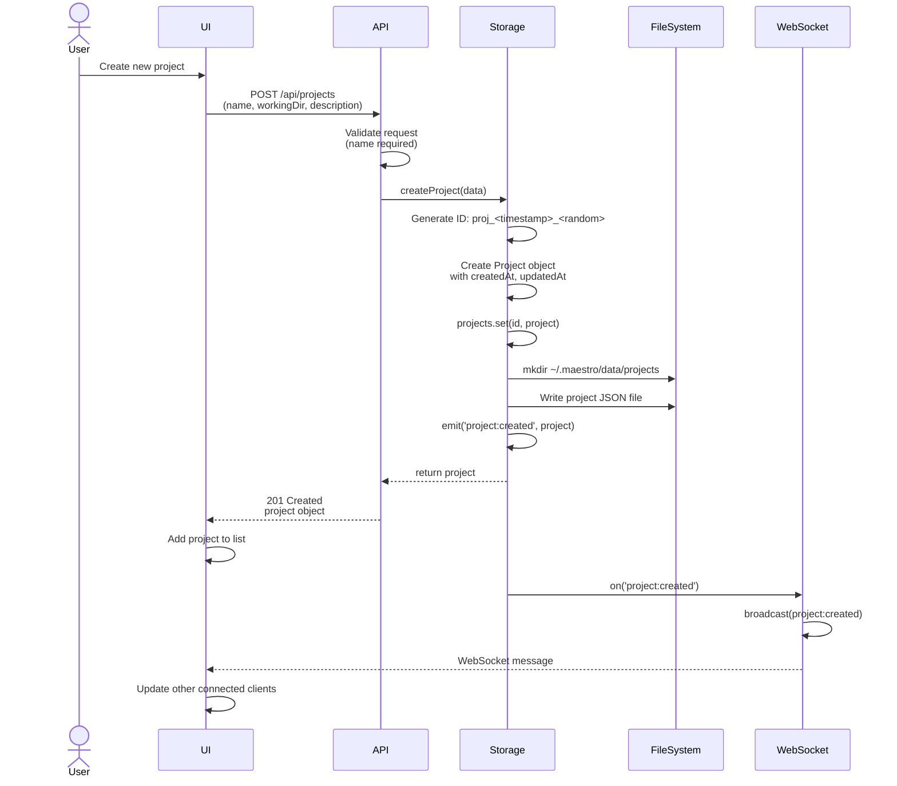

**Steps:**

1. User provides project name and optional working directory
2. API validates required fields
3. Storage generates unique project ID
4. Project saved to in-memory map
5. Project persisted to disk at `~/.maestro/data/projects/{id}.json`
6. `project:created` event emitted
7. WebSocket broadcasts to all connected clients
8. UI updates to show new project

**Edge Cases:**

- Empty project name → 400 validation error
- Invalid working directory → Accepted (not validated)
- Duplicate project name → Allowed (IDs are unique)

---

## Task Creation Flow

**Actor:** User or CLI

```mermaid
sequenceDiagram
    actor Actor
    participant API
    participant Storage
    participant FileSystem
    participant WebSocket

    Actor->>API: POST /api/tasks<br/>(projectId, title, description, priority)
    API->>API: Validate<br/>(projectId, title required)

    API->>Storage: createTask(payload)

    Storage->>Storage: Generate ID: task_<timestamp>_<random>
    Storage->>Storage: Create Task object with defaults:<br/>- status: 'pending'<br/>- priority: 'medium'<br/>- sessionIds: []<br/>- subtasks: []<br/>- timeline: [created event]

    Storage->>Storage: tasks.set(id, task)

    Storage->>FileSystem: mkdir ~/.maestro/data/tasks/{projectId}
    Storage->>FileSystem: Write task JSON file

    Storage->>Storage: emit('task:created', task)
    Storage-->>API: return task

    API-->>Actor: 201 Created<br/>task object

    Storage->>WebSocket: on('task:created')
    WebSocket->>WebSocket: broadcast(task:created, task)
    WebSocket-->>Actor: WebSocket update
```

**Steps:**

1. Actor provides task details (projectId, title required)
2. API validates payload
3. Storage generates task ID
4. Task initialized with default values:
   - `status: 'pending'`
   - `priority: 'medium'`
   - Empty arrays for sessionIds, subtasks, dependencies
   - Timeline with initial "created" event
5. Task saved to in-memory map and disk
6. Event broadcast to WebSocket clients
7. UI displays new task

**Default Timeline Event:**

```json
{
  "id": "evt_<timestamp>_<random>",
  "type": "created",
  "timestamp": 1706790000000,
  "message": "Task created"
}
```

---

## Session Spawn Flow

**CRITICAL:** This is the core orchestration flow that triggers terminal spawning.

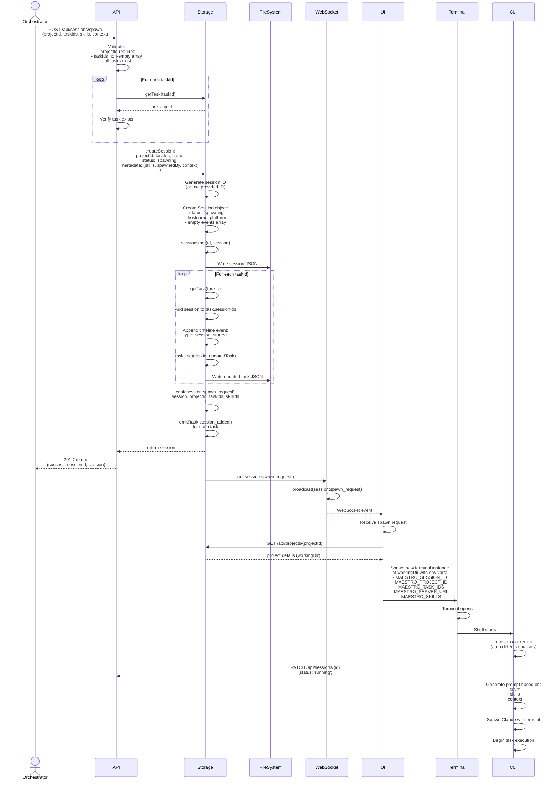

**Key Points:**

1. **Server Does NOT Generate Prompts:** Server only stores data and emits events
2. **UI Spawns Terminal:** UI receives WebSocket event and opens terminal with env vars
3. **CLI Takes Over:** CLI reads env vars, generates prompts, spawns Claude
4. **Session Status:** `spawning` → `running` when CLI connects

**Environment Variables Set by UI:**

```bash
MAESTRO_SESSION_ID=sess_1706792222222_lmn678
MAESTRO_PROJECT_ID=proj_1706789123456_k2j4n5l6m
MAESTRO_TASK_IDS=task_001,task_002
MAESTRO_SERVER_URL=http://localhost:3000
MAESTRO_SKILLS=maestro-worker
```

**Spawn Request Error Codes:**

- `missing_project_id` (400)
- `invalid_task_ids` (400)
- `task_not_found` (404)
- `spawn_error` (500)

---

## Task Execution Flow

**Actor:** Worker Session (CLI + Claude)

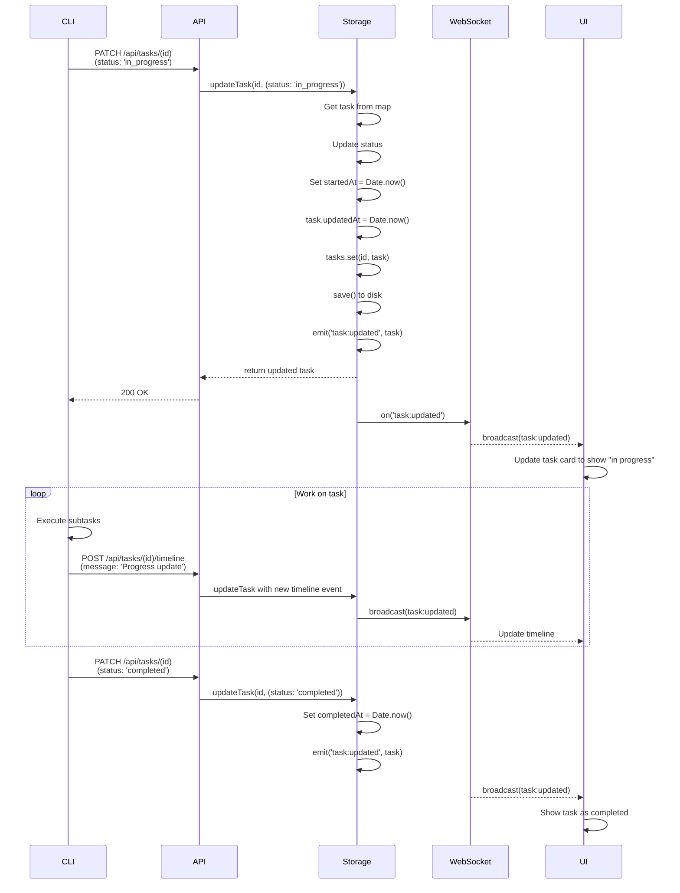

**Status Transitions:**

1. **pending → in_progress**
   - Sets `startedAt` timestamp
   - Session begins work

2. **in_progress → completed**
   - Sets `completedAt` timestamp
   - Task finished

3. **in_progress → blocked**
   - Task cannot proceed
   - Blocker must be resolved

**Timeline Updates:**

Workers can add timeline events at any time:

```bash
POST /api/tasks/{id}/timeline
{
  "type": "update",
  "message": "Completed User model implementation"
}
```

---

## Hierarchical Task Creation Flow

**Actor:** User, Orchestrator, or CLI

Tasks support parent-child relationships via the `parentId` field, allowing for recursive task decomposition.

### Create Child Task

```mermaid
sequenceDiagram
    participant Actor
    participant API
    participant Storage
    participant FileSystem
    participant WebSocket
    participant UI

    Actor->>API: POST /api/tasks<br/>(parentId: task-1, title: Create User model)

    API->>API: Validate:<br/>- title required<br/>- projectId required<br/>- parentId exists (if provided)

    API->>Storage: createTask(payload)

    Storage->>Storage: Generate ID: task_<timestamp>_<random>
    Storage->>Storage: Set parentId: task-1
    Storage->>Storage: Create Task with full capabilities:<br/>- status: 'pending'<br/>- sessionIds: []<br/>- timeline: [created event]

    Storage->>Storage: tasks.set(id, task)
    Storage->>FileSystem: Write task JSON file

    Storage->>Storage: emit('task:created', task)
    Storage-->>API: return task

    API-->>Actor: 201 Created (full Task object)

    Storage->>WebSocket: broadcast(task:created)
    WebSocket-->>UI: Task created event
    UI->>UI: Add child task to hierarchy view
```

### Query Child Tasks

```mermaid
sequenceDiagram
    participant Actor
    participant API
    participant Storage

    Actor->>API: GET /api/tasks/task-1/children

    API->>Storage: listTasks(parentId: task-1)
    Storage->>Storage: Filter tasks by parentId
    Storage-->>API: Array of child tasks

    API-->>Actor: 200 OK (child tasks array)
```

**Child Task Benefits:**

- **Full Task Entity**: Child tasks have all properties (status, priority, timeline, dependencies, sessions)
- **Independent Sessions**: Each child can have its own worker sessions
- **Recursive Nesting**: Children can have children (unlimited depth)
- **Independent Lifecycle**: Child status independent of parent status

**Example Hierarchy:**

```
task-1: Implement authentication (parentId: null)
  ├─ task-2: Create User model (parentId: task-1)
  ├─ task-3: Add JWT middleware (parentId: task-1)
  │  ├─ task-4: Write middleware (parentId: task-3)
  │  └─ task-5: Add tests (parentId: task-3)
  └─ task-6: Documentation (parentId: task-1)
```

---

## Session Completion Flow

**Actor:** Worker CLI or Orchestrator

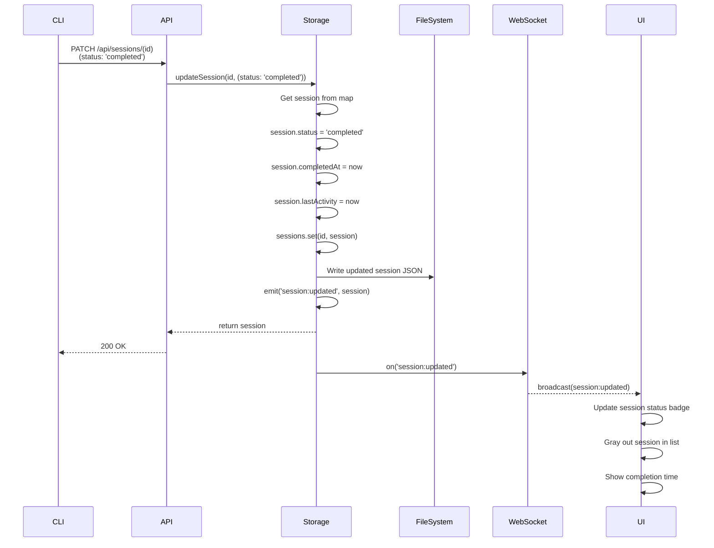

**Completion Triggers:**

1. **Manual:** Worker calls `maestro session complete`
2. **Automatic:** Worker task finished, CLI exits
3. **Orchestrator:** Marks session complete after validation

**Session Cleanup:**

- Session is NOT deleted (kept for history)
- Tasks retain session ID in their sessionIds array
- Timeline events preserved

---

## Task Status Lifecycle

Complete state machine for task status transitions.

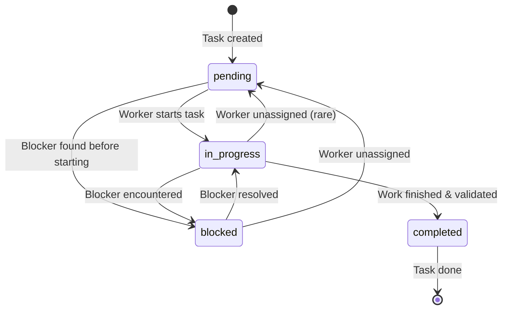

**State Descriptions:**

| Status | Description | Timestamps Set |
|--------|-------------|----------------|
| `pending` | Task created, not yet started | `createdAt` |
| `in_progress` | Work actively happening | `startedAt` (if not set) |
| `blocked` | Cannot proceed due to blocker | None |
| `completed` | Work finished and verified | `completedAt` (if not set) |

**Blocking Scenarios:**

- Missing dependencies
- Unclear requirements
- External service down
- Waiting for user input

**Unblocking:**

1. Orchestrator resolves blocker
2. Task status updated to `in_progress`
3. Worker notified via WebSocket event
4. Worker resumes work

---

## Bidirectional Relationship Management

Phase IV-A: Many-to-many relationships between tasks and sessions.

### Add Task to Session

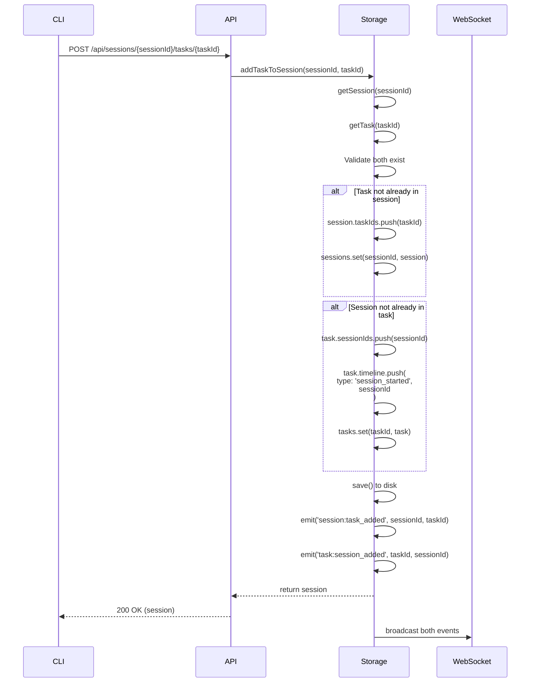

### Remove Task from Session

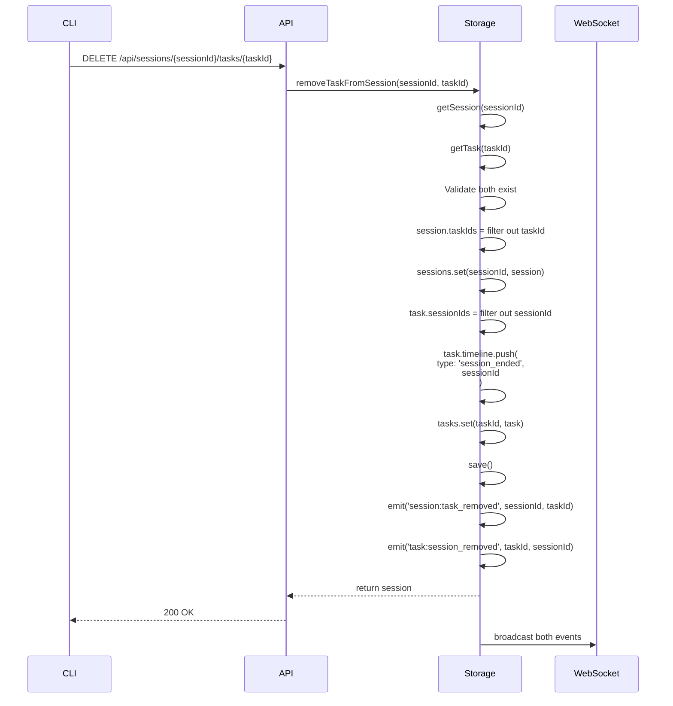

**Use Cases:**

1. **Orchestrator reassigns task** from one worker to another
2. **Worker completes task** and is assigned new task
3. **Session context changes** during execution

---

## Error Handling Flows

### Task Not Found

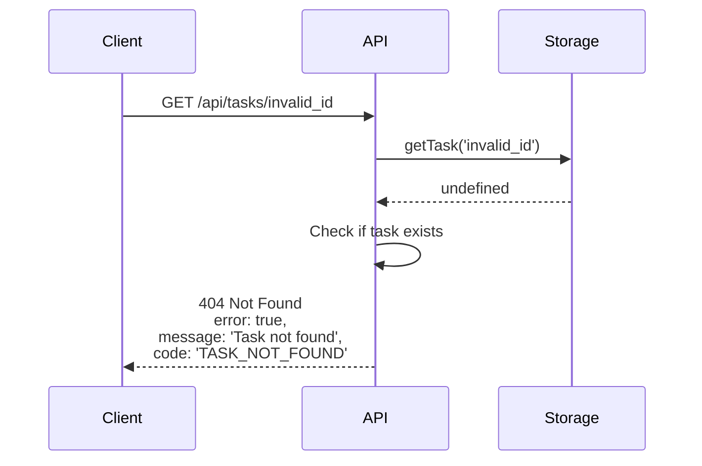

### Project with Dependencies

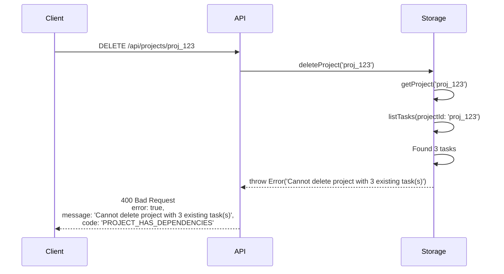

### Spawn with Invalid Task

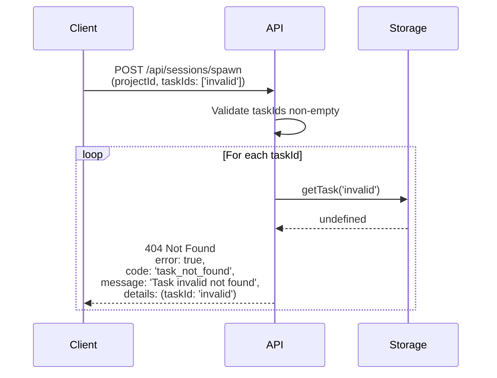

---

## Real-time Update Flow

**Scenario:** Multiple UIs observing same project

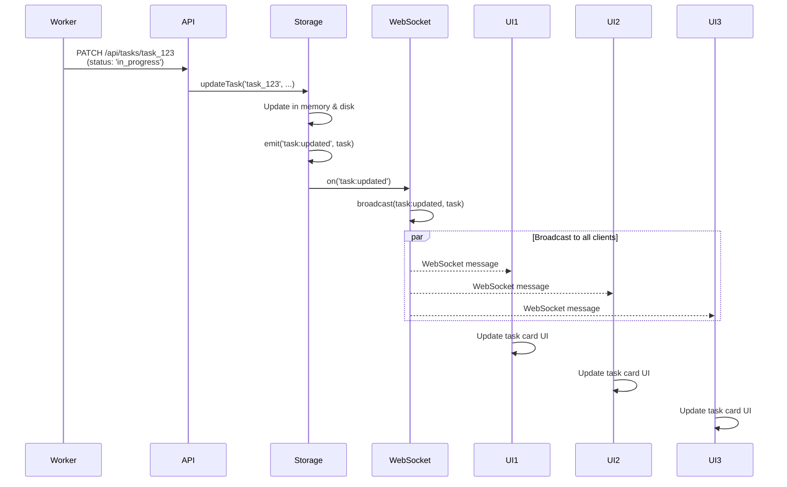

**Benefits:**

- All connected UIs stay in sync
- No polling required
- Instant visual feedback
- Supports collaboration (multiple users)

---

## Orchestrator Workflow

**Complete orchestrator session lifecycle**

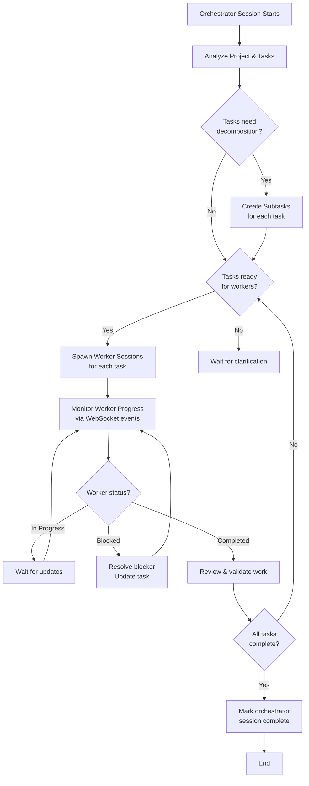

**Orchestrator Commands:**

```bash
# Initial analysis
maestro whoami
maestro status
maestro task list

# Task decomposition
maestro task get <id>
maestro subtask create <taskId> "Subtask title"

# Worker delegation
maestro session spawn --task <id> --skill maestro-worker

# Monitoring
maestro task list --status in_progress
maestro session list --status running

# Unblocking
maestro task update <id> --status in_progress
maestro update "Resolved blocker: XYZ"

# Completion
maestro task complete
maestro session complete
```

---

## Summary of Key Flows

| Flow | Trigger | Server Role | CLI Role | UI Role |
|------|---------|-------------|----------|---------|
| **Project Setup** | User | Store & broadcast | - | Create form, display |
| **Task Creation** | User/CLI | Store & broadcast | Generate from user input | Display task card |
| **Session Spawn** | CLI/Orchestrator | Store, emit spawn event | Generate prompts, spawn Claude | Spawn terminal with env |
| **Task Execution** | Worker | Update status, broadcast | Execute work, report progress | Show status updates |
| **Subtask Management** | Worker/Orchestrator | Store subtasks, broadcast | Create/complete subtasks | Display subtask list |
| **Session Completion** | Worker/CLI | Update status, broadcast | Mark complete on exit | Update session badge |
| **Real-time Updates** | Any change | Broadcast WebSocket event | - | React to events |

**Key Principle:** Server is a **dumb data store**. Intelligence lives in the CLI. UI is a **visualization layer**.
