# Maestro Server - Architecture Diagrams

Visual representation of the system architecture, component interactions, and data flows.

## System Architecture Overview

```mermaid
flowchart TB
    subgraph "User Layer"
        User[👤 Developer]
        UI[🖥️ Agent Maestro<br/>React/TypeScript]
    end

    subgraph "CLI Layer"
        CLI[⚡ Maestro CLI<br/>Orchestration Brain]
        Claude[🤖 Claude Agent<br/>Code Execution]
    end

    subgraph "Server Layer"
        Server[🗄️ Maestro Server<br/>Data Store + Events]
        WebSocket[🔌 WebSocket Server<br/>Real-time Broadcasting]
        API[🌐 REST API<br/>CRUD Operations]
    end

    subgraph "Storage Layer"
        Memory[(💾 In-Memory Maps<br/>Fast Access)]
        Disk[(📁 File System<br/>~/.maestro/data)]
    end

    subgraph "Skills System"
        Skills[📦 Skills Directory<br/>~/.agents-ui/maestro-skills]
    end

    User -->|Interacts| UI
    UI -->|WebSocket| WebSocket
    UI -->|Spawn Terminal| CLI
    CLI -->|HTTP API| API
    CLI -->|Spawn| Claude
    Claude -->|Execute| CLI
    API --> Server
    WebSocket --> Server
    Server --> Memory
    Server --> Disk
    Server --> Skills
```



---

## Component Diagram

```mermaid
graph TB
    subgraph Server[Maestro Server]
        ServerTS[server.ts<br/>HTTP + WS Setup]
        StorageTS[storage.ts<br/>Data Layer]
        WebSocketTS[websocket.ts<br/>Event Broadcaster]
        SkillsTS[skills.ts<br/>Skill Loader]

        subgraph API[API Routes]
            ProjectsAPI[projects.ts]
            TasksAPI[tasks.ts]
            SessionsAPI[sessions.ts]
            SubtasksAPI[subtasks.ts]
        end

        subgraph Services[Services]
            PromptGen[promptGenerator.ts<br/>⚠️ Deprecated]
        end

        ServerTS --> StorageTS
        ServerTS --> WebSocketTS
        ServerTS --> API
        API --> StorageTS
        WebSocketTS --> StorageTS
        SkillsTS -.->|Read Skills| Skills
    end

    subgraph Storage[File System Storage]
        Projects[(projects/*.json)]
        Tasks[(tasks/{projectId}/*.json)]
        Sessions[(sessions/*.json)]
    end

    subgraph Skills[Skills Directory]
        MaestroCLI[maestro-cli/]
        MaestroWorker[maestro-worker/]
        MaestroOrch[maestro-orchestrator/]
        CustomSkills[custom-skills/]
    end

    StorageTS <--> Projects
    StorageTS <--> Tasks
    StorageTS <--> Sessions
```

---

## Data Flow Architecture


---

## Storage Architecture

```mermaid
flowchart TB
    subgraph "In-Memory Layer (Fast Access)"
        ProjectsMap[Map: string → Project]
        TasksMap[Map: string → Task]
        SessionsMap[Map: string → Session]
    end

    subgraph "Persistence Layer (Disk)"
        subgraph ProjectFiles[projects/]
            PF1[proj_123.json]
            PF2[proj_456.json]
        end

        subgraph TaskFiles[tasks/]
            subgraph TF1[proj_123/]
                T1[task_001.json]
                T2[task_002.json]
            end
            subgraph TF2[proj_456/]
                T3[task_003.json]
            end
        end

        subgraph SessionFiles[sessions/]
            SF1[sess_abc.json]
            SF2[sess_def.json]
        end
    end

    ProjectsMap -->|save| ProjectFiles
    TasksMap -->|save| TaskFiles
    SessionsMap -->|save| SessionFiles

    ProjectFiles -->|load| ProjectsMap
    TaskFiles -->|load| TasksMap
    SessionFiles -->|load| SessionsMap
```



**Access Patterns:**

- **Read:** O(1) from in-memory Map
- **Write:** O(1) Map update + async file write
- **List:** O(n) iterate Map values
- **Filter:** O(n) iterate + filter predicate

---

## WebSocket Event Flow


**Event Types:**

- Project: `created`, `updated`, `deleted`
- Task: `created`, `updated`, `deleted`
- Session: `created`, `updated`, `deleted`, `spawn_request`
- Subtask: `created`, `updated`, `deleted`
- Relationships: `task_added`, `task_removed`, `session_added`, `session_removed`

---

## Session Spawn Architecture


**Environment Variables:**

```bash
MAESTRO_SESSION_ID=sess_1706792222222_lmn678
MAESTRO_PROJECT_ID=proj_1706789123456_k2j4n5l6m
MAESTRO_TASK_IDS=task_001,task_002
MAESTRO_SERVER_URL=http://localhost:3000
MAESTRO_SKILLS=maestro-worker
```

---

## Task-Session Relationship Architecture

**Many-to-Many Bidirectional**


**Add Relationship Flow:**

```mermaid
flowchart TD
    Start[Add Task to Session] --> UpdateSession[session.taskIds.push(taskId)]
    UpdateSession --> UpdateTask[task.sessionIds.push(sessionId)]
    UpdateTask --> AddTimeline[task.timeline.push(session_started)]
    AddTimeline --> SaveBoth[Save both entities]
    SaveBoth --> EmitEvents[Emit bidirectional events]
    EmitEvents --> End[Broadcast via WebSocket]
```

**Remove Relationship Flow:**

```mermaid
flowchart TD
    Start[Remove Task from Session] --> FilterSession[session.taskIds = filter out taskId]
    FilterSession --> FilterTask[task.sessionIds = filter out sessionId]
    FilterTask --> AddTimeline[task.timeline.push(session_ended)]
    AddTimeline --> SaveBoth[Save both entities]
    SaveBoth --> EmitEvents[Emit bidirectional events]
    EmitEvents --> End[Broadcast via WebSocket]
```

---

## Skill Loading Architecture


**Skill Manifest Schema:**

```json
{
  "name": "maestro-worker",
  "version": "1.0.0",
  "description": "Worker skill for task execution",
  "type": "role",
  "assignTo": ["worker"],
  "capabilities": ["task_execution", "progress_reporting"],
  "dependencies": ["maestro-cli"],
  "config": {}
}
```

---

## API Layer Architecture

```mermaid
flowchart TB
    subgraph "Express Middleware Chain"
        CORS[CORS Middleware]
        JSON[JSON Body Parser]
        Routes[API Routes]
        ErrorHandler[Error Handler]
    end

    Request[HTTP Request] --> CORS
    CORS --> JSON
    JSON --> Routes

    subgraph "Route Handlers"
        ProjectsRouter[/api/projects]
        TasksRouter[/api/tasks]
        SessionsRouter[/api/sessions]
        SubtasksRouter[/api/tasks/:taskId/subtasks]
    end

    Routes --> ProjectsRouter
    Routes --> TasksRouter
    Routes --> SessionsRouter
    Routes --> SubtasksRouter

    ProjectsRouter --> Storage[Storage Layer]
    TasksRouter --> Storage
    SessionsRouter --> Storage
    SubtasksRouter --> Storage

    Storage --> Success[200/201 Response]
    Storage --> Error[4xx/5xx Response]

    Success --> ErrorHandler
    Error --> ErrorHandler
    ErrorHandler --> Response[HTTP Response]
```

---

## Deployment Architecture

### Single-Machine (Development)


### Docker Deployment (Multi-Machine)


---

## Error Handling Architecture


**Error Response Format:**

```json
{
  "error": true,
  "message": "Human-readable error message",
  "code": "ERROR_CODE",
  "details": {}  // Optional
}
```

---

## Graceful Shutdown Flow


**Shutdown Steps:**

1. Close WebSocket connections
2. Close WebSocket server
3. Save all in-memory data to disk
4. Close HTTP server
5. Exit process

**Force Exit:** If graceful shutdown hangs, force exit after 5 seconds.

---

## Skills System Architecture


**Skill Loading Flow:**

1. CLI requests skills for role (worker, orchestrator)
2. Server reads skill manifests from `~/.agents-ui/maestro-skills/`
3. Server validates dependencies
4. Server formats skills for LLM prompt
5. CLI injects skills into prompt
6. Claude receives full context including skill instructions

---

## Performance Characteristics

### Read Operations


### Write Operations


### WebSocket Broadcast


Where:
- **n** = total entities
- **m** = connected clients

---

## Security Considerations

```mermaid
flowchart TB
    Request[HTTP Request] --> NoAuth{Authentication?}

    NoAuth -->|None| AllowAll[Allow all requests<br/>⚠️ Local dev only]

    AllowAll --> CORS{CORS?}

    CORS -->|Enabled| AllowOrigins[Allow all origins<br/>⚠️ Local dev only]

    AllowOrigins --> NoEncryption{Encryption?}

    NoEncryption -->|HTTP| NoTLS[Plain HTTP<br/>⚠️ Local dev only]

    NoTLS --> LocalOnly[✅ Safe for localhost<br/>❌ Unsafe for production]

    style NoAuth fill:#ff9999
    style CORS fill:#ff9999
    style NoEncryption fill:#ff9999
    style LocalOnly fill:#ffcc99
```



**Current Security:**
- ❌ No authentication
- ❌ No authorization
- ❌ No encryption (HTTP, not HTTPS)
- ❌ No rate limiting
- ✅ Designed for local, single-user use

**Production Requirements:**
- ✅ Token-based auth (JWT)
- ✅ User-based authorization
- ✅ TLS/HTTPS (WSS for WebSocket)
- ✅ Rate limiting per user
- ✅ Input sanitization
