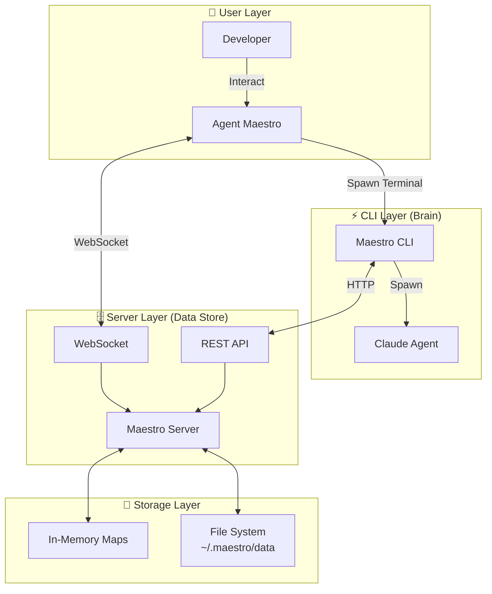
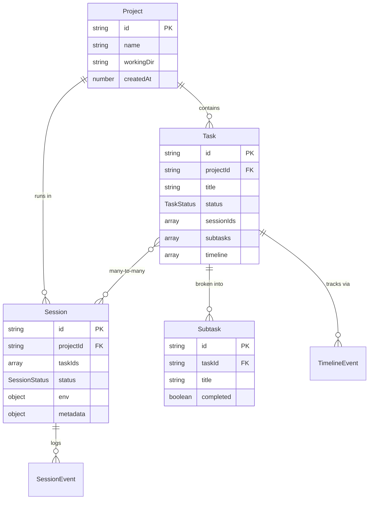
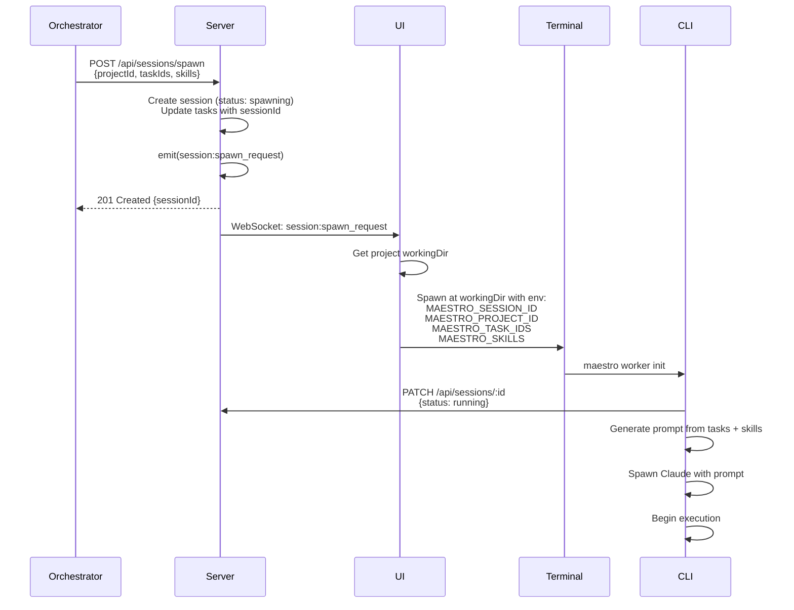
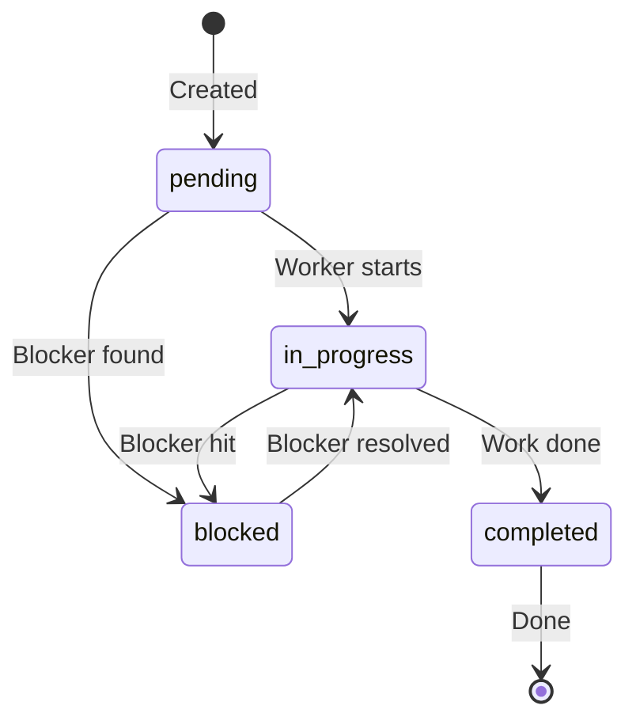

# Maestro Server - Visual Summary

A one-page visual reference for the entire Maestro Server architecture.

## System Overview



---

## Core Entities



---

## API Endpoints

```
┌─────────────────────────────────────────────────────────────┐
│                        REST API                             │
├─────────────────────────────────────────────────────────────┤
│ Health Check                                                │
│   GET /health                                               │
├─────────────────────────────────────────────────────────────┤
│ Projects                                                    │
│   GET    /api/projects                                      │
│   POST   /api/projects                                      │
│   GET    /api/projects/:id                                  │
│   PUT    /api/projects/:id                                  │
│   DELETE /api/projects/:id                                  │
├─────────────────────────────────────────────────────────────┤
│ Tasks                                                       │
│   GET    /api/tasks?projectId&status                        │
│   POST   /api/tasks                                         │
│   GET    /api/tasks/:id                                     │
│   PATCH  /api/tasks/:id                                     │
│   DELETE /api/tasks/:id                                     │
│   POST   /api/tasks/:id/timeline                            │
├─────────────────────────────────────────────────────────────┤
│ Sessions                                                    │
│   GET    /api/sessions?projectId&taskId&status              │
│   POST   /api/sessions                                      │
│   GET    /api/sessions/:id                                  │
│   PATCH  /api/sessions/:id                                  │
│   DELETE /api/sessions/:id                                  │
│   POST   /api/sessions/spawn ⭐                             │
│   POST   /api/sessions/:id/tasks/:taskId                    │
│   DELETE /api/sessions/:id/tasks/:taskId                    │
├─────────────────────────────────────────────────────────────┤
│ Subtasks                                                    │
│   GET    /api/tasks/:taskId/subtasks                        │
│   POST   /api/tasks/:taskId/subtasks                        │
│   PATCH  /api/tasks/:taskId/subtasks/:id                    │
│   DELETE /api/tasks/:taskId/subtasks/:id                    │
└─────────────────────────────────────────────────────────────┘
```

---

## WebSocket Events

```
┌─────────────────────────────────────────────────────────────┐
│                     WebSocket Events                        │
├─────────────────────────────────────────────────────────────┤
│ Project Events                                              │
│   • project:created                                         │
│   • project:updated                                         │
│   • project:deleted                                         │
├─────────────────────────────────────────────────────────────┤
│ Task Events                                                 │
│   • task:created                                            │
│   • task:updated                                            │
│   • task:deleted                                            │
│   • task:session_added                                      │
│   • task:session_removed                                    │
├─────────────────────────────────────────────────────────────┤
│ Session Events                                              │
│   • session:created                                         │
│   • session:updated                                         │
│   • session:deleted                                         │
│   • session:spawn_request ⭐ (triggers UI terminal spawn)  │
│   • session:task_added                                      │
│   • session:task_removed                                    │
├─────────────────────────────────────────────────────────────┤
│ Subtask Events                                              │
│   • subtask:created                                         │
│   • subtask:updated                                         │
│   • subtask:deleted                                         │
└─────────────────────────────────────────────────────────────┘
```

---

## Data Storage Structure

```
~/.maestro/data/
│
├── projects/
│   ├── proj_1706789123456_k2j4n5l6m.json
│   ├── proj_1706789234567_def456.json
│   └── ...
│
├── tasks/
│   ├── proj_1706789123456_k2j4n5l6m/
│   │   ├── task_1706790000000_xyz789.json
│   │   ├── task_1706790111111_uvw012.json
│   │   └── ...
│   ├── proj_1706789234567_def456/
│   │   └── task_1706791111111_rst345.json
│   └── ...
│
└── sessions/
    ├── sess_1706792222222_lmn678.json
    ├── sess_1706793333333_opq901.json
    └── ...
```

---

## Session Spawn Flow



---

## Task Status Lifecycle



**Status Types:**
- `pending` - Not started
- `in_progress` - Actively worked on
- `blocked` - Cannot proceed
- `completed` - Finished

---

## Component Responsibilities

```
┌──────────────────────────────────────────────────────────────┐
│                     MAESTRO CLI (Brain)                      │
├──────────────────────────────────────────────────────────────┤
│ ✅ Generate prompts                                          │
│ ✅ Execute commands                                          │
│ ✅ Spawn Claude sessions                                     │
│ ✅ Orchestration logic                                       │
│ ✅ Task decomposition                                        │
│ ✅ Worker delegation                                         │
└──────────────────────────────────────────────────────────────┘

┌──────────────────────────────────────────────────────────────┐
│                  MAESTRO SERVER (Data Store)                 │
├──────────────────────────────────────────────────────────────┤
│ ✅ Store projects, tasks, sessions                           │
│ ✅ Persist to disk                                           │
│ ✅ Broadcast WebSocket events                                │
│ ✅ Serve REST API                                            │
│ ❌ NO prompt generation                                      │
│ ❌ NO command execution                                      │
│ ❌ NO orchestration logic                                    │
└──────────────────────────────────────────────────────────────┘

┌──────────────────────────────────────────────────────────────┐
│                   AGENTS UI (Visualization)                  │
├──────────────────────────────────────────────────────────────┤
│ ✅ Display projects, tasks, sessions                         │
│ ✅ Spawn terminals with env vars                             │
│ ✅ Subscribe to WebSocket events                             │
│ ✅ Create/edit entities via API                              │
│ ❌ NO business logic                                         │
│ ❌ NO prompt generation                                      │
└──────────────────────────────────────────────────────────────┘
```

---

## Key Design Principles

### 1. CLI-First Architecture

```
Intelligence → CLI
Data Storage → Server
Visualization → UI
```

**Why?**
- Separation of concerns
- Server remains simple
- CLI can evolve independently
- Easy to test

### 2. Event-Driven Updates

```
Storage Change → Event Emitted → WebSocket Broadcast → UI Updates
```

**Benefits:**
- Real-time synchronization
- Multiple UIs stay in sync
- No polling required
- Supports collaboration

### 3. Many-to-Many Relationships

```
Task {sessionIds: []} ↔ Session {taskIds: []}
```

**Enables:**
- Multiple workers on one task (parallel)
- One worker on multiple tasks (orchestrator)
- Dynamic task reassignment

### 4. File-Based Storage

```
JSON Files + In-Memory Maps
```

**Advantages:**
- No database setup
- Human-readable data
- Easy debugging
- Portable

**Trade-offs:**
- Single-machine only
- No transactions
- Limited scalability

---

## Technology Stack

```
┌──────────────────────────────────────────────────────────────┐
│ Runtime        │ Node.js (v18+)                              │
├──────────────────────────────────────────────────────────────┤
│ Language       │ TypeScript (strict mode)                    │
├──────────────────────────────────────────────────────────────┤
│ Web Framework  │ Express.js v5                               │
├──────────────────────────────────────────────────────────────┤
│ WebSocket      │ ws library                                  │
├──────────────────────────────────────────────────────────────┤
│ Storage        │ File-based JSON (no database)               │
├──────────────────────────────────────────────────────────────┤
│ Build Tool     │ TypeScript compiler (tsc)                   │
└──────────────────────────────────────────────────────────────┘
```

---

## File Structure

```
maestro-server/
│
├── src/                          # TypeScript source
│   ├── server.ts                 # Entry point, HTTP + WS setup
│   ├── storage.ts                # Data persistence layer
│   ├── websocket.ts              # Event broadcasting
│   ├── types.ts                  # TypeScript definitions
│   ├── skills.ts                 # Skill loading
│   │
│   ├── api/                      # API routes
│   │   ├── projects.ts
│   │   ├── tasks.ts
│   │   ├── sessions.ts
│   │   └── subtasks.ts
│   │
│   └── services/
│       └── promptGenerator.ts    # ⚠️ Deprecated (kept for reference)
│
├── dist/                         # Compiled JavaScript
├── docs/                         # Documentation
├── test/                         # Tests
├── package.json
├── tsconfig.json
└── Dockerfile
```

---

## Performance Characteristics

| Operation | Complexity | Notes |
|-----------|-----------|-------|
| Get by ID | O(1) | Map.get() |
| List all | O(n) | Iterate Map values |
| Filter list | O(n) | Iterate + filter |
| Create/Update | O(1) | Map.set() + async file write |
| Delete | O(1) | Map.delete() + async file delete |
| WebSocket broadcast | O(m) | m = connected clients |

**Scalability:**
- ✅ ~1000 entities
- ✅ ~10 concurrent clients
- ✅ Single machine
- ❌ Multi-machine (file-based storage)
- ❌ High concurrency (no database)

---

## Common Commands

### Development

```bash
# Install dependencies
npm install

# Build TypeScript
npm run build

# Run development server
npm run dev

# Watch mode (auto-recompile)
npm run watch

# Production server
npm start
```

### Docker

```bash
# Build image
docker build -t maestro-server .

# Run container
docker run -p 3000:3000 -v ~/.maestro/data:/data maestro-server
```

### Testing

```bash
# Health check
curl http://localhost:3000/health

# List projects
curl http://localhost:3000/api/projects

# Create task
curl -X POST http://localhost:3000/api/tasks \
  -H "Content-Type: application/json" \
  -d '{"projectId":"proj_123","title":"Test Task"}'

# WebSocket test
npm install -g wscat
wscat -c ws://localhost:3000
```

---

## Error Codes

| Code | Status | Meaning |
|------|--------|---------|
| `VALIDATION_ERROR` | 400 | Missing/invalid parameters |
| `PROJECT_NOT_FOUND` | 404 | Project doesn't exist |
| `TASK_NOT_FOUND` | 404 | Task doesn't exist |
| `PROJECT_HAS_DEPENDENCIES` | 400 | Can't delete project with tasks/sessions |
| `missing_project_id` | 400 | Spawn: projectId missing |
| `invalid_task_ids` | 400 | Spawn: taskIds invalid |
| `task_not_found` | 404 | Spawn: task doesn't exist |
| `spawn_error` | 500 | Spawn: server error |
| `INTERNAL_ERROR` | 500 | Generic server error |

---

## Environment Variables

```bash
PORT=3000                         # HTTP server port (default: 3000)
DATA_DIR=/custom/path             # Data directory (default: ~/.maestro/data)
DEBUG=1                           # Enable debug logging
```

---

## Quick Reference: Session Spawn

**Most Important Flow:**

1. **Orchestrator** calls `POST /api/sessions/spawn`
2. **Server** creates session, updates tasks, emits `session:spawn_request`
3. **UI** receives WebSocket event
4. **UI** spawns terminal with env vars:
   ```
   MAESTRO_SESSION_ID=sess_123
   MAESTRO_PROJECT_ID=proj_456
   MAESTRO_TASK_IDS=task_001,task_002
   MAESTRO_SERVER_URL=http://localhost:3000
   MAESTRO_SKILLS=maestro-worker
   ```
5. **CLI** detects env vars and auto-initializes
6. **CLI** updates session status to `running`
7. **CLI** generates prompt from tasks + skills
8. **CLI** spawns Claude
9. **Claude** begins task execution

---

## Security Checklist

- [ ] ❌ No authentication
- [ ] ❌ No authorization
- [ ] ❌ No encryption (HTTP, not HTTPS)
- [ ] ❌ No rate limiting
- [ ] ❌ No input sanitization
- [ ] ✅ Designed for local use only

**⚠️ DO NOT expose to internet without adding security layers**

---

## Documentation Index

1. **[README.md](./README.md)** - Start here
2. **[01-OVERVIEW.md](./01-OVERVIEW.md)** - System overview
3. **[02-API-REFERENCE.md](./02-API-REFERENCE.md)** - Complete API docs
4. **[03-STORAGE-LAYER.md](./03-STORAGE-LAYER.md)** - Storage details
5. **[04-WEBSOCKET-EVENTS.md](./04-WEBSOCKET-EVENTS.md)** - Real-time events
6. **[05-DATA-MODELS.md](./05-DATA-MODELS.md)** - Entity schemas
7. **[06-FLOWS.md](./06-FLOWS.md)** - Workflow diagrams
8. **[07-ARCHITECTURE-DIAGRAMS.md](./07-ARCHITECTURE-DIAGRAMS.md)** - Visual architecture
9. **[08-VISUAL-SUMMARY.md](./08-VISUAL-SUMMARY.md)** - This document

---

## TL;DR

**Maestro Server** is a lightweight, file-based task orchestration backend for multi-agent development.

**What it does:**
- ✅ Stores projects, tasks, sessions
- ✅ Broadcasts real-time updates via WebSocket
- ✅ Serves REST API for CRUD operations

**What it doesn't do:**
- ❌ Generate prompts (that's the CLI)
- ❌ Execute commands (that's the CLI)
- ❌ Contain orchestration logic (that's the CLI)

**Key principle:** Server is dumb. Intelligence lives in the CLI.

**Port:** 3000 (HTTP + WebSocket)
**Storage:** `~/.maestro/data/` (JSON files)
**Architecture:** CLI-first, event-driven, many-to-many task-session relationships

**Start:** `npm run dev`
**Health:** `curl http://localhost:3000/health`
**WebSocket:** `wscat -c ws://localhost:3000`
