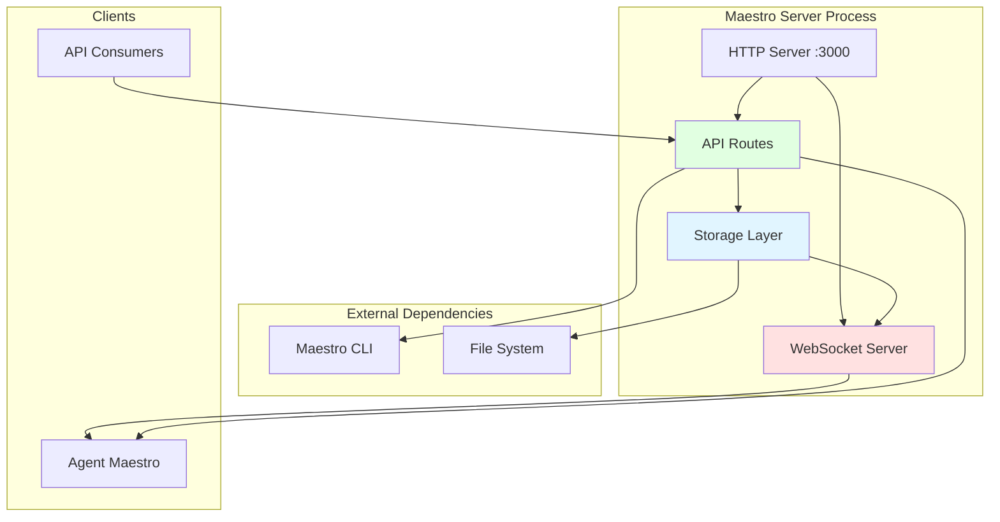

# Maestro Server - System Overview

**Version:** 2.0.0
**Last Updated:** 2026-02-08
**Purpose:** Define architecture boundaries and system philosophy

---

## What Maestro Server Is

Maestro Server is a **project coordination backend** that provides:

1. **Data Management** - CRUD operations for projects, tasks, and sessions
2. **Real-Time Events** - WebSocket broadcasts for state changes
3. **Session Orchestration** - Coordinating multiple agent sessions working on tasks
4. **Skills Integration** - Loading and managing agent skills
5. **Manifest Generation** - Creating session configurations via CLI integration

### Core Responsibilities

```
┌──────────────────────────────────────────────────────────────────────┐
│                        Maestro Server                                │
│                                                                      │
│  ┌─────────────┐  ┌──────────────┐  ┌─────────────────┐            │
│  │   REST API  │  │  WebSocket   │  │  CLI Integration│            │
│  │  (HTTP/JSON)│  │  (Events)    │  │  (Manifest Gen) │            │
│  └──────┬──────┘  └──────┬───────┘  └────────┬────────┘            │
│         │                │                    │                      │
│  ┌──────▼────────────────▼────────────────────▼──────────────────┐  │
│  │               Application Services Layer                      │  │
│  │  (ProjectService, TaskService, SessionService, QueueService,  │  │
│  │   TemplateService)                                            │  │
│  └──────────────────────────┬────────────────────────────────────┘  │
│                             │                                       │
│  ┌──────────────────────────▼────────────────────────────────────┐  │
│  │                  Domain Layer (Interfaces)                     │  │
│  │  (IProjectRepository, ITaskRepository, ISessionRepository,    │  │
│  │   IQueueRepository, ITemplateRepository, IEventBus,           │  │
│  │   ISkillLoader, ILogger, IIdGenerator)                        │  │
│  └──────────────────────────┬────────────────────────────────────┘  │
│                             │                                       │
│  ┌──────────────────────────▼────────────────────────────────────┐  │
│  │               Infrastructure Layer                            │  │
│  │  FileSystem Repositories, InMemoryEventBus, ConsoleLogger,    │  │
│  │  WebSocketBridge, Config, TimestampIdGenerator,               │  │
│  │  FileSystemSkillLoader                                        │  │
│  └───────────────────────────────────────────────────────────────┘  │
│                                                                      │
│  ┌──────────────────────────────────────────────────────────────┐    │
│  │                  DI Container (container.ts)                  │    │
│  │  Wires all components, manages lifecycle (init/shutdown)      │    │
│  └──────────────────────────────────────────────────────────────┘    │
│                                                                      │
└──────────────────────────────────────────────────────────────────────┘
              │                           │
              │                           │
    ┌─────────▼──────────┐     ┌─────────▼──────────┐
    │   UI Clients       │     │  Maestro CLI       │
    │  (WebSocket + API) │     │  (Manifest Reader) │
    └────────────────────┘     └────────────────────┘
```

---

## What Maestro Server Is NOT

Maestro Server explicitly **DOES NOT**:

1. ❌ **Execute agents** - Server only coordinates; CLI spawns agents
2. ❌ **Generate prompts** - That's the CLI's job (reads manifest)
3. ❌ **Manage terminals** - UI creates terminals, server just broadcasts spawn events
4. ❌ **Authenticate users** - No auth in current version (single-user, local)
5. ❌ **Validate business logic** - Minimal validation, trusts clients
6. ❌ **Queue or schedule work** - Just stores tasks, doesn't execute them
7. ❌ **Manage agent lifecycle** - Agents are independent processes

### Boundary Definition

```
SERVER RESPONSIBILITIES          │  CLI RESPONSIBILITIES
─────────────────────────────────┼─────────────────────────────────
Store projects/tasks/sessions    │  Read manifest files
Emit WebSocket events            │  Generate prompts from manifests
Generate manifests (via CLI)     │  Spawn Claude processes
Provide CRUD APIs                │  Execute agent sessions
Track session metadata           │  Report back to server via API
Serve skills metadata            │  Load skills into prompts
```

```
SERVER RESPONSIBILITIES          │  UI RESPONSIBILITIES
─────────────────────────────────┼─────────────────────────────────
Store data persistently          │  Display data to user
Emit state change events         │  Create terminal windows
Provide session spawn data       │  Execute spawn commands
Validate requests (minimal)      │  Validate user input (rich)
```

---

## Architecture Philosophy: CLI-First

Maestro Server follows a **CLI-first architecture**:

### Principle 1: Server as Coordinator, Not Executor
- Server **stores state** and **broadcasts events**
- CLI **executes work** (spawning agents, running tasks)
- UI **presents state** and **triggers actions**

### Principle 2: Server-Generated Manifests
- Server knows project context (tasks, skills, config)
- Server generates manifest via `maestro manifest generate` CLI
- CLI reads manifest and spawns agent with proper context
- UI receives spawn event and creates terminal

### Principle 3: Stateless Operations
- Server maintains persistent state in filesystem
- Each API request is independent (no sessions, auth, or cookies)
- WebSocket is **unidirectional** (server → clients only, no client messages)

### Principle 4: Single-User, Local-First
- Designed for single developer on local machine
- No multi-tenancy or user isolation
- No authentication or authorization
- Data stored in `~/.maestro/data/`

---

## Component Diagram



### Component Descriptions

#### HTTP Server (Express)
- **Port:** 3000 (configurable via `PORT` env)
- **Middleware:** CORS, JSON body parser, API request logging
- **Routes:** `/api/projects`, `/api/tasks`, `/api/sessions`, `/api/skills`, `/api/templates`, `/health`, `/ws-status`

#### WebSocket Server (ws)
- **Protocol:** WebSocket over HTTP upgrade
- **Direction:** Primarily Server → Client (broadcasts), with client ping/pong support
- **Bridge:** `WebSocketBridge` subscribes to `InMemoryEventBus` and broadcasts to all connected clients
- **Events:** 14 bridged event types (project:*, task:*, session:*)

#### Application Services Layer
- **ProjectService:** Project CRUD with dependency validation
- **TaskService:** Task CRUD with session association, update source tracking
- **SessionService:** Session CRUD with spawn orchestration, timeline events
- **QueueService:** FIFO queue management for queue-strategy sessions
- **TemplateService:** Prompt template management with defaults

#### Domain Layer (Interfaces)
- **Repository Interfaces:** `IProjectRepository`, `ITaskRepository`, `ISessionRepository`, `IQueueRepository`, `ITemplateRepository`
- **Service Interfaces:** `ISkillLoader`, `IManifestGenerator`
- **Infrastructure Interfaces:** `IEventBus`, `ILogger`, `IIdGenerator`
- **Domain Events:** Type-safe event definitions (`DomainEvents.ts`)
- **Error Classes:** `AppError`, `ValidationError`, `NotFoundError`, `ForbiddenError`, `UnauthorizedError`, `BusinessRuleError`, `ConfigError`, `ManifestGenerationError`, `SkillLoadError`

#### Infrastructure Layer
- **FileSystem Repositories:** JSON file storage per entity
- **InMemoryEventBus:** EventEmitter-based typed event bus
- **WebSocketBridge:** Bridges domain events to WebSocket clients
- **ConsoleLogger:** Structured logging with configurable levels
- **TimestampIdGenerator:** ID generation with prefix_timestamp_random pattern
- **FileSystemSkillLoader:** Loads skills from filesystem with caching
- **Config:** Centralized configuration from environment variables

#### DI Container (`container.ts`)
- Wires all dependencies together
- Manages lifecycle: `initialize()` loads repos from disk, `shutdown()` cleans up
- Provides typed access to all services and repositories

#### CLI Integration
- **Command:** `maestro manifest generate`
- **Purpose:** Generate session manifests with full context
- **Dependency:** Requires `maestro` CLI in PATH (resolved from monorepo `node_modules/.bin`)

---

## Non-Functional Requirements

### Performance
- **Startup:** < 1 second to initialize and load data
- **API Response:** < 50ms for CRUD operations (no external calls)
- **WebSocket Broadcast:** < 10ms to broadcast to all clients
- **Manifest Generation:** < 2 seconds (depends on CLI)

### Scalability
- **Data Size:** Designed for 100s of projects, 1000s of tasks
- **Concurrent Clients:** 10-50 WebSocket clients
- **Not Designed For:** Multi-tenant, cloud-scale, high-availability

### Reliability
- **Data Persistence:** Synchronous writes to filesystem on every mutation
- **Crash Recovery:** Data loaded from filesystem on startup
- **Error Handling:** Return error JSON, log to console, don't crash
- **Graceful Shutdown:** Save data before exit (SIGINT handler)

### Security
- **Current:** None (no auth, no encryption, no validation)
- **Assumption:** Trusted single-user environment
- **Future:** JWT auth, input validation, rate limiting (see `spec-review/`)

### Compatibility
- **Node.js:** >= 16.x (uses ES modules, modern APIs)
- **Dependencies:** Express, ws, TypeScript
- **Platform:** Cross-platform (macOS, Linux, Windows)

---

## Data Flow Patterns

### Pattern 1: CRUD Operation
```
Client                  Server                 Storage                WebSocket Clients
  │                       │                       │                         │
  ├─ POST /api/tasks ────>│                       │                         │
  │                       ├─ createTask() ───────>│                         │
  │                       │                       ├─ Save to disk           │
  │                       │                       ├─ emit('task:created')   │
  │                       │                       └──────────────────────────>│
  │                       │<─ task ───────────────┤                         │
  │<─ 201 Created ────────┤                       │                         │
  │                       │                       │                         │
```

### Pattern 2: Session Spawn (Server-Generated Manifest)
```
Client                Server              Maestro CLI         Storage         UI (WebSocket)
  │                     │                     │                 │                 │
  ├─ POST /spawn ──────>│                     │                 │                 │
  │                     ├─ Validate ──────────┤                 │                 │
  │                     ├─ createSession() ───────────────────>│                 │
  │                     │                     │                 ├─ Suppress event│
  │                     ├─ spawn CLI ────────>│                 │                 │
  │                     │                     ├─ Generate manifest               │
  │                     │                     └─ Write ~/.maestro/sessions/{id}  │
  │                     │<─ manifestPath ─────┤                 │                 │
  │                     ├─ emit('session:created' with spawn data) ────────────>│
  │<─ 201 Created ──────┤                     │                 │                 │
  │                     │                     │                 │                 ├─ UI creates terminal
  │                     │                     │                 │                 ├─ Runs command with env
  │                     │                     │                 │                 │
```

### Pattern 3: Real-Time State Sync
```
Client A             Server              Storage             Client B (WebSocket)
  │                    │                    │                       │
  ├─ PATCH /tasks/:id ─>│                    │                       │
  │                    ├─ updateTask() ─────>│                       │
  │                    │                    ├─ Save                  │
  │                    │                    ├─ emit('task:updated')  │
  │                    │                    └──────────────────────>│ (receives update)
  │<─ 200 OK ──────────┤                    │                       │
  │                    │                    │                       │
```

---

## Technology Stack

### Runtime
- **Node.js** >= 16.x
- **TypeScript** ^5.0.0

### Core Dependencies
- **express** ^4.18.2 - HTTP server and routing
- **ws** ^8.14.2 - WebSocket server
- **cors** ^2.8.5 - CORS middleware

### File System
- **fs/promises** - Async file operations (built-in)
- **path, os** - Path manipulation and OS info (built-in)

### CLI Integration
- **child_process** - Spawn `maestro` CLI (built-in)

### Event System
- **InMemoryEventBus** - Typed domain event bus (wraps Node.js EventEmitter)
- **WebSocketBridge** - Bridges event bus to WebSocket clients

---

## Deployment Model

### Current: Local Development Server
```
~/.maestro/
├── data/                    # Storage root (configurable via DATA_DIR)
│   ├── projects/           # Project JSON files
│   ├── tasks/              # Task JSON files (organized by project)
│   ├── sessions/           # Session JSON files
│   ├── queues/             # Queue state JSON files (for queue-strategy sessions)
│   └── templates/          # Template JSON files
└── sessions/               # Generated manifests (configurable via SESSION_DIR)
    └── {session-id}/
        └── manifest.json

~/.agents-ui/
└── maestro-skills/         # Skills directory (configurable via SKILLS_DIR)
    ├── maestro-cli/
    ├── maestro-worker/
    └── maestro-orchestrator/
```

### Future: Production Deployment
- Docker container (see `11-DEPLOYMENT-SPECIFICATION.md`)
- Database backend (PostgreSQL) instead of files
- JWT authentication
- Reverse proxy (nginx) for HTTPS
- Environment-based configuration

---

## Key Design Decisions

### Decision 1: File-Based Storage (with Postgres Support Prepared)
**Rationale:** Simple, no database dependency, easy to inspect
**Trade-off:** Not suitable for high concurrency or large datasets
**Current:** Storage abstracted behind repository interfaces (`IProjectRepository`, etc.). Config supports `DATABASE_TYPE=postgres` but only filesystem implementation exists.
**Future:** Implement `PostgresProjectRepository`, etc. behind existing interfaces

### Decision 2: Synchronous File Writes
**Rationale:** Ensure data persistence on every mutation
**Trade-off:** Slower API responses (but acceptable for local use)
**Future:** Async writes with write-ahead log

### Decision 3: Server-Generated Manifests via CLI
**Rationale:** Manifest generation requires Claude API, which CLI already has
**Trade-off:** Server depends on CLI being installed
**Future:** Server-side manifest generation (see `spec-review/`)

### Decision 4: Primarily Unidirectional WebSocket
**Rationale:** Server primarily broadcasts state changes; clients use HTTP API for mutations
**Client Messages:** Ping/pong heartbeat supported; other client messages logged but not acted upon
**Benefit:** Simple protocol, no WebSocket authentication needed

### Decision 5: No Authentication
**Rationale:** Single-user, local-first tool
**Trade-off:** Not suitable for multi-user or remote access
**Future:** JWT auth for production deployment

---

## System Constraints

### Hard Constraints
1. **Single Process** - One server instance per machine
2. **Local Filesystem** - Data must be on same machine
3. **CLI Dependency** - Requires `maestro` CLI for manifest generation
4. **Node.js Environment** - Requires Node.js runtime

### Soft Constraints
1. **Port 3000** - Configurable via `PORT` env
2. **Data Directory** - Configurable via `DATA_DIR` env
3. **Session Directory** - Configurable via `SESSION_DIR` env
4. **Skills Directory** - Configurable via `SKILLS_DIR` env (default: `~/.agents-ui/maestro-skills/`)

---

## Success Criteria

A Maestro Server implementation is correct if:

1. ✅ All API endpoints return correct responses (see `03-API-SPECIFICATION.md`)
2. ✅ All WebSocket events are emitted (see `04-WEBSOCKET-SPECIFICATION.md`)
3. ✅ Data persists across restarts (see `05-STORAGE-SPECIFICATION.md`)
4. ✅ Session spawn generates manifest and emits event (see `08-SESSION-SPAWNING-SPECIFICATION.md`)
5. ✅ Skills can be listed (see `07-SKILLS-SPECIFICATION.md`)
6. ✅ Server starts and shuts down gracefully
7. ✅ All error codes match specification (see `09-ERROR-HANDLING-SPECIFICATION.md`)

---

## Next Steps

- **For API consumers:** Read `03-API-SPECIFICATION.md`
- **For UI developers:** Read `02-CORE-CONCEPTS.md` then `04-WEBSOCKET-SPECIFICATION.md`
- **For server developers:** Read `02-CORE-CONCEPTS.md` then dive into component specs
- **For architects:** Read `spec-review/01-CURRENT-ISSUES.md` for improvement opportunities

---

**Related Specifications:**
- `02-CORE-CONCEPTS.md` - Domain entities and relationships
- `03-API-SPECIFICATION.md` - REST API endpoints
- `04-WEBSOCKET-SPECIFICATION.md` - WebSocket events
- `spec-review/04-PROPOSED-ARCHITECTURE.md` - Future architecture
