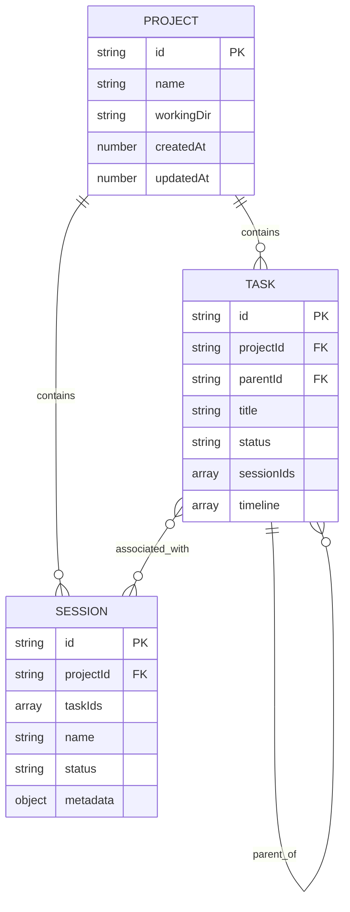
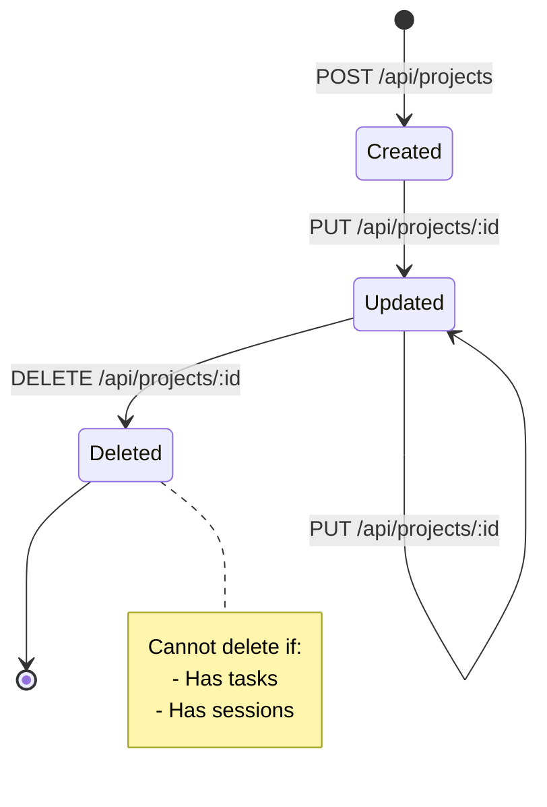
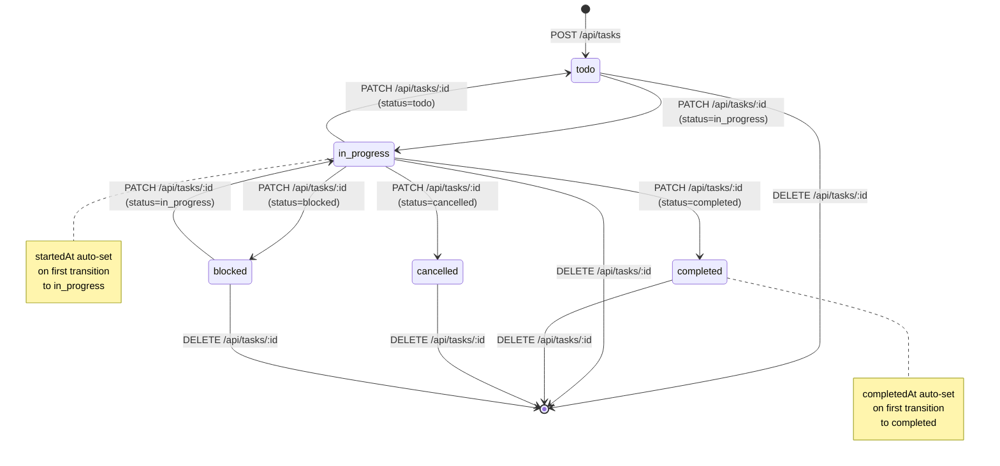
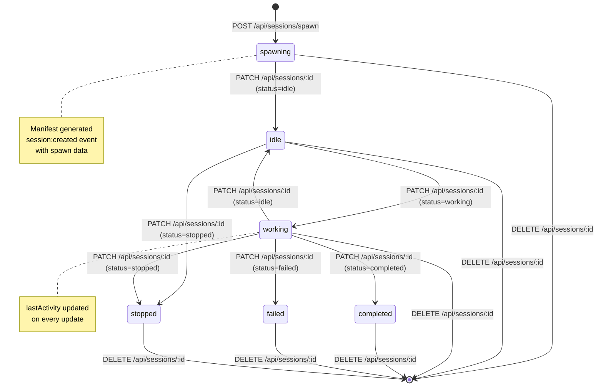

# Maestro Server - Core Concepts

**Version:** 1.0.0
**Last Updated:** 2026-02-04
**Purpose:** Define domain entities, relationships, and lifecycle rules

---

## Overview

Maestro Server manages three core domain entities:

1. **Project** - A workspace with tasks and sessions
2. **Task** - A unit of work within a project
3. **Session** - An agent execution context associated with tasks

This document defines the structure, relationships, and lifecycle of these entities.

---

## Entity Definitions

### Project Entity

A **Project** represents a workspace or repository where work is coordinated.

```typescript
interface Project {
  id: string;              // Unique identifier (e.g., "proj_1234567890_abc123def")
  name: string;            // Human-readable name
  workingDir: string;      // Absolute path to project directory
  description?: string;    // Optional description
  createdAt: number;       // Unix timestamp (milliseconds)
  updatedAt: number;       // Unix timestamp (milliseconds)
}
```

#### Field Details

| Field | Type | Required | Description |
|-------|------|----------|-------------|
| `id` | string | Yes | Auto-generated by server using `makeId('proj')` pattern |
| `name` | string | Yes | Project name (e.g., "agents-ui", "maestro-cli") |
| `workingDir` | string | Yes | Absolute filesystem path where project lives |
| `description` | string | No | Optional long-form description |
| `createdAt` | number | Yes | Timestamp when project was created (milliseconds since epoch) |
| `updatedAt` | number | Yes | Timestamp of last update (milliseconds since epoch) |

#### Example

```json
{
  "id": "proj_1738713600000_x7k9m2p4q",
  "name": "agents-ui",
  "workingDir": "/Users/john/Projects/agents-ui",
  "description": "Multi-agent UI framework",
  "createdAt": 1738713600000,
  "updatedAt": 1738713600000
}
```

---

### Task Entity

A **Task** represents a unit of work within a project. Tasks can have parent-child relationships (hierarchical) and can be associated with multiple sessions (many-to-many).

```typescript
interface Task {
  id: string;                    // Unique identifier
  projectId: string;             // Parent project ID
  parentId: string | null;       // Parent task ID (null for root tasks)
  title: string;                 // Short title
  description: string;           // Detailed description
  status: TaskStatus;            // Current status
  sessionStatus?: TaskSessionStatus; // Session's status while working on task
  priority: TaskPriority;        // Task priority
  createdAt: number;             // Creation timestamp
  updatedAt: number;             // Last update timestamp
  startedAt: number | null;      // When task started (null if not started)
  completedAt: number | null;    // When task completed (null if not completed)
  initialPrompt: string;         // Initial prompt/instructions

  // Many-to-many relationships (Phase IV-A)
  sessionIds: string[];          // Sessions working on this task
  skillIds: string[];            // Skills assigned to task (Phase IV-B)
  agentIds: string[];            // Agents assigned to task (Phase IV-C)

  dependencies: string[];        // Task IDs this task depends on
  // NOTE: timeline moved to Session - each session has its own timeline
}
```

#### Supporting Types

```typescript
type TaskStatus = 'todo' | 'in_progress' | 'completed' | 'cancelled' | 'blocked';
type TaskPriority = 'low' | 'medium' | 'high';
type TaskSessionStatus = 'queued' | 'working' | 'needs_input' | 'blocked' | 'completed' | 'failed' | 'skipped';
```

#### Field Details

| Field | Type | Required | Description |
|-------|------|----------|-------------|
| `id` | string | Yes | Auto-generated: `makeId('task')` |
| `projectId` | string | Yes | Must reference valid project |
| `parentId` | string\|null | Yes | Parent task ID or null for root tasks |
| `title` | string | Yes | Brief task title |
| `description` | string | Yes | Detailed description (can be empty string) |
| `status` | TaskStatus | Yes | One of: todo, in_progress, completed, cancelled, blocked |
| `sessionStatus` | TaskSessionStatus | No | Session's status while working on task |
| `priority` | TaskPriority | Yes | One of: low, medium, high |
| `createdAt` | number | Yes | Creation timestamp |
| `updatedAt` | number | Yes | Last modification timestamp |
| `startedAt` | number\|null | Yes | Auto-set when status → in_progress |
| `completedAt` | number\|null | Yes | Auto-set when status → completed |
| `initialPrompt` | string | Yes | Initial instructions (can be empty) |
| `sessionIds` | string[] | Yes | Array of session IDs working on task |
| `skillIds` | string[] | Yes | Array of skill IDs assigned to task |
| `agentIds` | string[] | Yes | Array of agent IDs assigned to task |
| `dependencies` | string[] | Yes | Array of task IDs this depends on |

#### Example

```json
{
  "id": "task_1738713700000_p9q2r5t8w",
  "projectId": "proj_1738713600000_x7k9m2p4q",
  "parentId": null,
  "title": "Implement WebSocket events",
  "description": "Add real-time event broadcasting for task updates",
  "status": "in_progress",
  "sessionStatus": "working",
  "priority": "high",
  "createdAt": 1738713700000,
  "updatedAt": 1738713800000,
  "startedAt": 1738713750000,
  "completedAt": null,
  "initialPrompt": "Add WebSocket support to broadcast task events",
  "sessionIds": ["sess_1738713800000_a1b2c3d4e"],
  "skillIds": ["maestro-worker"],
  "agentIds": [],
  "dependencies": []
}
```

---

### Session Entity

A **Session** represents an agent execution context. Sessions can work on multiple tasks simultaneously (many-to-many relationship).

```typescript
interface Session {
  id: string;                        // Unique identifier
  projectId: string;                 // Parent project ID
  taskIds: string[];                 // Tasks this session is working on (Phase IV-A)
  name: string;                      // Session name
  agentId?: string;                  // Agent running session (Phase IV-C)
  env: Record<string, string>;       // Environment variables
  strategy: WorkerStrategy;          // Worker strategy ('simple' | 'queue' | 'tree')
  status: SessionStatus;             // Current status
  startedAt: number;                 // Start timestamp
  lastActivity: number;              // Last activity timestamp
  completedAt: number | null;        // Completion timestamp (null if running)
  hostname: string;                  // Machine hostname
  platform: string;                  // OS platform (darwin, linux, win32)
  events: SessionEvent[];            // Event log
  timeline: SessionTimelineEvent[];  // Session's activity timeline
  metadata?: Record<string, any>;    // Additional metadata (skills, role, etc.)
}
```

#### Supporting Types

```typescript
type WorkerStrategy = 'simple' | 'queue' | 'tree';
type SessionStatus = 'spawning' | 'idle' | 'working' | 'completed' | 'failed' | 'stopped';

type SessionTimelineEventType =
  | 'session_started'    // Session spawned
  | 'session_stopped'    // Session stopped
  | 'task_started'       // Started working on a task
  | 'task_completed'     // Finished a task
  | 'task_failed'        // Failed a task
  | 'task_skipped'       // Skipped a task
  | 'task_blocked'       // Blocked on a task
  | 'needs_input'        // Waiting for user input
  | 'progress'           // General progress update
  | 'error'              // Error occurred
  | 'milestone';         // Milestone reached

interface SessionTimelineEvent {
  id: string;
  type: SessionTimelineEventType;
  timestamp: number;
  message?: string;
  taskId?: string;                    // Which task this event relates to
  metadata?: Record<string, any>;     // Extensible for strategy-specific data
}

interface SessionEvent {
  id: string;           // Unique event ID
  timestamp: number;    // Event timestamp
  type: string;         // Event type (arbitrary string)
  data?: any;          // Event payload
}
```

#### Field Details

| Field | Type | Required | Description |
|-------|------|----------|-------------|
| `id` | string | Yes | Auto-generated: `makeId('sess')` or client-provided |
| `projectId` | string | Yes | Must reference valid project |
| `taskIds` | string[] | Yes | Array of task IDs (can be empty) |
| `name` | string | Yes | Human-readable session name |
| `agentId` | string | No | Agent identifier (future use) |
| `env` | object | Yes | Environment variables as key-value pairs |
| `strategy` | WorkerStrategy | Yes | Worker strategy: simple, queue, or tree |
| `status` | SessionStatus | Yes | One of: spawning, idle, working, completed, failed, stopped |
| `startedAt` | number | Yes | Session start timestamp |
| `lastActivity` | number | Yes | Last activity timestamp (updated on changes) |
| `completedAt` | number\|null | Yes | Completion timestamp or null |
| `hostname` | string | Yes | Machine hostname (auto-detected) |
| `platform` | string | Yes | OS platform (auto-detected) |
| `events` | SessionEvent[] | Yes | Event log (append-only) |
| `timeline` | SessionTimelineEvent[] | Yes | Session's activity timeline |
| `metadata` | object | No | Arbitrary metadata (skills, role, context) |

#### Metadata Schema

The `metadata` field stores session-specific information:

```typescript
interface SessionMetadata {
  skills?: string[];              // Skills loaded in session (e.g., ["maestro-worker"])
  spawnedBy?: string;            // Session ID that spawned this session
  spawnSource?: 'ui' | 'session';  // How session was created: 'ui' (user-initiated) or 'session' (spawned by another session)
  role?: 'worker' | 'orchestrator';         // Session role
  context?: Record<string, any>;  // Additional context
}
```

#### Example

```json
{
  "id": "sess_1738713800000_a1b2c3d4e",
  "projectId": "proj_1738713600000_x7k9m2p4q",
  "taskIds": ["task_1738713700000_p9q2r5t8w"],
  "name": "Worker for task_1738713700000_p9q2r5t8w",
  "env": {
    "MAESTRO_SESSION_ID": "sess_1738713800000_a1b2c3d4e",
    "MAESTRO_MANIFEST_PATH": "/Users/john/.maestro/sessions/sess_1738713800000_a1b2c3d4e/manifest.json",
    "MAESTRO_SERVER_URL": "http://localhost:3000"
  },
  "strategy": "simple",
  "status": "working",
  "startedAt": 1738713800000,
  "lastActivity": 1738713850000,
  "completedAt": null,
  "hostname": "johns-macbook.local",
  "platform": "darwin",
  "events": [],
  "timeline": [
    {
      "id": "evt_1738713800000_abc123",
      "type": "session_started",
      "timestamp": 1738713800000,
      "message": "Session spawned"
    },
    {
      "id": "evt_1738713810000_def456",
      "type": "task_started",
      "timestamp": 1738713810000,
      "taskId": "task_1738713700000_p9q2r5t8w",
      "message": "Started working on task"
    }
  ],
  "metadata": {
    "skills": ["maestro-worker"],
    "spawnedBy": null,
    "spawnSource": "ui",
    "role": "worker",
    "context": {}
  }
}
```

---

## Entity Relationships

### Relationship Diagram



### Relationship Rules

#### 1. Project → Task (One-to-Many)
- **Forward:** One project has many tasks
- **Reverse:** Each task belongs to exactly one project
- **Constraint:** Cannot delete project if tasks exist
- **Field:** `Task.projectId` references `Project.id`

#### 2. Project → Session (One-to-Many)
- **Forward:** One project has many sessions
- **Reverse:** Each session belongs to exactly one project
- **Constraint:** Cannot delete project if sessions exist
- **Field:** `Session.projectId` references `Project.id`

#### 3. Task ↔ Session (Many-to-Many, Bidirectional)
- **Forward (Task → Session):** Task tracks sessions working on it via `sessionIds[]`
- **Reverse (Session → Task):** Session tracks tasks it's working on via `taskIds[]`
- **Synchronization:** Both arrays must be kept in sync
- **Events:** Adding/removing associations emits 4 events (see WebSocket spec)

**Sync Rules:**
- When `Session.taskIds` includes `task_123`, then `Task(task_123).sessionIds` must include session ID
- When `Task.sessionIds` includes `sess_456`, then `Session(sess_456).taskIds` must include task ID
- Adding association: Update both arrays, emit `task:session_added` + `session:task_added`
- Removing association: Update both arrays, emit `task:session_removed` + `session:task_removed`

#### 4. Task → Task (Hierarchical, One-to-Many)
- **Forward:** One task can have many child tasks
- **Reverse:** Each task has zero or one parent task
- **Field:** `Task.parentId` references `Task.id` or null for root tasks
- **Constraint:** No circular dependencies allowed (not enforced by server)

#### 5. Task → Task (Dependencies, Many-to-Many)
- **Field:** `Task.dependencies` contains array of task IDs
- **Validation:** None (client-side only)
- **Purpose:** Track logical dependencies between tasks

---

## Entity Lifecycle

### Project Lifecycle



#### Lifecycle Events
1. **Create:** `project:created` event emitted
2. **Update:** `project:updated` event emitted (on every field change)
3. **Delete:** `project:deleted` event emitted (only if no tasks/sessions)

### Task Lifecycle



#### Status Transitions

| From | To | Auto-Set Fields |
|------|----|-----------------|
| todo | in_progress | `startedAt = now()` |
| in_progress | completed | `completedAt = now()` |
| * | * | `updatedAt = now()` (always) |

#### Lifecycle Events
1. **Create:** `task:created` event emitted
2. **Update:** `task:updated` event emitted (on every field change)
3. **Delete:** `task:deleted` event emitted
4. **Session Added:** `task:session_added` event emitted when session associates with task
5. **Session Removed:** `task:session_removed` event emitted when session disassociates

### Session Lifecycle



#### Lifecycle Events
1. **Spawn:** `session:created` event with spawn data (command, env, manifest)
2. **Update:** `session:updated` event emitted
3. **Delete:** `session:deleted` event emitted (also removes from all tasks)
4. **Task Added:** `session:task_added` event when task associates with session
5. **Task Removed:** `session:task_removed` event when task disassociates

---

## ID Generation Pattern

All entity IDs follow a consistent pattern generated by `Storage.makeId(prefix)`:

```typescript
makeId(prefix: string): string {
  return `${prefix}_${Date.now()}_${Math.random().toString(36).substr(2, 9)}`;
}
```

### ID Format

```
{prefix}_{timestamp}_{random}

Where:
- prefix: Entity type ('proj', 'task', 'sess', 'evt')
- timestamp: Unix milliseconds (Date.now())
- random: 9-character base36 string
```

### Examples

```
proj_1738713600000_x7k9m2p4q    # Project ID
task_1738713700000_p9q2r5t8w    # Task ID
sess_1738713800000_a1b2c3d4e    # Session ID
evt_1738713900000_z1y2x3w4v     # Event ID (timeline, session events)
```

### Properties

- **Unique:** Combination of timestamp + random makes collisions extremely unlikely
- **Sortable:** Lexicographic sort ≈ chronological order (timestamp-based)
- **Identifiable:** Prefix identifies entity type at a glance
- **Timestamp-Embedded:** Can extract creation time from ID

---

## Timestamp Conventions

All timestamps are **Unix milliseconds** (JavaScript `Date.now()` format):

```typescript
// Creation timestamp
createdAt: 1738713600000  // January 4, 2026 12:00:00 GMT

// Conversion
const date = new Date(entity.createdAt);
const iso = new Date(entity.createdAt).toISOString();
```

### Timestamp Fields by Entity

| Entity | Fields |
|--------|--------|
| Project | `createdAt`, `updatedAt` |
| Task | `createdAt`, `updatedAt`, `startedAt`, `completedAt` |
| Session | `startedAt`, `lastActivity`, `completedAt` |
| TimelineEvent | `timestamp` |
| SessionEvent | `timestamp` |

---

## Data Validation Rules

### Project Validation
- `name` is required (non-empty string)
- `workingDir` is required (string, not validated as existing path)
- `description` is optional

### Task Validation
- `projectId` is required (must reference existing project)
- `title` is required (non-empty string)
- `description` is required (can be empty string)
- `status` must be valid TaskStatus enum value
- `priority` must be valid TaskPriority enum value
- `parentId` if provided, should reference existing task (not validated by server)

### Session Validation
- `projectId` is required (must reference existing project)
- `taskIds` must be array (can be empty, not validated for existence)
- `name` is required (non-empty string)
- `status` must be valid SessionStatus enum value
- `env` must be object (can be empty)

**Note:** Server performs **minimal validation**. Rich validation is client responsibility.

---

## Migration Notes

### Phase IV-A: Many-to-Many Relationships

The server supports migration from old single-task sessions:

```typescript
// OLD FORMAT (pre Phase IV-A)
{
  taskId: "task_123"  // Single task ID
}

// NEW FORMAT (Phase IV-A)
{
  taskIds: ["task_123"]  // Array of task IDs
}
```

**Migration Logic (in `storage.ts`):**
```typescript
// Auto-convert on load
if (session.taskId && !session.taskIds) {
  session.taskIds = [session.taskId];
  delete session.taskId;
}
```

**Backward Compatibility:**
```typescript
// API accepts both formats
POST /api/sessions
{
  "taskId": "task_123"  // Converted to taskIds: ["task_123"]
}
```

---

## Entity Constraints Summary

| Entity | Cannot Delete If... | Required Fields | Unique Fields |
|--------|---------------------|-----------------|---------------|
| Project | Has tasks or sessions | `name` | `id` |
| Task | (none) | `projectId`, `title` | `id` |
| Session | (none) | `projectId`, `name` | `id` |

---

## API Request/Response Types

### Create Task Payload
```typescript
interface CreateTaskPayload {
  projectId: string;
  parentId?: string;
  title: string;
  description?: string;
  priority?: TaskPriority;
  initialPrompt?: string;
  skillIds?: string[];
}
```

### Update Task Payload
```typescript
interface UpdateTaskPayload {
  title?: string;
  description?: string;
  status?: TaskStatus;
  sessionStatus?: TaskSessionStatus;
  priority?: TaskPriority;
  sessionIds?: string[];
  skillIds?: string[];
  agentIds?: string[];
  updateSource?: 'user' | 'session';  // Who is making the update
  sessionId?: string;                  // Session ID if updateSource === 'session'
}
```

### Create Session Payload
```typescript
interface CreateSessionPayload {
  id?: string;                   // Optional client-provided ID
  projectId: string;
  taskIds: string[];
  name?: string;
  agentId?: string;
  strategy?: WorkerStrategy;     // Worker strategy, defaults to 'simple'
  status?: SessionStatus;
  env?: Record<string, string>;
  metadata?: Record<string, any>;
  _suppressCreatedEvent?: boolean;  // Internal flag
}
```

### Update Session Payload
```typescript
interface UpdateSessionPayload {
  taskIds?: string[];
  status?: SessionStatus;
  agentId?: string;
  env?: Record<string, string>;
  events?: SessionEvent[];
  timeline?: SessionTimelineEvent[];  // Append timeline events
}
```

### Spawn Session Payload
```typescript
interface SpawnSessionPayload {
  projectId: string;
  taskIds: string[];
  role?: 'worker' | 'orchestrator';
  strategy?: WorkerStrategy;            // Worker strategy ('simple' or 'queue'), defaults to 'simple'
  spawnSource?: 'ui' | 'session';      // Who is calling (ui or session)
  sessionId?: string;                   // Required when spawnSource === 'session' (parent session ID)
  sessionName?: string;
  skills?: string[];
  spawnedBy?: string;                   // Deprecated: use sessionId instead
  context?: Record<string, any>;
}
```

---

## Examples

### Example 1: Create Project and Task

```bash
# 1. Create project
curl -X POST http://localhost:3000/api/projects \
  -H "Content-Type: application/json" \
  -d '{
    "name": "my-project",
    "workingDir": "/path/to/project"
  }'

# Response: { "id": "proj_...", "name": "my-project", ... }

# 2. Create task in project
curl -X POST http://localhost:3000/api/tasks \
  -H "Content-Type: application/json" \
  -d '{
    "projectId": "proj_...",
    "title": "Build API",
    "description": "Implement REST API",
    "priority": "high"
  }'

# Response: { "id": "task_...", "status": "todo", ... }
```

### Example 2: Create Session and Associate with Task

```bash
# 1. Create session (manual approach)
curl -X POST http://localhost:3000/api/sessions \
  -H "Content-Type: application/json" \
  -d '{
    "projectId": "proj_...",
    "taskIds": ["task_..."],
    "name": "Worker Session"
  }'

# Session is automatically added to task.sessionIds
# Events emitted: session:created, task:session_added

# 2. Verify task now has session
curl http://localhost:3000/api/tasks/task_...
# Response includes: "sessionIds": ["sess_..."]
```

### Example 3: Update Task Status

```bash
# Update status from todo → in_progress
curl -X PATCH http://localhost:3000/api/tasks/task_... \
  -H "Content-Type: application/json" \
  -d '{
    "status": "in_progress"
  }'

# Server auto-sets startedAt timestamp
# Event emitted: task:updated
```

### Example 4: Many-to-Many Association

```bash
# Add task to existing session
curl -X POST http://localhost:3000/api/sessions/sess_.../tasks/task_... \
  -H "Content-Type: application/json"

# Bidirectionally updates:
# - session.taskIds includes task_...
# - task.sessionIds includes sess_...

# Events emitted:
# - session:task_added
# - task:session_added
```

---

## Related Specifications

- **03-API-SPECIFICATION.md** - API endpoints for CRUD operations
- **04-WEBSOCKET-SPECIFICATION.md** - Real-time events for entity changes
- **05-STORAGE-SPECIFICATION.md** - Persistence implementation
- **08-SESSION-SPAWNING-SPECIFICATION.md** - Session spawn flow
