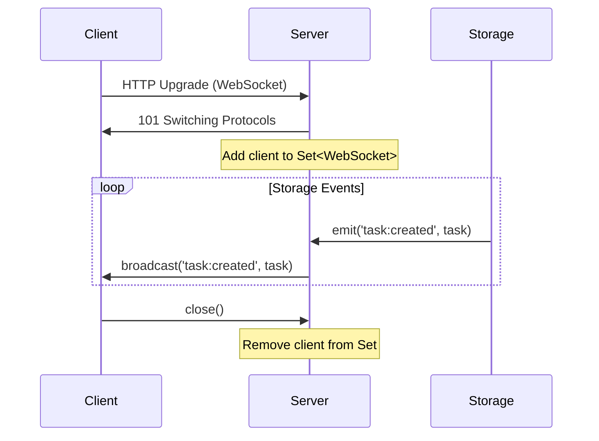
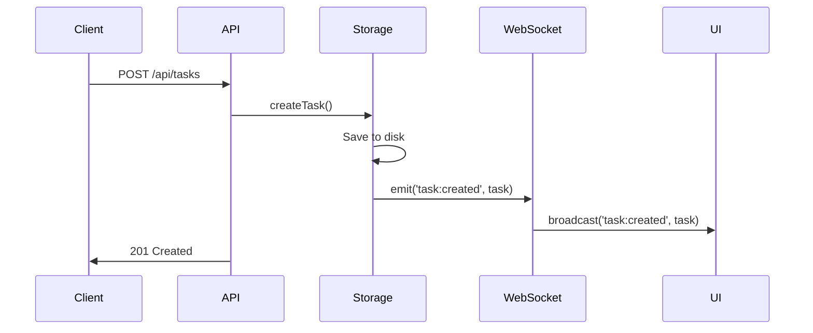
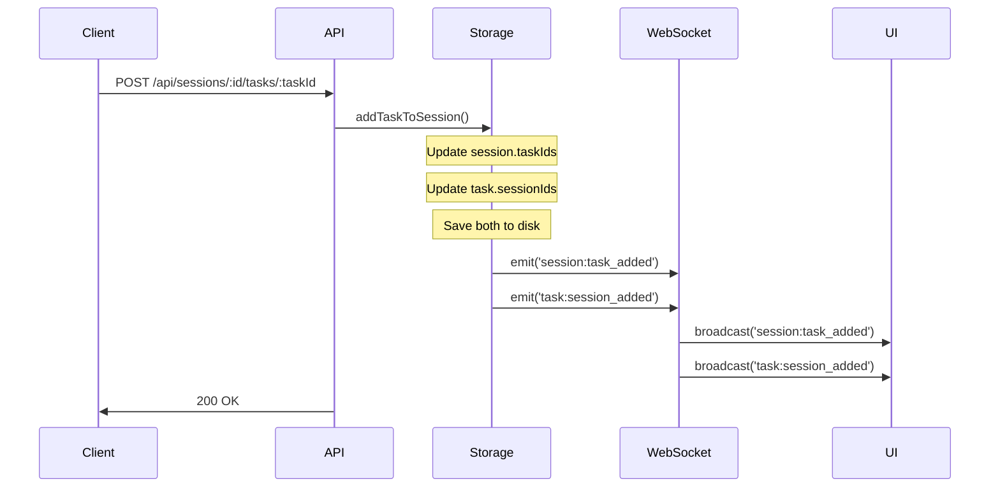
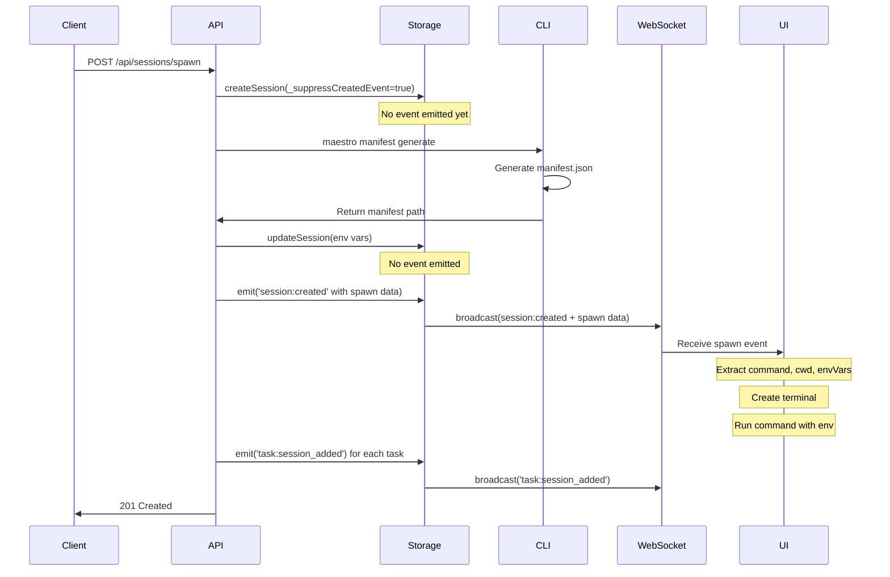

# Maestro Server - WebSocket Specification

**Version:** 1.0.0
**Last Updated:** 2026-02-04
**Purpose:** Complete WebSocket protocol and event catalog

---

## Overview

Maestro Server broadcasts real-time events to connected clients via WebSocket. The protocol is **unidirectional**: server sends events, clients only receive (no client messages accepted).

### Key Characteristics

- **Direction:** Server → Client only (unidirectional)
- **Transport:** WebSocket over HTTP upgrade
- **Format:** JSON messages
- **Connection:** Long-lived, persistent
- **URL:** `ws://localhost:3000` (same port as HTTP server)

---

## Connection Management

### Connection Flow



### Connecting

**WebSocket URL:**
```
ws://localhost:3000
```

**Example (Node.js):**
```javascript
const WebSocket = require('ws');
const ws = new WebSocket('ws://localhost:3000');

ws.on('open', () => {
  console.log('Connected to Maestro Server');
});

ws.on('message', (data) => {
  const message = JSON.parse(data);
  console.log('Event:', message.event, message.data);
});

ws.on('close', () => {
  console.log('Disconnected');
});

ws.on('error', (error) => {
  console.error('WebSocket error:', error);
});
```

**Example (Browser):**
```javascript
const ws = new WebSocket('ws://localhost:3000');

ws.onopen = () => {
  console.log('Connected to Maestro Server');
};

ws.onmessage = (event) => {
  const message = JSON.parse(event.data);
  console.log('Event:', message.event, message.data);
};

ws.onclose = () => {
  console.log('Disconnected');
};

ws.onerror = (error) => {
  console.error('WebSocket error:', error);
};
```

### Connection Lifecycle

1. **Connection:** Client opens WebSocket to server
2. **Active:** Client receives broadcast events
3. **Disconnection:** Client closes connection or network failure
4. **Cleanup:** Server removes client from broadcast set

### Server-Side Connection Tracking

```typescript
const clients = new Set<WebSocket>();

wss.on('connection', (ws: WebSocket) => {
  console.log('WebSocket client connected. Total clients:', clients.size + 1);
  clients.add(ws);

  ws.on('close', () => {
    console.log('WebSocket client disconnected. Total clients:', clients.size - 1);
    clients.delete(ws);
  });

  ws.on('error', (err: Error) => {
    console.error('WebSocket error:', err);
    clients.delete(ws);
  });
});
```

---

## Message Format

All messages follow a consistent JSON structure:

```typescript
interface WebSocketMessage {
  type: string;      // Event type (same as event)
  event: string;     // Event type (redundant for compatibility)
  data: any;         // Event payload
}
```

### Example Message

```json
{
  "type": "task:created",
  "event": "task:created",
  "data": {
    "id": "task_1738713700000_p9q2r5t8w",
    "projectId": "proj_1738713600000_x7k9m2p4q",
    "title": "Build API",
    "status": "pending"
  }
}
```

**Note:** Both `type` and `event` fields contain the same value for backward compatibility.

---

## Event Catalog

### Project Events

#### `project:created`

**Emitted When:** New project created via `POST /api/projects`

**Data Schema:**
```typescript
{
  id: string;
  name: string;
  workingDir: string;
  description?: string;
  createdAt: number;
  updatedAt: number;
}
```

**Example:**
```json
{
  "type": "project:created",
  "event": "project:created",
  "data": {
    "id": "proj_1738713600000_x7k9m2p4q",
    "name": "agents-ui",
    "workingDir": "/Users/john/Projects/agents-ui",
    "description": "Multi-agent UI framework",
    "createdAt": 1738713600000,
    "updatedAt": 1738713600000
  }
}
```

---

#### `project:updated`

**Emitted When:** Project updated via `PUT /api/projects/:id`

**Data Schema:** Same as `project:created`

**Example:**
```json
{
  "type": "project:updated",
  "event": "project:updated",
  "data": {
    "id": "proj_1738713600000_x7k9m2p4q",
    "name": "agents-ui (updated)",
    "workingDir": "/Users/john/Projects/agents-ui",
    "description": "Updated description",
    "createdAt": 1738713600000,
    "updatedAt": 1738713700000
  }
}
```

---

#### `project:deleted`

**Emitted When:** Project deleted via `DELETE /api/projects/:id`

**Data Schema:**
```typescript
{
  id: string;
}
```

**Example:**
```json
{
  "type": "project:deleted",
  "event": "project:deleted",
  "data": {
    "id": "proj_1738713600000_x7k9m2p4q"
  }
}
```

---

### Task Events

#### `task:created`

**Emitted When:** New task created via `POST /api/tasks`

**Data Schema:**
```typescript
{
  id: string;
  projectId: string;
  parentId: string | null;
  title: string;
  description: string;
  status: TaskStatus;
  priority: TaskPriority;
  createdAt: number;
  updatedAt: number;
  startedAt: number | null;
  completedAt: number | null;
  initialPrompt: string;
  sessionIds: string[];
  skillIds: string[];
  agentIds: string[];
  dependencies: string[];
  timeline: TimelineEvent[];
}
```

**Example:**
```json
{
  "type": "task:created",
  "event": "task:created",
  "data": {
    "id": "task_1738713700000_p9q2r5t8w",
    "projectId": "proj_1738713600000_x7k9m2p4q",
    "parentId": null,
    "title": "Build API",
    "description": "Implement REST API",
    "status": "pending",
    "priority": "high",
    "createdAt": 1738713700000,
    "updatedAt": 1738713700000,
    "startedAt": null,
    "completedAt": null,
    "initialPrompt": "Create REST API with Express",
    "sessionIds": [],
    "skillIds": [],
    "agentIds": [],
    "dependencies": [],
    "timeline": [
      {
        "id": "evt_1738713700000_z1y2x3w4v",
        "type": "created",
        "timestamp": 1738713700000,
        "message": "Task created"
      }
    ]
  }
}
```

---

#### `task:updated`

**Emitted When:** Task updated via `PATCH /api/tasks/:id` or `POST /api/tasks/:id/timeline`

**Data Schema:** Same as `task:created`

**Example:**
```json
{
  "type": "task:updated",
  "event": "task:updated",
  "data": {
    "id": "task_1738713700000_p9q2r5t8w",
    "status": "in_progress",
    "startedAt": 1738713750000,
    "updatedAt": 1738713750000
  }
}
```

---

#### `task:deleted`

**Emitted When:** Task deleted via `DELETE /api/tasks/:id`

**Data Schema:**
```typescript
{
  id: string;
}
```

**Example:**
```json
{
  "type": "task:deleted",
  "event": "task:deleted",
  "data": {
    "id": "task_1738713700000_p9q2r5t8w"
  }
}
```

---

#### `task:session_added`

**Emitted When:**
- Session created with task in `taskIds` (via `POST /api/sessions`)
- Task added to session (via `POST /api/sessions/:id/tasks/:taskId`)
- Session spawned with task (via `POST /api/sessions/spawn`)

**Data Schema:**
```typescript
{
  taskId: string;
  sessionId: string;
}
```

**Example:**
```json
{
  "type": "task:session_added",
  "event": "task:session_added",
  "data": {
    "taskId": "task_1738713700000_p9q2r5t8w",
    "sessionId": "sess_1738713800000_a1b2c3d4e"
  }
}
```

---

#### `task:session_removed`

**Emitted When:**
- Session deleted (via `DELETE /api/sessions/:id`)
- Task removed from session (via `DELETE /api/sessions/:id/tasks/:taskId`)

**Data Schema:**
```typescript
{
  taskId: string;
  sessionId: string;
}
```

**Example:**
```json
{
  "type": "task:session_removed",
  "event": "task:session_removed",
  "data": {
    "taskId": "task_1738713700000_p9q2r5t8w",
    "sessionId": "sess_1738713800000_a1b2c3d4e"
  }
}
```

---

### Session Events

#### `session:created`

**Emitted When:**
- Regular session created (via `POST /api/sessions`)
- Session spawned (via `POST /api/sessions/spawn`) - **SPECIAL FORMAT**

**Data Schema (Regular):**
```typescript
{
  id: string;
  projectId: string;
  taskIds: string[];
  name: string;
  agentId?: string;
  env: Record<string, string>;
  status: SessionStatus;
  startedAt: number;
  lastActivity: number;
  completedAt: number | null;
  hostname: string;
  platform: string;
  events: SessionEvent[];
  metadata?: Record<string, any>;
}
```

**Data Schema (Spawn - SPECIAL):**
```typescript
{
  session: Session;                    // Full session object
  command: string;                     // Command to run (e.g., "maestro worker init")
  cwd: string;                         // Working directory
  envVars: Record<string, string>;     // Environment variables
  manifest: any;                       // Generated manifest object
  projectId: string;                   // Project ID
  taskIds: string[];                   // Task IDs
  _isSpawnCreated: true;               // Flag to identify spawn event
}
```

**Example (Regular):**
```json
{
  "type": "session:created",
  "event": "session:created",
  "data": {
    "id": "sess_1738713800000_a1b2c3d4e",
    "projectId": "proj_1738713600000_x7k9m2p4q",
    "taskIds": ["task_1738713700000_p9q2r5t8w"],
    "name": "Worker Session",
    "env": {},
    "status": "running",
    "startedAt": 1738713800000,
    "lastActivity": 1738713800000,
    "completedAt": null,
    "hostname": "johns-macbook.local",
    "platform": "darwin",
    "events": [],
    "metadata": null
  }
}
```

**Example (Spawn):**
```json
{
  "type": "session:created",
  "event": "session:created",
  "data": {
    "session": {
      "id": "sess_1738713800000_a1b2c3d4e",
      "projectId": "proj_1738713600000_x7k9m2p4q",
      "taskIds": ["task_1738713700000_p9q2r5t8w"],
      "name": "Worker for task_1738713700000_p9q2r5t8w",
      "env": {
        "MAESTRO_SESSION_ID": "sess_1738713800000_a1b2c3d4e",
        "MAESTRO_MANIFEST_PATH": "/Users/john/.maestro/sessions/sess_1738713800000_a1b2c3d4e/manifest.json",
        "MAESTRO_SERVER_URL": "http://localhost:3000"
      },
      "status": "spawning",
      "startedAt": 1738713800000,
      "lastActivity": 1738713800000,
      "completedAt": null,
      "hostname": "johns-macbook.local",
      "platform": "darwin",
      "events": [],
      "metadata": {
        "skills": ["maestro-worker"],
        "role": "worker",
        "spawnSource": "session",
        "context": {}
      }
    },
    "command": "maestro worker init",
    "cwd": "/Users/john/Projects/agents-ui",
    "envVars": {
      "MAESTRO_SESSION_ID": "sess_1738713800000_a1b2c3d4e",
      "MAESTRO_MANIFEST_PATH": "/Users/john/.maestro/sessions/sess_1738713800000_a1b2c3d4e/manifest.json",
      "MAESTRO_SERVER_URL": "http://localhost:3000"
    },
    "manifest": {
      "manifestVersion": "1.0",
      "role": "worker",
      "session": {
        "id": "sess_1738713800000_a1b2c3d4e",
        "model": "claude-sonnet-4"
      },
      "tasks": [
        {
          "id": "task_1738713700000_p9q2r5t8w",
          "title": "Build API",
          "description": "Implement REST API"
        }
      ],
      "skills": ["maestro-worker"],
      "apiUrl": "http://localhost:3000"
    },
    "projectId": "proj_1738713600000_x7k9m2p4q",
    "taskIds": ["task_1738713700000_p9q2r5t8w"],
    "_isSpawnCreated": true
  }
}
```

**Special Handling:**

The `_isSpawnCreated` flag indicates this is a spawn event. UI clients should:
1. Extract `command`, `cwd`, and `envVars`
2. Create new terminal window
3. Set environment variables from `envVars`
4. Change directory to `cwd`
5. Execute `command`

---

#### `session:spawn`

**Emitted When:**
- Agent-initiated session spawn (when `spawnSource: "session"`)
- CLI sends `POST /api/sessions/spawn` with `spawnSource: "session"`
- **NOT emitted for UI-initiated spawns** (when `spawnSource: "ui"`)

**Purpose:**
This event tells the UI to automatically spawn a new terminal when an agent (running in CLI) requests to create a new session. The UI receives this event and spawns the terminal without user intervention.

**Data Schema:**
```typescript
{
  session: Session;                    // Full session object
  command: string;                     // Command to run (e.g., "maestro worker init")
  cwd: string;                         // Working directory
  envVars: Record<string, string>;     // Environment variables
  manifest: any;                       // Generated manifest object
  projectId: string;                   // Project ID
  taskIds: string[];                   // Task IDs
}
```

**Example:**
```json
{
  "type": "session:spawn",
  "event": "session:spawn",
  "data": {
    "session": {
      "id": "sess_1738714000000_x9y8z7w6v",
      "projectId": "proj_1738713600000_x7k9m2p4q",
      "taskIds": ["task_1738713700000_p9q2r5t8w"],
      "name": "Agent-spawned worker",
      "env": {
        "MAESTRO_SESSION_ID": "sess_1738714000000_x9y8z7w6v",
        "MAESTRO_MANIFEST_PATH": "/Users/john/.maestro/sessions/sess_1738714000000_x9y8z7w6v/manifest.json",
        "MAESTRO_SERVER_URL": "http://localhost:3000"
      },
      "status": "spawning",
      "metadata": {
        "role": "worker",
        "spawnSource": "session",
        "spawnedBy": "sess_parent_123"
      }
    },
    "command": "maestro worker init",
    "cwd": "/Users/john/Projects/my-app",
    "envVars": {
      "MAESTRO_SESSION_ID": "sess_1738714000000_x9y8z7w6v",
      "MAESTRO_MANIFEST_PATH": "/Users/john/.maestro/sessions/sess_1738714000000_x9y8z7w6v/manifest.json",
      "MAESTRO_SERVER_URL": "http://localhost:3000"
    },
    "manifest": {
      "manifestVersion": "1.0",
      "role": "worker",
      "session": { "model": "claude-3-5-sonnet-20241022" },
      "tasks": [...]
    },
    "projectId": "proj_1738713600000_x7k9m2p4q",
    "taskIds": ["task_1738713700000_p9q2r5t8w"]
  }
}
```

**UI Handling:**
When receiving this event, the UI should automatically:
1. Extract `command`, `cwd`, and `envVars` from the event data
2. Create new terminal window (without user interaction)
3. Set environment variables from `envVars`
4. Change directory to `cwd`
5. Execute `command`

**Difference from `session:created`:**
- `session:spawn` - Only for agent-initiated spawns, tells UI to auto-spawn terminal
- `session:created` - For all session creations, just notifies of new session record

---

#### `session:updated`

**Emitted When:** Session updated via `PATCH /api/sessions/:id`

**Data Schema:** Same as `session:created` (regular format)

**Example:**
```json
{
  "type": "session:updated",
  "event": "session:updated",
  "data": {
    "id": "sess_1738713800000_a1b2c3d4e",
    "status": "completed",
    "lastActivity": 1738713900000
  }
}
```

---

#### `session:deleted`

**Emitted When:** Session deleted via `DELETE /api/sessions/:id`

**Data Schema:**
```typescript
{
  id: string;
}
```

**Example:**
```json
{
  "type": "session:deleted",
  "event": "session:deleted",
  "data": {
    "id": "sess_1738713800000_a1b2c3d4e"
  }
}
```

---

#### `session:task_added`

**Emitted When:**
- Session created with tasks (via `POST /api/sessions`)
- Task added to session (via `POST /api/sessions/:id/tasks/:taskId`)
- Session spawned with tasks (via `POST /api/sessions/spawn`)

**Data Schema:**
```typescript
{
  sessionId: string;
  taskId: string;
}
```

**Example:**
```json
{
  "type": "session:task_added",
  "event": "session:task_added",
  "data": {
    "sessionId": "sess_1738713800000_a1b2c3d4e",
    "taskId": "task_1738713700000_p9q2r5t8w"
  }
}
```

---

#### `session:task_removed`

**Emitted When:**
- Session deleted (via `DELETE /api/sessions/:id`)
- Task removed from session (via `DELETE /api/sessions/:id/tasks/:taskId`)

**Data Schema:**
```typescript
{
  sessionId: string;
  taskId: string;
}
```

**Example:**
```json
{
  "type": "session:task_removed",
  "event": "session:task_removed",
  "data": {
    "sessionId": "sess_1738713800000_a1b2c3d4e",
    "taskId": "task_1738713700000_p9q2r5t8w"
  }
}
```

---

## Event Emission Flow

### CRUD Operation Flow



### Many-to-Many Association Flow



### Session Spawn Flow



---

## Broadcast Implementation

### Server-Side Broadcast Function

```typescript
function broadcast(event: string, data: any) {
  // Create message
  const message = JSON.stringify({
    type: event,
    event,
    data
  });

  let sent = 0;
  const startTime = Date.now();

  // Send to all connected clients
  clients.forEach(client => {
    if (client.readyState === WebSocket.OPEN) {
      try {
        client.send(message);
        sent++;
      } catch (error) {
        console.error(`Failed to send to client: ${error}`);
      }
    }
  });

  const duration = Date.now() - startTime;

  if (process.env.DEBUG) {
    console.log(`Broadcast to ${sent}/${clients.size} clients: ${event} (${duration}ms)`);
  }
}
```

### Storage Event Listeners

```typescript
// Project events
storage.on('project:created', (project) => {
  broadcast('project:created', project);
});

storage.on('project:updated', (project) => {
  broadcast('project:updated', project);
});

storage.on('project:deleted', (data) => {
  broadcast('project:deleted', data);
});

// Task events
storage.on('task:created', (task) => {
  broadcast('task:created', task);
});

storage.on('task:updated', (task) => {
  broadcast('task:updated', task);
});

storage.on('task:deleted', (data) => {
  broadcast('task:deleted', data);
});

// Session events
storage.on('session:created', (data) => {
  broadcast('session:created', data);
});

storage.on('session:updated', (session) => {
  broadcast('session:updated', session);
});

storage.on('session:deleted', (data) => {
  broadcast('session:deleted', data);
});

// Many-to-many relationship events
storage.on('session:task_added', (data) => {
  broadcast('session:task_added', data);
});

storage.on('session:task_removed', (data) => {
  broadcast('session:task_removed', data);
});

storage.on('task:session_added', (data) => {
  broadcast('task:session_added', data);
});

storage.on('task:session_removed', (data) => {
  broadcast('task:session_removed', data);
});
```

---

## Client Implementation Examples

### Basic WebSocket Client (Node.js)

```javascript
const WebSocket = require('ws');

class MaestroClient {
  constructor(url = 'ws://localhost:3000') {
    this.url = url;
    this.ws = null;
    this.handlers = new Map();
  }

  connect() {
    this.ws = new WebSocket(this.url);

    this.ws.on('open', () => {
      console.log('Connected to Maestro Server');
    });

    this.ws.on('message', (data) => {
      const message = JSON.parse(data);
      this.handleEvent(message.event, message.data);
    });

    this.ws.on('close', () => {
      console.log('Disconnected from Maestro Server');
      // Implement reconnection logic
      setTimeout(() => this.connect(), 5000);
    });

    this.ws.on('error', (error) => {
      console.error('WebSocket error:', error);
    });
  }

  on(event, handler) {
    if (!this.handlers.has(event)) {
      this.handlers.set(event, []);
    }
    this.handlers.get(event).push(handler);
  }

  handleEvent(event, data) {
    const handlers = this.handlers.get(event) || [];
    handlers.forEach(handler => handler(data));
  }

  disconnect() {
    if (this.ws) {
      this.ws.close();
    }
  }
}

// Usage
const client = new MaestroClient();

client.on('task:created', (task) => {
  console.log('New task:', task.title);
});

client.on('session:created', (data) => {
  if (data._isSpawnCreated) {
    console.log('Spawn event received!');
    console.log('Command:', data.command);
    console.log('Working directory:', data.cwd);
    console.log('Environment:', data.envVars);
    // Create terminal and run command
  }
});

client.connect();
```

### React Hook Example

```typescript
import { useEffect, useState } from 'react';

export function useMaestroWebSocket(url = 'ws://localhost:3000') {
  const [connected, setConnected] = useState(false);
  const [ws, setWs] = useState<WebSocket | null>(null);

  useEffect(() => {
    const websocket = new WebSocket(url);

    websocket.onopen = () => {
      console.log('Connected to Maestro Server');
      setConnected(true);
    };

    websocket.onclose = () => {
      console.log('Disconnected from Maestro Server');
      setConnected(false);
      // Reconnect after 5 seconds
      setTimeout(() => {
        setWs(new WebSocket(url));
      }, 5000);
    };

    websocket.onerror = (error) => {
      console.error('WebSocket error:', error);
    };

    setWs(websocket);

    return () => {
      websocket.close();
    };
  }, [url]);

  return { ws, connected };
}

// Usage in component
function TaskList() {
  const { ws, connected } = useMaestroWebSocket();
  const [tasks, setTasks] = useState([]);

  useEffect(() => {
    if (!ws) return;

    ws.onmessage = (event) => {
      const message = JSON.parse(event.data);

      if (message.event === 'task:created') {
        setTasks(prev => [...prev, message.data]);
      } else if (message.event === 'task:updated') {
        setTasks(prev => prev.map(t =>
          t.id === message.data.id ? message.data : t
        ));
      } else if (message.event === 'task:deleted') {
        setTasks(prev => prev.filter(t => t.id !== message.data.id));
      }
    };
  }, [ws]);

  return (
    <div>
      <p>Status: {connected ? 'Connected' : 'Disconnected'}</p>
      {tasks.map(task => (
        <div key={task.id}>{task.title}</div>
      ))}
    </div>
  );
}
```

---

## Reconnection Strategy

Clients should implement exponential backoff for reconnection:

```javascript
class ReconnectingWebSocket {
  constructor(url, options = {}) {
    this.url = url;
    this.reconnectDelay = options.reconnectDelay || 1000;
    this.maxReconnectDelay = options.maxReconnectDelay || 30000;
    this.reconnectAttempts = 0;
    this.ws = null;
    this.connect();
  }

  connect() {
    this.ws = new WebSocket(this.url);

    this.ws.onopen = () => {
      console.log('Connected');
      this.reconnectAttempts = 0;
      this.reconnectDelay = 1000;
    };

    this.ws.onclose = () => {
      console.log('Disconnected. Reconnecting...');
      this.reconnect();
    };

    this.ws.onerror = (error) => {
      console.error('WebSocket error:', error);
    };

    this.ws.onmessage = (event) => {
      const message = JSON.parse(event.data);
      this.onMessage(message);
    };
  }

  reconnect() {
    this.reconnectAttempts++;

    const delay = Math.min(
      this.reconnectDelay * Math.pow(2, this.reconnectAttempts),
      this.maxReconnectDelay
    );

    console.log(`Reconnecting in ${delay}ms (attempt ${this.reconnectAttempts})`);

    setTimeout(() => {
      this.connect();
    }, delay);
  }

  onMessage(message) {
    // Override in subclass or set handler
  }

  close() {
    if (this.ws) {
      this.ws.close();
    }
  }
}
```

---

## Event Ordering Guarantees

### Guarantee 1: Session Creation Order

For session spawn:
1. `session:created` (with spawn data) emitted **first**
2. `task:session_added` emitted **after** for each task

### Guarantee 2: Bidirectional Events

When associating task with session:
1. `session:task_added` emitted
2. `task:session_added` emitted
(Order not guaranteed between these two)

### Guarantee 3: Delete Cascade

When deleting session:
1. Session removed from all tasks
2. `session:deleted` emitted
3. Timeline events added to tasks

---

## Debugging

### Enable Debug Logging

Set `DEBUG` environment variable:

```bash
DEBUG=true npm start
```

Output shows broadcast details:

```
Broadcast to 3/3 clients: task:created (2ms)
Broadcast to 3/3 clients: session:created (1ms)
```

### Monitor WebSocket Traffic (wscat)

```bash
npm install -g wscat
wscat -c ws://localhost:3000
```

You'll see all broadcast events in real-time.

### Test Broadcasts

```bash
# Create task (triggers task:created)
curl -X POST http://localhost:3000/api/tasks \
  -H "Content-Type: application/json" \
  -d '{"projectId":"proj_123","title":"Test"}'

# Update task (triggers task:updated)
curl -X PATCH http://localhost:3000/api/tasks/task_123 \
  -H "Content-Type: application/json" \
  -d '{"status":"in_progress"}'
```

---

## Error Handling

### Client-Side Error Handling

```javascript
ws.onerror = (error) => {
  console.error('WebSocket error:', error);
  // Log to error tracking service
  // Show user notification
  // Attempt reconnection
};

ws.onclose = (event) => {
  console.log('Connection closed:', event.code, event.reason);

  if (event.code === 1006) {
    // Abnormal closure - likely network issue
    // Implement reconnection
  }
};
```

### Server-Side Error Handling

Server logs errors but continues broadcasting to other clients:

```typescript
clients.forEach(client => {
  if (client.readyState === WebSocket.OPEN) {
    try {
      client.send(message);
      sent++;
    } catch (error) {
      console.error(`Failed to send to client: ${error}`);
      // Don't crash - continue to other clients
    }
  }
});
```

---

## Performance Characteristics

### Broadcast Latency

- **Typical:** < 10ms to broadcast to all clients
- **Depends on:** Number of clients, message size, network conditions

### Connection Limit

- **Recommended:** 10-50 concurrent WebSocket clients
- **Tested:** Up to 100 clients (single machine)
- **Not designed for:** High-scale production (100+ clients)

### Message Size

- **Typical:** < 5KB per message (entity updates)
- **Largest:** Session spawn events with full manifest (10-50KB)

---

## Related Specifications

- **03-API-SPECIFICATION.md** - HTTP endpoints that trigger events
- **05-STORAGE-SPECIFICATION.md** - Storage layer that emits events
- **08-SESSION-SPAWNING-SPECIFICATION.md** - Spawn event details
- **02-CORE-CONCEPTS.md** - Entity schemas in event payloads
