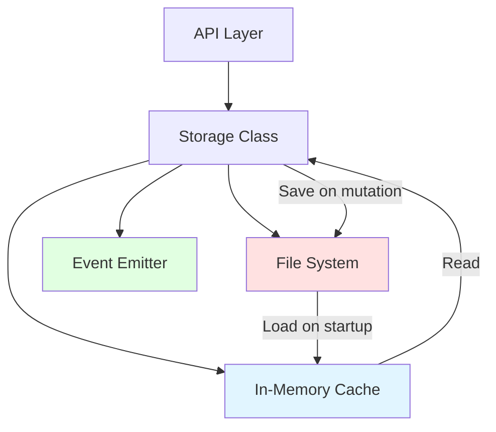
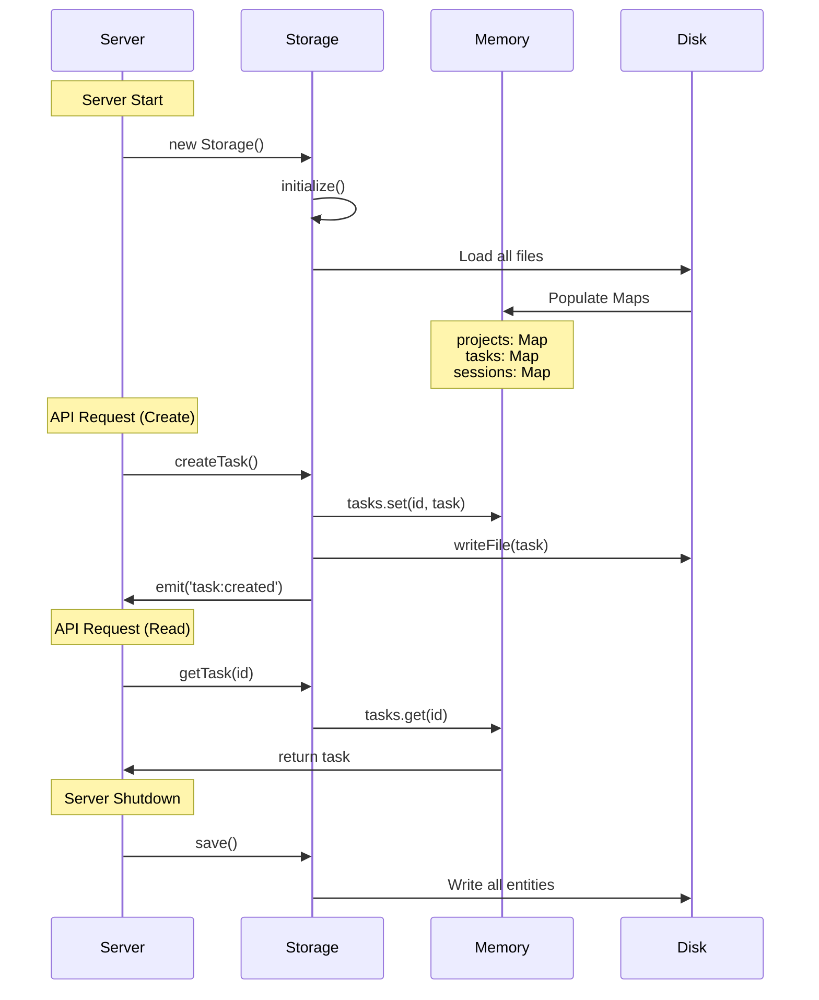

# Maestro Server - Storage Specification

**Version:** 1.0.0
**Last Updated:** 2026-02-04
**Purpose:** Define persistence requirements, file structure, and data integrity

---

## Overview

Maestro Server uses a **file-based storage system** with in-memory caching for fast reads. Data is persisted as individual JSON files in the user's home directory.

### Key Characteristics

- **Type:** File-based JSON storage
- **Location:** `~/.maestro/data/`
- **Format:** Individual JSON files per entity
- **Caching:** In-memory Maps for fast reads
- **Writes:** Synchronous (blocking) to ensure persistence
- **Reads:** From memory (loaded on startup)

---

## Storage Architecture



### Components

1. **Storage Class** - Main storage interface (extends EventEmitter)
2. **In-Memory Cache** - Three Maps: projects, tasks, sessions
3. **File System** - JSON files organized by entity type
4. **Event Emitter** - Broadcasts state changes to WebSocket

---

## File Structure

### Directory Layout

```
~/.maestro/
├── data/                           # Storage root
│   ├── projects/                  # Project entities
│   │   ├── proj_123.json
│   │   ├── proj_456.json
│   │   └── proj_789.json
│   ├── tasks/                     # Task entities (organized by project)
│   │   ├── proj_123/
│   │   │   ├── task_001.json
│   │   │   ├── task_002.json
│   │   │   └── task_003.json
│   │   └── proj_456/
│   │       ├── task_004.json
│   │       └── task_005.json
│   └── sessions/                  # Session entities
│       ├── sess_abc.json
│       ├── sess_def.json
│       └── sess_ghi.json
└── sessions/                       # CLI-generated manifests (not storage data)
    ├── sess_abc/
    │   └── manifest.json
    └── sess_def/
        └── manifest.json
```

### Path Configuration

**Default paths:**
```typescript
const dataDir = path.join(os.homedir(), '.maestro', 'data');

// Entity-specific paths
const projectsDir = path.join(dataDir, 'projects');
const tasksDir = path.join(dataDir, 'tasks');
const sessionsDir = path.join(dataDir, 'sessions');
```

**Override via environment:**
```bash
DATA_DIR=/custom/path npm start
```

---

## Data Format

### File Format

All files are **JSON** with pretty-printing (2-space indent):

```typescript
await fs.writeFile(
  filePath,
  JSON.stringify(entity, null, 2)  // Pretty-printed
);
```

### Project File Example

**File:** `~/.maestro/data/projects/proj_1738713600000_x7k9m2p4q.json`

```json
{
  "id": "proj_1738713600000_x7k9m2p4q",
  "name": "agents-ui",
  "workingDir": "/Users/john/Projects/agents-ui",
  "description": "Multi-agent UI framework",
  "createdAt": 1738713600000,
  "updatedAt": 1738713600000
}
```

### Task File Example

**File:** `~/.maestro/data/tasks/proj_1738713600000_x7k9m2p4q/task_1738713700000_p9q2r5t8w.json`

```json
{
  "id": "task_1738713700000_p9q2r5t8w",
  "projectId": "proj_1738713600000_x7k9m2p4q",
  "parentId": null,
  "title": "Build API",
  "description": "Implement REST API",
  "status": "pending",
  "priority": "high",
  "createdAt": 1738713700000,
  "updatedAt": 1738713700000,
  "startedAt": null,
  "completedAt": null,
  "initialPrompt": "Create REST API with Express",
  "sessionIds": [],
  "skillIds": [],
  "agentIds": [],
  "dependencies": [],
  "timeline": [
    {
      "id": "evt_1738713700000_z1y2x3w4v",
      "type": "created",
      "timestamp": 1738713700000,
      "message": "Task created"
    }
  ]
}
```

### Session File Example

**File:** `~/.maestro/data/sessions/sess_1738713800000_a1b2c3d4e.json`

```json
{
  "id": "sess_1738713800000_a1b2c3d4e",
  "projectId": "proj_1738713600000_x7k9m2p4q",
  "taskIds": ["task_1738713700000_p9q2r5t8w"],
  "name": "Worker Session",
  "env": {
    "MAESTRO_SESSION_ID": "sess_1738713800000_a1b2c3d4e",
    "MAESTRO_MANIFEST_PATH": "/Users/john/.maestro/sessions/sess_1738713800000_a1b2c3d4e/manifest.json",
    "MAESTRO_SERVER_URL": "http://localhost:3000"
  },
  "status": "running",
  "startedAt": 1738713800000,
  "lastActivity": 1738713800000,
  "completedAt": null,
  "hostname": "johns-macbook.local",
  "platform": "darwin",
  "events": [],
  "metadata": {
    "skills": ["maestro-worker"],
    "role": "worker",
    "spawnSource": "ui",
    "context": {}
  }
}
```

---

## In-Memory Caching Strategy

### Cache Structure

```typescript
class Storage extends EventEmitter {
  private projects: Map<string, Project>;    // Key: project.id
  private tasks: Map<string, Task>;          // Key: task.id
  private sessions: Map<string, Session>;    // Key: session.id
}
```

### Cache Lifecycle



### Cache Consistency

**Rule 1: Single Source of Truth**
- Memory cache is the primary data source
- Disk is persistence layer (always synced)

**Rule 2: Synchronous Writes**
- Every mutation immediately writes to disk
- No write buffering or batching

**Rule 3: Load Once**
- Data loaded from disk on startup
- Never reloaded during runtime (memory is source of truth)

---

## Load Behavior

### Initialization Sequence

```typescript
async initialize(): Promise<void> {
  try {
    // 1. Create data directory if missing
    await fs.mkdir(this.dataDir, { recursive: true });

    // 2. Load all data from disk
    await this.load();

    console.log('✅ Storage initialized');
  } catch (err) {
    console.error('❌ Storage initialization error:', err);
  }
}
```

### Load Implementation

```typescript
async load(): Promise<void> {
  // Load projects
  const projectsDir = path.join(this.dataDir, 'projects');
  await fs.mkdir(projectsDir, { recursive: true });
  const projectFiles = await fs.readdir(projectsDir);

  for (const file of projectFiles.filter(f => f.endsWith('.json'))) {
    const data = await fs.readFile(path.join(projectsDir, file), 'utf-8');
    const project = JSON.parse(data) as Project;
    this.projects.set(project.id, project);
  }
  console.log(`Loaded ${this.projects.size} projects`);

  // Load tasks (from project-specific directories)
  const tasksDir = path.join(this.dataDir, 'tasks');
  await fs.mkdir(tasksDir, { recursive: true });
  const projectDirs = await fs.readdir(tasksDir, { withFileTypes: true });

  for (const dirent of projectDirs) {
    if (dirent.isDirectory()) {
      const projectTasksDir = path.join(tasksDir, dirent.name);
      const taskFiles = await fs.readdir(projectTasksDir);

      for (const file of taskFiles.filter(f => f.endsWith('.json'))) {
        const data = await fs.readFile(path.join(projectTasksDir, file), 'utf-8');
        const task = JSON.parse(data) as Task;

        // Initialize new Phase IV-A fields if missing
        if (!task.sessionIds) task.sessionIds = [];
        if (!task.skillIds) task.skillIds = [];
        if (!task.agentIds) task.agentIds = [];

        this.tasks.set(task.id, task);
      }
    }
  }
  console.log(`Loaded ${this.tasks.size} tasks`);

  // Load sessions
  const sessionsDir = path.join(this.dataDir, 'sessions');
  await fs.mkdir(sessionsDir, { recursive: true });
  const sessionFiles = await fs.readdir(sessionsDir);

  for (const file of sessionFiles.filter(f => f.endsWith('.json'))) {
    const data = await fs.readFile(path.join(sessionsDir, file), 'utf-8');
    const session = JSON.parse(data) as any;

    // MIGRATION: Convert old taskId to taskIds array
    if (session.taskId && !session.taskIds) {
      session.taskIds = [session.taskId];
      delete session.taskId;
    }

    // Initialize new Phase IV-A fields if missing
    if (!session.taskIds) session.taskIds = [];
    if (!session.name) session.name = `Session ${session.id}`;
    if (!session.env) session.env = {};

    this.sessions.set(session.id, session as Session);
  }
  console.log(`Loaded ${this.sessions.size} sessions`);
}
```

---

## Save Behavior

### Save All Implementation

```typescript
async save(): Promise<void> {
  try {
    // Save projects
    const projectsDir = path.join(this.dataDir, 'projects');
    await fs.mkdir(projectsDir, { recursive: true });

    for (const project of this.projects.values()) {
      await fs.writeFile(
        path.join(projectsDir, `${project.id}.json`),
        JSON.stringify(project, null, 2)
      );
    }

    // Save tasks (in project-specific directories)
    const tasksDir = path.join(this.dataDir, 'tasks');
    await fs.mkdir(tasksDir, { recursive: true });

    for (const task of this.tasks.values()) {
      const projectTasksDir = path.join(tasksDir, task.projectId);
      await fs.mkdir(projectTasksDir, { recursive: true });
      await fs.writeFile(
        path.join(projectTasksDir, `${task.id}.json`),
        JSON.stringify(task, null, 2)
      );
    }

    // Save sessions
    const sessionsDir = path.join(this.dataDir, 'sessions');
    await fs.mkdir(sessionsDir, { recursive: true });

    for (const session of this.sessions.values()) {
      await fs.writeFile(
        path.join(sessionsDir, `${session.id}.json`),
        JSON.stringify(session, null, 2)
      );
    }
  } catch (err) {
    console.error('❌ Failed to save data:', err);
  }
}
```

### When Save is Called

**Synchronous save on every mutation:**

- `createProject()` → `save()`
- `updateProject()` → `save()`
- `deleteProject()` → `save()`
- `createTask()` → `save()`
- `updateTask()` → `save()`
- `deleteTask()` → `save()`
- `createSession()` → `save()`
- `updateSession()` → `save()`
- `deleteSession()` → `save()`
- `addTaskToSession()` → `save()`
- `removeTaskFromSession()` → `save()`

**Important:** `save()` is **synchronous** (blocks until complete) to ensure data persistence.

---

## ID Generation

### makeId Pattern

```typescript
makeId(prefix: string): string {
  return `${prefix}_${Date.now()}_${Math.random().toString(36).substr(2, 9)}`;
}
```

### ID Format

```
{prefix}_{timestamp}_{random}

Components:
- prefix: Entity type identifier
- timestamp: Unix milliseconds (Date.now())
- random: 9-character base36 string
```

### Prefix Mapping

| Entity | Prefix | Example |
|--------|--------|---------|
| Project | `proj` | `proj_1738713600000_x7k9m2p4q` |
| Task | `task` | `task_1738713700000_p9q2r5t8w` |
| Session | `sess` | `sess_1738713800000_a1b2c3d4e` |
| Event | `evt` | `evt_1738713900000_z1y2x3w4v` |

### Properties

1. **Uniqueness:** Timestamp + random = collision-resistant
2. **Sortability:** Lexicographic sort ≈ chronological order
3. **Readability:** Human-readable, identifies entity type
4. **Timestamp:** Creation time embedded in ID

---

## Event Emission

### Event Emitter Pattern

Storage class extends Node.js EventEmitter:

```typescript
class Storage extends EventEmitter {
  // ...

  createTask(taskData: CreateTaskPayload): Task {
    const task: Task = { /* ... */ };

    this.tasks.set(task.id, task);
    this.save();
    this.emit('task:created', task);  // Emit event

    return task;
  }
}
```

### Events Emitted

#### Project Events

| Event | Data | When |
|-------|------|------|
| `project:created` | Full project object | After `createProject()` |
| `project:updated` | Full project object | After `updateProject()` |
| `project:deleted` | `{ id: string }` | After `deleteProject()` |

#### Task Events

| Event | Data | When |
|-------|------|------|
| `task:created` | Full task object | After `createTask()` |
| `task:updated` | Full task object | After `updateTask()` |
| `task:deleted` | `{ id: string }` | After `deleteTask()` |
| `task:session_added` | `{ taskId, sessionId }` | After session association |
| `task:session_removed` | `{ taskId, sessionId }` | After session disassociation |

#### Session Events

| Event | Data | When |
|-------|------|------|
| `session:created` | Full session or spawn data | After `createSession()` (unless suppressed) |
| `session:updated` | Full session object | After `updateSession()` |
| `session:deleted` | `{ id: string }` | After `deleteSession()` |
| `session:task_added` | `{ sessionId, taskId }` | After task association |
| `session:task_removed` | `{ sessionId, taskId }` | After task disassociation |

### Event Suppression

Sessions created via spawn can suppress `session:created` event:

```typescript
createSession(sessionData: CreateSessionPayload): Session {
  // ...

  this.save();

  // Only emit if not suppressed
  if (!sessionData._suppressCreatedEvent) {
    this.emit('session:created', session);
  }

  return session;
}
```

This allows spawn endpoint to emit consolidated event with spawn data.

---

## Migration Handling

### Phase IV-A: taskId → taskIds

Storage automatically migrates old sessions on load:

```typescript
// MIGRATION: Convert old taskId to taskIds array
if (session.taskId && !session.taskIds) {
  session.taskIds = [session.taskId];
  delete session.taskId;
}
```

### Field Initialization

Missing Phase IV-A fields are initialized:

```typescript
// Tasks
if (!task.sessionIds) task.sessionIds = [];
if (!task.skillIds) task.skillIds = [];
if (!task.agentIds) task.agentIds = [];

// Sessions
if (!session.taskIds) session.taskIds = [];
if (!session.name) session.name = `Session ${session.id}`;
if (!session.env) session.env = {};
```

---

## CRUD Operations

### Create Operations

**Pattern:**
1. Generate ID via `makeId(prefix)`
2. Create entity with defaults
3. Add to memory cache
4. Save to disk (synchronous)
5. Emit event

**Example (Create Task):**
```typescript
createTask(taskData: CreateTaskPayload): Task {
  const task: Task = {
    id: this.makeId('task'),
    projectId: taskData.projectId,
    parentId: taskData.parentId || null,
    title: taskData.title,
    description: taskData.description || '',
    status: 'pending' as TaskStatus,
    priority: taskData.priority || 'medium',
    createdAt: Date.now(),
    updatedAt: Date.now(),
    startedAt: null,
    completedAt: null,
    initialPrompt: taskData.initialPrompt || '',
    sessionIds: [],
    skillIds: taskData.skillIds || [],
    agentIds: [],
    dependencies: [],
    timeline: [
      {
        id: this.makeId('evt'),
        type: 'created',
        timestamp: Date.now(),
        message: 'Task created'
      }
    ]
  };

  this.tasks.set(task.id, task);
  this.save();
  this.emit('task:created', task);

  return task;
}
```

### Read Operations

**Pattern:**
1. Read from memory cache (Map.get)
2. Return entity or undefined

**Example (Get Task):**
```typescript
getTask(id: string): Task | undefined {
  return this.tasks.get(id);
}
```

### Update Operations

**Pattern:**
1. Get entity from memory
2. Throw error if not found
3. Apply updates (merge or replace)
4. Update `updatedAt` timestamp
5. Handle special fields (startedAt, completedAt, timeline)
6. Save to disk (synchronous)
7. Emit event

**Example (Update Task):**
```typescript
updateTask(id: string, updates: UpdateTaskPayload): Task {
  const task = this.tasks.get(id);
  if (!task) {
    throw new Error('Task not found');
  }

  // Merge updates
  Object.assign(task, updates);
  task.updatedAt = Date.now();

  // Handle timeline (append, don't replace)
  if (updates.timeline && Array.isArray(updates.timeline)) {
    task.timeline = task.timeline.concat(updates.timeline);
  }

  // Handle status changes
  if (updates.status === 'in_progress' && !task.startedAt) {
    task.startedAt = Date.now();
  }
  if (updates.status === 'completed' && !task.completedAt) {
    task.completedAt = Date.now();
  }

  this.tasks.set(id, task);
  this.save();
  this.emit('task:updated', task);

  return task;
}
```

### Delete Operations

**Pattern:**
1. Get entity from memory
2. Throw error if not found
3. Check constraints (e.g., project has tasks)
4. Remove from memory cache
5. Save to disk (synchronous, deletes file)
6. Emit event

**Example (Delete Project):**
```typescript
deleteProject(id: string): { success: boolean; id: string } {
  const project = this.projects.get(id);
  if (!project) {
    throw new Error('Project not found');
  }

  // Check constraints
  const projectTasks = this.listTasks({ projectId: id });
  if (projectTasks.length > 0) {
    throw new Error(`Cannot delete project with ${projectTasks.length} existing task(s)`);
  }

  const projectSessions = this.listSessions({ projectId: id });
  if (projectSessions.length > 0) {
    throw new Error(`Cannot delete project with ${projectSessions.length} existing session(s)`);
  }

  this.projects.delete(id);
  this.save();
  this.emit('project:deleted', { id });

  return { success: true, id };
}
```

---

## Bidirectional Relationship Management

### addTaskToSession

**Synchronization logic:**

```typescript
async addTaskToSession(sessionId: string, taskId: string): Promise<void> {
  const session = this.sessions.get(sessionId);
  const task = this.tasks.get(taskId);

  if (!session) throw new Error('Session not found');
  if (!task) throw new Error('Task not found');

  // Add to session.taskIds (if not already present)
  if (!session.taskIds.includes(taskId)) {
    session.taskIds.push(taskId);
    this.sessions.set(sessionId, session);
  }

  // Add to task.sessionIds (if not already present)
  if (!task.sessionIds.includes(sessionId)) {
    task.sessionIds.push(sessionId);
    task.timeline.push({
      id: this.makeId('evt'),
      type: 'session_started',
      timestamp: Date.now(),
      sessionId: sessionId
    });
    this.tasks.set(taskId, task);
  }

  await this.save();
  this.emit('session:task_added', { sessionId, taskId });
  this.emit('task:session_added', { taskId, sessionId });
}
```

### removeTaskFromSession

**Synchronization logic:**

```typescript
async removeTaskFromSession(sessionId: string, taskId: string): Promise<void> {
  const session = this.sessions.get(sessionId);
  const task = this.tasks.get(taskId);

  if (!session) throw new Error('Session not found');
  if (!task) throw new Error('Task not found');

  // Remove from session.taskIds
  session.taskIds = session.taskIds.filter(id => id !== taskId);
  this.sessions.set(sessionId, session);

  // Remove from task.sessionIds
  task.sessionIds = task.sessionIds.filter(id => id !== sessionId);
  task.timeline.push({
    id: this.makeId('evt'),
    type: 'session_ended',
    timestamp: Date.now(),
    sessionId: sessionId
  });
  this.tasks.set(taskId, task);

  await this.save();
  this.emit('session:task_removed', { sessionId, taskId });
  this.emit('task:session_removed', { taskId, sessionId });
}
```

---

## Filtering and Queries

### listTasks

```typescript
listTasks(filter: {
  projectId?: string;
  status?: TaskStatus;
  parentId?: string | null
} = {}): Task[] {
  let tasks = Array.from(this.tasks.values());

  // Filter by projectId
  if (filter.projectId) {
    tasks = tasks.filter(t => t.projectId === filter.projectId);
  }

  // Filter by status
  if (filter.status) {
    tasks = tasks.filter(t => t.status === filter.status);
  }

  // Filter by parentId (supports null for root tasks)
  if (filter.parentId !== undefined) {
    tasks = tasks.filter(t => t.parentId === filter.parentId);
  }

  return tasks;
}
```

### listSessions

```typescript
listSessions(filter: {
  projectId?: string;
  taskId?: string;
  status?: string
} = {}): Session[] {
  let sessions = Array.from(this.sessions.values());

  // Filter by projectId
  if (filter.projectId) {
    sessions = sessions.filter(s => s.projectId === filter.projectId);
  }

  // Filter by taskId (session contains this task)
  if (filter.taskId && typeof filter.taskId === 'string') {
    sessions = sessions.filter(s => s.taskIds.includes(filter.taskId as string));
  }

  // Filter by status
  if (filter.status) {
    sessions = sessions.filter(s => s.status === filter.status);
  }

  return sessions;
}
```

---

## Data Integrity

### Consistency Rules

**Rule 1: Bidirectional Relationships**
- When `session.taskIds` contains `task_123`, then `task(task_123).sessionIds` must contain session ID
- Enforced by `addTaskToSession()` and `removeTaskFromSession()`

**Rule 2: Synchronous Writes**
- All mutations immediately write to disk
- Prevents data loss on crash

**Rule 3: No Orphans Allowed**
- Tasks must reference existing project (not enforced by storage)
- Sessions must reference existing project (not enforced by storage)
- Client responsibility to validate

### Constraints Enforced

**Project deletion:**
```typescript
// Cannot delete project with tasks
const projectTasks = this.listTasks({ projectId: id });
if (projectTasks.length > 0) {
  throw new Error(`Cannot delete project with ${projectTasks.length} existing task(s)`);
}

// Cannot delete project with sessions
const projectSessions = this.listSessions({ projectId: id });
if (projectSessions.length > 0) {
  throw new Error(`Cannot delete project with ${projectSessions.length} existing session(s)`);
}
```

**Session deletion:**
```typescript
// Remove session ID from all associated tasks
for (const taskId of session.taskIds) {
  const task = this.tasks.get(taskId);
  if (task) {
    task.sessionIds = task.sessionIds.filter(sid => sid !== id);
    task.timeline.push({
      id: this.makeId('evt'),
      type: 'session_ended',
      timestamp: Date.now(),
      sessionId: id
    });
    this.tasks.set(taskId, task);
  }
}
```

---

## Performance Characteristics

### Read Performance

- **Operation:** `O(1)` Map lookup
- **Latency:** < 1ms (in-memory)
- **Scalability:** Limited by memory (1000s of entities OK)

### Write Performance

- **Operation:** `O(1)` Map update + `O(n)` disk write
- **Latency:** 5-50ms (synchronous file write)
- **Bottleneck:** Disk I/O

### Load Performance

- **Operation:** `O(n)` where n = number of files
- **Latency:** 100-1000ms (depends on entity count)
- **Occurs:** Only on server startup

### Memory Usage

- **Per entity:** ~1-5KB (JSON in memory)
- **1000 tasks:** ~1-5MB
- **10,000 tasks:** ~10-50MB

---

## Error Handling

### File System Errors

```typescript
try {
  await fs.mkdir(this.dataDir, { recursive: true });
} catch (err) {
  console.error('❌ Failed to create data directory:', err);
}

try {
  await this.save();
} catch (err) {
  console.error('❌ Failed to save data:', err);
  // Continue execution - data in memory still valid
}
```

### Not Found Errors

```typescript
getTask(id: string): Task | undefined {
  return this.tasks.get(id);  // Returns undefined if not found
}

updateTask(id: string, updates: UpdateTaskPayload): Task {
  const task = this.tasks.get(id);
  if (!task) {
    throw new Error('Task not found');  // Throws error
  }
  // ...
}
```

---

## Future Improvements

### Current Limitations

1. **No transactions** - Multiple operations not atomic
2. **No write buffering** - Every mutation writes to disk
3. **No query indexes** - Filters scan all entities
4. **No database** - File-based storage not scalable
5. **No backup/restore** - Manual file copying required

### Proposed Improvements (see spec-review/)

1. **Abstract storage interface** - Swap file-based for database
2. **Async writes with WAL** - Write-ahead log for consistency
3. **Database backend** - PostgreSQL for production
4. **Backup/restore API** - Automated data management
5. **Query optimization** - Indexes for common filters

---

## Related Specifications

- **02-CORE-CONCEPTS.md** - Entity schemas stored on disk
- **03-API-SPECIFICATION.md** - API operations that trigger storage
- **04-WEBSOCKET-SPECIFICATION.md** - Events emitted by storage
- **09-ERROR-HANDLING-SPECIFICATION.md** - Error codes from storage
