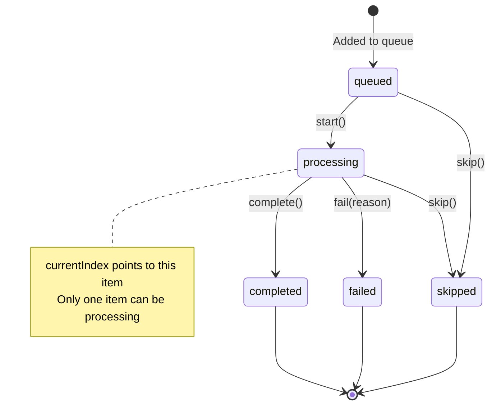

# Maestro Server - Queue Specification

**Version:** 1.0.0
**Last Updated:** 2026-02-07
**Purpose:** Complete specification for session task queue system

---

## Overview

The Queue system enables sessions to process multiple tasks sequentially in FIFO (First-In-First-Out) order. It's one of three worker strategies available in Maestro.

### Worker Strategies

| Strategy | Description | Use Case |
|----------|-------------|----------|
| `simple` | Single task execution | Default, straightforward task processing |
| `queue` | FIFO task queue | Process multiple tasks sequentially |
| `tree` | Hierarchical task tree | Complex multi-level task dependencies (future) |

This specification covers the **queue** strategy.

---

## Core Concepts

### Queue State

A queue is associated with a session and tracks multiple tasks through their processing lifecycle.

```typescript
interface QueueState {
  sessionId: string;           // Associated session ID
  strategy: WorkerStrategy;    // Always 'queue'
  items: QueueItem[];          // Queue items in order
  currentIndex: number;        // Index of item being processed (-1 if none)
  createdAt: number;           // Queue creation timestamp
  updatedAt: number;           // Last modification timestamp
}
```

### Queue Item

Each task in the queue is represented as a QueueItem with status tracking.

```typescript
interface QueueItem {
  taskId: string;              // Task ID
  status: QueueItemStatus;     // Current status
  addedAt: number;             // When added to queue
  startedAt?: number;          // When processing started
  completedAt?: number;        // When processing finished
  failReason?: string;         // Failure reason if status === 'failed'
}

type QueueItemStatus =
  | 'queued'      // Waiting to be processed
  | 'processing'  // Currently being worked on
  | 'completed'   // Successfully finished
  | 'failed'      // Failed with error
  | 'skipped';    // Skipped by user/agent
```

---

## Queue Lifecycle

### State Diagram



### Operations

#### 1. Initialize Queue
Creates queue for session with initial tasks.

**Preconditions:**
- Session must exist
- Session strategy must be 'queue'
- Queue must not already exist for session

**Effects:**
- Queue created with all tasks in 'queued' status
- currentIndex set to -1 (no item processing)

---

#### 2. Start Item
Begins processing next queued item.

**Preconditions:**
- No item currently processing (currentIndex === -1 or current item not 'processing')
- At least one item with status 'queued'

**Effects:**
- First 'queued' item status → 'processing'
- currentIndex updated to item's index
- startedAt timestamp set
- updatedAt timestamp updated

**Error Cases:**
- Already processing: Throws `VALIDATION_ERROR`
- No queued items: Returns empty response

---

#### 3. Complete Item
Marks current processing item as completed.

**Preconditions:**
- Item at currentIndex exists
- Item status === 'processing'

**Effects:**
- Item status → 'completed'
- completedAt timestamp set
- currentIndex reset to -1
- updatedAt timestamp updated

**Returns:**
- Completed item
- Next queued item (if any)

---

#### 4. Fail Item
Marks current processing item as failed.

**Preconditions:**
- Item at currentIndex exists
- Item status === 'processing'
- Reason string provided

**Effects:**
- Item status → 'failed'
- failReason set to provided reason
- completedAt timestamp set
- currentIndex reset to -1

---

#### 5. Skip Item
Skips current/next item without processing.

**Preconditions:**
- Either: item at currentIndex is 'processing'
- Or: at least one item with status 'queued'

**Effects:**
- Item status → 'skipped'
- completedAt timestamp set
- currentIndex reset to -1 (if was processing)

---

#### 6. Push Item
Adds new task to queue.

**Preconditions:**
- Task ID provided
- Task exists in database

**Effects:**
- New QueueItem appended to items array
- Item status set to 'queued'
- addedAt timestamp set

---

## Queue Statistics

Stats provide aggregate counts across all items.

```typescript
interface QueueStats {
  total: number;       // Total items in queue
  queued: number;      // Items waiting (status === 'queued')
  processing: number;  // Items being worked (status === 'processing')
  completed: number;   // Finished items (status === 'completed')
  failed: number;      // Failed items (status === 'failed')
  skipped: number;     // Skipped items (status === 'skipped')
}
```

---

## API Endpoints

See **03-API-SPECIFICATION.md** for complete API documentation.

### Summary

| Endpoint | Purpose |
|----------|---------|
| `GET /api/sessions/:id/queue` | Get queue state + stats |
| `GET /api/sessions/:id/queue/top` | Peek next item |
| `POST /api/sessions/:id/queue/start` | Start next item |
| `POST /api/sessions/:id/queue/complete` | Complete current item |
| `POST /api/sessions/:id/queue/fail` | Fail current item |
| `POST /api/sessions/:id/queue/skip` | Skip item |
| `GET /api/sessions/:id/queue/items` | List all items |
| `POST /api/sessions/:id/queue/push` | Add task to queue |

---

## Storage

### File Location
Queues are stored at:
```
~/.maestro/data/queues/{sessionId}.json
```

### File Format
```json
{
  "sessionId": "sess_123",
  "strategy": "queue",
  "items": [
    {
      "taskId": "task_456",
      "status": "completed",
      "addedAt": 1738713800000,
      "startedAt": 1738713850000,
      "completedAt": 1738713900000
    },
    {
      "taskId": "task_789",
      "status": "processing",
      "addedAt": 1738713800000,
      "startedAt": 1738713950000
    }
  ],
  "currentIndex": 1,
  "createdAt": 1738713800000,
  "updatedAt": 1738713950000
}
```

---

## Events

Queue operations emit WebSocket events.

| Event | When | Data |
|-------|------|------|
| `queue:created` | Queue initialized | `{ sessionId, queue }` |
| `queue:updated` | Any queue change | `{ sessionId, queue }` |
| `queue:item_started` | Item started | `{ sessionId, item }` |
| `queue:item_completed` | Item completed | `{ sessionId, item }` |
| `queue:item_failed` | Item failed | `{ sessionId, item, reason }` |
| `queue:item_skipped` | Item skipped | `{ sessionId, item }` |

---

## Integration with Sessions

### Creating Queue Session

When spawning a session with queue strategy:

```bash
POST /api/sessions/spawn
{
  "projectId": "proj_123",
  "taskIds": ["task_456", "task_789", "task_012"],
  "strategy": "queue",
  "role": "worker"
}
```

**Flow:**
1. Session created with strategy='queue'
2. Queue automatically initialized via QueueService
3. All taskIds added to queue in order
4. All items start with status='queued'

### Session-Queue Synchronization

- **Session.taskIds**: Contains all tasks associated with session
- **Queue.items**: Contains only tasks in the processing queue
- **Relationship**: Queue items must be subset of session tasks

---

## Error Handling

### Validation Errors

| Error | Condition | HTTP Status |
|-------|-----------|-------------|
| `VALIDATION_ERROR` | Session strategy != 'queue' | 400 |
| `VALIDATION_ERROR` | Already processing item | 400 |
| `VALIDATION_ERROR` | No taskId provided (push) | 400 |
| `NOT_FOUND` | Queue doesn't exist | 404 |
| `NOT_FOUND` | Task doesn't exist | 404 |
| `NOT_FOUND` | Session doesn't exist | 404 |

---

## Use Cases

### Use Case 1: Batch Task Processing

**Scenario:** Process 10 tasks sequentially in a worker session.

```bash
# 1. Spawn session with queue strategy
POST /api/sessions/spawn
{
  "projectId": "proj_123",
  "taskIds": ["task_1", "task_2", ..., "task_10"],
  "strategy": "queue"
}

# 2. Start first task
POST /api/sessions/sess_ABC/queue/start
# Returns: { item: { taskId: "task_1", status: "processing" } }

# 3. Complete task 1
POST /api/sessions/sess_ABC/queue/complete
# Returns: { completedItem: {...}, nextItem: { taskId: "task_2" } }

# 4. Start task 2
POST /api/sessions/sess_ABC/queue/start

# Repeat until queue empty
```

---

### Use Case 2: Adding Tasks Dynamically

**Scenario:** Add tasks to queue while processing.

```bash
# While processing
POST /api/sessions/sess_ABC/queue/push
{
  "taskId": "task_new"
}
# New task added to end of queue
```

---

### Use Case 3: Error Handling

**Scenario:** Task fails, continue with next.

```bash
# Task encounters error
POST /api/sessions/sess_ABC/queue/fail
{
  "reason": "API timeout after 30s"
}

# Returns next item to continue processing
```

---

## Comparison with Simple Strategy

| Aspect | Simple Strategy | Queue Strategy |
|--------|-----------------|----------------|
| Tasks | Single task | Multiple tasks |
| Processing | Immediate | Sequential FIFO |
| Queue State | None | Tracked in QueueState |
| API Endpoints | Standard session APIs | Queue-specific APIs |
| Use Case | One-off tasks | Batch processing |

---

## Future: Tree Strategy

The `tree` strategy (planned) will enable:
- Hierarchical task dependencies
- Parallel subtask execution
- Complex workflow orchestration

See future specification updates.

---

## Related Specifications

- **02-CORE-CONCEPTS.md** - Session and WorkerStrategy definitions
- **03-API-SPECIFICATION.md** - Queue API endpoint details
- **04-WEBSOCKET-SPECIFICATION.md** - Queue events
- **05-STORAGE-SPECIFICATION.md** - Queue persistence

---

## Change History

### Version 1.0.0 (2026-02-07)
- Initial queue specification
- Complete API, storage, and event documentation
