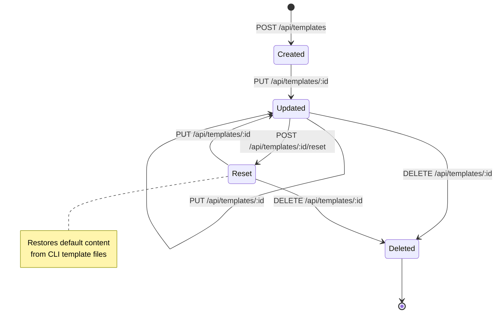

# Maestro Server - Template Specification

**Version:** 1.0.0
**Last Updated:** 2026-02-07
**Purpose:** Complete specification for worker and orchestrator prompt templates

---

## Overview

The Template system manages reusable prompt templates for Maestro workers and orchestrators. Templates define the system prompts and instructions used when spawning agent sessions.

### Key Features

- **Role-based templates**: Separate templates for workers and orchestrators
- **Customization**: Users can create and modify templates
- **Defaults**: Built-in default templates for each role
- **Reset capability**: Restore templates to default content

---

## Core Concepts

### Template Entity

```typescript
interface Template {
  id: string;                  // Unique template ID
  name: string;                // Human-readable name
  role: TemplateRole;          // 'worker' or 'orchestrator'
  content: string;             // Template prompt content (markdown)
  isDefault: boolean;          // Whether this is a default template
  createdAt: number;           // Creation timestamp
  updatedAt: number;           // Last update timestamp
}

type TemplateRole = 'worker' | 'orchestrator';
```

### Field Details

| Field | Type | Required | Description |
|-------|------|----------|-------------|
| `id` | string | Yes | Auto-generated: `makeId('tmpl')` |
| `name` | string | Yes | Template name (e.g., "Default Worker", "Custom Orchestrator") |
| `role` | TemplateRole | Yes | Template role: 'worker' or 'orchestrator' |
| `content` | string | Yes | Full prompt content in markdown format |
| `isDefault` | boolean | Yes | True if this is the built-in default template |
| `createdAt` | number | Yes | Creation timestamp (ms) |
| `updatedAt` | number | Yes | Last modification timestamp (ms) |

---

## Template Roles

### Worker Template

**Purpose:** Defines behavior for worker sessions that execute tasks.

**Typical Content:**
- Task execution instructions
- Code generation guidelines
- Testing requirements
- Error handling approach

**Example Structure:**
```markdown
# Maestro Worker

You are a worker agent responsible for executing tasks.

## Your Responsibilities
- Execute assigned tasks
- Report progress
- Handle errors gracefully

## Task Execution
- Read task description carefully
- Break down complex tasks
- Test your work
...
```

---

### Orchestrator Template

**Purpose:** Defines behavior for orchestrator sessions that coordinate workers.

**Typical Content:**
- Task decomposition strategy
- Worker spawning logic
- Progress monitoring
- Coordination patterns

**Example Structure:**
```markdown
# Maestro Orchestrator

You are an orchestrator agent responsible for coordinating workers.

## Your Responsibilities
- Break down complex tasks
- Spawn worker sessions
- Monitor progress
- Coordinate results

## Coordination Strategy
...
```

---

## Default Templates

### Default Worker Template

Located at: `maestro-cli/templates/worker-queue-prompt.md` (for queue strategy)

**Key Sections:**
1. Role definition
2. Task processing workflow
3. Queue management instructions
4. Communication protocols

---

### Default Orchestrator Template

Located at: `maestro-cli/templates/orchestrator-prompt.md`

**Key Sections:**
1. Role definition
2. Task decomposition strategy
3. Worker spawn logic
4. Progress tracking

---

## Storage

### File Location
Templates are stored at:
```
~/.maestro/data/templates/{id}.json
```

### File Format
```json
{
  "id": "tmpl_1738713800000_abc123def",
  "name": "Default Worker",
  "role": "worker",
  "content": "# Maestro Worker\n\nYou are a worker agent...",
  "isDefault": true,
  "createdAt": 1738713800000,
  "updatedAt": 1738713800000
}
```

---

## API Endpoints

See **03-API-SPECIFICATION.md** for complete API documentation.

### Summary

| Endpoint | Purpose |
|----------|---------|
| `GET /api/templates` | List all templates |
| `GET /api/templates/:id` | Get template by ID |
| `GET /api/templates/role/:role` | Get template for role |
| `POST /api/templates` | Create template |
| `PUT /api/templates/:id` | Update template |
| `POST /api/templates/:id/reset` | Reset to default |
| `DELETE /api/templates/:id` | Delete template |
| `GET /api/templates/default/:role` | Get default content |

---

## Template Lifecycle

### State Diagram



---

## Operations

### 1. Create Template

**Request:**
```typescript
{
  name: string;       // Required
  role: TemplateRole; // Required ('worker' | 'orchestrator')
  content: string;    // Required
}
```

**Effects:**
- Template created with generated ID
- isDefault set to false
- Timestamps auto-generated
- Saved to disk

**Events Emitted:**
- `template:created` - Full template object

---

### 2. Update Template

**Request:**
```typescript
{
  name?: string;      // Optional
  content?: string;   // Optional
}
```

**Effects:**
- Specified fields updated
- updatedAt auto-set
- Saved to disk

**Events Emitted:**
- `template:updated` - Full template object

**Note:** Role cannot be changed after creation.

---

### 3. Reset Template

**Purpose:** Restore template to default content from CLI template files.

**Effects:**
- Content replaced with default from file system
- name may be updated to default
- updatedAt auto-set
- isDefault flag unchanged

**Events Emitted:**
- `template:updated` - Full template object

---

### 4. Delete Template

**Effects:**
- Template removed from database
- File deleted from disk

**Events Emitted:**
- `template:deleted` - `{ id: string }`

**Constraints:**
- Can delete default templates (but may affect session spawning)

---

### 5. Get Default Content

**Purpose:** Retrieve default content without creating template.

**Returns:**
```typescript
{
  role: TemplateRole;
  content: string;
}
```

**Use Case:** Preview default content before customization.

---

## Integration with Session Spawning

### Template Selection

When spawning a session via `POST /api/sessions/spawn`:

1. **Role Specified:** Uses template matching the role parameter
2. **No Template Found:** Falls back to default content from file system
3. **Multiple Templates:** Uses first template for the role (usually default)

**Example:**
```bash
POST /api/sessions/spawn
{
  "projectId": "proj_123",
  "taskIds": ["task_456"],
  "role": "worker"  # Uses worker template
}
```

---

### Manifest Generation

Template content is injected into the generated manifest:

```json
{
  "skills": [...],
  "projectContext": {...},
  "systemPrompt": "<TEMPLATE CONTENT HERE>"
}
```

The CLI command `maestro manifest generate` reads the template and includes it in the manifest.

---

## Default Template Loading

### Source Files

Default templates are read from CLI repository:

- **Worker:** `maestro-cli/templates/worker-queue-prompt.md`
- **Orchestrator:** `maestro-cli/templates/orchestrator-prompt.md`

### Loading Logic

```typescript
class TemplateService {
  getDefaultContent(role: TemplateRole): string {
    const filename = role === 'worker'
      ? 'worker-queue-prompt.md'
      : 'orchestrator-prompt.md';

    const filepath = path.join(__dirname, '../../../maestro-cli/templates', filename);
    return fs.readFileSync(filepath, 'utf-8');
  }
}
```

---

## Events

| Event | When | Data |
|-------|------|------|
| `template:created` | Template created | Full template object |
| `template:updated` | Template updated or reset | Full template object |
| `template:deleted` | Template deleted | `{ id: string }` |

---

## Error Handling

| Error | Condition | HTTP Status |
|-------|-----------|-------------|
| `VALIDATION_ERROR` | Missing required fields | 400 |
| `VALIDATION_ERROR` | Invalid role | 400 |
| `NOT_FOUND` | Template doesn't exist | 404 |
| `INTERNAL_ERROR` | File system error | 500 |

---

## Use Cases

### Use Case 1: Create Custom Worker Template

```bash
# Create custom template
POST /api/templates
{
  "name": "Test-Driven Worker",
  "role": "worker",
  "content": "# Test-Driven Worker\n\nYou always write tests first..."
}

# Response: { "id": "tmpl_123", ... }

# Use in spawn
POST /api/sessions/spawn
{
  "role": "worker",  # Will use new custom template
  ...
}
```

---

### Use Case 2: Reset Modified Template

```bash
# Get current template
GET /api/templates/role/worker
# Returns: { "id": "tmpl_123", "content": "Modified content...", ... }

# Reset to default
POST /api/templates/tmpl_123/reset
# Returns: { "id": "tmpl_123", "content": "Original default content...", ... }
```

---

### Use Case 3: Preview Default Without Creating

```bash
# Get default content for orchestrator
GET /api/templates/default/orchestrator
# Returns: { "role": "orchestrator", "content": "..." }

# Decide whether to customize or use as-is
```

---

## Template Best Practices

### Content Structure

**Recommended Sections:**
1. **Role Definition**: Clear identity statement
2. **Responsibilities**: Key duties and goals
3. **Workflow**: Step-by-step process
4. **Communication**: How to report status
5. **Error Handling**: What to do when stuck

### Markdown Format

Templates should use well-structured markdown:
- Use headers (`#`, `##`) for sections
- Use lists for steps and responsibilities
- Use code blocks for examples
- Keep content concise and actionable

### Variables/Placeholders

Templates can include placeholders that get replaced during manifest generation:
- `{{PROJECT_NAME}}` - Project name
- `{{TASK_COUNT}}` - Number of tasks
- `{{STRATEGY}}` - Worker strategy

---

## Template Versioning

**Current:** Templates are not versioned. Updates overwrite existing content.

**Future Consideration:**
- Template version history
- Rollback capability
- A/B testing different templates

---

## Related Specifications

- **02-CORE-CONCEPTS.md** - Template entity definition
- **03-API-SPECIFICATION.md** - Template API endpoints
- **08-SESSION-SPAWNING-SPECIFICATION.md** - How templates are used in spawning

---

## Change History

### Version 1.0.0 (2026-02-07)
- Initial template specification
- Complete API, storage, and integration documentation
